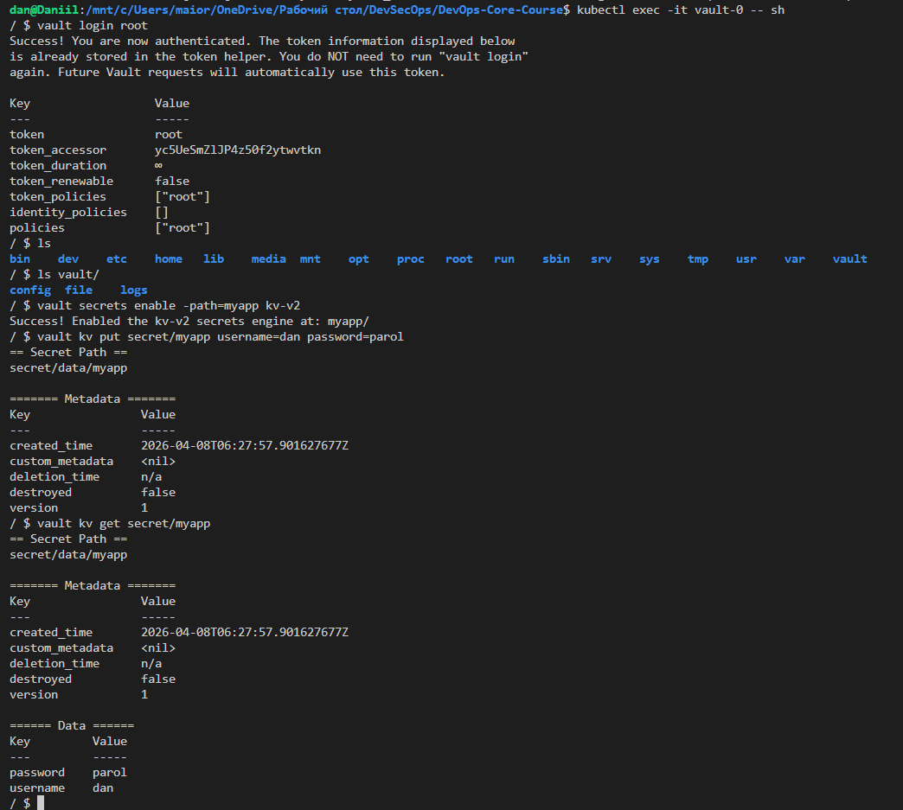
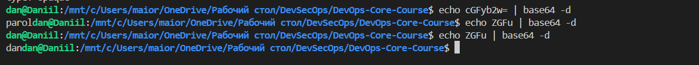
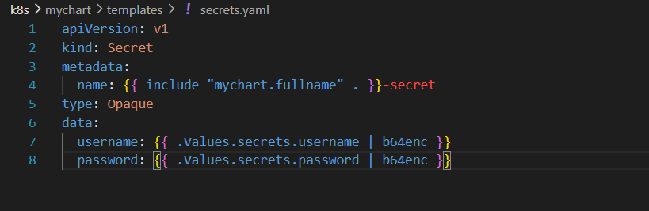
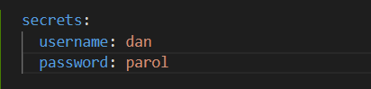
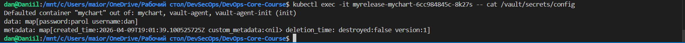
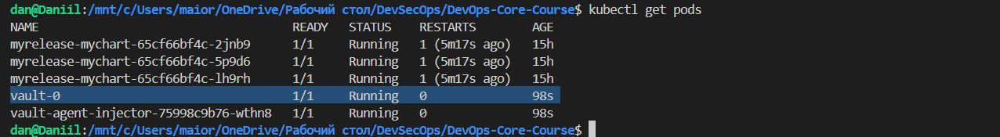
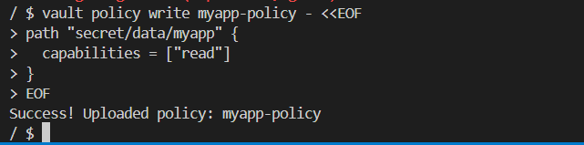
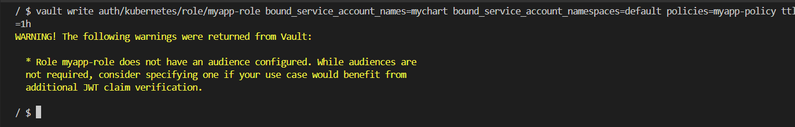

### Task 4 — Documentation (2 pts)

## 1. Kubernetes Secrets

### 1.1 Creating and Viewing Secret

We created a Kubernetes Secret for the application using the Vault Agent injector approach. Example commands:

```bash
kubectl exec -it vault-0 -- sh
vault kv put secret/myapp username=dan password=parol
vault kv get secret/myapp
````

**Screenshot of secret creation and check:**


After the secret is injected into the pod by Vault Agent, we can view the decoded values:

```bash
kubectl exec -it myrelease-mychart-<pod-id> -- cat /vault/secrets/config
```

**Example output:**

```text
username=dan
password=*****
```

**Screenshot Of Decoding:**


### 1.3 Base64 Encoding vs Encryption

* Kubernetes secrets are **base64-encoded**, not encrypted by default.
* Base64 encoding is reversible and only hides the data.
* Vault stores secrets securely, optionally with encryption-at-rest and access policies.

---

## 2. Helm Secret Integration

### 2.1 Chart Structure

The `mychart` Helm chart includes `secrets.yaml` for mapping Vault secrets into environment variables and mounted files.

```text
k8s/mychart/templates/secrets.yaml
```

**Screenshot:**


### 2.2 Consuming Secrets in Deployment

In the deployment template (`deployment.yaml`), secrets are consumed via `envFrom`:

```yaml
envFrom:
  - secretRef:
      name: {{ include "mychart.fullname" . }}-secret
```

**Screenshot showing values.yaml integration:**


### 2.3 Verification Output

Checking pod to verify secrets are injected (paths and env vars, values hidden):

```bash
kubectl exec -it myrelease-mychart-<pod-id> -- cat /vault/secrets
```

**Screenshot:**


---

## 3. Resource Management

### 3.1 Resource Limits Configuration

Resources are defined in `values.yaml` and `deployment.yaml`:

```yaml
resources:
  requests:
    cpu: 100m
    memory: 128Mi
  limits:
    cpu: 250m
    memory: 256Mi
```

### 3.2 Explanation: Requests vs Limits

* **Requests:** Guaranteed resources allocated to the pod.
* **Limits:** Maximum resources a pod can consume.

### 3.3 Choosing Values

* Requests should cover normal load.
* Limits prevent a single pod from overconsuming cluster resources.
* Values depend on application profiling and expected traffic.

---

## 4. Vault Integration

### 4.1 Vault Installation Verification

```bash
kubectl get pods
```

**Example screenshot:**


### 4.2 Policy and Role Configuration

* **Policy:** `myapp-policy` allows reading `secret/data/myapp`.
* **Role:** `myapp-role` binds ServiceAccount `myrelease-mychart` in namespace `default` to the policy.

**Screenshots:**

* Policy creation: 
* Role configuration: 

### 4.3 Proof of Secret Injection

Secrets are automatically injected by Vault Agent sidecar. The injected files exist in `/vault/secrets`:

```bash
kubectl exec -it myrelease-mychart-<pod-id> -- cat /vault/secrets
```

**Screenshot:**


### 4.4 Sidecar Injection Pattern

* Vault Agent runs as a sidecar container.
* Authenticates to Vault using the Kubernetes ServiceAccount.
* Injects secrets into a shared volume or environment variables.
* Pod application accesses secrets without handling Vault credentials directly.

---

## 5. Security Analysis

### 5.1 Kubernetes Secrets vs Vault

| Feature          | K8s Secret        | Vault               |
| ---------------- | ----------------- | ------------------- |
| Storage          | Base64 encoded    | Encrypted at rest   |
| Access control   | Namespace RBAC    | Policies, roles     |
| Secret rotation  | Manual            | Automatic / dynamic |
| Secret injection | Direct env/volume | Sidecar / Agent     |

### 5.2 When to Use

* **Kubernetes Secrets:** Simple apps, low-security requirements, small secrets.
* **Vault:** Production-grade security, dynamic secrets, multi-environment deployments.

### 5.3 Production Recommendations

* Use Vault for sensitive credentials and database passwords.
* Implement sidecar injection pattern for dynamic and rotated secrets.
* Keep minimal permissions for ServiceAccounts in Kubernetes.

---