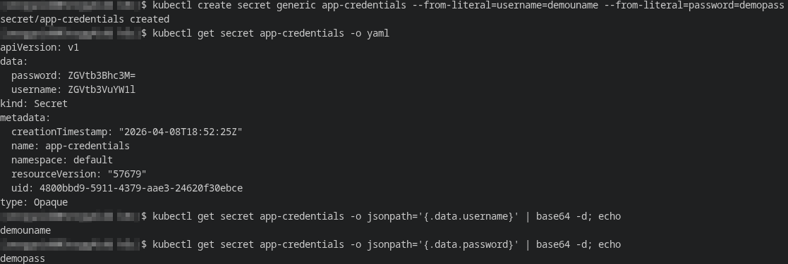
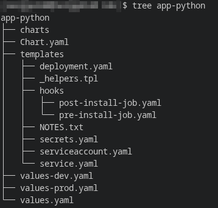
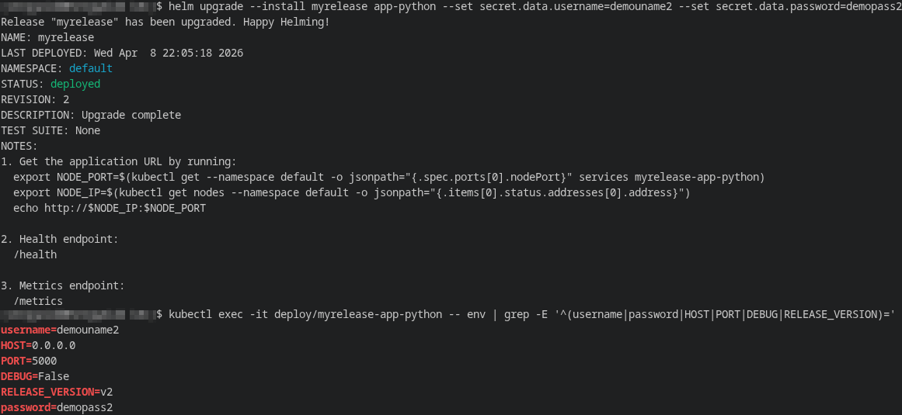
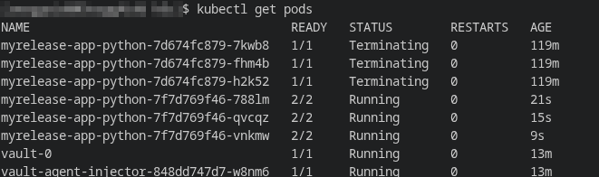
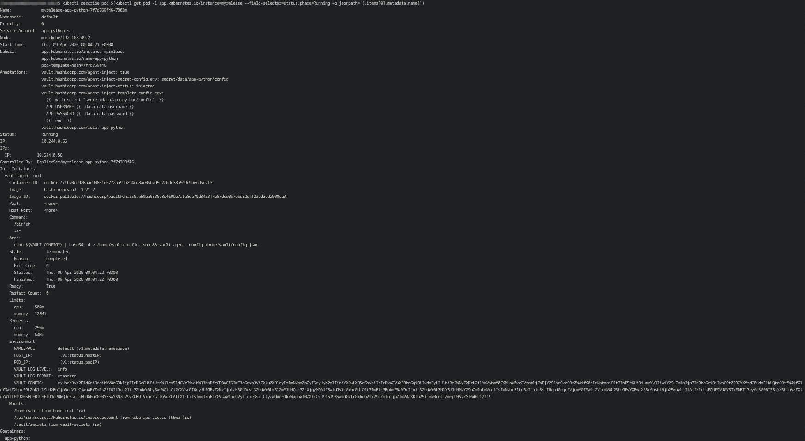
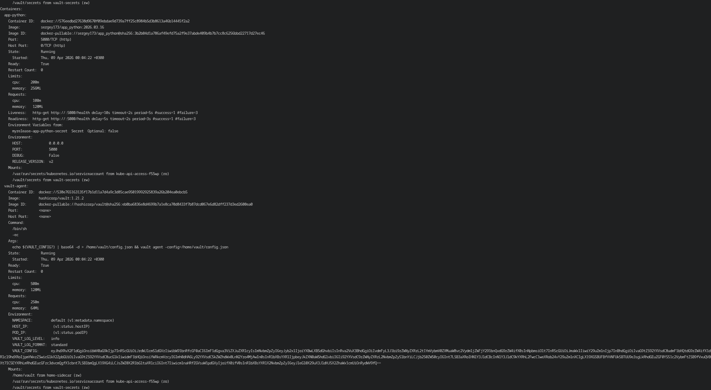
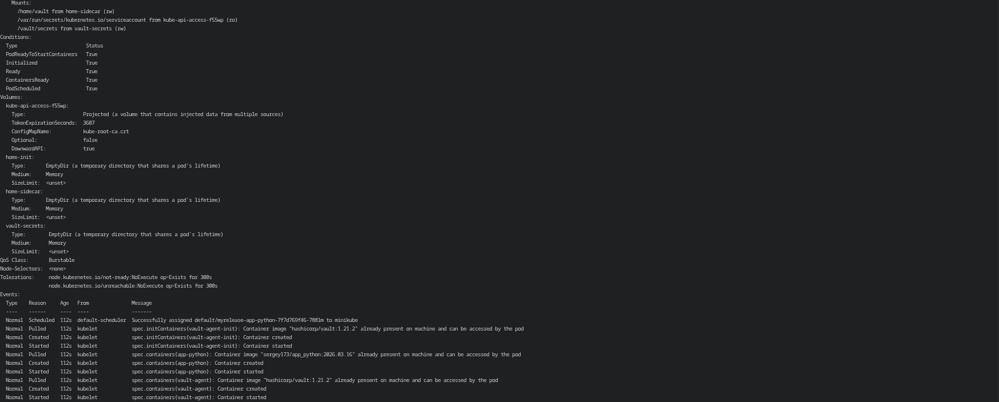
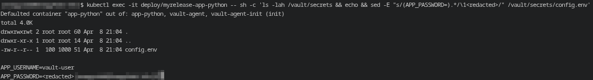
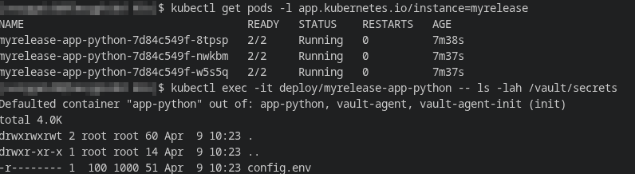

# Lab 11 — Kubernetes Secrets & HashiCorp Vault

## 1. Kubernetes Secrets
### Output of creating and viewing encoded and decoded secret:


### Explanation of base64 encoding vs encryption
Base64 encoding is simply a text encoding of data, not a means of cryptographic protection. Anyone with access to a Base64 value can decode it without a key and recover the original login or password. Encryption, unlike encoding, requires a cryptographic mechanism and a key to recover the data. Therefore, Kubernetes secrets cannot be considered fully secure without additional measures: they are convenient for storing and transmitting sensitive values ​​within a cluster, but by themselves they do not replace encryption and access control.

---

## 2. Helm Secret Integration
### Chart structure showing secrets.yaml
To integrate secrets into the Helm chart, the `templates/secrets.yaml` file was added to the project. The `serviceaccount.yaml` file was also added, along with the necessary changes to the Deployment template so that the application retrieves values ​​from the secret upon startup.


### How secrets are consumed in deployment
Secrets are passed to the container via `envFrom.secretRef`, meaning all keys from the Kubernetes Secret automatically become container environment variables.

**Template rendering key fragment:***
```yaml
apiVersion: v1
kind: Secret
metadata:
  name: myrelease-app-python-secret
...
type: Opaque
stringData:
  username: "change-me"
  password: "change-me"
```

```yaml
env:
  - name: HOST
    value: "0.0.0.0"
  - name: PORT
    value: "5000"
  - name: DEBUG
    value: "False"
  - name: RELEASE_VERSION
    value: "v2"
envFrom:
  - secretRef:
      name: myrelease-app-python-secret
```

### Verification output (env vars in pod, excluding actual values)


A check within the pod showed that the secret values ​​were indeed passed into the container environment. The actual values ​​are hidden in the report. Therefore, in this project, the Helm chart doesn't store actual secrets directly in templates, but uses the Kubernetes Secret as a separate object and attaches it to the container via the standard Kubernetes mechanism.

---

## 3. Resource Management
### Resource limits configuration
CPU and memory limits and requests were configured in Deployment.
```yaml
resources:
  requests:
    memory: "128Mi"
    cpu: "100m"
  limits:
    memory: "256Mi"
    cpu: "200m"
```

### Explanation of requests vs limits
While `requests` specifies the guaranteed minimum resources that Kubernetes reserves for a container when placing the pod on a node, `limits` specifies the upper resource limit that the container should not exceed while running.

### How to choose appropriate values
Moderate values ​​were chosen for this Flask application, as the service executes simple HTTP logic, uses health probes, and does not contain heavy background calculations. `100m CPU / 128Mi memory` were chosen as a sufficient baseline minimum for a stable startup and request processing, and `200m CPU / 256Mi memory` was chosen as a safe upper limit with a small margin for the workload.

---

## 4. Vault Integration

### Vault installation verification (`kubectl get pods`)
HashiCorp Vault was installed via Helm in dev mode with `vault-agent-injector` enabled. After installation, the `vault-0` pod and the injector pod appeared in the cluster, and new pod applications started running in `2/2` format after redeployment, indicating the addition of the Vault Agent sidecar container.


### Policy and role configuration (sanitized)
A separate path with the secret `secret/app-python/config` was created for the application, then a policy with read permission and a role were created, bound to the service account `app-python-sa` in the namespace `default`.

**Policy:**

```hcl
path "secret/data/app-python/config" {
  capabilities = ["read"]
}
```

**Role:**

```bash
vault write auth/kubernetes/role/app-python \
  bound_service_account_names=app-python-sa \
  bound_service_account_namespaces=default \
  policies=app-python \
  ttl=1h
```

### Proof of secret injection (show file exists, path structure)
After enabling Vault annotations in Deployment and updating the release, the application pod was modified by the injector. The pod description shows the presence of Vault annotations, the init container `vault-agent-init`, the sidecar container `vault-agent`, and the shared volume `/vault/secrets`.




A check inside the application container revealed that a config.env file generated by the Vault Agent appeared in the /vault/secrets path. The password in this example is hidden.


### Explanation of the sidecar injection pattern
This scenario utilizes the sidecar injection pattern. When a Kubernetes pod is created, the admission webhook from Vault Injector parses the pod's annotations and automatically modifies it. This adds the following to the pod:
- `vault-agent-init` - an init container that performs initial authentication with Vault via the Kubernetes service account and prepares the configuration;
- `vault-agent` - a sidecar container running alongside the main application container;
- `/vault/secrets` - a shared volume where the Vault Agent renders secrets as files.

The main application container doesn't need to interact directly with the Vault API. It simply reads the pre-prepared file from the file system. This approach decouples the application from Vault and makes the integration more transparent.

---

## 5. Security Analysis

### Comparison: K8s Secrets vs Vault
Kubernetes Secrets are a built-in Kubernetes mechanism for storing sensitive values ​​as separate API objects. They are well suited for basic scenarios within a single cluster, integrate easily with Deployment, and allow for quick data transfer to pods as environment variables or files. However, their security largely depends on the correct configuration of RBAC and data encryption in etcd.

Vault is a full-fledged external secrets management system. It provides centralized access control, policies, auditing, authentication of various clients, and convenient mechanisms for delivering secrets to applications. In this lab, Vault was used to inject a secret into a pod via a sidecar, providing a more flexible and secure model compared to traditionally storing sensitive data solely within Kubernetes.

### When to use each approach
Kubernetes Secrets is best used in small or educational projects, for internal services within a single cluster, and where a simple mechanism for passing sensitive values ​​to a pod is sufficient.

Vault makes sense for production environments, multi-service and multi-cluster infrastructures, and those with increased requirements for auditing, centralized access management, and stricter secret lifecycle control.

### Production recommendations
In production, real secrets should not be stored in plaintext in a Git repository or in `values.yaml`. For Kubernetes Secrets, restrict access via RBAC and enable data encryption in etcd. For critical services, it is recommended to use an external secrets manager, such as Vault, and expose only the minimum necessary data to the application based on the principle of least privilege. It is also advisable to avoid exposing sensitive values ​​in logs, reports, and diagnostic command output.

## 6. Bonus Task — Vault Agent Templates

### Template annotation configuration
To complete the bonus task, Vault Agent Injector annotations were used, allowing not only to retrieve a secret from Vault but also to render it in a custom format. In this project, a secret from the path `secret/data/app-python/config` is converted into a `.env` file containing several variables.

```yaml
annotations:
  vault.hashicorp.com/agent-inject: "true"
  vault.hashicorp.com/role: "app-python"
  vault.hashicorp.com/agent-inject-secret-config.env: "secret/data/app-python/config"
  vault.hashicorp.com/agent-inject-template-config.env: |
    {{- with secret "secret/data/app-python/config" -}}
    APP_USERNAME={{ .Data.data.username }}
    APP_PASSWORD={{ .Data.data.password }}
    {{- end -}}
  vault.hashicorp.com/agent-inject-command-config.env: "sh -c 'chmod 0400 /vault/secrets/config.env'"
  vault.hashicorp.com/template-static-secret-render-interval: "30s"
```
The annotation `vault.hashicorp.com/agent-inject-template-config.env` specifies the template for the resulting file, and `vault.hashicorp.com/agent-inject-command-config.env` executes an additional command after rendering. In this lab, the post-render command changes the permissions of the generated secret file.

### Rendered secret file content
After redeploying the application, the pods entered the 2/2 Running state, and a config.env file appeared in the /vault/secrets directory. A check also showed that the post-render command worked successfully: the file permissions were changed to 0400 (-r--------)

Thus, Vault Agent did not simply transfer individual values, but generated a single configuration file. In this bonus scenario, the file permissions were intentionally restricted to demonstrate post-render processing with agent-inject-command.

### Named template implementation
To adhere to the DRY principle in the Helm chart, a named template was used in the `_helpers.tpl` file, which is responsible for the application's common environment variables.

```yaml
{{- define "app-python.commonEnv" -}}
- name: HOST
  value: {{ .Values.env.host | quote }}
- name: PORT
  value: {{ .Values.env.port | quote }}
- name: DEBUG
  value: {{ .Values.env.debug | quote }}
- name: RELEASE_VERSION
  value: {{ .Values.env.releaseVersion | quote }}
{{- end -}}
```
This template is included in `deployment.yaml` via `include`, which allows you to move repeated environment variables to one place and avoid duplicating the same YAML code in several parts of the chart:
```yaml
env:
  {{- include "app-python.commonEnv" . | nindent 12 }}
```

### Benefits of templating approach
- Secrets can be converted into an application-friendly format, such as .env, instead of being passed as individual variables or files with raw values.
- Post-render commands allow for additional processing, such as changing file permissions or running helper actions after they're generated.
- Named Helm templates reduce code duplication and simplify chart maintenance.
