# Secret Management Documentation

## Overview

This document describes the secret-management implementation created for Lab 11. The solution extends the Helm chart from Lab 10 and introduces two complementary mechanisms:

- **Kubernetes native Secrets** for basic secret storage and environment variable injection
- **HashiCorp Vault** for externalized secret storage and sidecar-based secret injection into running pods

Relevant files:
- `k8s/app-python-chart/values.yaml`
- `k8s/app-python-chart/templates/secrets.yaml`
- `k8s/app-python-chart/templates/serviceaccount.yaml`
- `k8s/app-python-chart/templates/deployment.yaml`
- `k8s/app-python-chart/templates/_helpers.tpl`

---

## 1. Kubernetes Secrets

### 1.1 Secret creation

A native Kubernetes Secret named `app-credentials` was created with the keys `username` and `password`.

Example command used during the lab:

```bash
kubectl create secret generic app-credentials   -n devops-lab11   --from-literal=username=lab11user   --from-literal=password='Lab11Pass123!'
```

### 1.2 Viewing the Secret

The secret was inspected in YAML format:

```bash
kubectl get secret app-credentials -n devops-lab11 -o yaml
```

The output shows the values inside the `data:` section as base64-encoded strings rather than plain text.

### 1.3 Decoding values

The encoded values were decoded with standard Linux tools:

```bash
kubectl get secret app-credentials -n devops-lab11 -o jsonpath='{.data.username}' | base64 -d
kubectl get secret app-credentials -n devops-lab11 -o jsonpath='{.data.password}' | base64 -d
```

### 1.4 Encoding vs encryption

It is important to distinguish between the two:

- **Base64 encoding** only changes the textual representation of data and is easily reversible.
- **Encryption** protects the data and requires a key to recover the original content.

Kubernetes Secrets are not automatically protected in a strong way simply because they are called “Secrets.” Without additional safeguards, anyone with sufficient API access can read and decode them.

### Evidence
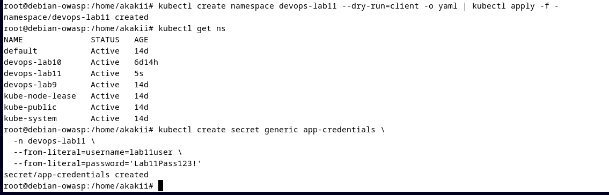

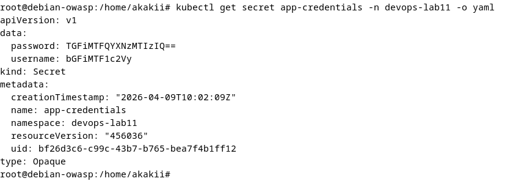

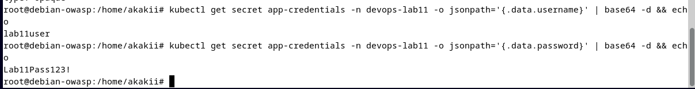

---

## 2. Helm Secret Integration

### 2.1 Chart structure

The Helm chart was extended with the following secret-related files:

```text
k8s/app-python-chart/
├── values.yaml
└── templates/
    ├── _helpers.tpl
    ├── deployment.yaml
    ├── secrets.yaml
    └── serviceaccount.yaml
```

### 2.2 Secret template

The file `templates/secrets.yaml` creates an `Opaque` Secret using the values from `values.yaml`.

Implementation summary:
- templated secret name through helper functions
- standard labels reused from chart helpers
- `stringData` used to simplify plain-text input during rendering

Example structure:

```yaml
apiVersion: v1
kind: Secret
type: Opaque
stringData:
  username: ...
  password: ...
```

### 2.3 Secret consumption in the deployment

The application deployment consumes secrets through:

```yaml
envFrom:
  - secretRef:
      name: ...
```

This pattern injects all keys from the Secret as environment variables in the container.

Additional application configuration remains values-driven:
- `PORT` comes from `env`
- CPU and memory requests/limits come from `resources`
- readiness and liveness probes remain configurable

### 2.4 Verification

The chart was validated with:

```bash
helm lint k8s/app-python-chart
helm template lab11-app k8s/app-python-chart
helm upgrade --install ...
```

After deployment:
- the running release was visible in Helm and Kubernetes status output,
- the pod environment contained the injected variables,
- `kubectl describe pod` did not print the raw secret values.

This is the expected secure behavior for environment variables sourced from a Secret reference.

### Evidence
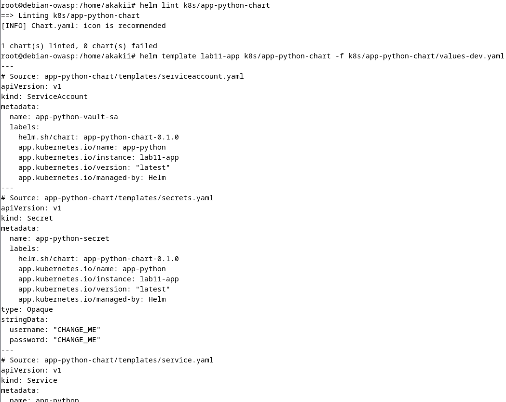


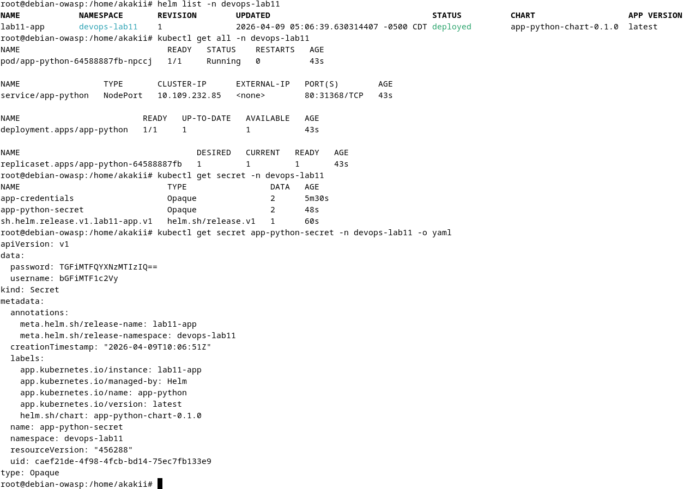

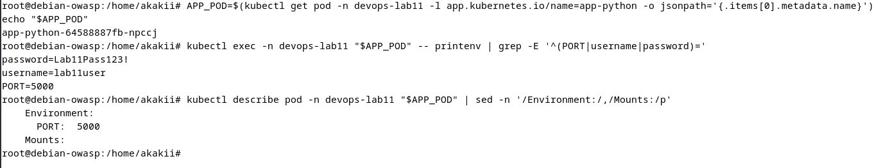

---

## 3. Resource Management

### 3.1 Configured limits and requests

The deployment keeps resource configuration in `values.yaml`:

```yaml
resources:
  limits:
    cpu: 200m
    memory: 256Mi
  requests:
    cpu: 100m
    memory: 128Mi
```

### 3.2 Requests vs limits

- **Requests** define the minimum CPU and memory the scheduler should reserve for the pod.
- **Limits** define the maximum amount the container is allowed to use.

This separation helps the scheduler place workloads correctly and also prevents one application container from consuming excessive resources.

### 3.3 Choosing appropriate values

For this lab, small but reasonable defaults were used:
- enough memory and CPU for the application to start reliably,
- explicit limits to avoid uncontrolled resource growth,
- override support through Helm values for different environments.

In production, these values should be chosen based on:
- real application profiling,
- observed steady-state usage,
- peak traffic behavior,
- performance and stability requirements.

---

## 4. Vault Integration

### 4.1 Installing Vault

Vault was installed from the official HashiCorp Helm repository in a dedicated namespace. Development mode was used for learning purposes, and the Vault Agent Injector was enabled.

Typical installation flow:

```bash
helm repo add hashicorp https://helm.releases.hashicorp.com
helm repo update

helm upgrade --install vault hashicorp/vault   -n vault   --set "server.dev.enabled=true"   --set "injector.enabled=true"
```

### 4.2 Policy and role configuration

Vault was configured with:
- Kubernetes auth enabled
- KV v2 secret engine enabled
- application secret stored under a dedicated path
- a policy granting read access to that path
- a role bound to the application's service account and namespace

Sanitized logic:
- **secret path:** `lab11/data/myapp/config`
- **role:** `lab11-app`
- **service account:** `app-python-vault-sa`

### 4.3 Pod-side secret injection

When Vault integration is enabled, the application deployment adds pod annotations such as:

```yaml
vault.hashicorp.com/agent-inject: "true"
vault.hashicorp.com/role: "lab11-app"
vault.hashicorp.com/agent-inject-secret-config: "lab11/data/myapp/config"
```

With these annotations, Vault Agent Injector adds the required sidecar/init logic and writes the allowed secret data into the pod filesystem.

### 4.4 Proof of injected secrets

Verification was performed by:
- checking that Vault pods were running,
- confirming the role/policy and secret path configuration,
- rolling out the application with Vault enabled,
- listing files under `/vault/secrets`,
- reading the generated `/vault/secrets/config` file.

This confirms that the application pod received the rendered secret file from Vault.

### 4.5 Sidecar injection pattern

The sidecar injection pattern works as follows:

1. The pod starts with Vault injection annotations.
2. Vault Agent authenticates using the pod’s service account and the Kubernetes auth method.
3. Vault verifies the role and policy bound to that service account.
4. Allowed secret data is fetched from Vault.
5. The agent writes the secret material into the pod filesystem, typically under `/vault/secrets/`.

This approach avoids hardcoding secrets into the image or storing real credentials in Git-managed values files.

### Evidence
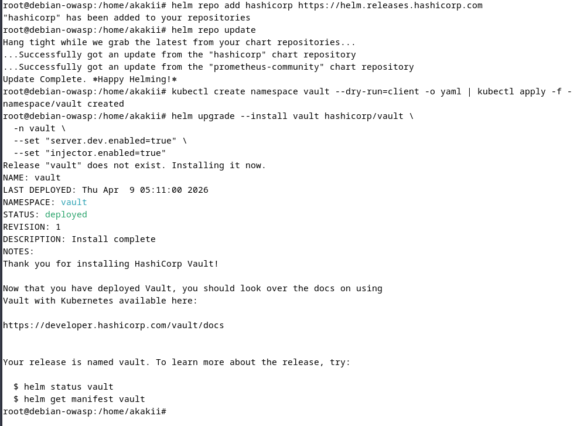

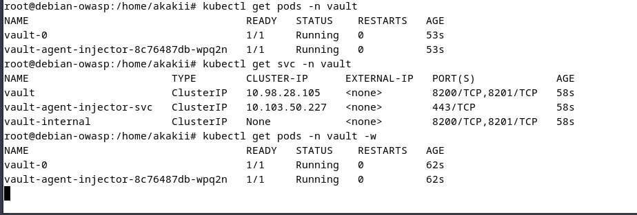

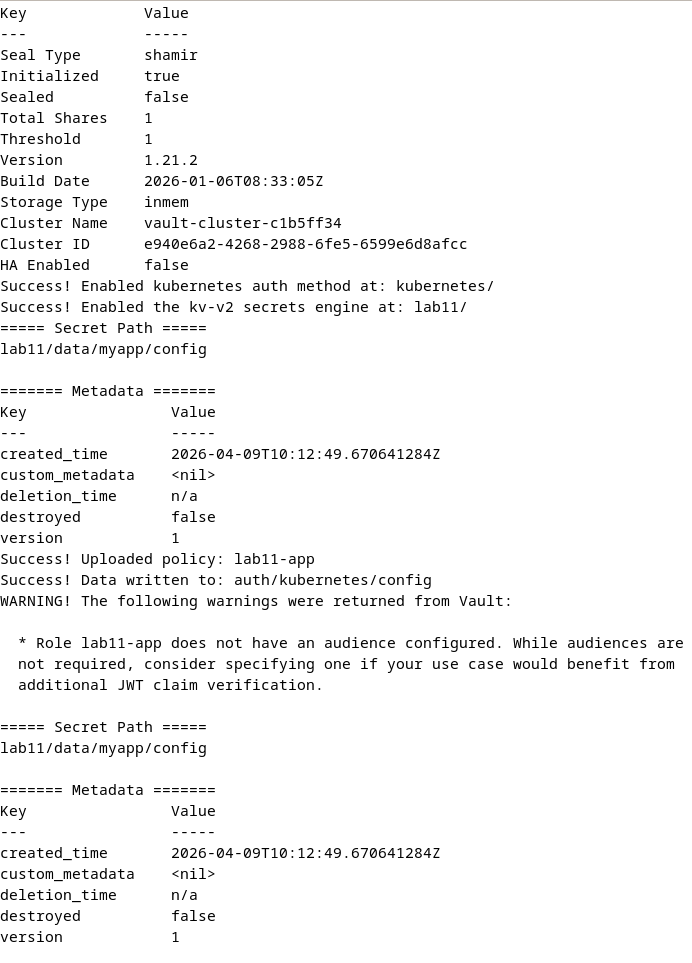

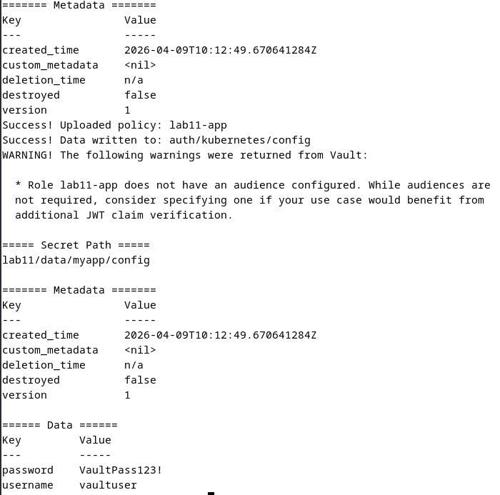

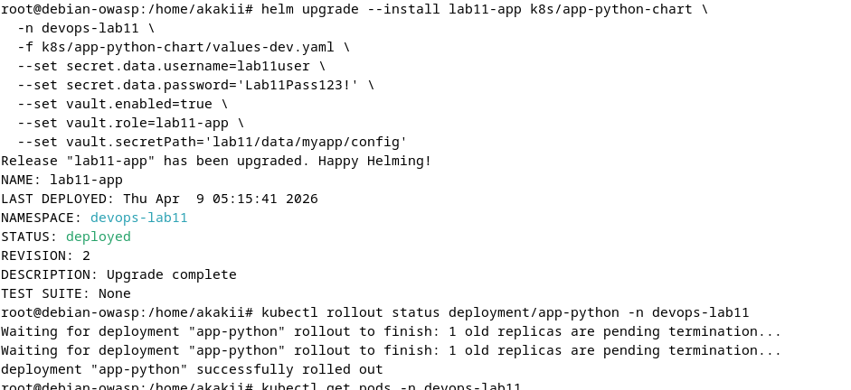

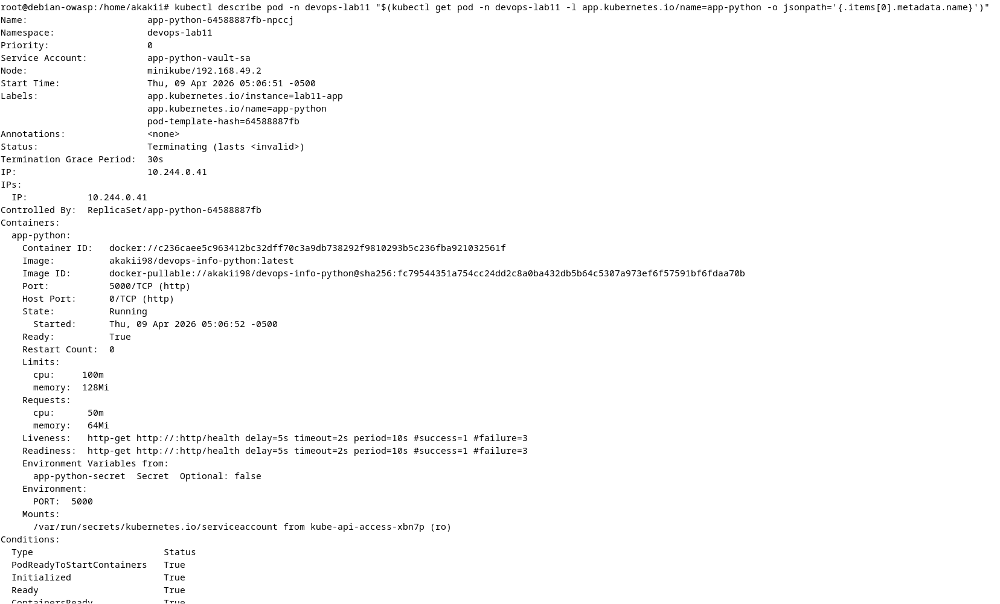

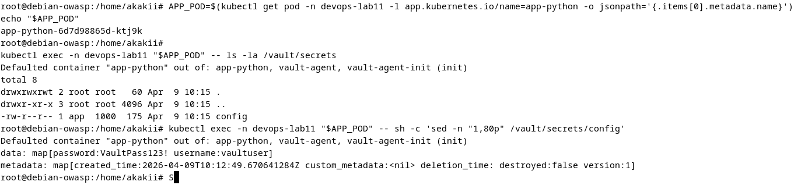

---

## 5. Security Analysis

### 5.1 Kubernetes Secrets vs Vault

**Kubernetes Secrets**
- simple and built into the platform,
- easy to template with Helm,
- sufficient for local labs and basic deployments,
- not a full enterprise secret-management system by themselves.

**HashiCorp Vault**
- centralizes secret storage,
- supports policy-based access control,
- reduces the need to place real secrets in static manifests,
- provides a cleaner path toward secure production secret delivery.

### 5.2 When to use each approach

Use **Kubernetes Secrets** when:
- the deployment is simple,
- the environment is local or non-critical,
- you need straightforward secret references for pods.

Use **Vault** when:
- multiple applications require controlled access to secrets,
- auditability and centralized policy matter,
- secret lifecycle management is important,
- production security requirements are higher.

### 5.3 Production recommendations

For production deployments:
- enable etcd encryption at rest,
- restrict secret access with RBAC,
- avoid committing real credentials into Git,
- prefer external secret management such as Vault,
- rotate secrets regularly,
- audit access and configuration changes.

---

## Conclusion

Lab 11 adds a complete introductory secret-management workflow on top of the existing Helm-based Kubernetes deployment. The chart now supports Kubernetes Secrets for environment variable injection, while Vault integration demonstrates a more advanced sidecar-based delivery model for secret files inside the pod.
