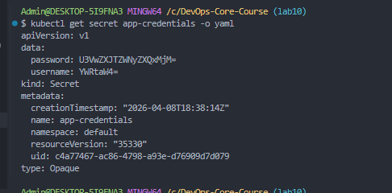
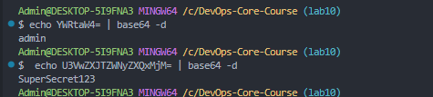
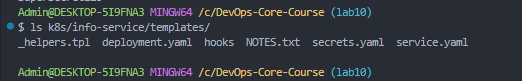
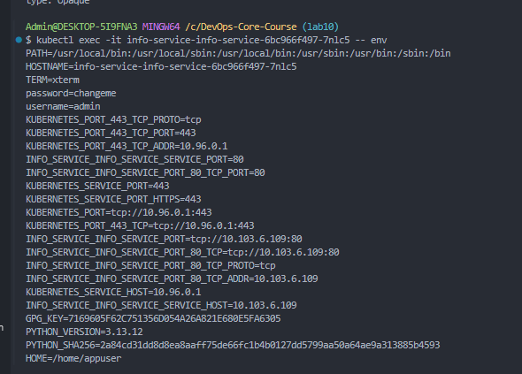
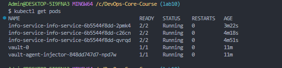
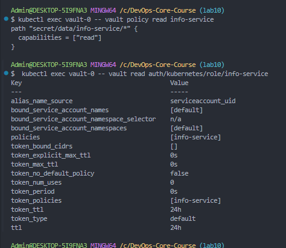

# Lab 11 — Kubernetes Secrets & HashiCorp Vault

## 1. Kubernetes Secrets

### Creating a Secret

```bash
kubectl create secret generic app-credentials \
  --from-literal=username=admin \
  --from-literal=password=SuperSecret123
```

### Viewing the Secret

```bash
kubectl get secret app-credentials -o yaml
```



### Decoding Base64

```bash
echo YWRtaW4= | base64 -d
# admin

echo U3VwZXJTZWNyZXQxMjM= | base64 -d
# SuperSecret123
```



### Base64 Encoding vs Encryption

| | Base64 Encoding | Encryption |
|---|---|---|
| Reversible by anyone | Yes | No (needs key) |
| Security | None | Mathematically secure |
| Purpose | Data format change | Confidentiality |

Kubernetes Secrets are **base64-encoded, NOT encrypted** by default. Anyone with `kubectl get secret -o yaml` access can decode them instantly.

For production, enable **etcd encryption at rest** via `EncryptionConfiguration` on the API server using AES-CBC or AES-GCM providers. This ensures secrets are encrypted before being written to etcd storage.

---

## 2. Helm Secret Integration

### Chart Structure



```
k8s/info-service/templates/
  _helpers.tpl
  deployment.yaml
  hooks/
  NOTES.txt
  secrets.yaml        # Secret template
  service.yaml
```

### secrets.yaml

```yaml
apiVersion: v1
kind: Secret
metadata:
  name: {{ include "info-service.fullname" . }}-secret
  labels:
    {{- include "info-service.labels" . | nindent 4 }}
type: Opaque
stringData:
  {{- range $key, $value := .Values.secret }}
  {{ $key }}: {{ $value | quote }}
  {{- end }}
```

### Secret Values (values.yaml)

```yaml
secret:
  username: "admin"
  password: "changeme"
```

> Never commit real secrets to Git. Use `--set` flag to override at deploy time:
> `helm install myapp ./info-service --set secret.password=RealPassword`

### Consuming Secrets in Deployment

Secrets are injected via `envFrom` in the deployment template:

```yaml
envFrom:
  - secretRef:
      name: {{ include "info-service.fullname" . }}-secret
```

### Verification

Environment variables inside the pod:



Secrets are NOT visible in `kubectl describe pod` — only the Secret reference is shown:

Full describe output: [05-describe-pod.txt](docs/screenshots/lab11/05-describe-pod.txt)

```
Environment Variables from:
  info-service-info-service-secret  Secret  Optional: false
Environment:                        <none>
```

---

## 3. Resource Management

### Configuration (values.yaml)

```yaml
resources:
  requests:
    memory: "128Mi"
    cpu: "100m"
  limits:
    memory: "256Mi"
    cpu: "200m"
```

### Requests vs Limits

- **Requests** — minimum guaranteed resources. The scheduler uses this to place pods on nodes.
- **Limits** — maximum allowed resources. Exceeding CPU limit causes throttling; exceeding memory limit causes OOM kill.

### Choosing Appropriate Values

- Start with low requests and monitor with `kubectl top pods`
- Set limits to 1.5-2x of typical usage for spike handling
- For info-service (lightweight FastAPI): 128Mi/100m requests and 256Mi/200m limits are appropriate

---

## 4. Vault Integration

### Installation

```bash
helm repo add hashicorp https://helm.releases.hashicorp.com
helm repo update
helm install vault hashicorp/vault \
  --set "server.dev.enabled=true" \
  --set "injector.enabled=true"
```

### Vault Pods



All info-service pods show `2/2` READY — the second container is the Vault Agent sidecar.

### Secret Configuration

```bash
kubectl exec vault-0 -- vault kv put secret/info-service/config \
  username="admin" password="VaultSecret123"
```

### Policy and Role



**Policy** (`info-service`):
```hcl
path "secret/data/info-service/*" {
  capabilities = ["read"]
}
```

**Role** (`info-service`):
- Bound to service account `default` in namespace `default`
- Policy: `info-service`
- TTL: 24h

### Sidecar Injection

Vault Agent annotations added to the deployment pod template:

```yaml
annotations:
  vault.hashicorp.com/agent-inject: "true"
  vault.hashicorp.com/role: "info-service"
  vault.hashicorp.com/agent-inject-secret-config: "secret/data/info-service/config"
```

### Proof of Injection


```bash
kubectl exec <pod> -c info-service -- sh -c "cat /vault/secrets/config"
# data: map[password:VaultSecret123 username:admin]
```

### Sidecar Injection Pattern

1. Pod is created with Vault annotations
2. Vault Mutating Webhook intercepts pod creation
3. Vault Agent Injector adds init container + sidecar container
4. Init container authenticates with Vault using ServiceAccount JWT
5. Sidecar fetches secrets and writes them to `/vault/secrets/`
6. Application reads secrets from the shared volume
7. Sidecar continuously renews the Vault token and refreshes secrets

---

## 5. Security Analysis

### K8s Secrets vs Vault

| Feature | K8s Secrets | HashiCorp Vault |
|---------|-------------|-----------------|
| Encryption at rest | Optional (etcd config) | Always encrypted |
| Secret rotation | Manual | Automatic |
| Audit logging | Basic K8s audit | Full detailed audit |
| Dynamic secrets | No | Yes (DB creds, PKI) |
| Access control | RBAC | Fine-grained policies |
| Multi-platform | K8s only | Any platform |
| Complexity | Low | High |

### When to Use Each

- **K8s Secrets:** Small teams, simple apps, single cluster, non-regulated environments. Always enable etcd encryption at rest.
- **HashiCorp Vault:** Enterprise, compliance requirements (SOC2, PCI-DSS), multi-cluster/multi-platform, dynamic secrets and automatic rotation needed.

### Production Recommendations

1. **Never commit secrets** to version control — use placeholder values
2. **Enable etcd encryption** at rest as a minimum baseline
3. **Use Vault** for production workloads with compliance requirements
4. **Automate rotation** — short-lived dynamic secrets where possible
5. **Audit all access** — you can't secure what you can't see
6. **Least privilege** — apps should only access their own secrets
