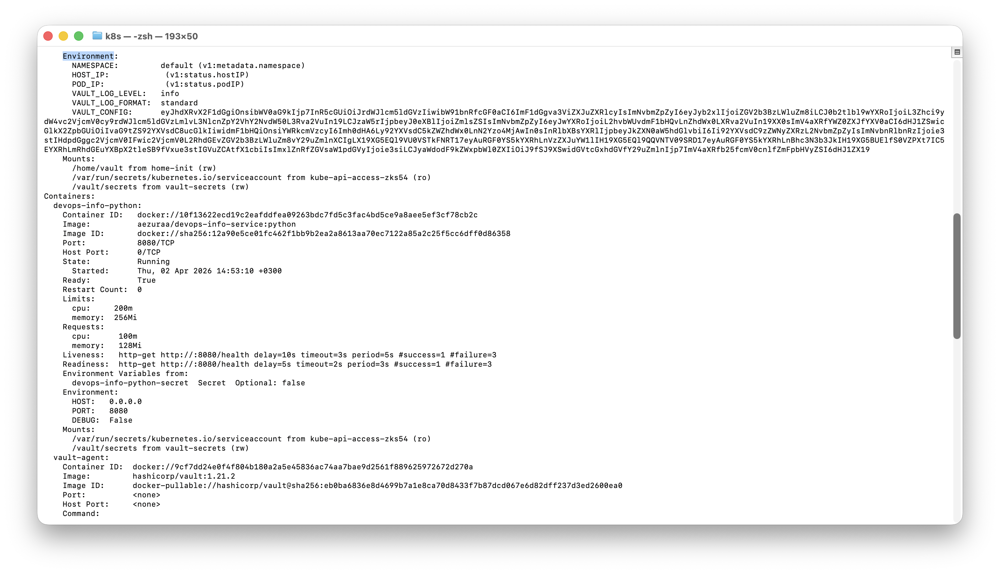
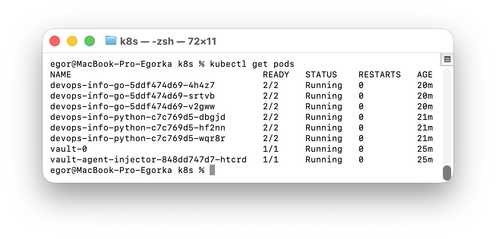
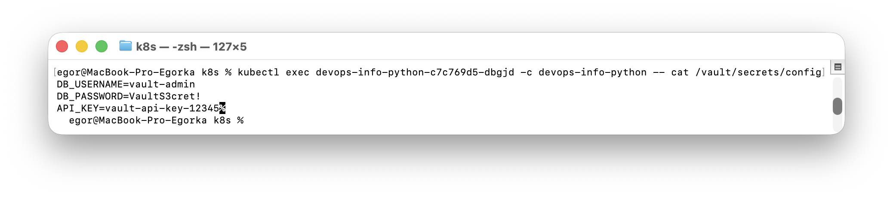

# Lab 11 — Kubernetes Secrets & HashiCorp Vault

## Table of Contents
1. [Kubernetes Secrets](#1-kubernetes-secrets)
2. [Helm Secret Integration](#2-helm-secret-integration)
3. [Resource Management](#3-resource-management)
4. [Vault Integration](#4-vault-integration)
5. [Security Analysis](#5-security-analysis)
6. [Bonus — Vault Agent Templates](#6-bonus--vault-agent-templates)

---

## 1. Kubernetes Secrets

### Creating a Secret

```bash
kubectl create secret generic app-credentials \
  --from-literal=username=admin \
  --from-literal=password=S3cur3P@ssw0rd
```

Output:
```
secret/app-credentials created
```

### Viewing the Secret (YAML)

```bash
kubectl get secret app-credentials -o yaml
```

```yaml
apiVersion: v1
data:
  password: UzNjdXIzUEBzc3cwcmQ=
  username: YWRtaW4=
kind: Secret
metadata:
  name: app-credentials
  namespace: default
type: Opaque
```

### Decoding Base64 Values

```bash
echo "YWRtaW4=" | base64 -d        # → admin
echo "UzNjdXIzUEBzc3cwcmQ=" | base64 -d  # → S3cur3P@ssw0rd
```

### Base64 Encoding vs Encryption

| Aspect | Base64 Encoding | Encryption |
|--------|----------------|------------|
| Purpose | Transport/storage format | Data protection |
| Security | **None** — trivially reversible | Strong — requires key to decrypt |
| K8s default | Yes — secrets are base64 only | No — must enable etcd encryption |
| Reversible | By anyone with `base64 -d` | Only with the encryption key |

**Key takeaway:** Kubernetes Secrets are base64-encoded, **NOT encrypted** by default. Anyone with API access can decode them.

### etcd Encryption at Rest
- By default, secrets are stored in etcd as base64 plaintext
- Enable `EncryptionConfiguration` to encrypt secrets at rest in etcd
- Recommended for production: use `aescbc`, `aesgcm`, or KMS provider
- Combine with RBAC to restrict `get`/`list` access to secrets

---

## 2. Helm Secret Integration

### Chart Structure

```
devops-info-python/
├── Chart.yaml
├── values.yaml
└── templates/
    ├── _helpers.tpl
    ├── deployment.yaml
    ├── secrets.yaml          ← NEW
    ├── serviceaccount.yaml   ← NEW
    └── service.yaml
```

### Secret Template (`templates/secrets.yaml`)

```yaml
apiVersion: v1
kind: Secret
metadata:
  name: {{ include "common.fullname" . }}-secret
  labels:
    {{- include "common.labels" . | nindent 4 }}
type: Opaque
stringData:
  {{- range $key, $value := .Values.secrets }}
  {{ $key }}: {{ $value | quote }}
  {{- end }}
```

### Secret Values in `values.yaml`

```yaml
secrets:
  DB_USERNAME: "placeholder"
  DB_PASSWORD: "placeholder"
```

Real values injected at deploy time (never committed):
```bash
helm upgrade --install devops-info-python ./devops-info-python \
  --set secrets.DB_USERNAME=<username> \
  --set secrets.DB_PASSWORD=<password>
```

### Consuming Secrets in Deployment

Secrets are injected via `envFrom` with `secretRef`:

```yaml
envFrom:
  - secretRef:
      name: {{ include "common.fullname" . }}-secret
```

### Verification

**Environment variables inside pod:**
```bash
kubectl exec <pod> -- env | grep DB_
```
```
DB_PASSWORD=<hidden>
DB_USERNAME=<hidden>
```

**`kubectl describe pod` output — values are NOT visible:**
```
Environment Variables from:
  devops-info-python-secret  Secret  Optional: false
Environment:
  HOST:   0.0.0.0
  PORT:   8080
  DEBUG:  False
```



---

## 3. Resource Management

### Configuration in `values.yaml`

**Python chart:**
```yaml
resources:
  requests:
    memory: "128Mi"
    cpu: "100m"
  limits:
    memory: "256Mi"
    cpu: "200m"
```

**Go chart:**
```yaml
resources:
  requests:
    memory: "64Mi"
    cpu: "50m"
  limits:
    memory: "128Mi"
    cpu: "100m"
```

### Requests vs Limits

| Aspect | Requests | Limits |
|--------|----------|--------|
| Purpose | Minimum guaranteed resources | Maximum allowed resources |
| Scheduling | Used by scheduler for pod placement | Not used for scheduling |
| Enforcement | Soft — pod always gets at least this | Hard — pod killed/throttled if exceeded |
| OOM Kill | Not triggered by requests | Triggered if memory limit exceeded |
| CPU | Guaranteed CPU share | CPU throttled at limit |

### Choosing Appropriate Values
1. **Start with monitoring** — observe actual resource usage under load
2. **Requests** — set to average/typical consumption (~P50)
3. **Limits** — set to peak consumption (~P99) + buffer (1.5-2x requests)
4. **QoS Classes** — `Guaranteed` (requests=limits) for critical workloads, `Burstable` for general use
5. Go services use fewer resources than Python due to compiled binary + lower memory footprint

---

## 4. Vault Integration

### Installation

```bash
helm repo add hashicorp https://helm.releases.hashicorp.com
helm repo update
helm install vault hashicorp/vault \
  --set "server.dev.enabled=true" \
  --set "injector.enabled=true"
```

### Vault Pods Running

```bash
kubectl get pods -l app.kubernetes.io/name=vault
```
```
NAME                                    READY   STATUS    RESTARTS   AGE
vault-0                                 1/1     Running   0          6m
vault-agent-injector-848dd747d7-htcrd   1/1     Running   0          6m
```



### KV Secrets Engine Configuration

```bash
kubectl exec vault-0 -- vault kv put secret/devops-info/config \
  username="<username>" \
  password="<password>" \
  api_key="<api-key>"
```

Verification:
```bash
kubectl exec vault-0 -- vault kv get secret/devops-info/config
```
```
====== Data ======
Key         Value
---         -----
api_key     <sensitive>
password    <sensitive>
username    <sensitive>
```

### Kubernetes Auth Method

```bash
# Enable K8s auth
kubectl exec vault-0 -- vault auth enable kubernetes

# Configure with cluster credentials
kubectl exec vault-0 -- /bin/sh -c '
vault write auth/kubernetes/config \
  kubernetes_host="https://$KUBERNETES_PORT_443_TCP_ADDR:443" \
  token_reviewer_jwt="$(cat /var/run/secrets/kubernetes.io/serviceaccount/token)" \
  kubernetes_ca_cert=@/var/run/secrets/kubernetes.io/serviceaccount/ca.crt \
  issuer="https://kubernetes.default.svc.cluster.local"'
```

### Policy (sanitized)

```hcl
path "secret/data/devops-info/*" {
  capabilities = ["read"]
}
```

### Role

```bash
vault write auth/kubernetes/role/devops-info \
  bound_service_account_names=devops-info-python,devops-info-go \
  bound_service_account_namespaces=default \
  policies=devops-info \
  ttl=24h
```

### Proof of Secret Injection

All app pods run 2/2 containers (app + vault-agent sidecar):
```
NAME                                READY   STATUS    RESTARTS   AGE
devops-info-python-c7c769d5-dbgjd   2/2     Running   0          2m
devops-info-go-5ddf474d69-4h4z7     2/2     Running   0          1m
```

Secrets injected at `/vault/secrets/config`:
```bash
kubectl exec <pod> -c devops-info-python -- cat /vault/secrets/config
```
```
DB_USERNAME=<sensitive>
DB_PASSWORD=<sensitive>
API_KEY=<sensitive>
```



### Sidecar Injection Pattern

1. **Mutating Webhook** — Vault Agent Injector watches for pods with `vault.hashicorp.com/agent-inject: "true"` annotation
2. **Init Container** — `vault-agent-init` runs first, authenticates with Vault via K8s auth, fetches secrets, writes them to a shared volume
3. **Sidecar Container** — `vault-agent` runs alongside the app, keeps secrets refreshed and handles token renewal
4. **Shared Volume** — `/vault/secrets/` is an in-memory `tmpfs` volume mounted in both the init/sidecar and app containers

```
Pod Startup Flow:
  ┌─────────────────┐     ┌──────────┐     ┌─────────────┐
  │ vault-agent-init │────▶│  Vault   │────▶│ Write to    │
  │ (init container) │     │  Server  │     │ /vault/     │
  └─────────────────┘     └──────────┘     │ secrets/    │
                                            └──────┬──────┘
                                                   │ shared volume
  ┌─────────────────┐                      ┌──────┴──────┐
  │  vault-agent    │◀─── keeps refreshing │ App reads   │
  │  (sidecar)      │                      │ secrets     │
  └─────────────────┘                      └─────────────┘
```

---

## 5. Security Analysis

### K8s Secrets vs Vault

| Feature | K8s Secrets | HashiCorp Vault |
|---------|------------|-----------------|
| Encryption at rest | Only if etcd encryption enabled | Built-in (AES-GCM) |
| Access control | RBAC only | Fine-grained policies + RBAC |
| Audit logging | K8s audit logs (if enabled) | Built-in detailed audit log |
| Secret rotation | Manual — redeploy needed | Automatic via agent refresh |
| Dynamic secrets | No | Yes (DB creds, cloud IAM, etc.) |
| Versioning | No | KV v2 supports versioning |
| Lease/TTL | No | Yes — auto-expiration |
| Complexity | Low | Medium-High |
| External access | No — cluster only | Yes — API-driven |

### When to Use Each

**Use K8s Secrets when:**
- Simple, static configs (API URLs, feature flags)
- Development/staging environments
- Small teams with low compliance requirements
- Quick prototyping

**Use Vault when:**
- Sensitive production credentials (DB passwords, API keys)
- Compliance requirements (PCI, HIPAA, SOC2)
- Dynamic secrets needed (short-lived DB credentials)
- Secret rotation without redeployment
- Multi-cluster or multi-cloud environments
- Audit trail required

### Production Recommendations

1. **Never** commit real secrets to Git — use `--set` or external managers
2. Enable **etcd encryption at rest** if using K8s Secrets
3. Use **RBAC** to restrict secret access to specific service accounts
4. Deploy Vault in **HA mode** (not dev mode) with Raft/Consul backend
5. Enable **Vault audit logging** for compliance
6. Use **dynamic secrets** where possible (database, cloud providers)
7. Implement **secret rotation** policies
8. Use **namespaces** in Vault for multi-tenant environments

---

## 6. Bonus — Vault Agent Templates

### Template Annotation

Vault Agent supports custom rendering of secrets using Go templates. Instead of raw JSON output, secrets are rendered in `.env` format:

```yaml
vault.hashicorp.com/agent-inject-template-config: |
  {{- with secret "secret/data/devops-info/config" -}}
  DB_USERNAME={{ .Data.data.username }}
  DB_PASSWORD={{ .Data.data.password }}
  API_KEY={{ .Data.data.api_key }}
  {{- end -}}
```

This is configured in `values.yaml` and rendered by the deployment template:

```yaml
vault:
  enabled: true
  role: "devops-info"
  secretPath: "secret/data/devops-info/config"
  template: |
    {{- with secret "secret/data/devops-info/config" -}}
    DB_USERNAME={{ .Data.data.username }}
    DB_PASSWORD={{ .Data.data.password }}
    API_KEY={{ .Data.data.api_key }}
    {{- end -}}
```

### Rendered File Content

The file at `/vault/secrets/config` inside the pod:
```
DB_USERNAME=<sensitive>
DB_PASSWORD=<sensitive>
API_KEY=<sensitive>
```

### Dynamic Secret Rotation

- **Vault Agent sidecar** continuously runs and monitors secret leases
- When secrets are updated in Vault, the agent detects changes and re-renders templates
- Default refresh interval: `5m` (configurable via `vault.hashicorp.com/agent-cache-enable`)
- `vault.hashicorp.com/agent-inject-command` annotation can trigger a script when secrets change (e.g., reload app config, send SIGHUP)

### Named Template in `_helpers.tpl`

Added `common.envVars` to `common-lib/templates/_helpers.tpl`:

```yaml
{{- define "common.envVars" -}}
{{- range .Values.env }}
- name: {{ .name }}
  value: {{ .value | quote }}
{{- end }}
{{- end }}
```

Used in `deployment.yaml` via `include`:
```yaml
env:
  {{- include "common.envVars" . | nindent 12 }}
```

**Benefits:**
- **DRY principle** — env var rendering logic defined once, reused across charts
- **Consistency** — all charts render env vars the same way
- **Maintainability** — change format in one place, applies everywhere
- **Library pattern** — `common-lib` provides shared templates consumed by app charts
