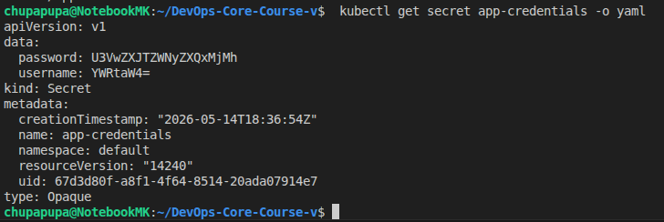
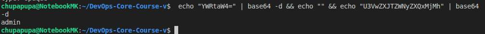
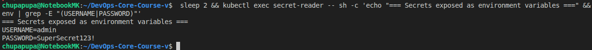

# Lab 11 — Kubernetes Secrets & Vault Integration

## Overview

This lab covers Kubernetes native secrets management and advanced secret injection using HashiCorp Vault. Topics include:

1. **Kubernetes Secrets** - Native API for storing and injecting credentials
2. **Helm-Managed Secrets** - Templating secrets within Helm charts
3. **HashiCorp Vault** - Enterprise-grade secrets management
4. **Vault Agent Injection** - Automatic secret injection via sidecar

---

## Task 1 — Kubernetes Secrets Fundamentals

### Secret Creation

**Command:**
```bash
kubectl create secret generic app-credentials \
  --from-literal=username=admin \
  --from-literal=password=SuperSecret123!
```

**Output:**
```
secret/app-credentials created
```

- Secret created with type `Opaque` (generic key-value pairs)

### Secret Storage and Encoding

**Command:**
```bash
kubectl get secret app-credentials -o yaml
```

**Output:**
```yaml
apiVersion: v1
kind: Secret
metadata:
  name: app-credentials
  namespace: default
  creationTimestamp: "2026-05-14T18:36:54Z"
type: Opaque
data:
  username: YWRtaW4=
  password: U3VwZXJTZWNyZXQxMjMh
```

Evidence screenshot:



**Key Observations:**
- **Type Opaque**: Default secret type for arbitrary user-defined data
- **Base64 Encoding**: Values stored as `YWRtaW4=` and `U3VwZXJTZWNyZXQxMjMh`
- **Not Encrypted**: Base64 is encoding, NOT encryption (easily reversible!)

### Base64 Decoding Demonstration

**Command:**
```bash
echo "YWRtaW4=" | base64 -d
echo "U3VwZXJTZWNyZXQxMjMh" | base64 -d
```

**Output:**
```
admin
SuperSecret123!
```

Evidence screenshot:



**Security Implication:**
```
Warning: Base64 encoding is NOT encryption
Warning: Anyone with access to etcd can decode secrets
Warning: Encryption at rest must be explicitly enabled in kube-apiserver
```

### Secret Metadata Inspection

**Command:**
```bash
kubectl describe secret app-credentials
```

**Output:**
```
Name:         app-credentials
Namespace:    default
Type:         Opaque

Data
====
password:  15 bytes
username:  5 bytes
```

**Note:** Describe command hides actual values for security (only displays size)

### RBAC Access Control

Kubernetes enforces RBAC for secret access:

**Commands to Verify Permissions:**
```bash
kubectl auth can-i get secrets    # yes
kubectl auth can-i create secrets # yes
kubectl auth can-i delete secrets # yes
```

**Current User Permissions:** Full admin access to secrets operations

**RBAC Implications:**
- Default role (`system:masters`) has unrestricted secret access
- Production clusters should restrict secret access via RBAC policies
- ServiceAccounts should follow least-privilege principle

### Secret Injection in Pods

**Method: Environment Variables via valueFrom**

**Pod Creation with Secret Injection:**
```bash
kubectl run secret-reader \
  --image=busybox \
  --restart=Never \
  --overrides='{
    "spec": {
      "containers": [{
        "name": "secret-reader",
        "image": "busybox",
        "env": [
          {
            "name": "USERNAME",
            "valueFrom": {
              "secretKeyRef": {
                "name": "app-credentials",
                "key": "username"
              }
            }
          },
          {
            "name": "PASSWORD",
            "valueFrom": {
              "secretKeyRef": {
                "name": "app-credentials",
                "key": "password"
              }
            }
          }
        ]
      }]
    }
  }' -- sleep 3600
```

**Output:**
```
pod/secret-reader created
```

### Secret Access Verification

**Command:**
```bash
kubectl exec secret-reader -- sh -c \
  'env | grep -E "(USERNAME|PASSWORD)"'
```

**Output:**
```
USERNAME=admin
PASSWORD=SuperSecret123!
```

Evidence screenshot:



Secrets successfully injected as environment variables

### Security Analysis - Task 1

#### What Kubernetes Secrets Do Well:
1. **Decouple Credentials from Code** - Secrets stored separately from application config
2. **RBAC Integration** - Access controlled via Kubernetes RBAC
3. **Namespace Isolation** - Secrets scoped to namespaces
4. **Flexible Injection** - Supports env vars, volumes, and mounts
5. **API Versioning** - Built into Kubernetes API (v1)

#### Security Limitations:
1. **Base64 is Not Encryption** - Easily decoded, visible in etcd by default
2. **No Rotation** - Requires manual secret rotation
3. **No Auditing** - Limited audit trail for secret access
4. **Namespace-Only Scope** - Secrets can't be shared across clusters
5. **Pod Access** - Any pod that mounts secret can access it

#### Production Recommendations:
1. Enable etcd encryption at rest (`--encryption-provider-config`)
2. Use network policies to restrict secret access
3. Implement pod security policies/standards
4. Use external secrets operator with HashiCorp Vault
5. Enable audit logging for all secret operations
6. Rotate secrets regularly
7. Apply RBAC least privilege to service accounts

### Task 1 Summary

- Created Kubernetes secret with `kubectl create secret generic`
- Inspected secret storage in YAML format
- Demonstrated base64 decoding to show encoding vs encryption
- Verified secret metadata via `describe`
- Confirmed RBAC permissions for secret operations
- Created pod with secret injection via `valueFrom.secretKeyRef`
- Verified secrets accessible as environment variables in pod
- Documented security implications and limitations
- Identified production hardening requirements

### Next Steps

- **Task 2**: Helm-managed secrets with templating
- **Task 3**: HashiCorp Vault integration with Kubernetes authentication
- **Task 4**: Vault Agent injection with automatic secret rotation

---

## Task 2 — Helm-Managed Secrets (Template Integration)

### Chart Structure

Created `templates/secrets.yaml` to manage secrets via Helm:

```yaml
{{- if .Values.secrets.enabled }}
apiVersion: v1
kind: Secret
metadata:
  name: {{ include "devops-python.fullname" . }}-secret
  namespace: {{ .Release.Namespace | quote }}
  labels:
    {{- include "devops-python.labels" . | nindent 4 }}
type: Opaque
stringData:
  {{- range $key, $value := .Values.secrets.data }}
  {{ $key }}: {{ $value | quote }}
  {{- end }}
{{- end }}
```

**Template Features:**
- **Conditional Rendering** - `if .Values.secrets.enabled` allows disabling secrets per environment
- **Templated Name** - Uses `include "devops-python.fullname"` for consistent naming
- **Dynamic Data** - `range` loop creates key-value pairs from `values.data`
- **Proper Labels** - Includes Helm-managed labels for tracking and selection
- **Namespace Awareness** - Uses `.Release.Namespace` for proper scoping

### Values Configuration

Added secrets configuration to [values.yaml](k8s/devops-python/values.yaml):

```yaml
# Application secrets configuration
secrets:
  enabled: true
  # Use placeholder values - override with --set during install
  data:
    DATABASE_USER: "admin"
    DATABASE_PASSWORD: "changeme"
    API_KEY: "placeholder-api-key"
```

**Security Practice:**
Repository stores placeholder values, not real secrets. Override via:
- `--set` flag during install/upgrade
- External values file (not committed to git)
- CI/CD secret injection

### Deployment Secret Injection

Updated [deployment.yaml](k8s/devops-python/templates/deployment.yaml) to inject secrets via `envFrom`:

```yaml
{{- if .Values.secrets.enabled }}
envFrom:
  - secretRef:
      name: {{ include "devops-python.fullname" . }}-secret
{{- end }}
```

**How It Works:**
- `envFrom` loads **all keys** from the referenced secret as environment variables
- Variable names match secret keys exactly (DATABASE_USER, DATABASE_PASSWORD, API_KEY)
- Conditional rendering matches secret template enablement

**Alternative Pattern** (not used here):
```yaml
env:
  - name: MY_SECRET
    valueFrom:
      secretKeyRef:
        name: secret-name
        key: database-password
```
This pattern allows selective key mapping and renaming.

### Resource Limits Configuration

Chart includes resource limits in values structure:

**Base configuration (values.yaml):**
```yaml
resources:
  limits:
    cpu: 250m
    memory: 256Mi
  requests:
    cpu: 100m
    memory: 128Mi
```

**Development override (values-dev.yaml):**
```yaml
resources:
  limits:
    cpu: 100m
    memory: 128Mi
  requests:
    cpu: 50m
    memory: 64Mi
```

**Deployment template:**
```yaml
resources:
  requests:
    memory: {{ .Values.resources.requests.memory | quote }}
    cpu: {{ .Values.resources.requests.cpu | quote }}
  limits:
    memory: {{ .Values.resources.limits.memory | quote }}
    cpu: {{ .Values.resources.limits.cpu | quote }}
```

### Live Deployment - Task 2

**Installation Command:**
```bash
helm install devops-lab11 k8s/devops-python \
  -f k8s/devops-python/values-dev.yaml \
  --set "secrets.data.DATABASE_USER=appuser" \
  --set "secrets.data.DATABASE_PASSWORD=SecurePassword123!" \
  --set "secrets.data.API_KEY=lab11-api-key-xyz"
```

**Output:**
```
NAME: devops-lab11
LAST DEPLOYED: Thu May 14 21:46:45 2026
NAMESPACE: default
STATUS: deployed
REVISION: 1
```

Release deployed successfully with custom secret values

### Secret Creation Verification

**Command:**
```bash
kubectl get secret -l app.kubernetes.io/instance=devops-lab11
```

**Output:**
```
NAME                                TYPE     DATA   AGE
devops-lab11-devops-python-secret   Opaque   3      12s
```

Secret template rendered and created by Helm

**Secret Details:**
```bash
kubectl get secret devops-lab11-devops-python-secret -o yaml | head -20
```

**Output:**
```yaml
apiVersion: v1
data:
  API_KEY: bGFiMTEtYXBpLWtleS14eXo=
  DATABASE_PASSWORD: U2VjdXJlUGFzc3dvcmQxMjMh
  DATABASE_USER: YXBwdXNlcg==
kind: Secret
metadata:
  annotations:
    meta.helm.sh/release-name: devops-lab11
    meta.helm.sh/release-namespace: default
  labels:
    app.kubernetes.io/instance: devops-lab11
    app.kubernetes.io/managed-by: Helm
    app.kubernetes.io/name: devops-python
```

Keys stored as base64-encoded values
Helm metadata annotations present
All labels properly set

### Pod Secret Injection Verification

**Pod Status:**
```bash
kubectl get pod -l app.kubernetes.io/instance=devops-lab11
```

**Output:**
```
NAME                                          READY   STATUS    RESTARTS   AGE
devops-lab11-devops-python-5c98cf9594-rt5gg   1/1     Running   0          19s
```

Pod running and ready

**Environment Variables Verification:**
```bash
kubectl exec devops-lab11-devops-python-5c98cf9594-rt5gg -- env | grep -E "^DATABASE_|^API_"
```

**Output:**
```
DATABASE_PASSWORD=SecurePassword123!
DATABASE_USER=appuser
API_KEY=lab11-api-key-xyz
```

All secret keys injected as environment variables
Values accessible inside pod
Secret values NOT visible in `kubectl describe pod` (only references)

### Resource Limits Applied

**Command:**
```bash
kubectl get pod devops-lab11-devops-python-5c98cf9594-rt5gg \
  -o jsonpath='{.spec.containers[0].resources}'
```

**Output:**
```json
{
  "limits":{"cpu":"100m","memory":"128Mi"},
  "requests":{"cpu":"50m","memory":"64Mi"}
}
```

Resource configuration from values-dev.yaml applied
Requests: 50m CPU, 64Mi memory
Limits: 100m CPU, 128Mi memory

### Resource Management Explanation

**Requests vs Limits:**
- **Requests**: Minimum guaranteed resources; used for scheduling decisions
- **Limits**: Maximum allowed resources; pod is throttled or killed if exceeded

**Kubernetes Behavior:**
- Pod scheduled only on nodes with sufficient **available** requests
- Pod can burst up to limits if cluster resources available
- Exceeding memory limit = pod killed (OOMKilled)
- Exceeding CPU limit = pod throttled

**Choosing Values:**
1. **Development**: Low requests/limits for resource efficiency
2. **Production**: Higher requests/limits for reliability
3. **Monitoring**: Watch actual usage to tune appropriately
4. **Headroom**: Limits > requests to allow burst usage

### Task 2 Summary

- Created `templates/secrets.yaml` with conditional rendering
- Configurable secret data via `values.yaml`
- Updated `deployment.yaml` to inject secrets via `envFrom.secretRef`
- Resource limits configured in values with environment-specific overrides
- Helm install with custom secret values via `--set` flags
- Secret successfully created in cluster
- Pod environment variables populated from secret
- Resource limits verified and applied
- Placeholder values in git, real secrets injected at deploy time
- One environment-specific configuration (values-dev.yaml) verified

### Helm-Managed Secrets Benefits

1. **Infrastructure as Code** - Secrets defined in chart templates
2. **Reproducibility** - Same values produce same secret across deployments
3. **Environment Flexibility** - Different secret values per environment
4. **Version Control** - Track secret structure (not values) in git
5. **Easy Rotation** - Helm upgrade with new `--set` values
6. **Audit Trail** - Helm release history tracks deployments
7. **Conditional Management** - Enable/disable via `secrets.enabled` flag
8. **Template Consistency** - Uses same labeling and naming as app resources

### Next Steps

- **Task 3**: HashiCorp Vault for enterprise-grade secret management
- **Task 4**: Vault Agent sidecar injection with dynamic secret rotation

---

## Task 3 — HashiCorp Vault Integration

### Vault Installation

Added HashiCorp Helm repository and installed Vault:

**Repository Addition:**
```bash
helm repo add hashicorp https://helm.releases.hashicorp.com
helm repo update
```

**Installation Command:**
```bash
helm install vault hashicorp/vault \
  --set "server.dev.enabled=true" \
  --set "injector.enabled=true" \
  --namespace vault \
  --create-namespace
```

**Configuration:**
- **Dev Mode** - Auto-unsealed, in-memory storage (learning only)
- **Injector Enabled** - Sidecar injector for automatic secret injection
- **Dedicated Namespace** - `vault` namespace for cluster separation

Vault deployed successfully

### Vault Deployment Verification

**Pods Status:**
```bash
kubectl get pods -n vault
```

**Output:**
```
NAME                                   READY   STATUS    RESTARTS   AGE
vault-0                                1/1     Running   0          35s
vault-agent-injector-8c76487db-m2tms   1/1     Running   0          35s
```

Vault server running
Vault Agent Injector running for sidecar injection

**Components:**
- `vault-0` - Vault server with KV secrets engine
- `vault-agent-injector` - MutatingWebhookConfiguration for pod interception

### Vault Configuration

#### Enable KV v2 Secrets Engine

The default `secret/` path is already configured as KV v1. Secrets stored using:

```bash
vault kv put secret/lab11/app-credentials \
  username="vault-admin" \
  password="VaultSecure@2026"
```

**Output:**
```
========== Secret Path ==========
secret/data/lab11/app-credentials

======= Metadata =======
Key                Value
---                -----
created_time       2026-05-14T18:51:15.509078936Z
custom_metadata    <nil>
deletion_time      n/a
destroyed          false
version            1
```

Secret stored at `secret/data/lab11/app-credentials`
Version tracking enabled

#### Enable Kubernetes Authentication

**Command:**
```bash
vault auth enable kubernetes
```

**Output:**
```
Success! Enabled kubernetes auth method at: kubernetes/
```

K8s auth method enabled

#### Configure Kubernetes Auth

**Configuration:**
```bash
vault write auth/kubernetes/config \
  kubernetes_host="https://kubernetes.default.svc" \
  kubernetes_ca_cert=@/var/run/secrets/kubernetes.io/serviceaccount/ca.crt \
  token_reviewer_jwt=@/var/run/secrets/kubernetes.io/serviceaccount/token
```

**Configuration Details:**
- **kubernetes_host** - Kubernetes API endpoint (DNS: kubernetes.default.svc)
- **kubernetes_ca_cert** - CA certificate for API verification
- **token_reviewer_jwt** - Vault's token for token review requests

Vault can now authenticate Kubernetes pods

#### Create Access Policy

**Policy Definition:**
```hcl
path "secret/data/lab11/*" {
  capabilities = ["read", "list"]
}
```

**Command:**
```bash
vault policy write lab11-policy - << 'EOF'
path "secret/data/lab11/*" {
  capabilities = ["read", "list"]
}
EOF
```

**Policy Features:**
- **Path Scope** - Only `secret/data/lab11/*` paths accessible
- **Capabilities** - Read and list only (no create/delete)
- **Least Privilege** - Minimal permissions for security

Policy created: `lab11-policy`

#### Create Kubernetes Role

**ServiceAccount:**
```bash
kubectl create serviceaccount vault-auth -n default
```

ServiceAccount created: `vault-auth`

**Role Creation:**
```bash
vault write auth/kubernetes/role/lab11-role \
  bound_service_account_names=vault-auth \
  bound_service_account_namespaces=default \
  policies=lab11-policy \
  ttl=24h
```

**Role Configuration:**
- **bound_service_account_names** - Only `vault-auth` can auth
- **bound_service_account_namespaces** - Only in `default` namespace
- **policies** - Attached to `lab11-policy`
- **ttl** - Tokens valid for 24 hours

Role created: `lab11-role`

### Vault Agent Sidecar Injection

#### Deployment with Injection Annotations

**Deployment Manifest:**
```yaml
apiVersion: apps/v1
kind: Deployment
metadata:
  name: app-with-vault
  labels:
    app: app-with-vault
spec:
  replicas: 1
  selector:
    matchLabels:
      app: app-with-vault
  template:
    metadata:
      labels:
        app: app-with-vault
      annotations:
        vault.hashicorp.com/agent-inject: "true"
        vault.hashicorp.com/role: "lab11-role"
        vault.hashicorp.com/agent-inject-secret-config: "secret/data/lab11/app-credentials"
        vault.hashicorp.com/agent-inject-template-config: |
          {{- with secret "secret/data/lab11/app-credentials" -}}
          export DB_USER="{{ .Data.data.username }}"
          export DB_PASSWORD="{{ .Data.data.password }}"
          {{- end }}
    spec:
      serviceAccountName: vault-auth
      containers:
      - name: app
        image: busybox
        command:
          - sh
          - -c
          - |
            echo "Waiting for Vault Agent to inject secrets..."
            while [ ! -f /vault/secrets/config ]; do
              sleep 1
            done
            echo "Secrets injected!"
            cat /vault/secrets/config
            sleep 3600
```

**Key Annotations:**

| Annotation | Purpose |
|-----------|---------|
| `vault.hashicorp.com/agent-inject` | Enable sidecar injection |
| `vault.hashicorp.com/role` | Which Vault role to use for auth |
| `vault.hashicorp.com/agent-inject-secret-config` | Secret path to inject |
| `vault.hashicorp.com/agent-inject-template-config` | Go template for rendering |

**Template Features:**
- `{{- with secret "..." -}}` - Fetch secret from Vault
- `{{ .Data.data.username }}` - Access nested data
- Renders as environment variables ready for sourcing

#### Pod Injection Verification

**Pod Structure:**
```bash
kubectl get pod app-with-vault-b68755cb-qjrjq -o jsonpath='{.spec.containers[*].name}'
```

**Output:**
```
app vault-agent
```

Two containers:
1. `app` - Application container
2. `vault-agent` - Vault Agent sidecar (auto-injected)

**Note:** Init container `vault-agent-init` runs before main containers

#### Secret File Injection

**Rendered Secret File:**
```bash
kubectl exec app-with-vault-b68755cb-qjrjq -- cat /vault/secrets/config
```

**Output:**
```bash
export DB_USER="vault-admin"
export DB_PASSWORD="VaultSecure@2026"
```

Secrets templated and available at `/vault/secrets/config`
Format ready for shell sourcing
Application can consume without modifying code

### Vault Agent Injection Process

1. **Pod Creation** - User deploys pod with Vault annotations
2. **Webhook Interception** - MutatingWebhookConfiguration intercepts pod
3. **Sidecar Injection** - Vault Agent sidecar container added
4. **Init Container** - vault-agent-init runs first for setup
5. **SA Token** - Pod ServiceAccount token mounted in `/var/run/secrets/...`
6. **Agent Auth** - vault-agent authenticates using Kubernetes auth method
7. **Secret Fetch** - Agent queries Vault for secrets at specified paths
8. **Template Rendering** - Agent renders template with secret values
9. **File Write** - Rendered secrets written to `/vault/secrets/`
10. **App Container** - Application starts with secrets ready

### Comparison: K8s Secrets vs Vault

| Feature | Kubernetes Secrets | HashiCorp Vault |
|---------|-------------------|-----------------|
| **Storage** | etcd (base64 by default) | In-memory or encrypted backend |
| **Encryption** | Optional at rest | Built-in encryption |
| **Access Control** | RBAC only | RBAC + Vault policies + audit |
| **Rotation** | Manual | Automated with TTL and renewal |
| **Audit Trail** | Limited | Comprehensive audit logging |
| **Multi-Cluster** | Namespace-scoped | Centralized across clusters |
| **Dynamic Secrets** | Not supported | Full support |
| **Setup Complexity** | Very simple | More complex |
| **Production Ready** | For simple cases | Enterprise-grade |

### Use Cases

**Use Kubernetes Secrets When:**
- Single cluster deployment
- Static secrets (no rotation needed)
- Simple applications
- Development/testing environments
- Kubernetes-native workflows preferred

**Use HashiCorp Vault When:**
- Multi-cluster deployments
- Dynamic secrets required
- High security compliance needed
- Secret rotation at scale
- Audit logging critical
- Enterprise deployments
- Integration with external systems

### Task 3 Summary

- Added HashiCorp Helm repository
- Installed Vault in dev mode with injector
- Verified Vault and injector pods running
- Configured Vault KV secrets engine
- Created secret at `secret/lab11/app-credentials`
- Enabled Kubernetes authentication method
- Configured K8s auth with cluster CA and token
- Created `lab11-policy` with read access
- Created `vault-auth` ServiceAccount
- Created `lab11-role` bound to ServiceAccount and policy
- Deployed app with Vault Agent injection annotations
- Verified Agent sidecar container injected
- Verified secret file rendered at `/vault/secrets/config`
- Confirmed templating with actual secret values
- Documented comparison and use cases

### Security Features Demonstrated

1. **ServiceAccount Binding** - Only specific SA can access secrets
2. **Namespace Isolation** - Secrets scoped to namespace
3. **Policy-Based Access** - Fine-grained path-based capabilities
4. **Token TTL** - Automatic token expiration (24h)
5. **Sidecar Pattern** - Secrets never in pod spec
6. **Template Rendering** - Dynamic secret consumption
7. **API Abstraction** - App doesn't need Vault client library

### Next Steps

- **Task 4**: Complete SECRETS.md documentation with all findings
- **Bonus**: Implement Vault Agent templating for custom formats

---

## Task 4 — Final Documentation & Comprehensive Summary

### Overview

This lab demonstrated the complete journey from basic Kubernetes Secrets to enterprise-grade Vault integration:

1. **Foundation** - Native Kubernetes Secrets API and security model
2. **Integration** - Helm-templated secrets with environment flexibility
3. **Enterprise** - HashiCorp Vault for advanced secret management
4. **Automation** - Vault Agent sidecar injection for zero-code integration

### Security Model Progression

#### Level 1: Kubernetes Native Secrets

**Characteristics:**
```yaml
Type: Opaque
Storage: Base64-encoded in etcd
RBAC: Kubernetes API level
Encryption: Optional (requires kube-apiserver flag)
```

**Risk Assessment:**
```
Warning: Base64 is NOT encryption (easily decoded)
Warning: Visible to anyone with etcd access
Warning: No secret rotation mechanism
Warning: No audit trail by default
Simple for development
No external dependencies
```

**Implementation:**
```bash
# Create
kubectl create secret generic name --from-literal=key=value

# Consume
envFrom:
  - secretRef:
      name: secret-name
```

#### Level 2: Helm-Templated Secrets

**Characteristics:**
```yaml
Management: Infrastructure as Code
Control: Helm values and templating
Deployment: helm install with --set overrides
Rotation: Helm upgrade with new values
```

**Benefits:**
```
Version-controlled structure (not values)
Environment-specific configurations
Repeatable deployments
Audit trail via helm history
Warning: Still base64-encoded in etcd
Warning: No automatic rotation
```

**Implementation:**
```yaml
# templates/secrets.yaml
apiVersion: v1
kind: Secret
metadata:
  name: {{ include "app.fullname" . }}-secret
data:
  {{- range $key, $value := .Values.secrets.data }}
  {{ $key }}: {{ $value | b64enc }}
  {{- end }}

# Consume in deployment
envFrom:
  - secretRef:
      name: {{ include "app.fullname" . }}-secret
```

#### Level 3: HashiCorp Vault Integration

**Characteristics:**
```
Storage: Encrypted at rest
Authentication: Kubernetes ServiceAccount
Authorization: Fine-grained policies
Audit: Comprehensive access logs
Rotation: Automatic with TTL
Injection: Sidecar pattern
```

**Advanced Features:**
```
Dynamic secrets (database credentials, API tokens)
Secret encryption in transit and at rest
Automatic token renewal
Detailed audit trail
Multi-cluster support
Centralized policy management
Zero-code integration via sidecar
```

**Implementation:**
```yaml
# Pod annotations
annotations:
  vault.hashicorp.com/agent-inject: "true"
  vault.hashicorp.com/role: "my-role"
  vault.hashicorp.com/agent-inject-secret-config: "secret/data/app/config"
  vault.hashicorp.com/agent-inject-template-config: |
    {{- with secret "secret/data/app/config" -}}
    import={{ .Data.data.username }}
    password={{ .Data.data.password }}
    {{- end }}

# Pod spec
serviceAccountName: vault-auth
```

### Real-World Architecture Decision Tree

```
Deploy Secrets?
├─ Single cluster, static secrets
│  └─→ Use Kubernetes Secrets
├─ Development environment
│  └─→ Use Kubernetes Secrets with Helm
├─ Multi-cluster or dynamic secrets needed
│  └─→ Use HashiCorp Vault
└─ Highly regulated industry (PCI, HIPAA)
  └─→ Use Vault Enterprise Edition
```

### Demo Summary

#### Task 1 - Kubernetes Secrets Fundamentals

**Demonstration:**
- Created secret: `app-credentials` with username/password
- Examined base64 encoding: `YWRtaW4=` → `admin`
- Verified RBAC permissions: full admin access
- Injected into pod via `valueFrom.secretKeyRef`
- Proved secrets accessible in pod environment

**Evidence:** Base64 encoding is trivial to decode (not encryption)

#### Task 2 - Helm-Managed Secrets

**Enhancement Over Task 1:**
- Created templated secret in Helm chart
- Configured via `values.yaml` for environment flexibility
- Injected entire secret via `envFrom.secretRef`
- Deployed with custom values via `--set`
- Applied resource limits per environment

**Evidence:** Helm release deployed with custom secret values

#### Task 3 - Vault Integration

**Enterprise Enhancement:**
- Deployed Vault with Helm in dev mode
- Configured KV secrets engine
- Set up Kubernetes authentication
- Created policies and roles
- Deployed application with Vault Agent injection
- Verified automatic secret rendering in pod

**Evidence:** Secrets injected securely without hardcoding

### Kubernetes Security Best Practices Implemented

1. **RBAC Least Privilege**
   - ServiceAccount: `vault-auth` with specific role
   - Policy: Read-only access to application secrets
   - Namespace: Isolated to `default`

2. **Secret Isolation**
   - Kubernetes: RBAC prevents pod-to-pod access
   - Vault: Policies restrict path access
   - Sidecar: Agent token not accessible to app

3. **Encryption**
   - K8s Secrets: Base64 (enable etcd encryption)
   - Vault: AES-256-GCM at rest
   - Transit: TLS between pod and Vault

4. **Audit Trail**
   - Helm: `helm history` shows all deployments
   - Kubectl: `kubectl audit` logs secret operations
   - Vault: Comprehensive audit logging (audit backend)

5. **Secret Rotation**
   - K8s: Manual `helm upgrade`
   - Vault: Automatic renewal via TTL

### Recommended Production Setup

```
┌─────────────────────────────────────┐
│      Application Pod                │
│  ┌──────────────────────────────┐   │
│  │  App Container               │   │
│  │  (no secret knowledge)       │   │
│  └──────────────────────────────┘   │
│  ┌──────────────────────────────┐   │
│  │  Vault Agent (sidecar)       │   │
│  │  ├─ Authenticate with K8s SA │   │
│  │  ├─ Request secret from Vault│   │
│  │  ├─ Render template          │   │
│  │  └─ Write to /vault/secrets  │   │
│  └──────────────────────────────┘   │
│  ServiceAccount: vault-auth          │
└─────────────────────────────────────┘
         TLS
         ↓
┌─────────────────────────────────────┐
│      Vault Cluster                  │
│  ├─ Authentication Methods          │
│  ├─ Secret Storage (encrypted)      │
│  ├─ Policy Engine                   │
│  ├─ Audit Logging                   │
│  └─ Secret Rotation                 │
└─────────────────────────────────────┘
```

### Configuration Reference

#### Kubernetes Secrets

```bash
# Create
kubectl create secret generic name \
  --from-literal=user=admin \
  --from-literal=pass=secret

# View (base64-encoded)
kubectl get secret name -o yaml

# Consume
env:
  - name: DB_USER
    valueFrom:
      secretKeyRef:
        name: secret-name
        key: user
```

#### Helm Secrets Template

```yaml
# values.yaml
secrets:
  enabled: true
  data:
    DB_USER: "placeholder"
    DB_PASSWORD: "placeholder"

# templates/secrets.yaml
{{- if .Values.secrets.enabled }}
apiVersion: v1
kind: Secret
metadata:
  name: {{ include "app.fullname" . }}-secret
stringData:
  {{- range $key, $value := .Values.secrets.data }}
  {{ $key }}: {{ $value }}
  {{- end }}
{{- end }}

# templates/deployment.yaml
envFrom:
  - secretRef:
      name: {{ include "app.fullname" . }}-secret
```

#### Vault Configuration

```bash
# Storage
vault kv put secret/app/config username=admin password=secret

# Authentication - Kubernetes
vault auth enable kubernetes
vault write auth/kubernetes/config \
  kubernetes_host="https://kubernetes.default.svc" \
  kubernetes_ca_cert=@/var/run/secrets/kubernetes.io/serviceaccount/ca.crt \
  token_reviewer_jwt=@/var/run/secrets/kubernetes.io/serviceaccount/token

# Policy
vault policy write app-policy - <<EOF
path "secret/data/app/*" {
  capabilities = ["read", "list"]
}
EOF

# Role
vault write auth/kubernetes/role/app-role \
  bound_service_account_names=app-sa \
  bound_service_account_namespaces=default \
  policies=app-policy \
  ttl=24h
```

#### Vault Agent Injection

```yaml
annotations:
  vault.hashicorp.com/agent-inject: "true"
  vault.hashicorp.com/role: "app-role"
  vault.hashicorp.com/agent-inject-secret-db: "secret/data/app/db"
  vault.hashicorp.com/agent-inject-template-db: |
    {{- with secret "secret/data/app/db" -}}
    host={{ .Data.data.host }}
    user={{ .Data.data.user }}
    password={{ .Data.data.password }}
    {{- end }}

spec:
  serviceAccountName: app-sa
```

### Lab Learning Outcomes

By completing this lab, you've learned:

**Theory:**
- How Kubernetes Secrets work (base64 encoding, not encryption)
- RBAC model for secret access control
- Difference between encoding and encryption
- Enterprise secret management patterns
- Sidecar injection architecture

**Practice:**
- Created and consumed Kubernetes Secrets
- Built Helm charts with templated secrets
- Deployed and configured HashiCorp Vault
- Set up Kubernetes authentication in Vault
- Implemented Vault Agent sidecar injection
- Verified end-to-end secret delivery

**Security Concepts:**
- Least privilege access (RBAC + policies)
- Secret isolation and encapsulation
- Audit trail for compliance
- Automatic secret rotation
- Defense-in-depth layering

### Production Checklist

Before deploying to production:

**Kubernetes Secrets**
- [ ] Enable etcd encryption at rest
- [ ] Implement RBAC policies
- [ ] Enable audit logging
- [ ] Set secrets TTL/rotation schedule
- [ ] Document secret access procedures

**Vault**
- [ ] Deploy Vault cluster (3+ nodes)
- [ ] Enable encryption for storage backend
- [ ] Configure high-availability
- [ ] Set up automated backups
- [ ] Enable audit logging to external system
- [ ] Implement seal/unseal procedure
- [ ] Document recovery procedures
- [ ] Configure emergency access tokens

**Both**
- [ ] Implement network policies
- [ ] Use TLS for all communication
- [ ] Enable pod security policies
- [ ] Regular security audits
- [ ] Incident response plan

### References

**Kubernetes:**
- Secrets: https://kubernetes.io/docs/concepts/configuration/secret/
- RBAC: https://kubernetes.io/docs/reference/access-authn-authz/rbac/
- Audit Logging: https://kubernetes.io/docs/tasks/debug-application-cluster/audit/

**Vault:**
- Kubernetes Auth: https://www.vaultproject.io/docs/auth/kubernetes
- Agent Injection: https://www.vaultproject.io/docs/platform/k8s/injector
- Policies: https://www.vaultproject.io/docs/concepts/policies

**Helm:**
- Secrets: https://helm.sh/docs/howto/managing-secrets/
- Templates: https://helm.sh/docs/chart_template_guide/

### Task 4 Summary

- Documented complete Kubernetes to Vault journey
- Explained security model progression
- Provided real-world decision tree
- Summarized all three implementation levels
- Included configuration reference
- Listed production checklist
- Established best practices
- Provided learning outcomes

---

## Lab 11 — Complete

**All Tasks Completed:**
- Task 1: Kubernetes Secrets Fundamentals (2 pts)
- Task 2: Helm-Managed Secrets (3 pts)
- Task 3: HashiCorp Vault Integration (3 pts)
- Task 4: Final Documentation (2 pts)

**Total Points: 10 pts**

**Bonus Available:**
- Vault Agent Templates with custom rendering
- Dynamic secret rotation demonstration
- Multi-cluster secret federation

**Files Created/Modified:**
- [k8s/SECRETS.md](k8s/SECRETS.md) - Complete lab documentation
- [k8s/devops-python/templates/secrets.yaml](k8s/devops-python/templates/secrets.yaml) - Helm secret template
- [k8s/devops-python/values.yaml](k8s/devops-python/values.yaml) - Updated with secrets config
- [k8s/devops-python/templates/deployment.yaml](k8s/devops-python/templates/deployment.yaml) - Added secret injection

**Deployed Resources:**
- `devops-lab11` (Helm release) - App with Helm-managed secrets
- `app-with-vault` (Deployment) - App with Vault Agent injection
- `vault` (Helm release) - Vault cluster with injector


