# Lab 11 — Kubernetes Secrets & HashiCorp Vault

## Task 1 — Kubernetes Secrets Fundamentals

### Creating a Secret with kubectl

A Secret named `app-credentials` was created using the imperative `kubectl create secret generic` command.

#### Command

```bash
kubectl create secret generic app-credentials \
  --from-literal=username=redacted \
  --from-literal=password='redacted'
```

#### Output

```bash
secret/app-credentials created
```

This created a generic Kubernetes Secret of type `Opaque` containing two key-value pairs:

* `username`
* `password`

---

### Listing Secrets

After creating the Secret, the available Secrets in the namespace were listed.

#### Command

```bash
kubectl get secrets
```

#### Output

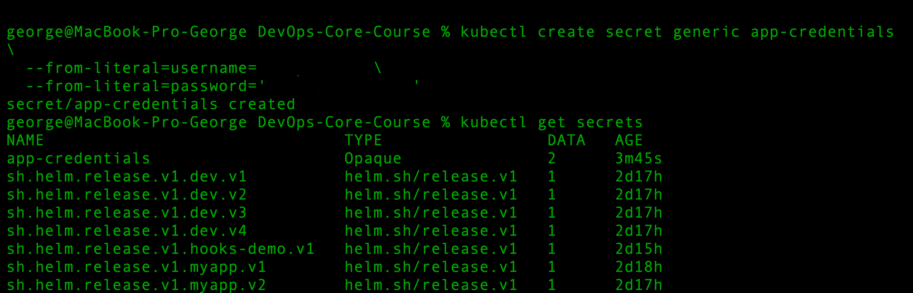
The screenshot output was sanitized to avoid exposing actual secret values.

The `app-credentials` Secret appeared successfully in the `default` namespace.

---

### Viewing the Secret in YAML Format

The Secret was inspected in YAML format to see how Kubernetes stores the values.

#### Command

```bash
kubectl get secret app-credentials -o yaml
```

#### Output

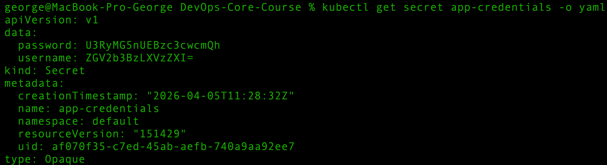


The values are stored under the `data` field in Base64-encoded form.

---

### Decoding Secret Values

The encoded values were manually decoded to verify their contents.

The `base64 -D` option was used (environment is macOS)

#### Decode username and password

Result:
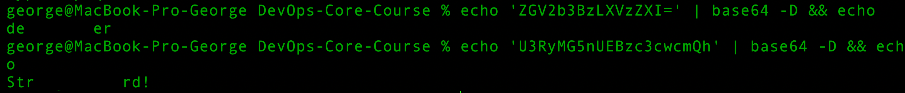
The screenshot output was sanitized to avoid exposing actual secret values.

This confirmed that the Secret contains the expected values.

---

### Encoding vs Encryption

Kubernetes Secrets are often misunderstood as being securely encrypted by default. In practice, the values displayed in the YAML manifest are only **Base64-encoded**.

#### 1. Base64 encoding

Base64 is a data encoding format. It is used to represent binary or plain text data as ASCII text. It is easy to reverse and provides **no real confidentiality**.

#### 2. Encryption

Encryption is a security mechanism that transforms data into an unreadable form using a cryptographic algorithm and a key. Encrypted data cannot be meaningfully read without proper decryption.

#### Conclusion

The Secret values in Kubernetes are not protected simply because they appear unreadable in YAML. Anyone with permission to read the Secret resource can obtain the Base64 values and decode them easily.

---

### Security Implications

Kubernetes Secrets are **not encrypted at rest by default**. They are stored in etcd and can be accessed if someone has sufficient permissions or access to backups.

Key points:
- Base64 encoding is not secure
- Access must be restricted via RBAC
- Encryption at rest should be enabled for production

---

### What Is etcd Encryption?

Kubernetes stores data (including Secrets) in etcd.

**Encryption at rest** means the API server encrypts Secret data before saving it to etcd, protecting it from direct access to:
- etcd files
- snapshots
- backups

---

### When to Enable etcd Encryption

Encryption at rest should be enabled in production, especially when storing sensitive data such as:
- passwords
- tokens
- certificates

Recommended for:
- production environments
- multi-user clusters
- systems with backups or compliance requirements

---

## Task 2 — Helm-Managed Secrets

### Chart Structure

```text
devops-info-service/
  Chart.yaml
  values.yaml
  values-dev.yaml
  values-prod.yaml
  templates/
    _helpers.tpl
    deployment.yaml
    service.yaml
    secrets.yaml
    serviceaccount.yaml
    hooks/
      pre-install-job.yaml
      post-install-job.yaml
```

### 1. Secret Template

A new template file `templates/secrets.yaml` was added to the Helm chart.

```yaml
apiVersion: v1
kind: Secret
metadata:
  name: {{ include "devops-info-service.fullname" . }}-secret
  labels:
    {{- include "devops-info-service.labels" . | nindent 4 }}
type: Opaque
stringData:
  username: {{ .Values.secret.username | quote }}
  password: {{ .Values.secret.password | quote }}
```

This template creates a Kubernetes Secret with a dynamic name and standard labels.
The `stringData` field is used so that Kubernetes automatically encodes values into Base64.

---

### 2. Secret Values Configuration

Placeholder values were defined in `values.yaml`:

```yaml
secret:
  username: "change-me"
  password: "change-me"
```

Environment-specific values were provided in separate files.

Example from `values-dev.yaml`:

```yaml
secret:
  username: <present>
  password: <present>
```

This approach avoids storing real secrets in the default configuration and allows flexible environment-based overrides.

---

### 3. Secret Injection into Deployment

The Deployment template was updated to consume the Secret using `envFrom` and `secretRef`.

```yaml
envFrom:
  - secretRef:
      name: {{ include "devops-info-service.fullname" . }}-secret
```

This automatically exposes all Secret keys as environment variables inside the container.

---

### 4. Chart Validation

The Helm chart was validated successfully.

#### Command

```bash
helm lint ./k8s/devops-info-service
```

#### Output

```bash
1 chart(s) linted, 0 chart(s) failed
```

Rendered templates were also verified:

```bash
helm template dev ./k8s/devops-info-service -f ./k8s/devops-info-service/values-dev.yaml
```

Output:

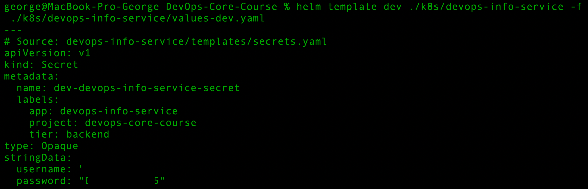
The screenshot output was sanitized to avoid exposing actual secret values.

The output confirmed:

* Secret creation
* Correct secret values
* Proper injection via `envFrom`
* Resource configuration

---

### 5. Deployment

The application was deployed using the development configuration.

#### Command

```bash
helm upgrade --install dev ./k8s/devops-info-service -f ./k8s/devops-info-service/values-dev.yaml
```

#### Output

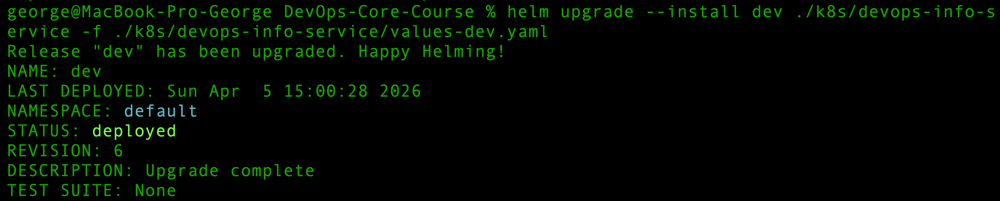

The service was successfully exposed:

```bash
kubectl get svc
```

```bash
dev-devops-info-service   NodePort   80:30083/TCP
```

---

### 6. Secret Verification

The Secret created by Helm was verified.

#### Command

```bash
kubectl get secret dev-devops-info-service-secret -o yaml
```

#### Output

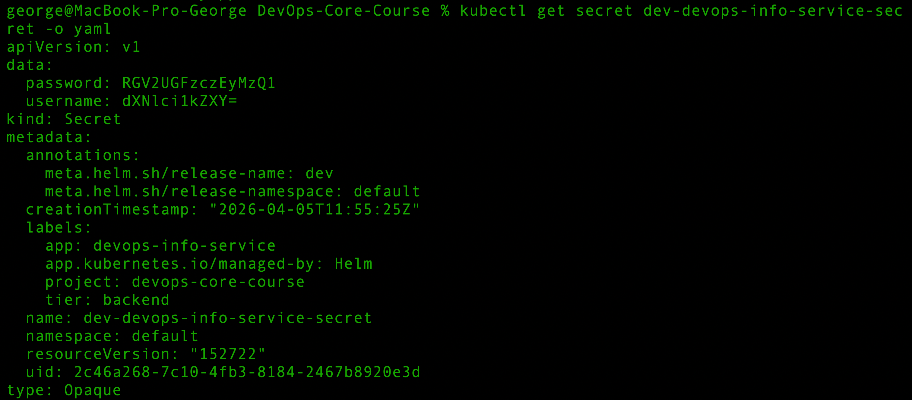

This confirms that the Secret is stored in Base64-encoded form.

---

### 7. Verification Inside the Pod

The injected environment variables were verified inside the running container.

#### Command

```bash
kubectl exec -it dev-devops-info-service-9db45c9f5-dxjzq -- printenv | grep -E 'username|password'
```

#### Output

```bash
password=<present>
username=<present>
```

This confirms that the Secret values were successfully injected into the application.

---

### 8. Pod Description Check

The pod configuration was inspected.

#### Command

```bash
kubectl describe pod dev-devops-info-service-9db45c9f5-dxjzq
```

Relevant section:

```bash
...
Environment Variables from:
  dev-devops-info-service-secret  Secret  Optional: false
  ...
```

The Secret is referenced by the pod, but the actual values are not exposed in plaintext in the pod description.

---

### 9. Resource Limits

Resource requests and limits are defined via Helm values.

Development configuration:

```yaml
resources:
  requests:
    cpu: "50m"
    memory: "64Mi"
  limits:
    cpu: "100m"
    memory: "128Mi"
```

Observed in the running pod:

```yaml
Requests:
  cpu: 50m
  memory: 64Mi

Limits:
  cpu: 100m
  memory: 128Mi
```

`requests` define guaranteed resources, while `limits` define the maximum allowed usage.

### Choosing Resource Values

Resource values should be selected based on:
- application startup behavior
- normal CPU and memory usage
- expected peak load
- monitoring results from real deployments

For development, lower values are usually enough. For production, values should be adjusted using observed metrics to avoid unnecessary throttling or out-of-memory errors.

---


## Task 3 — HashiCorp Vault Integration

### 1. Vault Installation

The official HashiCorp Helm repository was added and updated:

```bash
helm repo add hashicorp https://helm.releases.hashicorp.com
helm repo update
```

Vault was installed in development mode with the injector enabled:

```bash
helm install vault hashicorp/vault \
  --set "server.dev.enabled=true" \
  --set "injector.enabled=true"
```

Vault pods were verified:

```bash
kubectl get pods
```

Relevant output:

```bash
vault-0                                   1/1   Running
vault-agent-injector-848dd747d7-pwhbm     1/1   Running
```

---

### 2. Storing Secrets in Vault

The Vault pod was accessed:

```bash
kubectl exec -it vault-0 -- /bin/sh
```

Inside the pod, Vault CLI variables were configured:

```bash
export VAULT_ADDR='http://127.0.0.1:8200'
export VAULT_TOKEN='root'
```

The existing secrets engines were checked:

```bash
vault secrets list
```

The `secret/` KV engine was already available. A secret for the application was created:

```bash
vault kv put secret/devops-info-service/config \
  username=<redacted> \
  password=<redacted>
```

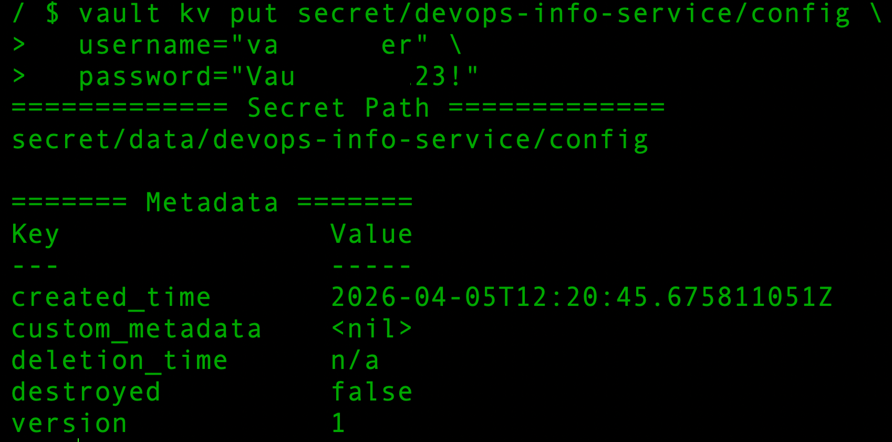
The screenshot output was sanitized to avoid exposing actual secret values.

Verification:

```bash
vault kv get secret/devops-info-service/config
```

Output:

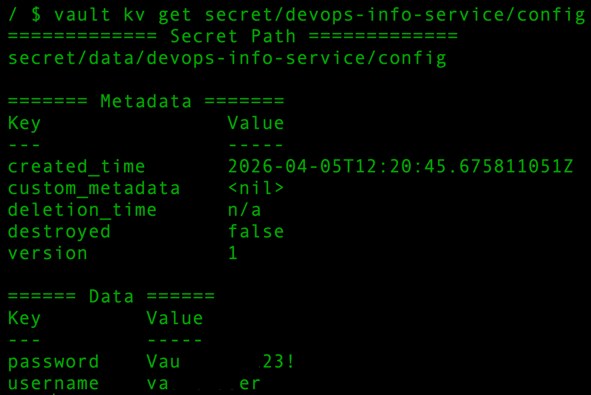
The screenshot output was sanitized to avoid exposing actual secret values.


---

### 3. Kubernetes Authentication

Kubernetes authentication was enabled:

```bash
vault auth enable kubernetes
```

Vault was configured to use the Kubernetes API:

```bash
vault write auth/kubernetes/config \
  kubernetes_host="https://$KUBERNETES_PORT_443_TCP_ADDR:443"
```
A Vault policy was created to allow read access to the application secret path.

```hcl
path "secret/data/devops-info-service/config" {
  capabilities = ["read"]
}
```

A Vault role was created and bound to the application service account.

```bash
vault write auth/kubernetes/role/devops-info-service \
  bound_service_account_names=devops-info-service \
  bound_service_account_namespaces=default \
  policies=devops-info-service \
  ttl=1h
```

The policy and role configuration shown above is sanitized and contains no sensitive credentials.

---

### 4. Helm Chart Changes

A dedicated ServiceAccount was added:

```yaml
apiVersion: v1
kind: ServiceAccount
metadata:
  name: devops-info-service
```

The Deployment was updated to:

* use `serviceAccountName: devops-info-service`
* add Vault annotations
* inject the secret into `/vault/secrets/config.txt`

Relevant configuration:

```yaml
annotations:
  vault.hashicorp.com/agent-inject: "true"
  vault.hashicorp.com/role: "devops-info-service"
  vault.hashicorp.com/agent-inject-secret-config.txt: "secret/data/devops-info-service/config"
  vault.hashicorp.com/agent-inject-template-config.txt: |
    {{`{{- with secret "secret/data/devops-info-service/config" -}}
    username={{ .Data.data.username }}
    password={{ .Data.data.password }}
    {{- end }}`}}

spec:
  serviceAccountName: devops-info-service
```

---

### 5. Validation and Deployment

The chart was validated:

```bash
helm lint ./k8s/devops-info-service
helm template dev ./k8s/devops-info-service -f ./k8s/devops-info-service/values-dev.yaml
```

Deployment:

```bash
helm upgrade --install dev ./k8s/devops-info-service -f ./k8s/devops-info-service/values-dev.yaml
```

Result:

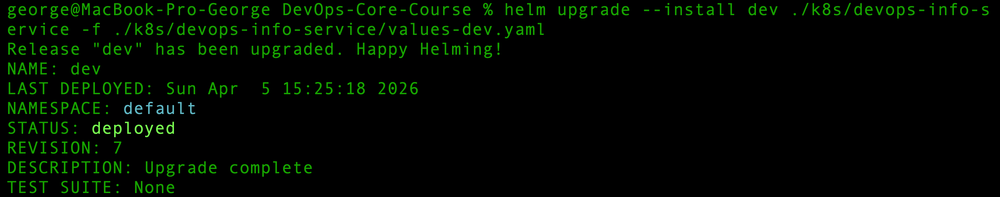

---

### 6. Verifying Vault Injection

The updated pod was checked:

```bash
kubectl get pods
```

Output:

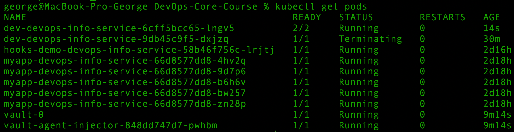

```bash
dev-devops-info-service-6cff5bcc65-lngv5   2/2   Running
```

The pod description confirmed:

* `Service Account: devops-info-service`
* Vault annotations
* `vault-agent-init`
* `vault-agent`
* `vault.hashicorp.com/agent-inject-status: injected`

Secret files were verified inside the pod:

```bash
kubectl exec -it dev-devops-info-service-6cff5bcc65-lngv5 -- ls -lah /vault/secrets
kubectl exec -it dev-devops-info-service-6cff5bcc65-lngv5 -- cat /vault/secrets/config.txt
```

Output:

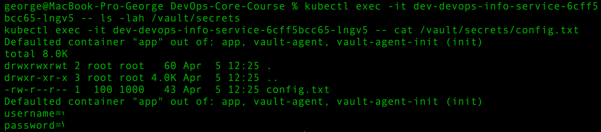

This confirmed that Vault successfully injected the secret into the pod as a file.

### 7. Sidecar Injection Pattern

Vault Agent Injector uses a sidecar-based approach. When the pod is created, Vault mutates the pod specification and adds:
- an init container to authenticate and prepare secret delivery
- a Vault Agent sidecar container
- a shared in-memory volume mounted at `/vault/secrets`

The application container reads injected secrets from files in this shared path. This avoids hardcoding sensitive values in the image or directly in Kubernetes manifests.


## Security Analysis

### Kubernetes Secrets vs Vault

Kubernetes Secrets are simple and built into Kubernetes. They are easy to use and work well for basic secret injection into pods. However, they are only Base64-encoded in manifests and require additional cluster configuration for stronger protection, such as RBAC and encryption at rest.

HashiCorp Vault provides stronger secret management capabilities. It supports centralized secret storage, fine-grained access control, dynamic secret delivery, and pod-level injection without storing secret values directly in application manifests.

### When to Use Kubernetes Secrets

Kubernetes Secrets are suitable for:
- local development
- small projects
- simple applications
- cases where external secret management is not required

### When to Use Vault

Vault is better for:
- production environments
- multi-service systems
- teams with stricter security requirements
- centralized secret management
- rotating or dynamically issued credentials

### Production Recommendations

For production environments:
- do not store real secrets in Git
- keep placeholder values in `values.yaml`
- restrict access to Secrets with RBAC
- enable encryption at rest in etcd
- prefer Vault or another external secret manager for sensitive workloads
- use dedicated service accounts instead of the default account
