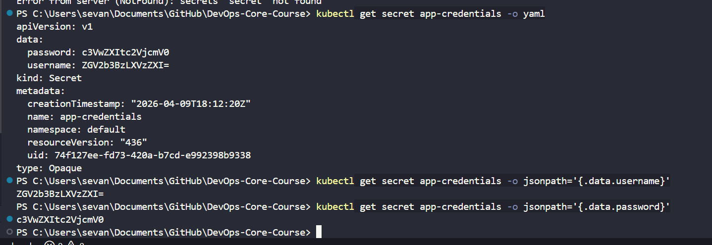
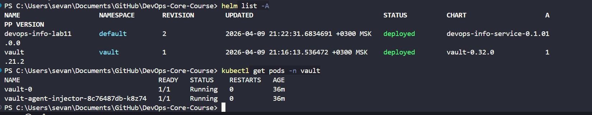
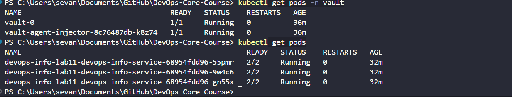
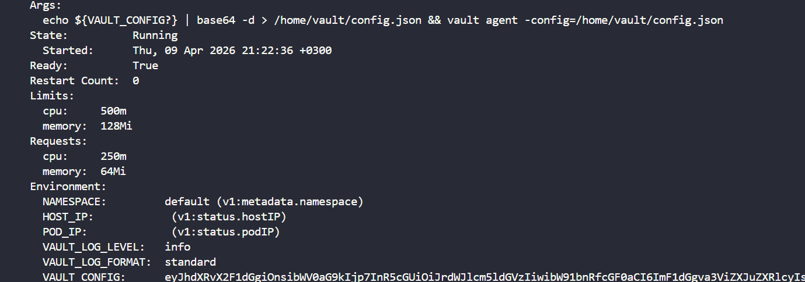

# Lab 11: Kubernetes Secrets and HashiCorp Vault

Date: 2026-04-09  
Cluster: `minikube`  
Namespace(s): `default`, `vault`

## 1. Kubernetes Secrets Fundamentals

### 1.1 Create Secret (imperative kubectl)

```bash
kubectl create secret generic app-credentials \
  --from-literal=username=devops-user \
  --from-literal=password=super-secret
```

Output:

```text
secret/app-credentials created
```

### 1.2 View Secret YAML

```bash
kubectl get secret app-credentials -o yaml
```

Output:

```yaml
apiVersion: v1
data:
  password: c3VwZXItc2VjcmV0
  username: ZGV2b3BzLXVzZXI=
kind: Secret
metadata:
  creationTimestamp: "2026-04-09T18:12:20Z"
  name: app-credentials
  namespace: default
type: Opaque
```

### 1.3 Decode base64 values

```powershell
$u = kubectl get secret app-credentials -o jsonpath='{.data.username}'
[Text.Encoding]::UTF8.GetString([Convert]::FromBase64String($u))

$p = kubectl get secret app-credentials -o jsonpath='{.data.password}'
[Text.Encoding]::UTF8.GetString([Convert]::FromBase64String($p))
```

Output:

```text
devops-user
super-secret
```

Screenshot:



### 1.4 Encoding vs Encryption

- Kubernetes Secret values in `data` are **base64-encoded**, not encrypted.
- Base64 is reversible representation, not cryptographic protection.
- Real protection requires:
  - etcd encryption at rest (`EncryptionConfiguration` on API server)
  - strict RBAC for `secrets` access
  - external secret manager for production (Vault, cloud secret managers, etc.)

### 1.5 Are Secrets encrypted at rest by default?

- In standard Kubernetes setup: **No, not by default**.
- etcd encryption at rest should be enabled for any non-trivial environment.

---

## 2. Helm Secret Integration

Helm chart updated in `k8s/devops-info-service`.

### 2.1 Chart changes

Added:

- `templates/secrets.yaml` (Kubernetes Secret via `stringData`)
- `templates/serviceaccount.yaml` (dedicated ServiceAccount for Vault auth)

Updated:

- `templates/deployment.yaml`
- `templates/_helpers.tpl`
- `values.yaml`
- `values-dev.yaml`
- `values-prod.yaml`

### 2.2 Secret template and values

- Secret values are controlled through:
  - `secret.enabled`
  - `secret.create`
  - `secret.name`
  - `secret.data.username`
  - `secret.data.password`
- App consumes secret keys through:
  - `envFrom -> secretRef`

### 2.3 Deployment verification

Install/upgrade command:

```bash
helm upgrade --install devops-info-lab11 k8s/devops-info-service \
  --set secret.data.username=lab-user \
  --set secret.data.password=lab-password \
  --set app.environment=lab \
  --wait --timeout 240s
```

Release status:

```text
NAME: devops-info-lab11
STATUS: deployed
REVISION: 1
```

Resources:

```bash
kubectl get deploy,svc,secret -l app.kubernetes.io/instance=devops-info-lab11
```

```text
deployment.apps/devops-info-lab11-devops-info-service   3/3
service/devops-info-lab11-devops-info-service           NodePort
secret/devops-info-lab11-devops-info-service-credentials Opaque 2
```

Environment verification in pod:

```bash
kubectl exec <pod> -- printenv | grep -E "username|password|APP_ENV|LOG_LEVEL|HOST|PORT"
```

Observed:

```text
HOST=0.0.0.0
PORT=5000
APP_ENV=lab
LOG_LEVEL=info
username=lab-user
password=lab-password
```

`kubectl describe pod` does not reveal actual secret values:

```text
Environment Variables from:
  devops-info-lab11-devops-info-service-credentials  Secret  Optional: false
Environment:
  ... (no secret plaintext values)
```

---

## 3. Resource Management

Configured in `values.yaml` and applied in Deployment:

```yaml
resources:
  requests:
    cpu: 100m
    memory: 128Mi
  limits:
    cpu: 200m
    memory: 256Mi
```

Runtime check (`kubectl get pod ... -o jsonpath=...`):

```text
requests.cpu=100m
requests.memory=128Mi
limits.cpu=200m
limits.memory=256Mi
```

Requests vs limits:

- `requests` reserve guaranteed minimum scheduling capacity.
- `limits` cap maximum container resource consumption.
- Choose values from real metrics (baseline load, p95/p99 peaks, headroom).

---

## 4. Vault Integration

### 4.1 Install Vault via Helm

```bash
helm repo add hashicorp https://helm.releases.hashicorp.com
helm repo update
helm upgrade --install vault hashicorp/vault \
  --namespace vault --create-namespace \
  --set server.dev.enabled=true \
  --set injector.enabled=true \
  --wait --timeout 420s
```

Vault pods:

```bash
kubectl get pods -n vault -o wide
```

```text
vault-0                                1/1 Running
vault-agent-injector-8c76487db-k8z74   1/1 Running
```

Screenshot:



### 4.2 Configure Vault (KV v2 + secret path)

`secret/` mount in dev chart is already KV v2 (`options: map[version:2]`).

Create application secret:

```bash
kubectl exec -n vault vault-0 -- sh -c \
  "export VAULT_ADDR=http://127.0.0.1:8200 VAULT_TOKEN=root; \
   vault kv put secret/myapp/config username=vault-user password=vault-password api_key=vault-api-key"
```

### 4.3 Kubernetes auth, policy, role

Enable auth method:

```bash
vault auth enable kubernetes
```

Configure auth:

```bash
vault write auth/kubernetes/config \
  token_reviewer_jwt="$TOKEN" \
  kubernetes_host="https://kubernetes.default.svc:443" \
  kubernetes_ca_cert=@/var/run/secrets/kubernetes.io/serviceaccount/ca.crt
```

Policy (`k8s/vault/devops-info-policy.hcl`):

```hcl
path "secret/data/myapp/config" {
  capabilities = ["read"]
}
```

Role creation:

```bash
vault write auth/kubernetes/role/devops-info-role \
  bound_service_account_names=devops-info-lab11-devops-info-service \
  bound_service_account_namespaces=default \
  policies=devops-info-policy \
  ttl=1h
```

Role evidence:

```text
bound_service_account_names       [devops-info-lab11-devops-info-service]
bound_service_account_namespaces  [default]
policies                          [devops-info-policy]
ttl                               1h
```

### 4.4 Vault Agent injection in app

Helm upgrade enabling annotations:

```bash
helm upgrade devops-info-lab11 k8s/devops-info-service \
  --reuse-values \
  --set vault.enabled=true \
  --set vault.role=devops-info-role \
  --set vault.secretPath=secret/data/myapp/config \
  --set vault.injectFileName=config \
  --wait --timeout 300s
```

Pod result:

```text
devops-info-lab11-devops-info-service-...   2/2 Running
```

Screenshot:



Injected annotations present:

```text
vault.hashicorp.com/agent-inject: "true"
vault.hashicorp.com/role: devops-info-role
vault.hashicorp.com/agent-inject-secret-config: secret/data/myapp/config
vault.hashicorp.com/agent-inject-status: injected
```

Screenshot:



Injected file proof:

```bash
kubectl exec <pod> -c devops-info-service -- find /vault -maxdepth 3 -type f
kubectl exec <pod> -c devops-info-service -- cat /vault/secrets/config
```

Output:

```text
/vault/secrets/config
DATABASE_USERNAME=vault-user
DATABASE_PASSWORD=vault-password
```

Sidecar pattern summary:

- Pod annotations instruct Vault Injector webhook to mutate pod spec.
- Init/sidecar Vault Agent authenticates via Kubernetes auth role.
- Agent writes secrets to shared in-memory volume (e.g. `/vault/secrets/*`).
- App consumes secrets from files without embedding Vault client code.

---

## 5. Security Analysis: K8s Secrets vs Vault

Kubernetes Secrets:

- Pros: native, simple, fast to adopt, no external dependency.
- Cons: only base64 by default, weaker rotation/audit model, broader blast radius if API/RBAC is weak.

Vault:

- Pros: centralized policy control, audit trail, dynamic/short-lived credentials, stronger rotation workflows.
- Cons: extra operational complexity and availability dependency.

When to use:

- Use K8s Secrets for low-risk/dev/internal bootstrap.
- Use Vault for production credentials, compliance, and multi-team environments.

Production recommendations:

1. Enable etcd encryption at rest.
2. Enforce least-privilege RBAC for secrets.
3. Prefer external secret manager (Vault) for sensitive credentials.
4. Rotate credentials regularly and automate rollout/reload behavior.
5. Use sealed secrets / SOPS / CI secret injection to avoid plaintext in Git.

---

## Bonus: Vault Agent Templates and DRY Helm

### B1. Template annotation implemented

In `values.yaml`:

```yaml
vault:
  template: |
    {{- with secret "secret/data/myapp/config" -}}
    DATABASE_USERNAME={{ .Data.data.username }}
    DATABASE_PASSWORD={{ .Data.data.password }}
    {{- end }}
```

In `deployment.yaml`:

```yaml
vault.hashicorp.com/agent-inject-template-config: |
  {{- with secret "secret/data/myapp/config" -}}
  DATABASE_USERNAME={{ .Data.data.username }}
  DATABASE_PASSWORD={{ .Data.data.password }}
  {{- end }}
```

Rendered evidence:

```text
vault.hashicorp.com/agent-inject-template-config: |
  DATABASE_USERNAME={{ .Data.data.username }}
  DATABASE_PASSWORD={{ .Data.data.password }}
```

### B2. Dynamic secret refresh behavior (research)

- Vault Agent periodically renews/re-reads secrets according to lease/TTL semantics.
- For rotating/dynamic secrets, rendered files are updated when data changes or lease rotates.
- `vault.hashicorp.com/agent-inject-command-<name>` can run a command after file update
  (for example, send `SIGHUP` or trigger app-specific reload script).
- If app does not watch files, add reload command or sidecar reloader strategy.

Rendered command annotation example:

```text
vault.hashicorp.com/agent-inject-command-config: "sh -c 'echo reloaded'"
```

### B3. Named template for env vars (DRY)

Implemented in `templates/_helpers.tpl`:

```yaml
{{- define "devops-info-service.commonEnv" -}}
- name: HOST
  value: "0.0.0.0"
- name: PORT
  value: "{{ .Values.containerPort }}"
- name: APP_ENV
  value: {{ .Values.app.environment | quote }}
- name: LOG_LEVEL
  value: {{ .Values.app.logLevel | quote }}
{{- end -}}
```

Used in `deployment.yaml`:

```yaml
env:
{{ include "devops-info-service.commonEnv" . | nindent 12 }}
```

Benefits:

- Single source of truth for common env variables.
- Cleaner deployment template.
- Lower risk of env drift between environments/releases.
