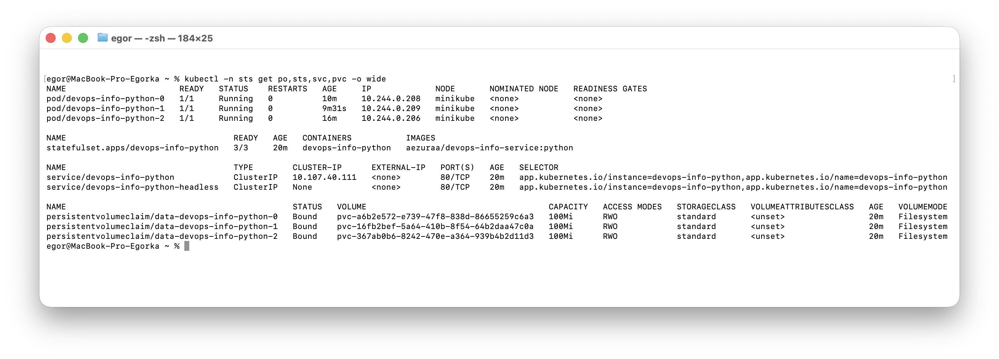
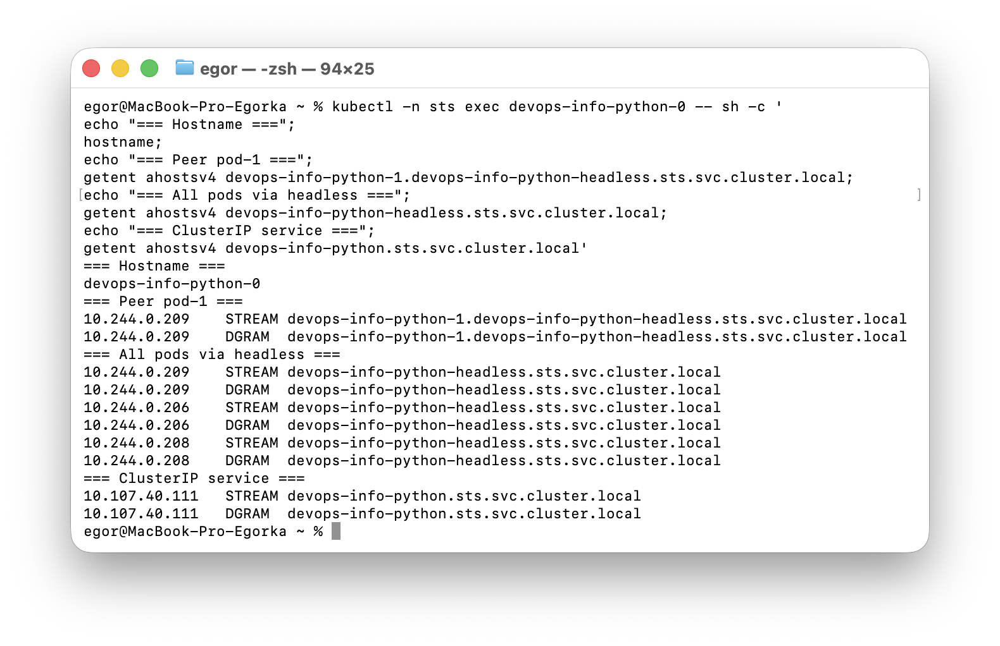
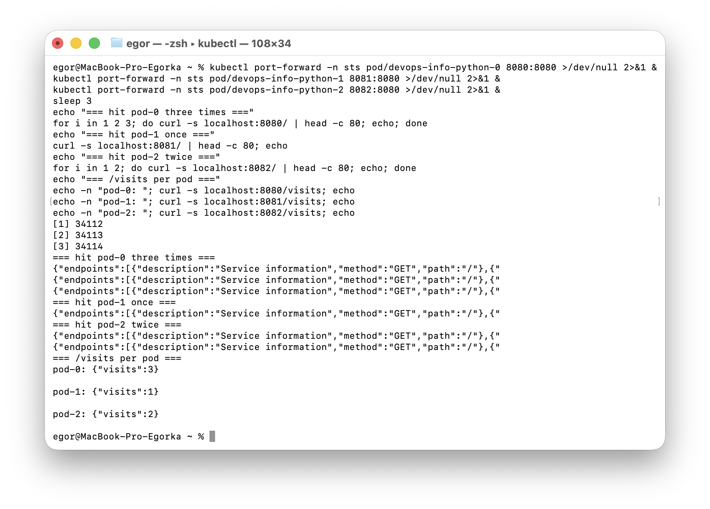
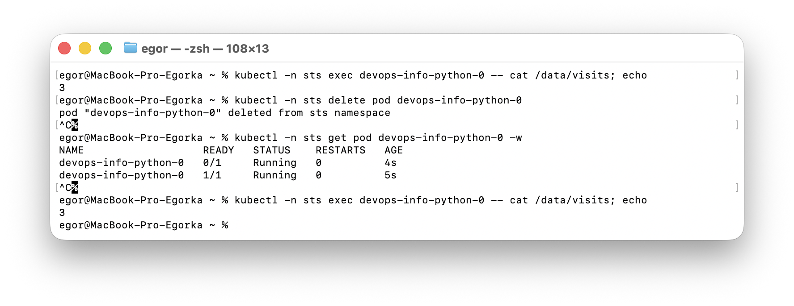
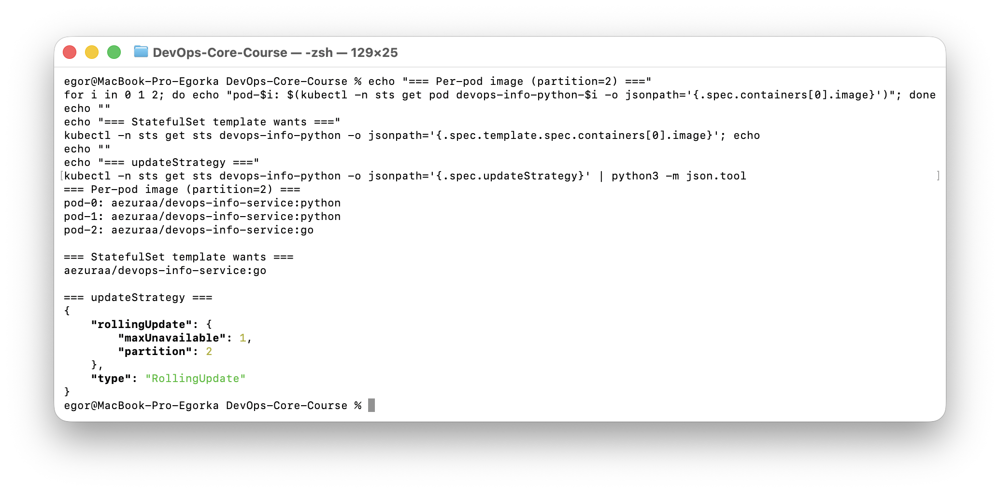
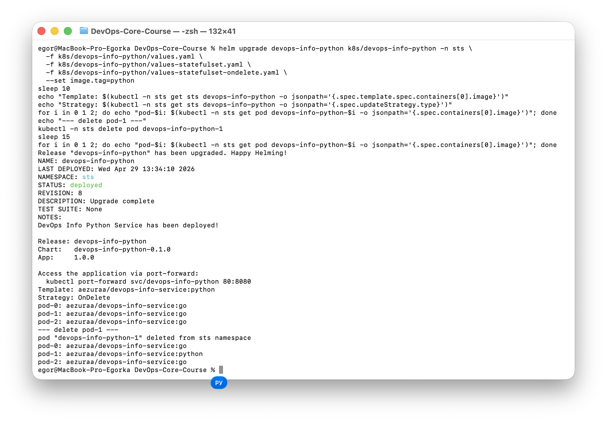

# StatefulSets & Persistent Storage (Lab 15)

`devops-info-python` deployed as a StatefulSet with stable pod identities, headless DNS, and per-pod persistent storage.

## 1. Why StatefulSet

The Flask app persists its visit counter to `/data/visits` (`app_python/app.py`, line 87: `VISITS_FILE = os.getenv('VISITS_FILE', '/data/visits')`). With a Deployment + a single shared `ReadWriteOnce` PVC the replicas race and only one ever runs. A StatefulSet gives every replica its own identity and PVC, so the counter is per-pod and survives pod restarts.

### Guarantees

1. **Stable network identity** — pods are named `<sts>-0`, `<sts>-1`, ...; each gets DNS `<sts>-N.<headless>.<ns>.svc.cluster.local` that follows the pod across reschedules.
2. **Stable persistent storage** — each ordinal owns a dedicated PVC, created from `volumeClaimTemplates`. The PVC is preserved when the pod is deleted/rescheduled and even when the StatefulSet is scaled down (manual cleanup).
3. **Ordered, graceful lifecycle** — with `podManagementPolicy: OrderedReady`, pods are created and updated 0 → 1 → 2 (and torn down in reverse) so quorum/leader-election workloads stay consistent.

### Deployment vs StatefulSet

| | Deployment | StatefulSet |
|---|---|---|
| Pod names | `<rs-hash>-<rand>` | `<sts>-0`, `<sts>-1`, ... |
| Storage | One shared PVC (or `emptyDir`) | One PVC per replica via `volumeClaimTemplates` |
| Network | Single Service VIP | Headless Service → per-pod DNS A records |
| Pod startup | Parallel | Ordered (`OrderedReady`) by default |
| Pod deletion on scale-down | Random | Reverse ordinal (N-1 → 0) |
| PVC reclaim | None (shared) | PVCs survive scale-down |
| Update strategies | RollingUpdate, Recreate | RollingUpdate (with `partition`), OnDelete |
| Best for | Stateless web/API services | Databases, queues, leader-elected clusters (Postgres, Kafka, ES, MongoDB) |

### Headless Service

A Service with `spec.clusterIP: None` skips kube-proxy load balancing. Instead, kube-dns publishes:
- one A record per ready pod under `<headless>.<ns>.svc.cluster.local`
- a per-pod A record `<sts-N>.<headless>.<ns>.svc.cluster.local`

That lets clients (or peers in a quorum) talk directly to a specific replica — required for stateful clustering.

---

## 2. Implementation

Files:
- [`templates/statefulset.yaml`](devops-info-python/templates/statefulset.yaml) — gated by `.Values.statefulset.enabled`
- [`templates/service-headless.yaml`](devops-info-python/templates/service-headless.yaml) — `clusterIP: None`
- [`templates/deployment.yaml`](devops-info-python/templates/deployment.yaml), [`templates/rollout.yaml`](devops-info-python/templates/rollout.yaml), [`templates/pvc.yaml`](devops-info-python/templates/pvc.yaml) — auto-skip when StatefulSet is enabled
- [`values-statefulset.yaml`](devops-info-python/values-statefulset.yaml) — primary config
- [`values-statefulset-partition.yaml`](devops-info-python/values-statefulset-partition.yaml), [`values-statefulset-ondelete.yaml`](devops-info-python/values-statefulset-ondelete.yaml) — bonus

### Key fragments

```yaml
# statefulset.yaml
spec:
  serviceName: devops-info-python-headless
  podManagementPolicy: OrderedReady
  updateStrategy:
    type: RollingUpdate
  template:
    spec:
      containers:
        - name: devops-info-python
          volumeMounts:
            - name: data
              mountPath: /data
          env:
            - name: VISITS_FILE
              value: "/data/visits"
  volumeClaimTemplates:
    - metadata: { name: data }
      spec:
        accessModes: [ "ReadWriteOnce" ]
        resources: { requests: { storage: 100Mi } }
        storageClassName: standard
```

```yaml
# service-headless.yaml
spec:
  clusterIP: None
  publishNotReadyAddresses: true
  selector:
    app.kubernetes.io/name: devops-info-python
    app.kubernetes.io/instance: devops-info-python
```

### Install

```bash
kubectl create ns sts
helm install devops-info-python k8s/devops-info-python \
  -n sts -f k8s/devops-info-python/values.yaml \
         -f k8s/devops-info-python/values-statefulset.yaml
```

---

## 3. Resource Verification

```text
$ kubectl -n sts get po,sts,svc,pvc -o wide
NAME                       READY   STATUS    RESTARTS   AGE   IP             NODE
pod/devops-info-python-0   1/1     Running   0          49s   10.244.0.202   minikube
pod/devops-info-python-1   1/1     Running   0          41s   10.244.0.203   minikube
pod/devops-info-python-2   1/1     Running   0          33s   10.244.0.204   minikube

NAME                                  READY   AGE   IMAGES
statefulset.apps/devops-info-python   3/3     49s   aezuraa/devops-info-service:python

NAME                                  TYPE        CLUSTER-IP      PORT(S)
service/devops-info-python            ClusterIP   10.107.40.111   80/TCP        # external access
service/devops-info-python-headless   ClusterIP   None            80/TCP        # per-pod DNS

NAME                                          STATUS   CAPACITY   ACCESS MODES   STORAGECLASS
pvc/data-devops-info-python-0                 Bound    100Mi      RWO            standard
pvc/data-devops-info-python-1                 Bound    100Mi      RWO            standard
pvc/data-devops-info-python-2                 Bound    100Mi      RWO            standard
```

- 3 pods with **ordinal** names (no random hash).
- 3 PVCs, one per pod, named `data-<sts>-<N>`.
- Two services: one regular ClusterIP (entry point) + one **headless** for direct pod targeting.



---

## 4. Network Identity (DNS)

From inside `devops-info-python-0`:

```text
=== Hostname ===
devops-info-python-0

=== Resolve devops-info-python-1 (peer) ===
10.244.0.203    devops-info-python-1.devops-info-python-headless.sts.svc.cluster.local

=== Resolve headless service (returns ALL pod IPs) ===
('devops-info-python-headless.sts.svc.cluster.local', [],
 ['10.244.0.202', '10.244.0.204', '10.244.0.203'])

=== Resolve clusterIP service ===
('devops-info-python.sts.svc.cluster.local', [], ['10.107.40.111'])
```

DNS naming pattern: **`<pod-name>.<headless-service-name>.<namespace>.svc.cluster.local`** → individual pod IP.
Resolving the headless service alone returns the **list of all ready pod IPs** (one A record per pod), enabling direct client-side load balancing or quorum gossip.



---

## 5. Per-Pod Storage Isolation

Each pod was hit a different number of times:

```text
=== Hit pod-0 three times ===           pod-0 → visits=1, 2, 3
=== Hit pod-1 once ===                  pod-1 → visits=1
=== Hit pod-2 twice ===                 pod-2 → visits=1, 2

=== /visits per pod ===
pod-0 visits: {"visits":3}
pod-1 visits: {"visits":1}
pod-2 visits: {"visits":2}
```

Different counters prove that the pods do **not** share storage — each writes to its own `data-devops-info-python-N` PVC mounted at `/data`.



---

## 6. Persistence Across Pod Deletion

```text
=== Before delete ===
$ kubectl -n sts exec devops-info-python-0 -- cat /data/visits
3

=== Delete pod-0 ===
$ kubectl -n sts delete pod devops-info-python-0
pod "devops-info-python-0" deleted

=== Pod recreated with new IP, same name + same PVC ===
NAME                   READY   STATUS    AGE   IP
devops-info-python-0   1/1     Running   8s    10.244.0.205   <-- was 10.244.0.202

=== After restart ===
$ kubectl -n sts exec devops-info-python-0 -- cat /data/visits
3

$ curl localhost:8080/visits   # via the same pod, after restart
{"visits":3}

# Increment once more — counter continues, doesn't reset
$ curl localhost:8080/         → visits=4

# Other pods unaffected
pod-1: {"visits":1}
pod-2: {"visits":2}
```

The PVC `data-devops-info-python-0` outlived the pod. The new pod (different IP `10.244.0.205`) re-attached to the same volume and read the existing `visits=3`.



---

## 7. Bonus — Update Strategies

### 7.1 Partitioned RollingUpdate

```yaml
updateStrategy:
  type: RollingUpdate
  rollingUpdate:
    partition: 2     # only pods with ordinal >= 2 are updated
```

```bash
helm upgrade devops-info-python k8s/devops-info-python -n sts \
  -f k8s/devops-info-python/values.yaml \
  -f k8s/devops-info-python/values-statefulset.yaml \
  -f k8s/devops-info-python/values-statefulset-partition.yaml \
  --set image.tag=go
```

Result — only `pod-2` adopted the new image:

```text
=== Per-pod image (partition=2) ===
pod-0: aezuraa/devops-info-service:python   <-- frozen
pod-1: aezuraa/devops-info-service:python   <-- frozen
pod-2: aezuraa/devops-info-service:go       <-- updated

=== updateStrategy ===
{ "type": "RollingUpdate",
  "rollingUpdate": { "partition": 2, "maxUnavailable": 1 } }
```

**Use case:** canary-style validation on the highest ordinal first; lower `partition` once metrics look good to roll the rest.



### 7.2 OnDelete

```yaml
updateStrategy:
  type: OnDelete
```

The controller writes the new pod template but **never** rolls existing pods automatically. They adopt the new spec only when the operator explicitly deletes them.

```bash
helm upgrade devops-info-python ... -f values-statefulset-ondelete.yaml --set image.tag=python
# Wait — nothing changes:
pod-0: go    pod-1: go    pod-2: go

kubectl -n sts delete pod devops-info-python-1
# After recreation:
pod-0: go    pod-1: python    pod-2: go
```

**Use cases:**
- Workloads that need explicit drain / leader hand-off before restart (Postgres primary, Kafka broker).
- Strict change-control where every restart is a manual operation.
- Coordinating updates with external load-balancer cutovers.



---

## 8. CLI Cheatsheet

| Action | Command |
|---|---|
| Install | `helm install devops-info-python k8s/devops-info-python -n sts -f values.yaml -f values-statefulset.yaml` |
| Watch ordered startup | `kubectl -n sts get pods -w` |
| Inspect StatefulSet | `kubectl -n sts get sts devops-info-python -o yaml` |
| List per-pod PVCs | `kubectl -n sts get pvc -l app.kubernetes.io/name=devops-info-python` |
| Resolve peer DNS | `kubectl -n sts exec sts/devops-info-python -- getent hosts <pod>.<headless>.<ns>.svc.cluster.local` |
| Read data on disk | `kubectl -n sts exec devops-info-python-0 -- cat /data/visits` |
| Delete pod (PVC kept) | `kubectl -n sts delete pod devops-info-python-0` |
| Scale down (PVCs kept) | `kubectl -n sts scale sts devops-info-python --replicas=2` |
| Manual cleanup of orphaned PVCs | `kubectl -n sts delete pvc data-devops-info-python-2` |
| Set partition | `helm upgrade ... --set statefulset.updateStrategy.partition=N` |
| Switch to OnDelete | `... -f values-statefulset-ondelete.yaml` |
