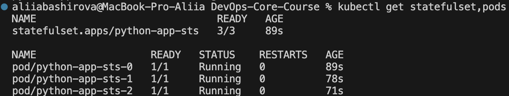
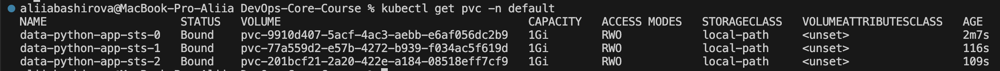
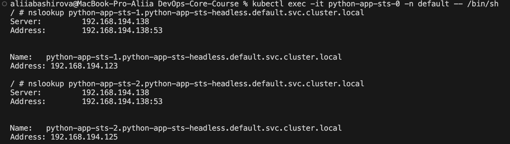
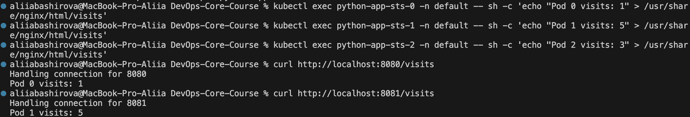
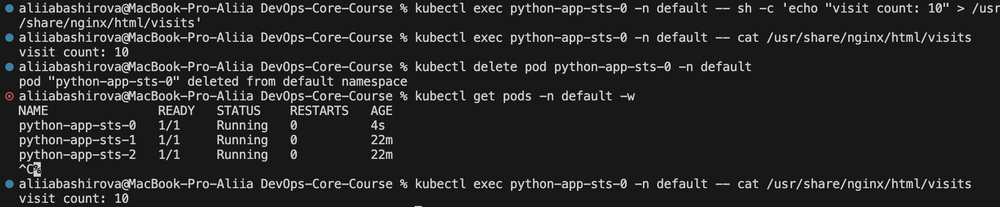

# Lab 15 — StatefulSets & Persistent Storage

## Task 1 — StatefulSet Concepts

### StatefulSet Guarantees

1. **Stable, unique network identifiers** — Each pod has a predictable name (`app-0`, `app-1`, `app-2`) that persists across restarts
2. **Stable, persistent storage** — Each pod gets its own PVC (PersistentVolumeClaim) that survives pod rescheduling
3. **Ordered, graceful deployment and scaling** — Pods are created in order (0→1→2) and terminated in reverse order (2→1→0)

### Deployment vs StatefulSet

| Feature | Deployment | StatefulSet |
|---------|------------|-------------|
| Pod naming | Random suffix (`app-5d8c7b9f-xyz`) | Ordered index (`app-0`, `app-1`) |
| Storage | Shared PVC or ephemeral | Per-pod PVC via volumeClaimTemplates |
| Scaling order | Parallel (any order) | Ordered (0→1→2 up, 2→1→0 down) |
| Network identity | Random, not stable | Stable DNS names |
| Pod replacement | New name, new identity | Same name, same identity |

### When to Use StatefulSet

| Use Case | Examples |
|----------|----------|
| Databases | MySQL, PostgreSQL, MongoDB |
| Message queues | Kafka, RabbitMQ |
| Distributed systems | Elasticsearch, Cassandra, ZooKeeper |
| Any app needing stable storage per instance | Redis cluster, etcd |

### Headless Service

A **headless service** (`clusterIP: None`) creates DNS records for each pod:
```
<pod-name>.<service-name>.<namespace>.svc.cluster.local
```


Examples:
- `python-app-sts-0.python-app-sts-headless.default.svc.cluster.local`
- `python-app-sts-1.python-app-sts-headless.default.svc.cluster.local`

---

## Task 2 — StatefulSet Implementation

### StatefulSet Configuration

```yaml
apiVersion: apps/v1
kind: StatefulSet
metadata:
  name: python-app-sts
  namespace: default
spec:
  serviceName: python-app-sts-headless
  replicas: 3
  selector:
    matchLabels:
      app: python-app-sts
  template:
    metadata:
      labels:
        app: python-app-sts
    spec:
      containers:
      - name: app
        image: nginx:alpine
        ports:
        - containerPort: 80
        volumeMounts:
        - name: data
          mountPath: /usr/share/nginx/html
  volumeClaimTemplates:
  - metadata:
      name: data
    spec:
      accessModes: ["ReadWriteOnce"]
      resources:
        requests:
          storage: 1Gi
```

### Headless Service Configuration
```yaml
apiVersion: v1
kind: Service
metadata:
  name: python-app-sts-headless
  namespace: default
spec:
  clusterIP: None
  selector:
    app: python-app-sts
  ports:
  - port: 80
    targetPort: 80
```

### Regular Service (External Access)
```yaml
apiVersion: v1
kind: Service
metadata:
  name: python-app-sts
  namespace: default
spec:
  type: NodePort
  selector:
    app: python-app-sts
  ports:
  - port: 80
    targetPort: 80
```


### Verification



## Task 3 — Identity & Storage Tests
### Test 1: DNS Resolution (Stable Network Identities)


### Test 2: Per-Pod Storage Isolation
Each pod has its own separate storage. We create different data in each pod:


### Test 3: Persistence (Data Survives Pod Deletion)

