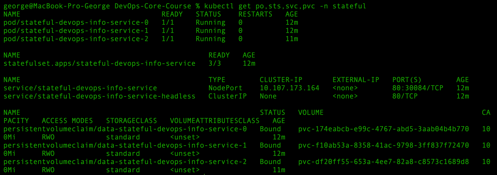
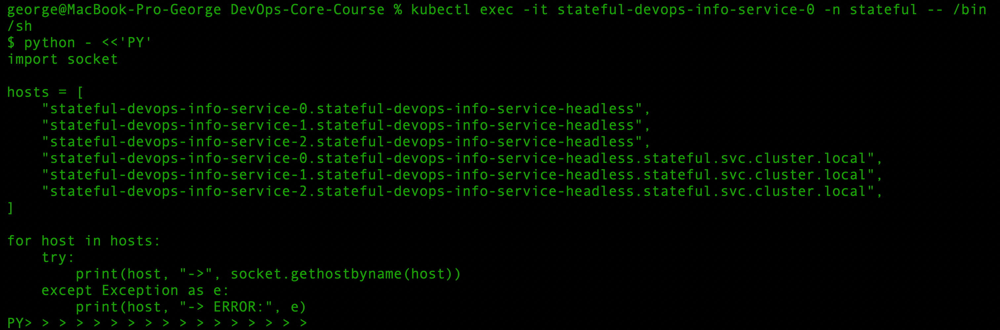
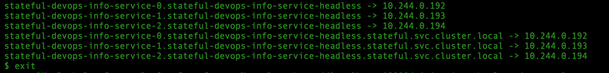
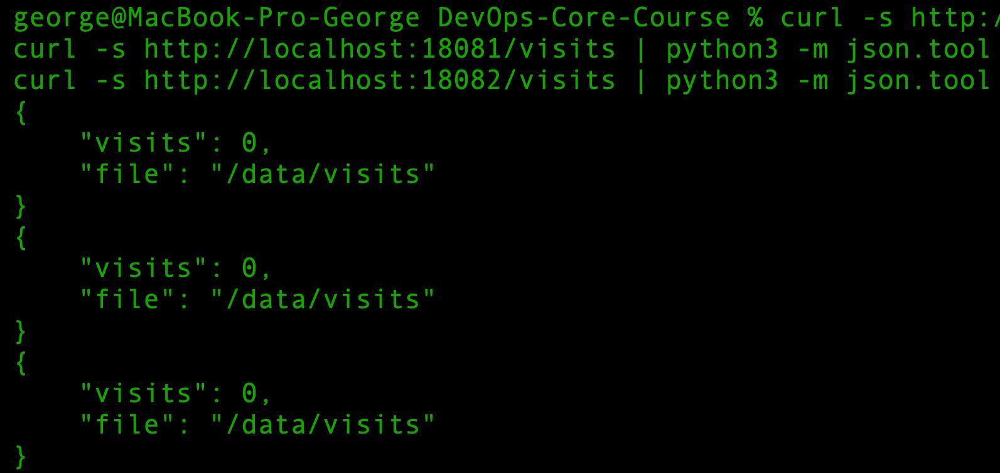
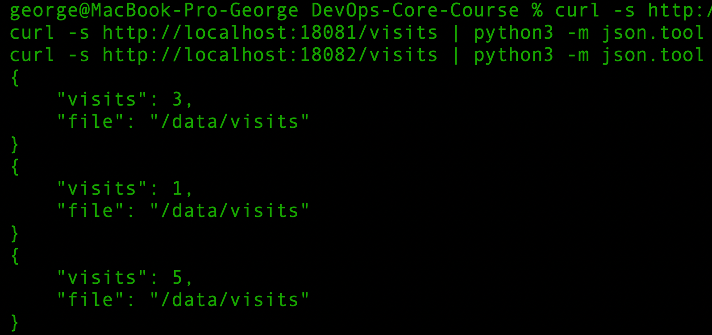
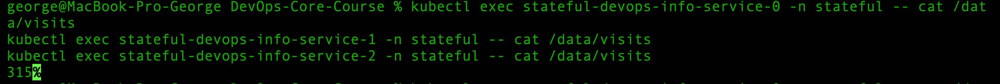
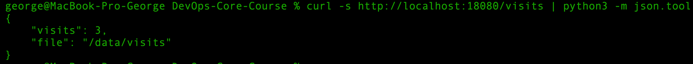

# Lab 15 — StatefulSets & Persistent Storage

# Task 1 — StatefulSet Concepts

## 1.1 StatefulSet Overview

A StatefulSet is a Kubernetes workload controller designed for applications that require stable identity, stable storage, and predictable deployment or scaling behavior.

Unlike a Deployment, where Pods are interchangeable, a StatefulSet gives every Pod a persistent identity. Each Pod gets an ordered name such as:

```text
stateful-devops-info-service-0
stateful-devops-info-service-1
stateful-devops-info-service-2
```

This identity remains stable across restarts. If `stateful-devops-info-service-0` is deleted, Kubernetes recreates a Pod with the same name and reconnects it to the same persistent volume.

StatefulSets are useful for applications where each replica is not fully interchangeable and may own its own data or role.

## 1.2 StatefulSet Guarantees

StatefulSets provide three important guarantees:

### Stable, unique network identifiers

Each Pod has a stable ordinal index and predictable DNS identity. For example:

```text
<pod-name>.<headless-service-name>.<namespace>.svc.cluster.local
```

For this project, the expected DNS pattern is:

- stateful-devops-info-service-0.stateful-devops-info-service-headless.stateful.svc.cluster.local
- stateful-devops-info-service-1.stateful-devops-info-service-headless.stateful.svc.cluster.local
- stateful-devops-info-service-2.stateful-devops-info-service-headless.stateful.svc.cluster.local


This makes it possible to access a specific Pod directly instead of sending traffic to a random replica.

### Stable, persistent storage

StatefulSets can use `volumeClaimTemplates` to create a separate PersistentVolumeClaim for each Pod.

For example:

```text
data-stateful-devops-info-service-0
data-stateful-devops-info-service-1
data-stateful-devops-info-service-2
```

Each Pod receives its own storage. If a Pod is deleted and recreated, it keeps using the same PVC. In this lab, the application stores the visits counter in:

```text
/data/visits
```

Because `/data` is backed by a per-Pod PVC, every StatefulSet Pod keeps its own isolated visit counter.

### Ordered, graceful deployment and scaling

By default, StatefulSets create and scale Pods in ordinal order. For example, when scaling from 0 to 3 replicas, Kubernetes creates:

```text
pod-0 -> pod-1 -> pod-2
```

When scaling down, Kubernetes removes Pods in reverse order:

```text
pod-2 -> pod-1 -> pod-0
```

This behavior is useful for systems where startup, shutdown, or membership order matters.


## 1.3 Deployment vs StatefulSet

| Feature | Deployment | StatefulSet |
|---|---|---|
| Main purpose | Stateless applications | Stateful applications |
| Pod names | Random ReplicaSet-based suffixes | Stable ordinal names, for example `app-0`, `app-1` |
| Pod identity | Pods are interchangeable | Each Pod has a stable identity |
| Storage | Usually shared, external, or ephemeral | Per-Pod PVCs via `volumeClaimTemplates` |
| Scaling order | Pods can be created or removed in any order | Ordered by default |
| DNS identity | Service load-balances across Pods | Each Pod can have a stable DNS name |
| Best for | APIs, web apps, stateless workers | Databases, queues, clustered systems |

## 1.4 When to Use Deployment

Use a Deployment when the application is stateless and replicas are interchangeable.

Good examples:

- REST APIs
- frontend applications
- stateless backend services
- workers that do not store local persistent data


In this project, the Argo Rollouts work from Lab 14 used Rollouts for progressive delivery of a mostly stateless service. That was appropriate for canary and blue-green deployment testing.

## 1.5 When to Use StatefulSet

Use a StatefulSet when the application needs at least one of the following:

- stable Pod names
- stable network identities
- persistent per-Pod storage
- ordered startup or shutdown
- direct access to individual replicas

Good examples:

- PostgreSQL
- MySQL
- MongoDB
- Kafka
- RabbitMQ
- Elasticsearch
- Cassandra
- ZooKeeper

For Lab 15, StatefulSet is appropriate because the application has a visits counter stored in `/data/visits`. With `volumeClaimTemplates`, each Pod gets its own `/data` volume and therefore its own visit count.


## 1.6 Headless Service

A headless Service is a Kubernetes Service with:

```yaml
clusterIP: None
```

A normal Service gets a virtual ClusterIP and load-balances traffic across matching Pods. A headless Service does not allocate a ClusterIP. Instead, Kubernetes DNS returns records for the individual Pods selected by the Service.

For StatefulSets, the headless Service is important because it enables stable DNS names for every Pod.

Expected format:

```text
<pod-name>.<headless-service-name>.<namespace>.svc.cluster.local
```

For this lab:

- stateful-devops-info-service-0.stateful-devops-info-service-headless.stateful.svc.cluster.local
- stateful-devops-info-service-1.stateful-devops-info-service-headless.stateful.svc.cluster.local
- stateful-devops-info-service-2.stateful-devops-info-service-headless.stateful.svc.cluster.local


This allows testing direct Pod-to-Pod communication and proving that each StatefulSet replica has a stable identity.

---


# Task 2 — Convert Deployment to StatefulSet

## 2.1 Helm Chart Changes

For Lab 15, the Helm chart was extended with a dedicated StatefulSet mode.

The existing `deployment.yaml` and `rollout.yaml` templates were kept for previous labs and reference. A new `statefulset.yaml` template was added and enabled only when:

```yaml
statefulset:
  enabled: true
```

This keeps the Lab 14 Argo Rollouts setup working while allowing Lab 15 to use StatefulSets separately.

## 2.2 Added and Updated Files

Added files:

* `k8s/devops-info-service/templates/statefulset.yaml`
* `k8s/devops-info-service/templates/service-headless.yaml`
* `k8s/devops-info-service/values-stateful.yaml`

Updated files:

* `k8s/devops-info-service/values.yaml`
* `k8s/devops-info-service/templates/pvc.yaml`

The regular PVC template was changed so it does not create a shared PVC when StatefulSet mode is enabled. In StatefulSet mode, per-pod PVCs are created by `volumeClaimTemplates`.

## 2.3 StatefulSet Template

The StatefulSet uses the headless Service through the `serviceName` field:

```yaml
serviceName: stateful-devops-info-service-headless
```

It runs three replicas:

```yaml
replicas: 3
```

It uses ordered Pod management:

```yaml
podManagementPolicy: OrderedReady
```

The application container mounts persistent storage at:

```yaml
volumeMounts:
  - name: data
    mountPath: /data
```

The application stores the visits counter in:

```text
/data/visits
```

## 2.4 VolumeClaimTemplates

The StatefulSet uses `volumeClaimTemplates` to create one PersistentVolumeClaim for each Pod:

```yaml
volumeClaimTemplates:
  - metadata:
      name: data
    spec:
      accessModes:
        - "ReadWriteOnce"
      resources:
        requests:
          storage: 100Mi
```

This creates separate PVCs for each StatefulSet Pod.

Created PVCs:

* `data-stateful-devops-info-service-0`
* `data-stateful-devops-info-service-1`
* `data-stateful-devops-info-service-2`

Each Pod keeps its own `/data` directory and its own `visits` file.

## 2.5 Headless Service

A headless Service was added for stable network identity:

```yaml
clusterIP: None
```

The Service name is:

```text
stateful-devops-info-service-headless
```

The regular NodePort Service was kept for external access:

```text
stateful-devops-info-service
```

This means the chart now creates two Services in StatefulSet mode:

* `stateful-devops-info-service` — regular NodePort Service for external access
* `stateful-devops-info-service-headless` — headless Service for stable StatefulSet DNS

## 2.6 Deployment Commands

The StatefulSet release was installed with:

```bash
helm upgrade --install stateful ./k8s/devops-info-service \
  -n stateful \
  --create-namespace \
  -f k8s/devops-info-service/values-stateful.yaml
```

The Helm release was verified with:

```bash
helm list -n stateful
```

Output:

```text
NAME      NAMESPACE   REVISION   STATUS     CHART                       APP VERSION
stateful  stateful    1          deployed   devops-info-service-0.1.0    1.0.0
```

## 2.7 Render Verification

The chart was checked with:

```bash
helm lint k8s/devops-info-service
```

Output:

```text
==> Linting k8s/devops-info-service
[INFO] Chart.yaml: icon is recommended

1 chart(s) linted, 0 chart(s) failed
```

The StatefulSet template was verified with:

```bash
helm template stateful ./k8s/devops-info-service \
  -n stateful \
  -f k8s/devops-info-service/values-stateful.yaml | grep -n "kind: StatefulSet"
```

Output:

```text
116:kind: StatefulSet
```

The headless Service was verified with:

```bash
helm template stateful ./k8s/devops-info-service \
  -n stateful \
  -f k8s/devops-info-service/values-stateful.yaml | grep -n "clusterIP: None"
```

Output:

```text
82:  clusterIP: None
```

The StatefulSet `serviceName` was verified with:

```bash
helm template stateful ./k8s/devops-info-service \
  -n stateful \
  -f k8s/devops-info-service/values-stateful.yaml | grep -n "serviceName"
```

Output:

```text
125:  serviceName: stateful-devops-info-service-headless
```

The `volumeClaimTemplates` section was verified with:

```bash
helm template stateful ./k8s/devops-info-service \
  -n stateful \
  -f k8s/devops-info-service/values-stateful.yaml | grep -n "volumeClaimTemplates"
```

Output:

```text
213:  volumeClaimTemplates:
```

The regular shared PVC template was not rendered:

```bash
helm template stateful ./k8s/devops-info-service \
  -n stateful \
  -f k8s/devops-info-service/values-stateful.yaml | grep -n "kind: PersistentVolumeClaim"
```

Output was empty, which is expected because StatefulSet PVCs are created dynamically from `volumeClaimTemplates`.

## 2.8 Resource Verification

The StatefulSet was verified with:

```bash
kubectl get po,sts,svc,pvc -n stateful
```

Output:


This output confirms that:

- the StatefulSet is running with 3/3 ready replicas
- all three Pods are running
- the regular NodePort Service exists for external access
- the headless Service exists with CLUSTER-IP set to None
- each Pod has its own bound PVC

## 2.9 StatefulSet Description

The StatefulSet was described with:

```bash
kubectl describe statefulset stateful-devops-info-service -n stateful
```

Important output:

```text
Replicas:           3 desired | 3 total
Update Strategy:    RollingUpdate
  Partition:        0
Pods Status:        3 Running / 0 Waiting / 0 Succeeded / 0 Failed

Mounts:
  /config from config-volume (ro)
  /data from data (rw)

Volume Claims:
  Name:          data
  Capacity:      100Mi
  Access Modes:  [ReadWriteOnce]
```

The events also show that the StatefulSet controller created a separate PVC for each Pod:


- Create Claim data-stateful-devops-info-service-0 Pod stateful-devops-info-service-0 in StatefulSet stateful-devops-info-service success
- Create Claim data-stateful-devops-info-service-1 Pod stateful-devops-info-service-1 in StatefulSet stateful-devops-info-service success
- Create Claim data-stateful-devops-info-service-2 Pod stateful-devops-info-service-2 in StatefulSet stateful-devops-info-service success

---


# Task 3 — Headless Service and Pod Identity

## 3.1 Objective

The goal of this task was to verify that the StatefulSet provides:

- stable network identities
- predictable Pod DNS names
- isolated per-Pod persistent storage
- data persistence after Pod deletion

The StatefulSet was deployed in the `stateful` namespace.

## 3.2 StatefulSet Pods

The StatefulSet created Pods with stable ordinal names:

- `stateful-devops-info-service-0`
- `stateful-devops-info-service-1`
- `stateful-devops-info-service-2`

This was verified with:

```bash
kubectl get pods -n stateful
```

Example output:

```text
NAME                             READY   STATUS    RESTARTS   AGE
stateful-devops-info-service-0   1/1     Running   0          66s
stateful-devops-info-service-1   1/1     Running   0          45s
stateful-devops-info-service-2   1/1     Running   0          31s
```

## 3.3 DNS Naming Pattern

StatefulSet Pods are reachable through the headless Service using the following DNS pattern:

```text
<pod-name>.<headless-service-name>.<namespace>.svc.cluster.local
```

For this deployment:

* `stateful-devops-info-service-0.stateful-devops-info-service-headless.stateful.svc.cluster.local`
* `stateful-devops-info-service-1.stateful-devops-info-service-headless.stateful.svc.cluster.local`
* `stateful-devops-info-service-2.stateful-devops-info-service-headless.stateful.svc.cluster.local`

## 3.4 Pod Hostname Verification

The Pod hostname and fully qualified domain name were checked from inside `stateful-devops-info-service-0`.

Command:

```bash
kubectl exec -it stateful-devops-info-service-0 -n stateful -- /bin/sh
```

Output:

```text
$ hostname
stateful-devops-info-service-0

$ hostname -f
stateful-devops-info-service-0.stateful-devops-info-service-headless.stateful.svc.cluster.local

$ cat /etc/resolv.conf
nameserver 10.96.0.10
search stateful.svc.cluster.local svc.cluster.local cluster.local
options ndots:5
```

This confirms that the Pod has a stable StatefulSet hostname and receives a DNS suffix based on the headless Service and namespace.

## 3.5 DNS Resolution Test

DNS resolution was tested from inside Pod `stateful-devops-info-service-0` using Python.

Command:

```bash
kubectl exec -it stateful-devops-info-service-0 -n stateful -- /bin/sh
```

Inside the Pod:


Output:


This confirms that each StatefulSet Pod can be resolved directly through the headless Service.

## 3.6 Per-Pod Storage Isolation

The application stores its visits counter in:

```text
/data/visits
```

The `/visits` endpoint reads the current counter, while requests to `/` increment it.

Because the StatefulSet uses `volumeClaimTemplates`, every Pod has its own PVC and its own `/data/visits` file.

Port-forwarding was started for each Pod:

```bash
kubectl port-forward pod/stateful-devops-info-service-0 -n stateful 18080:5000
kubectl port-forward pod/stateful-devops-info-service-1 -n stateful 18081:5000
kubectl port-forward pod/stateful-devops-info-service-2 -n stateful 18082:5000
```

Initial counters were checked with:

```bash
curl -s http://localhost:18080/visits | python3 -m json.tool
curl -s http://localhost:18081/visits | python3 -m json.tool
curl -s http://localhost:18082/visits | python3 -m json.tool
```

Output:


Then different numbers of requests were sent to each Pod:

```bash
for i in {1..3}; do curl -s http://localhost:18080/ > /dev/null; done
for i in {1..1}; do curl -s http://localhost:18081/ > /dev/null; done
for i in {1..5}; do curl -s http://localhost:18082/ > /dev/null; done
```

The counters were checked again:

```bash
curl -s http://localhost:18080/visits | python3 -m json.tool
curl -s http://localhost:18081/visits | python3 -m json.tool
curl -s http://localhost:18082/visits | python3 -m json.tool
```

Output:


The different values prove that each Pod has isolated persistent storage.


## 3.7 Direct File Verification

The visits files were also checked directly inside each Pod:

```bash
kubectl exec stateful-devops-info-service-0 -n stateful -- cat /data/visits
kubectl exec stateful-devops-info-service-1 -n stateful -- cat /data/visits
kubectl exec stateful-devops-info-service-2 -n stateful -- cat /data/visits
```

Output:


The shell prompt was displayed immediately after the values because the visits file does not contain a trailing newline. The actual values are 3, 1, and 5.
This confirms that each Pod stores its counter in its own persistent volume.


## 3.8 Persistence Test

Before deleting Pod `stateful-devops-info-service-0`, the current value was checked:

```bash
kubectl exec stateful-devops-info-service-0 -n stateful -- cat /data/visits
```

Output:

```text
3
```

The Pod was deleted:

```bash
kubectl delete pod stateful-devops-info-service-0 -n stateful
```

Output:

```text
pod "stateful-devops-info-service-0" deleted from stateful namespace
```

The StatefulSet recreated the Pod with the same name:

```bash
kubectl get pods -n stateful -w
```

Output:

```text
NAME                             READY   STATUS    RESTARTS   AGE
stateful-devops-info-service-0   0/1     Running   0          4s
stateful-devops-info-service-1   1/1     Running   0          22m
stateful-devops-info-service-2   1/1     Running   0          22m
stateful-devops-info-service-0   1/1     Running   0          12s
```

The PVCs were checked after the Pod restart:

```bash
kubectl get pvc -n stateful
```

Output:

```text
NAME                                  STATUS   VOLUME                                     CAPACITY   ACCESS MODES   STORAGECLASS   VOLUMEATTRIBUTESCLASS   AGE
data-stateful-devops-info-service-0   Bound    pvc-174eabcb-e99c-4767-abd5-3aab04b4b770   100Mi      RWO            standard       <unset>                 23m
data-stateful-devops-info-service-1   Bound    pvc-f10ab53a-8358-41ac-9798-3ff837f72470   100Mi      RWO            standard       <unset>                 23m
data-stateful-devops-info-service-2   Bound    pvc-df20ff55-653a-4ee7-82a8-c8573c1689d8   100Mi      RWO            standard       <unset>                 22m
```

The visits file was checked again after the Pod was recreated:

```bash
kubectl exec stateful-devops-info-service-0 -n stateful -- cat /data/visits
```

Output:

```text
3
```

The value was preserved after Pod deletion and recreation. This proves that the data is stored on the persistent volume, not only inside the container filesystem.

The endpoint also returned the same value after reconnecting port-forward:

Result:



## 4.1 Documentation Summary

This document describes the StatefulSet implementation for `devops-info-service`.
The documentation is based on the StatefulSet deployment in the `stateful` namespace.

## 4.2 Required Evidence

### StatefulSet Overview

Covered in:

- `1.1 StatefulSet Overview`
- `1.2 StatefulSet Guarantees`
- `1.3 Deployment vs StatefulSet`
- `1.4 When to Use Deployment`
- `1.5 When to Use StatefulSet`
- `1.6 Headless Service`

### Resource Verification

Covered in:

- `2.8 Resource Verification`
- `2.9 StatefulSet Description`

The main verification command was:

```bash
kubectl get po,sts,svc,pvc -n stateful
```

This confirmed:

* StatefulSet is ready with `3/3` replicas
* Pods use ordinal names
* regular NodePort Service exists
* headless Service exists
* each Pod has its own bound PVC

### Network Identity

Covered in:

* `3.3 DNS Naming Pattern`
* `3.4 Pod Hostname Verification`
* `3.5 DNS Resolution Test`

The DNS pattern is:

```text
<pod-name>.<headless-service-name>.<namespace>.svc.cluster.local
```

For this lab:

* `stateful-devops-info-service-0.stateful-devops-info-service-headless.stateful.svc.cluster.local`
* `stateful-devops-info-service-1.stateful-devops-info-service-headless.stateful.svc.cluster.local`
* `stateful-devops-info-service-2.stateful-devops-info-service-headless.stateful.svc.cluster.local`

### Per-Pod Storage Evidence

Covered in:

* `3.6 Per-Pod Storage Isolation`
* `3.7 Direct File Verification`

Different visit counters were demonstrated:

```text
stateful-devops-info-service-0 -> 3 visits
stateful-devops-info-service-1 -> 1 visit
stateful-devops-info-service-2 -> 5 visits
```

This proves that each Pod has its own persistent `/data/visits` file.

### Persistence Test

Covered in:

* `3.8 Persistence Test`

Pod `stateful-devops-info-service-0` was deleted and recreated by the StatefulSet. After recreation, the value in `/data/visits` was still:

```text
3
```

This proves that the data survived Pod deletion.

---

# Bonus Task — StatefulSet Update Strategies

## B.1 Objective

The goal of this bonus task was to test two StatefulSet update strategies:

- partitioned `RollingUpdate`
- `OnDelete`

With a partitioned `RollingUpdate`, only Pods with ordinal greater than or equal to the partition value are updated.

With `OnDelete`, Pods are not updated automatically. A Pod receives the new template only after it is manually deleted.

---

## B.2 Partitioned RollingUpdate

The StatefulSet was first running version:

```text
lab15-stateful
```

on all Pods:

```text
stateful-devops-info-service-0 -> lab15-stateful
stateful-devops-info-service-1 -> lab15-stateful
stateful-devops-info-service-2 -> lab15-stateful
```

A partitioned update was applied with `partition: 2`:

```bash
helm upgrade stateful ./k8s/devops-info-service \
  -n stateful \
  -f k8s/devops-info-service/values-stateful.yaml \
  --set statefulset.updateStrategy.type=RollingUpdate \
  --set statefulset.updateStrategy.partition=2 \
  --set env.RELEASE_VERSION=lab15-partitioned-update
```

The rollout status confirmed that only one Pod was updated:

```text
partitioned roll out complete: 1 new pods have been updated...
```

The versions after the update were:

```text
stateful-devops-info-service-0 -> lab15-stateful
stateful-devops-info-service-1 -> lab15-stateful
stateful-devops-info-service-2 -> lab15-partitioned-update
```

The update strategy was verified:

```bash
kubectl get statefulset stateful-devops-info-service -n stateful -o yaml | grep -A5 "updateStrategy"
```

Output:

```yaml
updateStrategy:
  rollingUpdate:
    maxUnavailable: 1
    partition: 2
  type: RollingUpdate
```

This confirms that `partition: 2` updated only the Pod with ordinal `2`.

---

## B.3 Continuing the Partitioned Rollout

The partition was changed to `1`:

```bash
helm upgrade stateful ./k8s/devops-info-service \
  -n stateful \
  -f k8s/devops-info-service/values-stateful.yaml \
  --set statefulset.updateStrategy.type=RollingUpdate \
  --set statefulset.updateStrategy.partition=1 \
  --set env.RELEASE_VERSION=lab15-partitioned-update
```

The rollout status confirmed that two Pods were updated:

```text
partitioned roll out complete: 2 new pods have been updated...
```

Versions:

```text
stateful-devops-info-service-0 -> lab15-stateful
stateful-devops-info-service-1 -> lab15-partitioned-update
stateful-devops-info-service-2 -> lab15-partitioned-update
```

Then the partition was changed to `0`:

```bash
helm upgrade stateful ./k8s/devops-info-service \
  -n stateful \
  -f k8s/devops-info-service/values-stateful.yaml \
  --set statefulset.updateStrategy.type=RollingUpdate \
  --set statefulset.updateStrategy.partition=0 \
  --set env.RELEASE_VERSION=lab15-partitioned-update
```

The rollout status confirmed that all three Pods were updated:

```text
partitioned roll out complete: 3 new pods have been updated...
```

Final partitioned update result:

```text
stateful-devops-info-service-0 -> lab15-partitioned-update
stateful-devops-info-service-1 -> lab15-partitioned-update
stateful-devops-info-service-2 -> lab15-partitioned-update
```

---

## B.4 OnDelete Strategy

The StatefulSet was switched to `OnDelete` with a new version:

```bash
helm upgrade stateful ./k8s/devops-info-service \
  -n stateful \
  -f k8s/devops-info-service/values-stateful.yaml \
  --set statefulset.updateStrategy.type=OnDelete \
  --set env.RELEASE_VERSION=lab15-ondelete-update
```

The strategy was verified:

```yaml
updateStrategy:
  type: OnDelete
```

Immediately after the Helm upgrade, the Pods still had the old version:

```text
stateful-devops-info-service-0 -> lab15-partitioned-update
stateful-devops-info-service-1 -> lab15-partitioned-update
stateful-devops-info-service-2 -> lab15-partitioned-update
```

This confirms that `OnDelete` does not update Pods automatically.

---

## B.5 Manual Updates with OnDelete

Pod `stateful-devops-info-service-2` was deleted manually:

```bash
kubectl delete pod stateful-devops-info-service-2 -n stateful
kubectl wait --for=condition=Ready pod/stateful-devops-info-service-2 \
  -n stateful \
  --timeout=120s
```

After recreation, only Pod `-2` had the new version:

```text
stateful-devops-info-service-0 -> lab15-partitioned-update
stateful-devops-info-service-1 -> lab15-partitioned-update
stateful-devops-info-service-2 -> lab15-ondelete-update
```

Then Pods `-1` and `-0` were deleted manually:

```bash
kubectl delete pod stateful-devops-info-service-1 -n stateful
kubectl wait --for=condition=Ready pod/stateful-devops-info-service-1 \
  -n stateful \
  --timeout=120s

kubectl delete pod stateful-devops-info-service-0 -n stateful
kubectl wait --for=condition=Ready pod/stateful-devops-info-service-0 \
  -n stateful \
  --timeout=120s
```

After manual deletion and recreation, all Pods had the new version:

```text
stateful-devops-info-service-0 -> lab15-ondelete-update
stateful-devops-info-service-1 -> lab15-ondelete-update
stateful-devops-info-service-2 -> lab15-ondelete-update
```


---

## B.6 OnDelete Use Cases

The `OnDelete` strategy is useful when automatic rolling updates are not safe.

Common use cases:

* databases requiring manual replica-by-replica maintenance
* clustered systems that need explicit operator control
* workloads that require backup or validation before restart
* applications where each replica has a specific role
* systems where update order must be controlled manually

---

## B.7 Final State

After testing, the StatefulSet was restored to normal `RollingUpdate` behavior:

```bash
helm upgrade stateful ./k8s/devops-info-service \
  -n stateful \
  -f k8s/devops-info-service/values-stateful.yaml \
  --set statefulset.updateStrategy.type=RollingUpdate \
  --set statefulset.updateStrategy.partition=0 \
  --set env.RELEASE_VERSION=lab15-stateful-final
```

The final strategy was:

```yaml
updateStrategy:
  rollingUpdate:
    maxUnavailable: 1
    partition: 0
  type: RollingUpdate
```

All Pods were left on the final version:

```text
stateful-devops-info-service-0 -> lab15-stateful-final
stateful-devops-info-service-1 -> lab15-stateful-final
stateful-devops-info-service-2 -> lab15-stateful-final
```

---

## B.8 Bonus Result

Bonus task is complete.

Confirmed:

* partitioned `RollingUpdate` was configured
* `partition: 2` updated only Pod `stateful-devops-info-service-2`
* reducing the partition continued the update in controlled phases
* `partition: 0` completed the update for all Pods
* `OnDelete` strategy was configured
* Pods did not update automatically with `OnDelete`
* manually deleted Pods were recreated with the new version
* StatefulSet was restored to `RollingUpdate` with `partition: 0`
