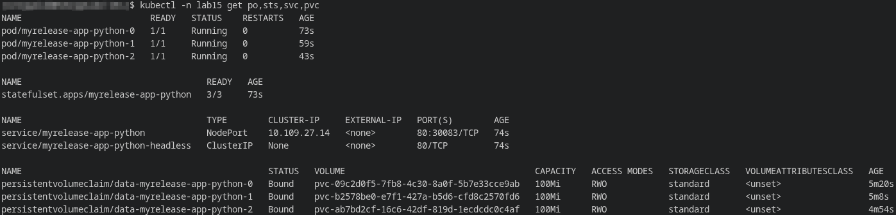
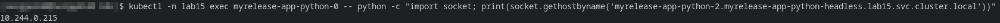
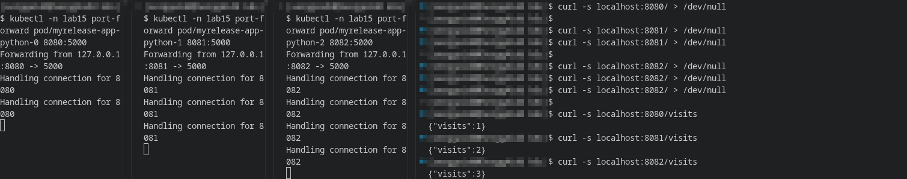
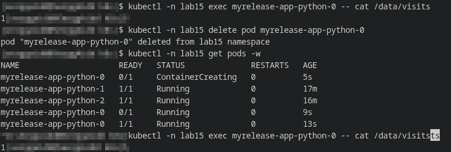

# Lab 15 — StatefulSets & Persistent Storage

## 1. StatefulSet Overview
### Why StatefulSet
The Helm chart of the `app-python` application has been adapted to run as a `StatefulSet` instead of a regular `Deployment`, since this approach allows the application to use a persistent visitor counter written to a `visits` file, where each replica stores its own state and does not lose it after the pod is recreated.

### Differences from Deployment
- `StatefulSet` gives pods stable names with sequential indices, for example `myrelease-app-python-0`, `myrelease-app-python-1`, `myrelease-app-python-2`;
- `StatefulSet` creates a separate `PersistentVolumeClaim` for each replica via `volumeClaimTemplates`;
- `StatefulSet` works in conjunction with `Headless Service`, allowing pods to be addressed using stable DNS names;
- When a pod is deleted, its data is preserved on the volume assigned to it and remains accessible after it is recreated.

### Helm chart changes:
- Added the `statefulset.yaml` template;
- Added the `myrelease-app-python-headless` headless service with `clusterIP: None`;
- Enabled data storage via `volumeClaimTemplates`;
- `Deployment` and single `PVC` are disabled when `statefulset.enabled: true` is enabled.

---

## 2. Resource Verification

The release was deployed to the lab15 namespace. Resource checks show that the following were created:
- StatefulSet `myrelease-app-python`;
- Three pods with ordinal names;
- A regular `Service` for application access;
- `Headless Service` for stable DNS;
- Three separate `PVCs`, one for each pod.

---

## 3. Network Identity

DNS resolution of one pod from within another pod was performed, confirming the availability of the `StatefulSet` replica via stable DNS names.

**DNS name template:**
```text
<pod-name>.<headless-service>.<namespace>.svc.cluster.local
```

---

## 4. Per-Pod Storage Evidence


To prove that each replica uses its own storage, separate `port-forward` connections were opened to the pods:
- `myrelease-app-python-0` → `localhost:8080`
- `myrelease-app-python-1` → `localhost:8081`
- `myrelease-app-python-2` → `localhost:8082`

Each pod was then sent a different number of requests to increment the visit counter, and the current counter values ​​were then printed via the `/visits` endpoint:
- `pod-0` → `{"visits":1}`
- `pod-1` → `{"visits":2}`
- `pod-2` → `{"visits":3}`

These results confirm that the replicas do not share a `visits` file, but store data independently in their own volumes.

---

# Persistence Test

To verify this, I manually deleted the pod `myrelease-app-python-0`, whose `/data/visits` file value was `1`, and which was automatically recreated using a `StatefulSet` with the same name.
After re-creating the pod, the `/data/visits` value was still equal to 1, confirming that the data in the `StatefulSet` is correctly persisted due to the use of `PersistentVolume` via `volumeClaimTemplates`.


