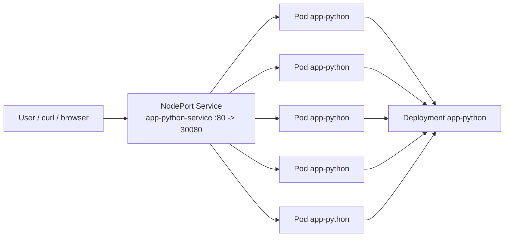
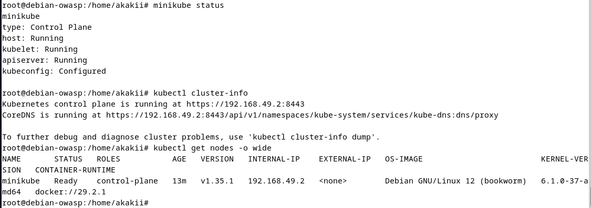
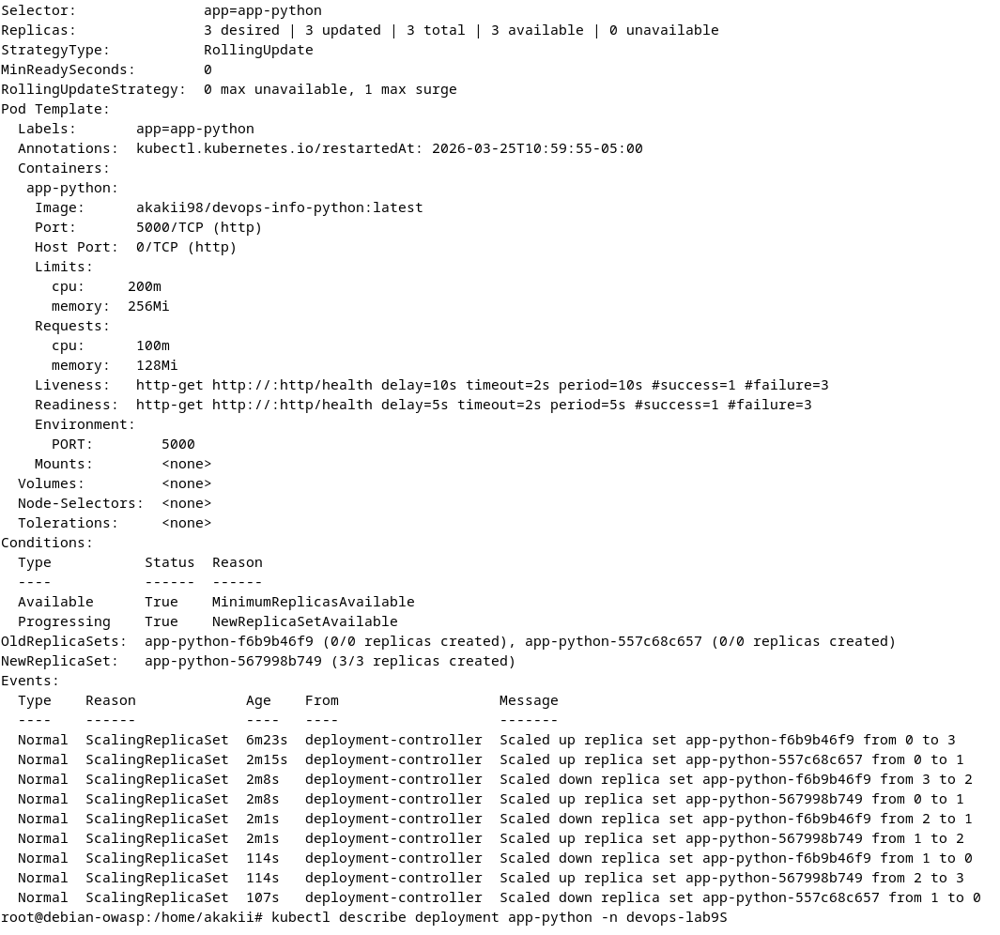
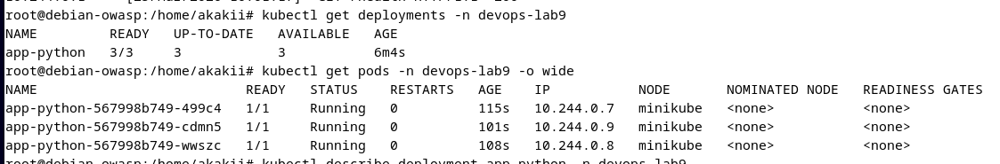
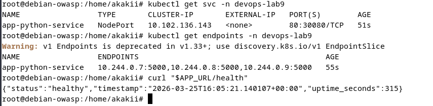
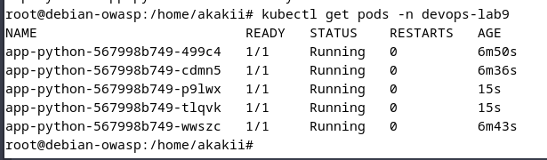
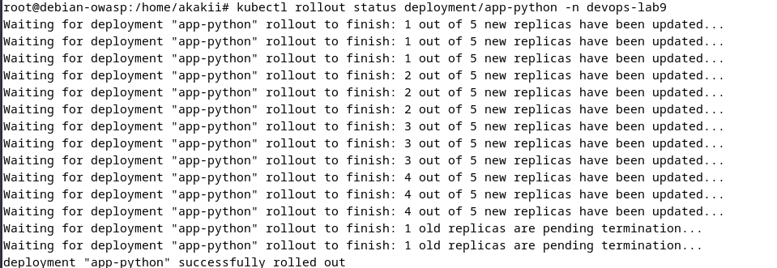
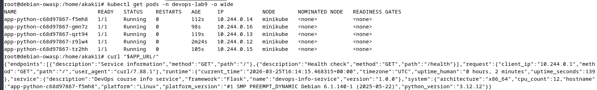

# Lab 9 — Kubernetes Fundamentals

**Student:** Alexander Rozanov  
**Email:** al.rozanov@innopolis.university  
**Group:** CBS-02  

---

## 1. Repository Layout

This lab is implemented in the following repository locations:

- `k8s/namespace.yml` — namespace definition for resource isolation
- `k8s/deployment.yml` — Deployment manifest for the Python application
- `k8s/service.yml` — NodePort Service used to expose the application
- `k8s/README.md` — implementation notes and operational summary required by the lab
- `k8s/docs/screenshots/` — terminal screenshots with deployment evidence

The container image used in the final manifest is:

```text
akakii98/devops-info-python:2026.02.11-11
```

The deployment was initially created with **3 replicas** for the main deployment task and then updated to **5 replicas** during the scaling task. Therefore, the committed manifest reflects the final state of the lab.

---

## 2. Architecture

The local Kubernetes environment for this lab is based on **minikube** running on a Debian host. A dedicated namespace is used to isolate lab resources.



### Architecture summary
- **Cluster type:** local single-node Kubernetes cluster via minikube
- **Namespace:** `devops-lab9`
- **Workload type:** `Deployment`
- **Service type:** `NodePort`
- **Application port inside container:** `5000`
- **Service port:** `80`
- **NodePort:** `30080`
- **Final replica count:** `5`

This setup demonstrates the standard Kubernetes flow: the Deployment manages Pods, while the Service provides a stable endpoint for application access.

---

## 3. Task 1 — Local Kubernetes Setup

For the local environment, **minikube** was selected as the Kubernetes runtime. This option is well suited for a Debian-based workstation because it provides a simple single-node cluster, easy service access, and a straightforward workflow for local testing.

The cluster was started successfully and verified using standard kubectl commands:
- `kubectl cluster-info`
- `kubectl get nodes -o wide`
- `kubectl get namespaces`

The screenshots show that the control plane is running and the `minikube` node is available and ready.

### Evidence — cluster status


---

## 4. Task 2 — Application Deployment

A dedicated namespace was created for this lab:

```yaml
apiVersion: v1
kind: Namespace
metadata:
  name: devops-lab9
```

The Python application was deployed as a Kubernetes `Deployment` with production-oriented settings:
- application label: `app: app-python`
- rolling update strategy
- resource requests and limits
- liveness probe
- readiness probe
- exposed container port `5000`
- environment variable `PORT=5000`

### 4.1 Deployment strategy
The Deployment uses the following rolling update configuration:

```yaml
strategy:
  type: RollingUpdate
  rollingUpdate:
    maxSurge: 1
    maxUnavailable: 0
```

This ensures that updates happen gradually while keeping the application available.

### 4.2 Resource management
The application container was configured with explicit resource boundaries:

```yaml
resources:
  requests:
    cpu: "100m"
    memory: "128Mi"
  limits:
    cpu: "200m"
    memory: "256Mi"
```

These values are reasonable for a lightweight Flask service in a local training cluster. They are also sufficient to demonstrate Kubernetes scheduling and resource control best practices.

### 4.3 Health checks
Both probes are configured to check the `/health` endpoint:

```yaml
readinessProbe:
  httpGet:
    path: /health
    port: http

livenessProbe:
  httpGet:
    path: /health
    port: http
```

This configuration ensures that the Service only forwards traffic to ready Pods and that Kubernetes can automatically restart unhealthy containers if needed.

### 4.4 Deployment verification
The initial deployment was verified by checking the Deployment status and confirming that all Pods entered the `Running` state.

### Evidence — Deployment description


### Evidence — Deployment and Pods status


---

## 5. Task 3 — Service Configuration

To expose the application from the local cluster, a `NodePort` Service was created:

```yaml
apiVersion: v1
kind: Service
metadata:
  name: app-python-service
  namespace: devops-lab9
spec:
  type: NodePort
  selector:
    app: app-python
  ports:
    - name: http
      port: 80
      targetPort: http
      nodePort: 30080
```

### 5.1 Why NodePort
`NodePort` was chosen because the lab is executed in a local environment and this service type is the standard way to expose workloads externally without a cloud load balancer.

### 5.2 Connectivity verification
The Service was validated by checking:
- service status via `kubectl get svc`
- endpoint population via `kubectl get endpoints`
- live application response via `curl "$APP_URL/health"`

The screenshot confirms that the Service successfully maps to the application endpoints and that the health endpoint returns a healthy status.

### Evidence — Service and health check


---

## 6. Task 4 — Scaling and Updates

### 6.1 Scaling to five replicas
The Deployment was scaled from **3** to **5** replicas. After the scaling operation, all five Pods were running successfully.

This demonstrates Kubernetes replica management and the controller’s ability to converge toward the declared desired state.

### Evidence — Scaling result


### 6.2 Rolling update
A rolling update was then performed by applying an updated Deployment specification with a new application image version. The rollout completed successfully and Kubernetes replaced the old Pods with new ones without interrupting availability.

### Evidence — Rollout status


### 6.3 Application availability after rollout
After the rollout, the application was queried again through the Service endpoint. The response proves that the updated application remained available and continued returning valid JSON service information.

### Evidence — Updated service response


### 6.4 Rollback capability
The Deployment keeps revision history via:

```yaml
revisionHistoryLimit: 5
```

This means rollback support is available through standard Kubernetes commands such as:

```bash
kubectl rollout undo deployment/app-python -n devops-lab9
```

Even in a small local cluster, this is an important production-oriented practice because it enables safe recovery after a failed deployment.

---

## 7. Task 5 — Documentation

The lab requires a dedicated Kubernetes README. For this reason, a separate file was prepared:

- `k8s/README.md`

It contains:
- architecture overview
- manifest explanation
- deployment evidence
- operations performed
- production considerations
- challenges and solutions

This keeps the implementation summary concise in the report while placing operational guidance closer to the manifests.

---

## 8. Production Considerations

Although the cluster used in this lab is local and single-node, the manifests already follow several production-style practices:

### 8.1 Readiness and liveness checks
Health probes make the workload safer during startup, restarts, and rolling updates.

### 8.2 Resource control
Explicit requests and limits prevent the application from consuming cluster resources unpredictably.

### 8.3 Rolling update strategy
`maxUnavailable: 0` prioritizes application availability during rollout.

### 8.4 Stable service endpoint
The Service provides a stable access point regardless of Pod recreation or rescheduling.

### 8.5 Improvements for a real production setup
For a production-grade deployment, the following improvements would be appropriate:
- use an `Ingress` with TLS termination
- add Horizontal Pod Autoscaler
- externalize configuration with ConfigMaps and Secrets
- add monitoring/alerting with Prometheus and Grafana
- store manifests as Helm chart or Kustomize overlays for environment-specific deployment

---

## 9. Challenges and What Was Learned

During the lab, the main challenge was not the Kubernetes primitives themselves, but understanding how the desired state is continuously reconciled by controllers. The practical work helped reinforce several core concepts:

- a Deployment manages Pods indirectly through ReplicaSets
- Services rely on labels/selectors, not Pod names
- health probes strongly influence rollout behavior
- scaling is declarative and controller-driven
- Kubernetes updates workloads gradually instead of replacing everything at once

This lab provided hands-on experience with the basic building blocks of Kubernetes and showed how they fit together in a real deployment flow.

---

## 10. Final Summary

The following lab objectives were completed:

- [x] Local Kubernetes cluster started and verified
- [x] Namespace created for isolation
- [x] Python application deployed with a Kubernetes Deployment
- [x] Resource requests and limits configured
- [x] Liveness and readiness probes configured
- [x] NodePort Service created and verified
- [x] Deployment scaled from 3 to 5 replicas
- [x] Rolling update demonstrated successfully
- [x] Kubernetes README created

The bonus task with Ingress and TLS was not part of this submission.