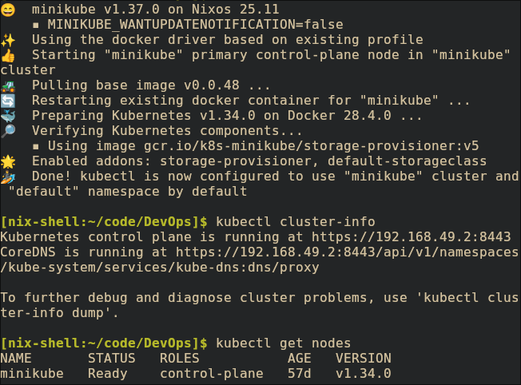
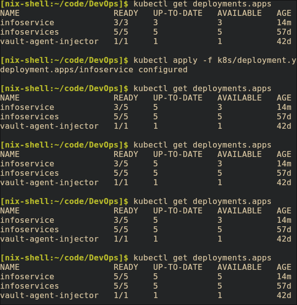
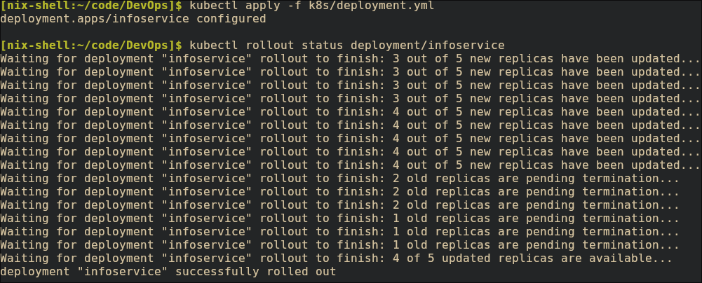
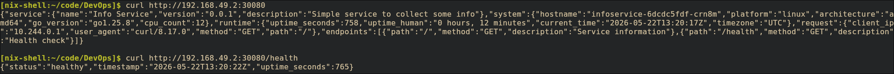

# Evidence
## Task 1


## Task 4



# Architecture Overview

# Manifest Files

# Deployment Evidence
## `kubectl get all`
```bash
NAME                                        READY   STATUS    RESTARTS      AGE
pod/infoservice-6dcdc5fdf-crn8m             1/1     Running   0             8m42s
pod/infoservice-6dcdc5fdf-czh76             1/1     Running   0             8m52s
pod/infoservice-6dcdc5fdf-fd2d6             1/1     Running   0             8m52s
pod/infoservice-6dcdc5fdf-s7xg4             1/1     Running   0             8m52s
pod/infoservice-6dcdc5fdf-wk8q7             1/1     Running   0             8m43s
pod/vault-0                                 1/1     Running   3 (25d ago)   43d
pod/vault-agent-injector-7845f59846-k4gn9   1/1     Running   3 (25d ago)   43d

NAME                               TYPE        CLUSTER-IP      EXTERNAL-IP   PORT(S)             AGE
service/infoservice-service        NodePort    10.105.186.89   <none>        80:30080/TCP        57d
service/kubernetes                 ClusterIP   10.96.0.1       <none>        443/TCP             57d
service/vault                      ClusterIP   10.96.249.209   <none>        8200/TCP,8201/TCP   43d
service/vault-agent-injector-svc   ClusterIP   10.96.246.166   <none>        443/TCP             43d
service/vault-internal             ClusterIP   None            <none>        8200/TCP,8201/TCP   43d

NAME                                   READY   UP-TO-DATE   AVAILABLE   AGE
deployment.apps/infoservice            5/5     5            5           25m
deployment.apps/vault-agent-injector   1/1     1            1           43d

NAME                                              DESIRED   CURRENT   READY   AGE
replicaset.apps/infoservice-566b86db95            0         0         0       25m
replicaset.apps/infoservice-57dbd46744            0         0         0       22m
replicaset.apps/infoservice-6dcdc5fdf             5         5         5       8m52s
replicaset.apps/infoservice-f49f9896f             0         0         0       21m
replicaset.apps/vault-agent-injector-7845f59846   1         1         1       43d

NAME                     READY   AGE
statefulset.apps/vault   1/1     43d
```

## `kubectl get pods,svc
```bash
NAME                                        READY   STATUS    RESTARTS      AGE
pod/infoservice-6dcdc5fdf-crn8m             1/1     Running   0             9m41s
pod/infoservice-6dcdc5fdf-czh76             1/1     Running   0             9m51s
pod/infoservice-6dcdc5fdf-fd2d6             1/1     Running   0             9m51s
pod/infoservice-6dcdc5fdf-s7xg4             1/1     Running   0             9m51s
pod/infoservice-6dcdc5fdf-wk8q7             1/1     Running   0             9m42s
pod/vault-0                                 1/1     Running   3 (25d ago)   43d
pod/vault-agent-injector-7845f59846-k4gn9   1/1     Running   3 (25d ago)   43d

NAME                               TYPE        CLUSTER-IP      EXTERNAL-IP   PORT(S)             AGE
service/infoservice-service        NodePort    10.105.186.89   <none>        80:30080/TCP        57d
service/kubernetes                 ClusterIP   10.96.0.1       <none>        443/TCP             57d
service/vault                      ClusterIP   10.96.249.209   <none>        8200/TCP,8201/TCP   43d
service/vault-agent-injector-svc   ClusterIP   10.96.246.166   <none>        443/TCP             43d
service/vault-internal             ClusterIP   None            <none>        8200/TCP,8201/TCP   43d
```

## `kubectl describe deployment infoservice`
```bash
Name:                   infoservice
Namespace:              default
CreationTimestamp:      Fri, 22 May 2026 15:50:36 +0300
Labels:                 app=infoservice
Annotations:            deployment.kubernetes.io/revision: 4
Selector:               app=infoservice
Replicas:               5 desired | 5 updated | 5 total | 5 available | 0 unavailable
StrategyType:           RollingUpdate
MinReadySeconds:        0
RollingUpdateStrategy:  25% max unavailable, 25% max surge
Pod Template:
  Labels:  app=infoservice
  Containers:
   infoservice:
    Image:      ub3rch/infoservice:go-latest
    Port:       <none>
    Host Port:  <none>
    Limits:
      cpu:     100m
      memory:  128Mi
    Requests:
      cpu:        100m
      memory:     128Mi
    Liveness:     http-get http://:8000/health delay=10s timeout=1s period=5s #success=1 #failure=3
    Readiness:    http-get http://:8000/health delay=5s timeout=1s period=3s #success=1 #failure=3
    Environment:  <none>
    Mounts:
      /work-dir from workdir (rw)
  Volumes:
   workdir:
    Type:          EmptyDir (a temporary directory that shares a pod's lifetime)
    Medium:
    SizeLimit:     <unset>
  Node-Selectors:  <none>
  Tolerations:     <none>
Conditions:
  Type           Status  Reason
  ----           ------  ------
  Available      True    MinimumReplicasAvailable
  Progressing    True    NewReplicaSetAvailable
OldReplicaSets:  infoservice-566b86db95 (0/0 replicas created), infoservice-57dbd46744 (0/0 replicas created), infoservice-f49f9896f (0/0 replicas created)
NewReplicaSet:   infoservice-6dcdc5fdf (5/5 replicas created)
Events:
  Type    Reason             Age                 From                   Message
  ----    ------             ----                ----                   -------
  Normal  ScalingReplicaSet  27m                 deployment-controller  Scaled up replica set infoservice-566b86db95 from 0 to 3
  Normal  ScalingReplicaSet  24m                 deployment-controller  Scaled up replica set infoservice-57dbd46744 from 0 to 1
  Normal  ScalingReplicaSet  23m                 deployment-controller  Scaled down replica set infoservice-566b86db95 from 3 to 2
  Normal  ScalingReplicaSet  23m                 deployment-controller  Scaled up replica set infoservice-f49f9896f from 0 to 1
  Normal  ScalingReplicaSet  23m                 deployment-controller  Scaled down replica set infoservice-566b86db95 from 2 to 1
  Normal  ScalingReplicaSet  23m                 deployment-controller  Scaled up replica set infoservice-f49f9896f from 1 to 2
  Normal  ScalingReplicaSet  23m                 deployment-controller  Scaled down replica set infoservice-566b86db95 from 1 to 0
  Normal  ScalingReplicaSet  23m                 deployment-controller  Scaled up replica set infoservice-f49f9896f from 2 to 3
  Normal  ScalingReplicaSet  23m                 deployment-controller  Scaled down replica set infoservice-57dbd46744 from 1 to 0
  Normal  ScalingReplicaSet  12m                 deployment-controller  Scaled up replica set infoservice-f49f9896f from 3 to 5
  Normal  ScalingReplicaSet  10m (x11 over 15m)  deployment-controller  (combined from similar events): Scaled down replica set infoservice-f49f9896f from 1 to 0
```



# Operations Performed

# Production Considerations

# Challenges and solutions
