# Lab 10 — Helm Package Manager

**Student:** Alexander Rozanov  
**Email:** al.rozanov@innopolis.university  
**Group:** CBS-02  

---

## 1. Repository Layout

This lab is implemented in the following repository locations:

- `k8s/app-python-chart/Chart.yaml` — Helm chart metadata
- `k8s/app-python-chart/values.yaml` — default chart configuration
- `k8s/app-python-chart/values-dev.yaml` — development overrides
- `k8s/app-python-chart/values-prod.yaml` — production overrides
- `k8s/app-python-chart/templates/deployment.yaml` — templated Kubernetes Deployment
- `k8s/app-python-chart/templates/service.yaml` — templated Kubernetes Service
- `k8s/app-python-chart/templates/_helpers.tpl` — shared labels and naming helpers
- `k8s/app-python-chart/templates/hooks/pre-install-job.yaml` — pre-install hook
- `k8s/app-python-chart/templates/hooks/post-install-job.yaml` — post-install hook
- `k8s/HELM.md` — operational documentation required by the assignment
- `k8s/docs/screenshots/` — screenshots with terminal evidence

The chart packages the Python application previously deployed in Lab 9. The Docker image used by the chart is:

```text
akakii98/devops-info-python:latest
```

---

## 2. Helm Overview

In this lab, the static Kubernetes manifests from Lab 9 were converted into a reusable Helm chart. This makes the deployment configurable through values files and easier to install, upgrade, and maintain across environments.

### Helm value proposition
- **Chart** — a package containing Kubernetes templates and metadata
- **Release** — a deployed instance of the chart inside the cluster
- **Repository** — a source of public or private charts
- **Values** — environment-specific configuration overrides without duplicating manifests

This approach improves reuse, standardization, and lifecycle management compared to keeping separate static YAML files for each environment.

---

## 3. Task 1 — Helm Fundamentals

Helm CLI was installed on the Debian host and verified successfully. The environment output confirms that Helm 4.x is available and ready to interact with Kubernetes.

A public chart repository was then added:

- `prometheus-community`

After updating the repository index, the available charts were explored with `helm search repo prometheus`. The public `prometheus-community/prometheus` chart was inspected with `helm show chart`, which demonstrates how Helm packages chart metadata, dependencies, maintainers, and versioning information.

### Evidence — Helm installation and environment
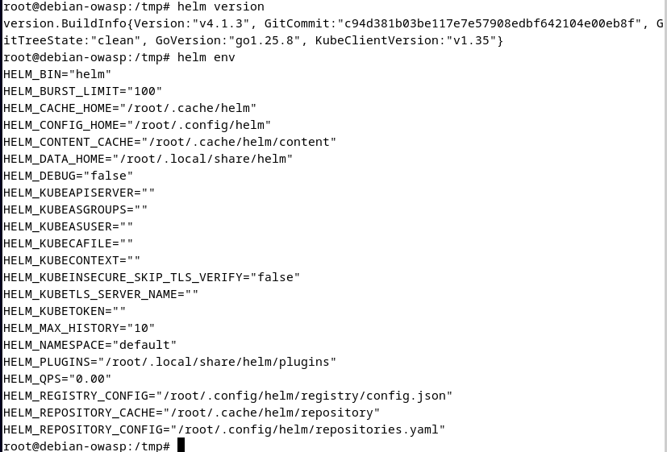

### Evidence — Helm repository setup and search
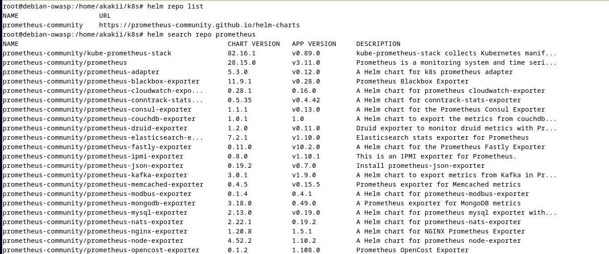

### Evidence — Public chart inspection
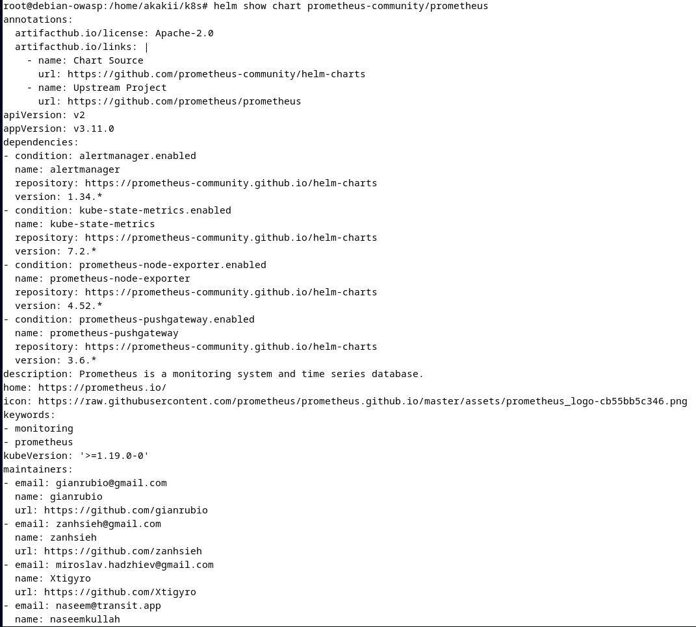

---

## 4. Task 2 — Create Your Helm Chart

A new chart named `app-python-chart` was created in the `k8s/` directory. The default scaffold generated by Helm was then simplified to keep only the resources required by this lab.

The final chart contains:
- `Chart.yaml` with chart metadata
- `values.yaml` with default parameters
- helper templates in `_helpers.tpl`
- a templated `Deployment`
- a templated `Service`
- lifecycle hook jobs

The Deployment and Service from Lab 9 were converted into Helm templates. Static values such as replica count, image repository, image tag, ports, resource limits, and probe settings were extracted into `values.yaml`.

The chart was validated using:
- `helm lint`
- `helm template`
- `helm install --dry-run --debug`

The rendered output confirms that labels, names, image settings, health probes, and service settings are produced correctly by the chart templates.

### Evidence — Initial chart structure
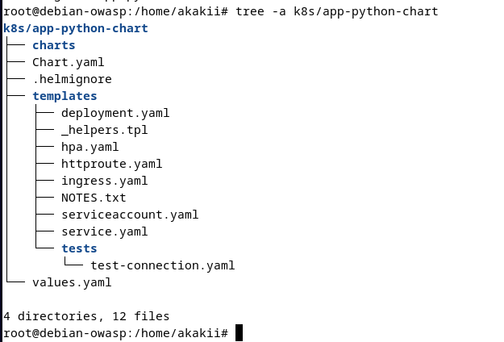

### Evidence — Linting and template rendering


### Evidence — Dry-run installation
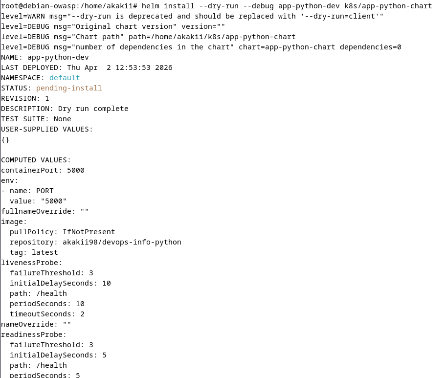

---

## 5. Task 3 — Multi-Environment Support

To support multiple environments, two override files were prepared:

- `values-dev.yaml`
- `values-prod.yaml`

### 5.1 Development configuration
The development profile was configured for a lightweight local deployment:
- `replicaCount: 1`
- `service.type: NodePort`
- reduced CPU and memory requests/limits
- shorter and simpler health-check timings

The chart was installed into a dedicated namespace:

```bash
helm install app-python-dev k8s/app-python-chart \
  -n devops-lab10 \
  -f k8s/app-python-chart/values-dev.yaml
```

The resulting release was listed successfully and the application became accessible through a minikube service URL. A direct request to `/health` returned a healthy JSON response.

### 5.2 Production configuration
The production profile increases the operational parameters of the same chart:
- `replicaCount: 3`
- `service.type: LoadBalancer`
- higher CPU and memory requests/limits
- more conservative probe timings

The release was upgraded in-place using the production values file. The output confirms that Helm created a new revision and started applying the new desired configuration.

This demonstrates one of Helm’s main strengths: the same chart can be reused for multiple environments by changing only values files instead of duplicating manifests.

### Evidence — Development install
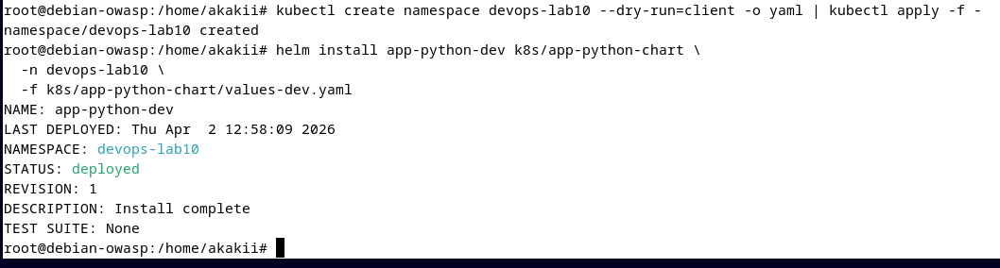

### Evidence — Release list and deployed resources
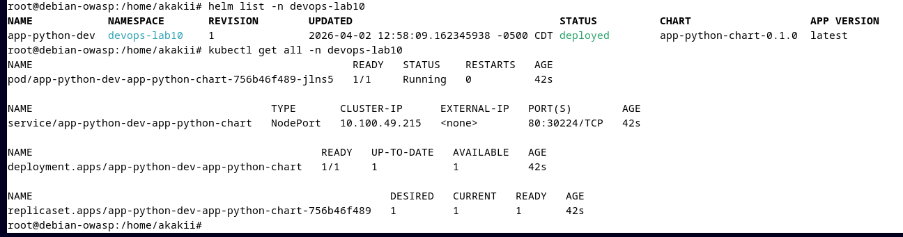

### Evidence — Health check through minikube service
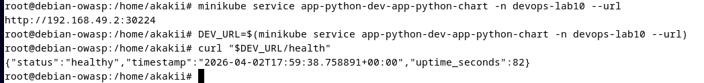

### Evidence — Upgrade to production profile
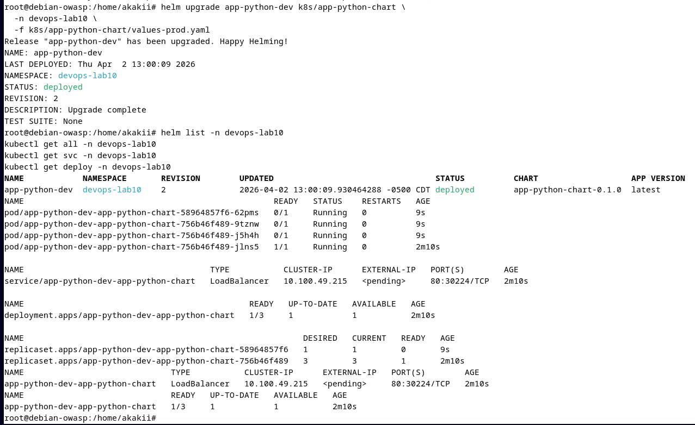

---

## 6. Task 4 — Chart Hooks

Two lifecycle hooks were added to the chart:

- **pre-install hook** — runs a simple validation job before installation
- **post-install hook** — runs a simple smoke-test style job after installation

Both hooks are implemented as Kubernetes `Job` resources and use the following Helm annotations:

```yaml
annotations:
  "helm.sh/hook": pre-install | post-install
  "helm.sh/hook-weight": "..."
  "helm.sh/hook-delete-policy": hook-succeeded
```

The hooks were validated in two ways:
1. by rendering the chart and confirming that the hook annotations appear in the generated manifests;
2. by running Helm installation commands against the chart containing the hook definitions.

This implementation demonstrates Helm lifecycle automation and shows how custom logic can be attached to chart installation stages.

### Evidence — Hook annotations in rendered templates
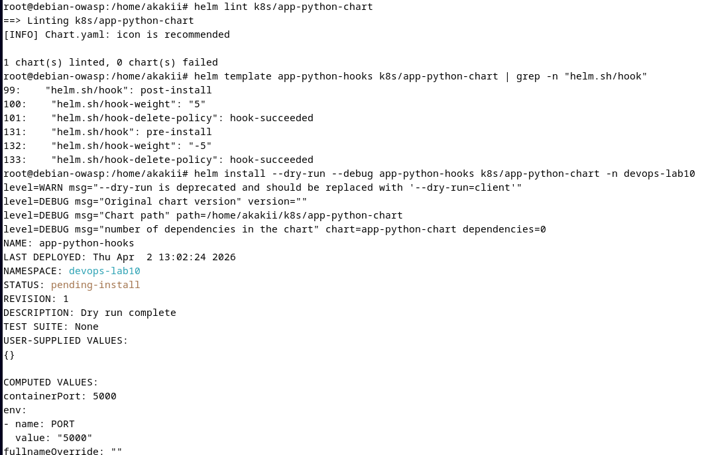

### Evidence — Chart installation with hooks present
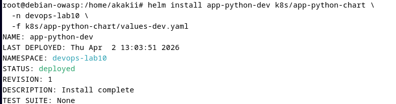

---

## 7. Task 5 — Documentation

The assignment requires dedicated Helm documentation. For this reason, a separate file was prepared:

- `k8s/HELM.md`

It contains:
- chart overview
- configuration guide
- install and upgrade workflow
- hook implementation summary
- validation notes
- operations and troubleshooting guidance

This keeps the lab report focused on the performed tasks while the operational instructions remain close to the chart itself.

---

## 8. Chart Design Summary

### 8.1 Helper templates
Naming and standard labels are centralized in `_helpers.tpl`. This avoids duplication and ensures consistent metadata across resources.

### 8.2 Health checks preserved
The liveness and readiness probes from Lab 9 were retained and moved into chart values. This satisfies the requirement to keep health checks while making them configurable.

### 8.3 Values-driven configuration
The chart exposes the most important deployment parameters through values files:
- image repository and tag
- replica count
- service type and ports
- resources
- liveness and readiness probes
- environment variables

### 8.4 Reusable release workflow
The same chart was used for both development and production-style deployment flows. The only change between them was the selected values file.

---

## 9. Conclusion

Lab 10 successfully converted the Kubernetes deployment from Lab 9 into a reusable Helm chart. The resulting chart supports templated deployment, environment-specific overrides, lifecycle hooks, validation through `helm lint` and `helm template`, and release-based installation and upgrade workflows.

As a result, the application deployment is no longer represented only by static YAML manifests. It is now packaged in a way that is closer to real-world Kubernetes operations, where reproducibility, configurability, and controlled upgrades are essential.