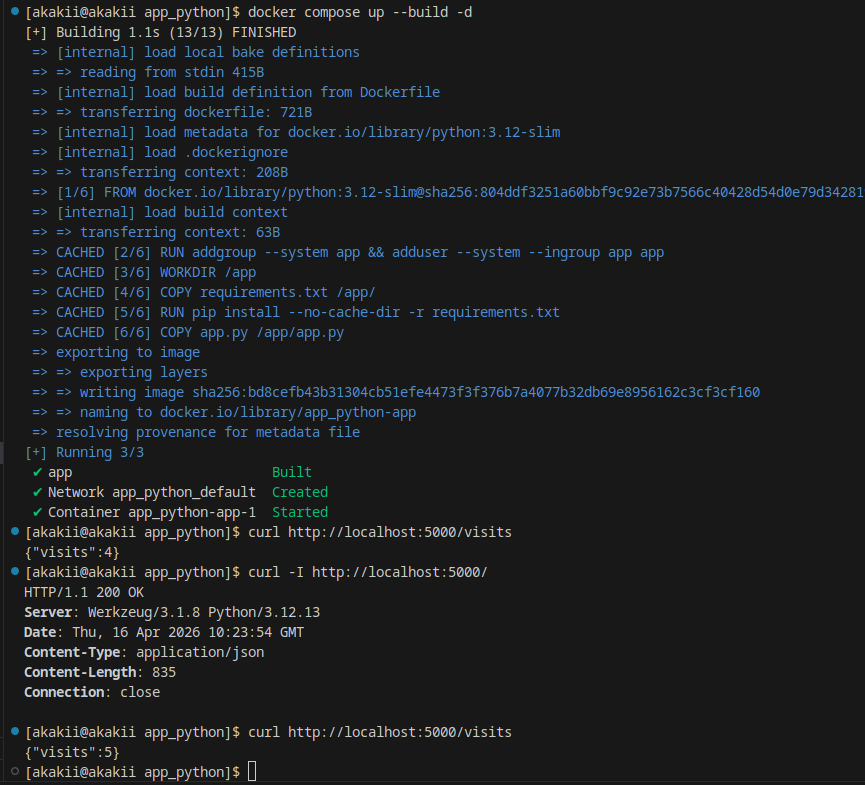
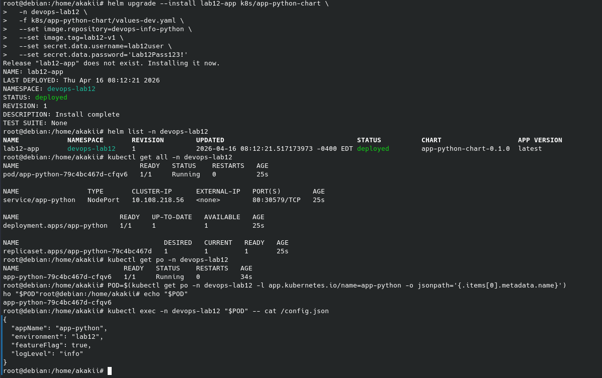
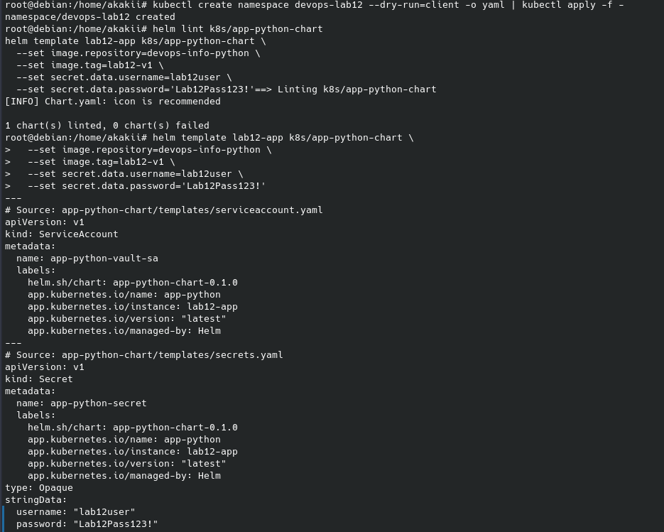
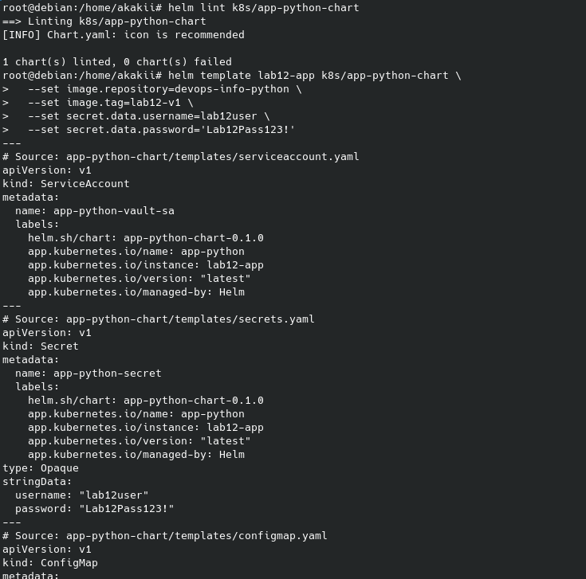
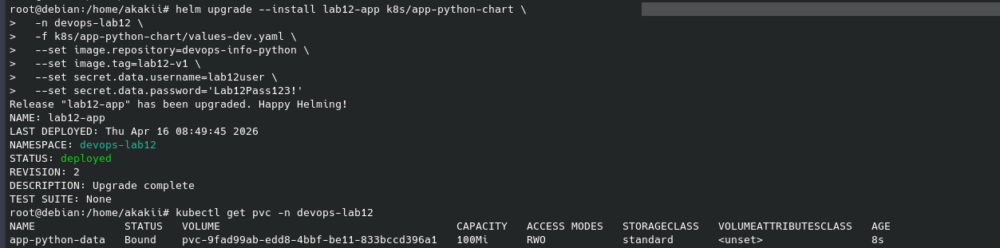
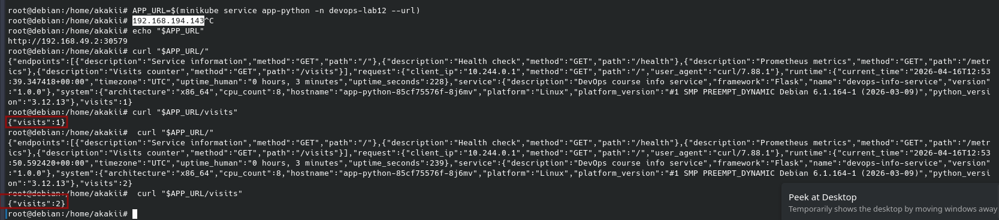

# Lab 12 — ConfigMaps & Persistent Volumes

**Student:** Alexander Rozanov  
**Email:** al.rozanov@innopolis.university  
**Group:** CBS-02  

---

## 1. Repository Layout

This lab is implemented in the following repository locations:

- `labs/lab3/app_python/app.py` — current Python/Flask application used in this lab and extended with the visits counter logic
- `labs/lab3/app_python/docker-compose.yaml` — local Docker Compose configuration used to verify the file-based counter
- `labs/lab3/app_python/README.md` — updated application README for the persistence scenario
- `k8s/app-python-chart/files/config.json` — chart-local JSON configuration source
- `k8s/app-python-chart/templates/configmap.yaml` — ConfigMap template that loads `config.json` through Helm `.Files.Get`
- `k8s/app-python-chart/templates/deployment.yaml` — deployment updated with ConfigMap mount and PVC-backed data mount
- `k8s/app-python-chart/templates/pvc.yaml` — PersistentVolumeClaim template added for Task 3
- `k8s/app-python-chart/values.yaml` — chart values extended with the `persistence` section
- `k8s/docs/screenshots/` — screenshots used as visual evidence
- `k8s/docs/evidence/` — saved command outputs
- `k8s/CONFIGMAPS.md` — dedicated documentation file required by the lab

The Kubernetes part of the lab continues to build on top of the Helm chart prepared in Labs 10 and 11, while the application side uses the **current Python service from Lab 3**.

---

## 2. Lab Objective

The goal of this lab was to externalize application configuration with ConfigMaps and to prepare the application for persistent state storage using Kubernetes persistent volumes.

The current project state demonstrates three implemented directions:

1. local file-based persistence in the Python application from Lab 3,
2. ConfigMap delivery of `config.json` through Helm,
3. PVC templating and PVC mounting in the Kubernetes deployment.

The archive also contains screenshots showing the visits counter working in Kubernetes and the PVC being successfully created and bound. At the same time, the available screenshots do not explicitly show a before/after check across pod deletion, so the final proof of data survival after pod recreation is not directly visible in the provided evidence bundle.

---

## 3. Task 1 — Application Persistence Upgrade

For this lab, the Python application from `labs/lab3/app_python/` was reused as the current application base. The application was extended with file-based persistence logic using:

- `VISITS_FILE = Path(os.getenv("VISITS_FILE", "/app/visits"))`
- `read_visits()` for safe reading of the current counter value
- `write_visits()` for writing the updated value back to disk
- `GET /visits` for returning the current visits counter

The root endpoint `GET /` now increments the counter before forming the JSON response and returns the current `visits` value in the response body. The endpoint normalization logic was also extended to include `/visits` in the low-cardinality metrics set.

For local verification, `docker-compose.yaml` mounts the host file `./visits` into the container path `/app/visits`. During testing, the mounted file had to remain writable for the container process; after that adjustment, repeated requests to `/` incremented the value correctly and `/visits` reflected the current count.

This satisfies the practical objective of Task 1: the visit count is no longer memory-only and is instead stored in a small external file.

### Evidence — local application behavior

---

## 4. Task 2 — ConfigMaps

The Helm chart was extended with a file-based ConfigMap implementation.

### 4.1 Configuration file inside the chart
A chart-local file was created:

- `k8s/app-python-chart/files/config.json`

It stores non-sensitive application configuration values such as:
- application name,
- environment name,
- feature flag,
- log level.

### 4.2 ConfigMap template
A dedicated template was added:

- `k8s/app-python-chart/templates/configmap.yaml`

The template uses Helm’s `.Files.Get` helper to read `files/config.json` and place its contents into the rendered ConfigMap under `data.config.json`.

### 4.3 Mounting the ConfigMap into the pod
The deployment template was updated to mount the ConfigMap as a volume:

- volume name: `app-config`
- mounted file path: `/config.json`
- source ConfigMap: `{{ include "app-python-chart.fullname" . }}-config`

Validation with `kubectl exec ... -- cat /config.json` confirmed that the pod receives the expected JSON configuration file.

### 4.4 Helm validation
The chart was successfully checked with `helm lint`, and the screenshots show the rendered resources created from the chart templates.

### Evidence — deployment and mounted config file

### Evidence — Helm lint and template validation

---

## 5. Task 3 — Persistent Volumes

Compared with the previous project state, Task 3 is now partially implemented in the chart.

### 5.1 PVC template
A dedicated template was added:

- `k8s/app-python-chart/templates/pvc.yaml`

The template creates a `PersistentVolumeClaim` named `{{ include "app-python-chart.fullname" . }}-data` with:
- access mode `ReadWriteOnce`,
- requested storage size taken from chart values,
- optional `storageClassName` support.

### 5.2 Persistence values
The chart values now include a `persistence` section:

- `enabled: true`
- `size: 100Mi`
- `storageClass: ""`
- `mountPath: /data`

This means persistent storage is now part of the chart’s configurable behavior.

### 5.3 Deployment mount
The `Deployment` template was extended with:

- a `data-volume` backed by the PVC,
- a corresponding `volumeMount` to `{{ .Values.persistence.mountPath }}`.

This is the structural requirement expected by the assignment for PVC-backed application data.

### 5.4 Validation and runtime evidence
The screenshots confirm that:

- `helm lint` passes,
- the chart renders after adding Task 3 resources,
- `helm upgrade --install` succeeds,
- the PVC is created and reaches the `Bound` state,
- the application remains accessible through the service and the visits counter works in the Kubernetes deployment.

### 5.5 Honest limitation of the current evidence
The current screenshot set does **not** include an explicit sequence where:
1. the visits value is captured,
2. the pod is deleted,
3. a new pod is created,
4. the same visits value is verified again.

Because of that, the report can reliably state that PVC templating and PVC binding are implemented, but it cannot claim a directly demonstrated before/after survival check across pod recreation from the current evidence alone.

### Evidence — Helm validation after adding persistence

### Evidence — Helm upgrade and PVC bound state

### Evidence — application runtime check in Kubernetes

---

## 6. Task 4 — Documentation

The assignment requires a dedicated documentation file:

- `k8s/CONFIGMAPS.md`

This file was updated to describe:
- application-side persistence changes in the current Lab 3 Python service,
- ConfigMap structure and mount approach,
- the added PVC template and persistence values,
- the distinction between ConfigMaps and Secrets,
- the current level of proof available for the persistence workflow.

---

## 7. ConfigMap vs Secret

### ConfigMap
A ConfigMap should be used for **non-sensitive** runtime configuration, for example:
- application mode,
- feature flags,
- log level,
- static JSON configuration files.

ConfigMaps are convenient because they can be mounted as files or injected as environment variables and can be managed together with deployment logic.

### Secret
A Secret should be used for **sensitive** data, for example:
- passwords,
- tokens,
- credentials,
- API keys.

In this project split:
- `config.json` belongs in a ConfigMap,
- credentials from Lab 11 remain in a Secret.

---

## 8. Current Validation Outputs

The collected outputs in `k8s/docs/evidence/` confirm the following:

- `lab12_helm_lint.txt` — the Helm chart passes lint validation,
- `lab12_get_all.txt` — the application resources are deployed in the target namespace,
- `lab12_get_pods.txt` — the pod is healthy,
- `lab12_config_inside_pod.txt` — `/config.json` is available in the running pod.

Together with the screenshots, this evidence supports the implemented ConfigMap workflow and the addition of PVC-based chart resources.

---

## 9. Conclusion

Lab 12 extended the project in three practical ways. First, the current Python application from **Lab 3** was updated with a file-based visits counter and a `/visits` endpoint. Second, the Helm chart was extended with a file-based ConfigMap rendered from `files/config.json` and mounted into the application pod as `/config.json`. Third, the chart was further extended with a PVC template and a persistent data mount defined through chart values.

The current archive clearly demonstrates:
- local file-based visit persistence in the Lab 3 application,
- successful ConfigMap templating and mounting through Helm,
- successful PVC creation and `Bound` state in Kubernetes,
- working runtime access to the application in the Kubernetes deployment.

The only thing not directly shown in the current screenshot set is the explicit before/after survival check across pod deletion. So the implementation now covers the PVC resources and PVC binding, while the strongest possible runtime proof of data survival is still not explicitly captured in the supplied evidence.