# Lab 13 — GitOps with ArgoCD

**Student:** Alexander Rozanov  
**Email:** al.rozanov@innopolis.university  
**Group:** CBS-02  

---

## 1. Repository Layout

This lab is implemented in the following repository locations:

- `k8s/argocd/application.yaml` — base ArgoCD Application for the default namespace
- `k8s/argocd/application-dev.yaml` — ArgoCD Application for the `dev` environment with automated sync enabled
- `k8s/argocd/application-prod.yaml` — ArgoCD Application for the `prod` environment with manual sync policy
- `k8s/app-python-chart/` — Helm chart reused from Labs 10–12 as the GitOps deployment source
- `k8s/docs/screenshots/` — screenshots used as visual evidence for this lab
- `k8s/ARGOCD.md` — dedicated documentation file required by the assignment

The GitOps source repository referenced by the Application manifests is:

- `https://github.com/Rozanalex/DevOps-Core-Course.git`
- branch: `lab13`
- chart path: `k8s/app-python-chart`

---

## 2. Lab Objective

The goal of this lab was to introduce GitOps-based application delivery with ArgoCD and to use Git as the source of truth for Kubernetes deployments.

The work completed in this lab covers four practical directions:

1. installation and initial setup of ArgoCD,
2. deployment of the existing Helm-based application through ArgoCD,
3. separation of `dev` and `prod` environments through independent Application manifests,
4. verification of sync behavior and self-healing mechanisms in Kubernetes and ArgoCD.

The Helm chart created in Labs 10–12 was reused as the deployment unit. ArgoCD was then configured to watch the Git repository and render that chart declaratively for each target namespace.

---

## 3. Task 1 — ArgoCD Installation & Setup

ArgoCD was installed via the official Helm repository in a dedicated `argocd` namespace. After installation, the readiness of the components was verified with `kubectl get pods -n argocd`, and the web interface was exposed locally through a port-forward to `svc/argocd-server`.

The initial admin password was retrieved from `argocd-initial-admin-secret`, after which access to the web UI was confirmed. The `argocd` CLI tool was also installed and used to authenticate against the local port-forwarded endpoint with the `--insecure` option.

The screenshots confirm that:

- the Helm repository was added successfully,
- the ArgoCD release was installed,
- the core components were running,
- the UI was accessible,
- the CLI login succeeded and returned the expected user information.

### Evidence — ArgoCD installation via Helm
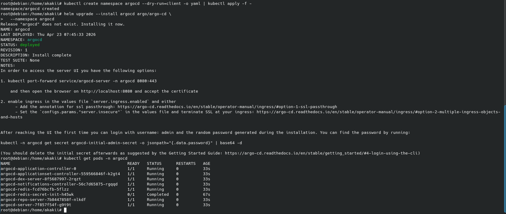

### Evidence — ArgoCD UI access
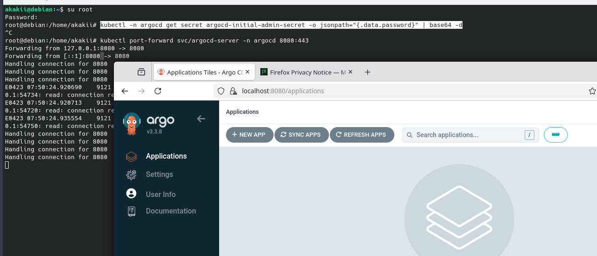

### Evidence — ArgoCD CLI login
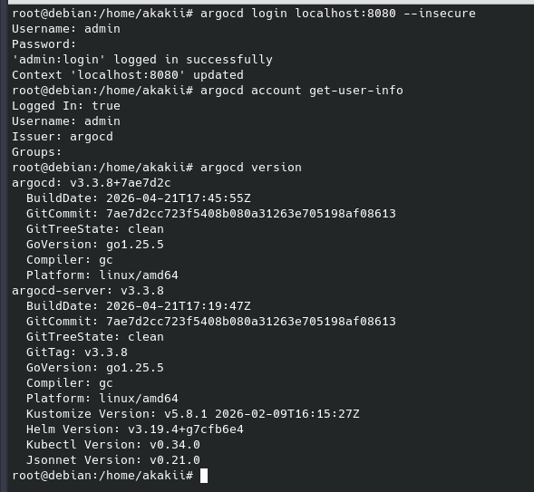

---

## 4. Task 2 — Application Deployment

The application was deployed through a declarative ArgoCD `Application` resource stored in `k8s/argocd/application.yaml`.

The manifest defines:

- `repoURL: https://github.com/Rozanalex/DevOps-Core-Course.git`
- `targetRevision: lab13`
- `path: k8s/app-python-chart`
- destination cluster: `https://kubernetes.default.svc`
- destination namespace: `default`
- Helm values file: `values.yaml`
- manual sync workflow for the initial application instance

After applying the manifest, the `python-app` application appeared in ArgoCD and was manually synchronized. The resulting deployment in the `default` namespace created the expected Helm-managed resources, including:

- `Deployment`
- `Service`
- `Secret`
- `ConfigMap`
- `PersistentVolumeClaim`
- `ServiceAccount`
- pre-install and post-install hook `Job`s

The screenshots also show successful application access through the service URL obtained from `minikube service`, along with successful responses from `/` and `/health`.

### Evidence — sync command and rendered resources
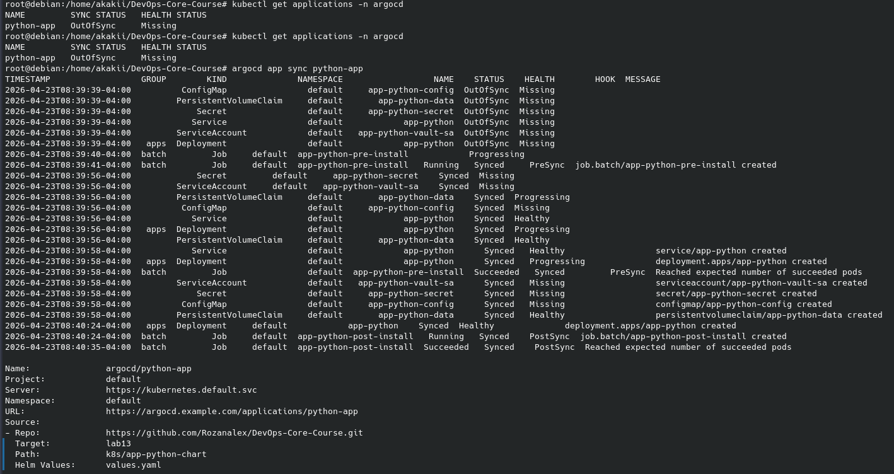

### Evidence — successful synchronized state
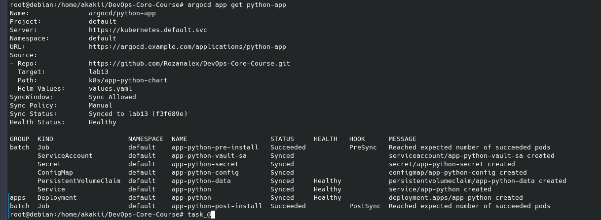

### Evidence — application health check in the cluster
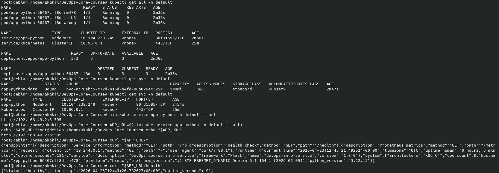

---

## 5. Task 3 — Multi-Environment Deployment

Two additional ArgoCD applications were prepared:

- `python-app-dev` — deployed into namespace `dev`
- `python-app-prod` — deployed into namespace `prod`

The environment separation was implemented through:

- `k8s/argocd/application-dev.yaml`
- `k8s/argocd/application-prod.yaml`

### 5.1 Dev environment
The dev Application uses `values-dev.yaml` and enables automated sync with:

- `prune: true`
- `selfHeal: true`

This matches the expected GitOps workflow for a lower-risk environment where ArgoCD is allowed to continuously reconcile the cluster to the Git state.

### 5.2 Prod environment
The prod Application uses `values-prod.yaml` and intentionally keeps synchronization manual. This reflects the safer deployment pattern where production changes are reviewed and triggered explicitly.

### 5.3 Environment differences
The two values files differ in multiple aspects:

- replica count,
- resource requests and limits,
- service type,
- probe timings.

This satisfies the purpose of the multi-environment task: the same Helm chart is reused, but the operational behavior is environment-specific.

The screenshots confirm that:

- both environments were registered in ArgoCD,
- the dev application reached a synchronized and healthy state under auto-sync,
- the prod application was synchronized separately and entered the deployment lifecycle in its own namespace.

### Evidence — dev auto-sync behavior
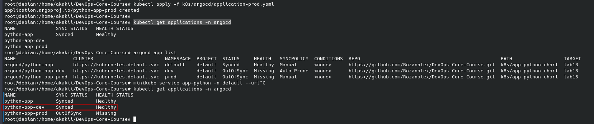

### Evidence — prod sync state
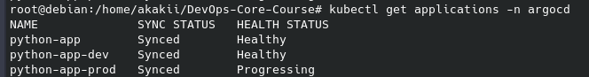

---

## 6. Task 4 — Self-Healing & Sync Policies

This task was used to distinguish between Kubernetes-native healing and ArgoCD reconciliation.

### 6.1 Manual scale test
A manual scale operation was executed against the `dev` deployment:

- `kubectl scale deployment app-python -n dev --replicas=5`

The screenshot shows the attempted drift introduction and subsequent pod state changes. During this stage, transient pod errors appeared while the deployment was being reconciled. This is still useful evidence that the workload was actively reacting to a manual deviation from the declared state.

### 6.2 Pod deletion test
A pod in the `dev` namespace was explicitly deleted. Kubernetes recreated a replacement pod automatically through the Deployment/ReplicaSet controller. This confirms Kubernetes self-healing at the workload-controller level.

### 6.3 Configuration drift test
A manual label (`drift=test`) was added to the deployment in `dev`, after which the application state was inspected through `argocd app diff` and `argocd app get`.

The available screenshot clearly captures the drift injection command and the subsequent ArgoCD inspection commands. However, the final frame does not show explicit visual proof that the label was already removed automatically. Because of that, it is accurate to state that the drift test was executed and inspected, but the screenshot set does not fully prove the final post-reconciliation label state.

### 6.4 Behavioral distinction
The lab demonstrates the difference between the two mechanisms:

- **Kubernetes self-healing** recreates missing pods to satisfy the Deployment replica specification.
- **ArgoCD self-healing** reconciles declarative drift between the Git state and the live cluster state when automated sync with self-heal is enabled.

### Evidence — manual scale drift attempt
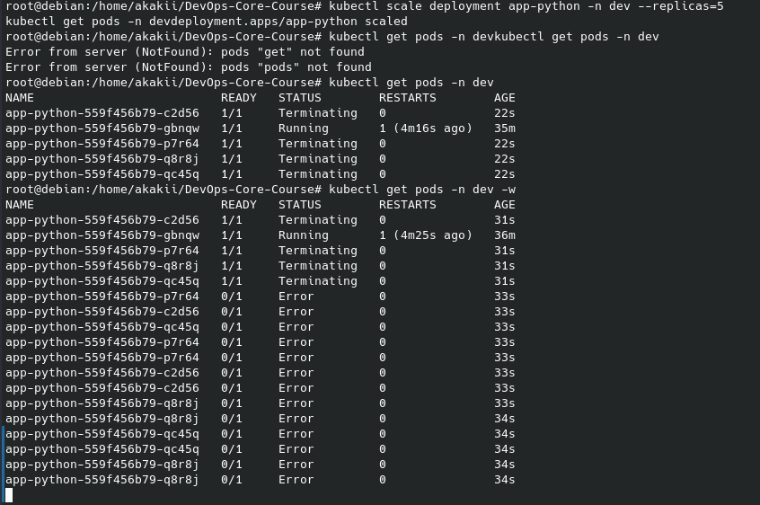

### Evidence — drift inspection through ArgoCD
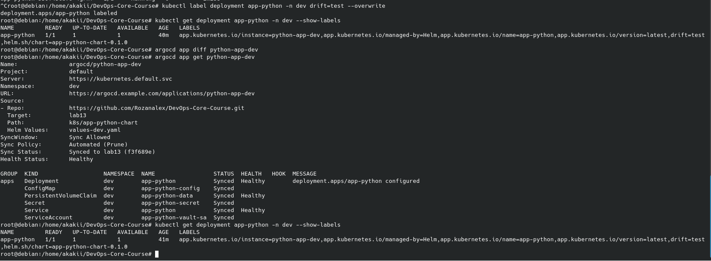

### Evidence — Kubernetes recreates a deleted pod
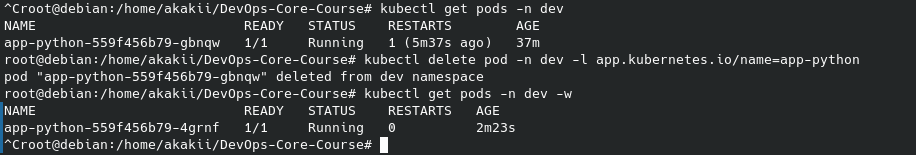

---

## 7. Required Documentation File

The assignment explicitly requires:

- `k8s/ARGOCD.md`

That file was prepared alongside this report and contains a focused summary of:

- ArgoCD installation,
- Application manifests,
- dev/prod separation,
- sync policies,
- self-healing observations.

---

## 8. Honest Scope of Completion

Based on the repository contents and the provided screenshots, the following can be stated confidently:

- ArgoCD installation was completed successfully.
- UI and CLI access were verified.
- The base application was deployed from Git through ArgoCD.
- Separate dev and prod ArgoCD applications were created.
- Dev auto-sync and prod manual sync were configured.
- Manual scale, pod deletion, and label drift tests were initiated and observed.

---

## 9. Conclusion

Lab 13 introduced a full GitOps deployment workflow using ArgoCD on top of the Helm chart prepared in the previous labs. ArgoCD was installed and accessed through both the web interface and CLI, the application was deployed declaratively from Git, and separate `dev` and `prod` environments were configured with different synchronization policies.

The lab also demonstrated the practical difference between Kubernetes workload recovery and ArgoCD reconciliation. Kubernetes restored deleted pods automatically, while ArgoCD was configured to watch the Git repository and keep the `dev` environment aligned with the declared state. Overall, the repository now contains the core GitOps building blocks required for further work with progressive delivery and environment-specific deployment automation.