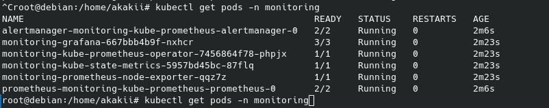
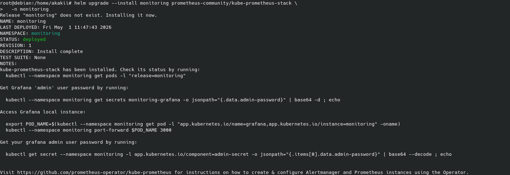
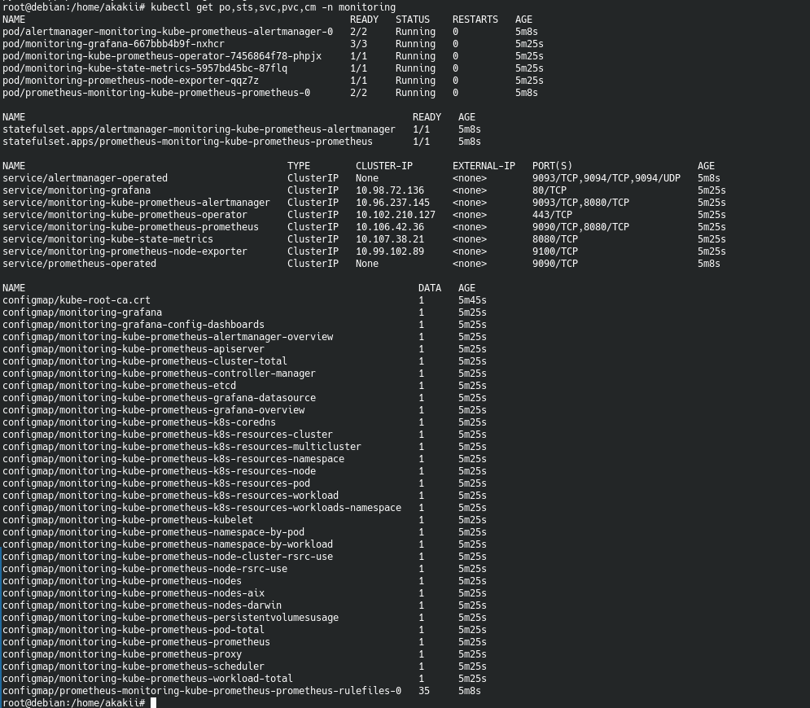
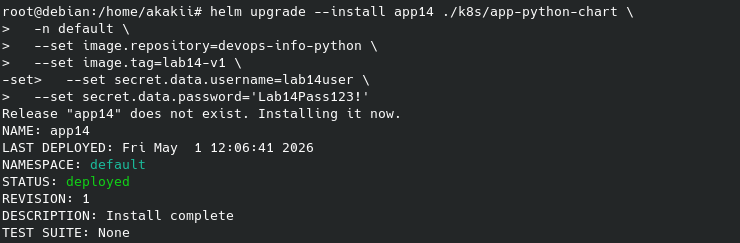
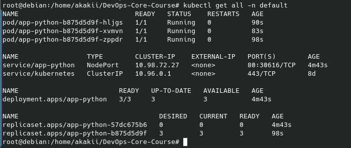
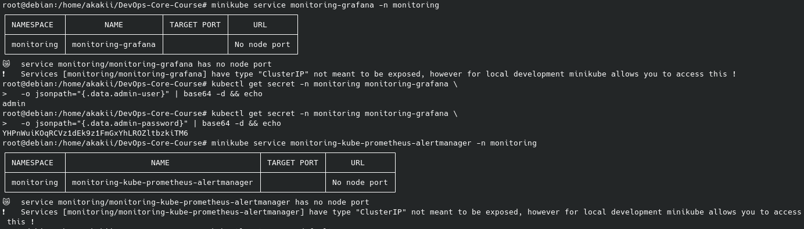
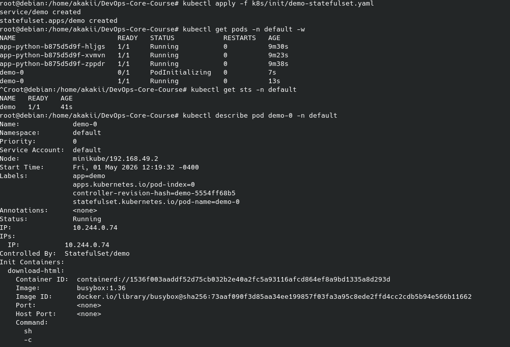
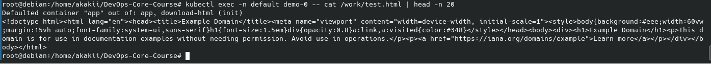
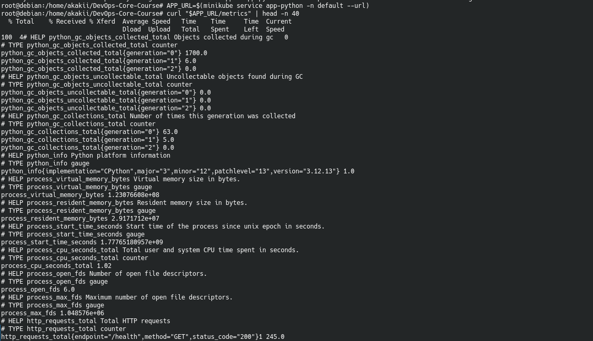
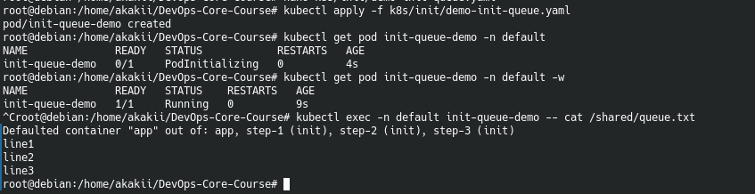

# Lab 14 — Kubernetes Monitoring and Init Containers

**Student:** Alexander Rozanov  
**Email:** al.rozanov@innopolis.university  
**Group:** CBS-02  

---

## 1. Repository Layout

This lab is implemented in the following repository locations:

- `k8s/app-python-chart/` — Helm chart of the Python application reused from previous labs
- `k8s/docs/screenshots/` — screenshots collected during installation, verification, and init container testing
- `k8s/14.md` — dedicated documentation file for this lab
- `k8s/init/` — manifests used for init-container demonstrations (described in this report)

The application used in this lab is the current Python service from `labs/lab3/app_python`, which already includes health checks, metrics, and persistent visits logic from previous work.

---

## 2. Lab Objective

The objective of this lab was to deploy a Kubernetes monitoring stack based on Prometheus and Grafana, verify that the application from previous labs is running together with the monitoring components, and practice the use of Init Containers.

The work completed in this lab covers three practical directions:

1. installation of `kube-prometheus-stack` in the cluster,
2. deployment and verification of the application Helm chart in the `default` namespace,
3. implementation of init-container based preparation steps, including file download and ordered initialization.

---

## 3. Task 1 — kube-prometheus-stack Deployment

The monitoring stack was installed in the dedicated `monitoring` namespace using the official `prometheus-community/kube-prometheus-stack` Helm chart.

The screenshots confirm that the Helm release was created successfully and that the namespace contains the expected monitoring components. The running pods include:

- `alertmanager-monitoring-kube-prometheus-alertmanager`
- `monitoring-grafana`
- `monitoring-kube-prometheus-operator`
- `monitoring-kube-state-metrics`
- `monitoring-prometheus-node-exporter`
- `prometheus-monitoring-kube-prometheus-prometheus`

This demonstrates a successful deployment of the monitoring stack required for the lab.

### Evidence — monitoring stack pods

### Evidence — Helm installation of kube-prometheus-stack

### Evidence — monitoring namespace resources

---

## 4. Task 1 — Application Deployment Together with Monitoring

After the monitoring stack was installed, the existing Helm chart for the Python application was deployed in the `default` namespace as release `app14`.

The screenshots show that:

- the Helm release `app14` was installed successfully,
- the `app-python` deployment reached the `Running` state,
- the service was exposed as `NodePort`,
- the application resources in the `default` namespace were available together with the monitoring stack.

The service URL was then obtained through `minikube service`, confirming that the application could be accessed from the local environment.

### Evidence — Helm deployment of application

### Evidence — application resources in `default`

### Evidence — service access through minikube

---

## 5. Task 2 — Init Container: Downloading a File Before Application Start

For the second task, an init-container based workload was applied to the `default` namespace. The goal was to ensure that a file is downloaded before the main application container starts.

The screenshots show that the init-container manifest was applied, the corresponding pod `demo-0` appeared in the namespace, and the pod details were inspected through `kubectl describe`.

After the init container completed successfully, the downloaded file was inspected from inside the running pod using `kubectl exec`. This confirms that the init container performed the preparation step before the main container started.

### Evidence — applying StatefulSet/init-container manifest

### Evidence — downloaded file inside pod

---

## 6. Task 3 — Bonus Verification

The provided screenshots also confirm two bonus-style checks.

### 6.1 Application metrics endpoint

The Python application exposes Prometheus metrics on `/metrics`. The screenshot of the `curl` response confirms that metrics are available and include the Prometheus-formatted output expected from the application instrumentation added in earlier labs.

### Evidence — application metrics output

### 6.2 Multiple init containers executed in sequence

A second manifest demonstrates a queue of multiple init containers. The screenshot confirms that the pod `init-queue-demo` reached the `Completed` state for its initialization phase and that the final file content contains the lines written by each init container in sequence:

- `line1`
- `line2`
- `line3`

This confirms ordered execution of multiple init containers against a shared volume.

### Evidence — ordered init-container queue

---

## 7. Required Documentation File

This lab includes the dedicated summary file:

- `k8s/14.md`

It contains a compact technical summary of the monitoring stack deployment, application deployment, and init-container usage.

---

## 8. Honest Scope of Completion

Based on the repository contents and the provided screenshots, the following can be stated confidently:

- `kube-prometheus-stack` was installed successfully in the `monitoring` namespace.
- The Python application Helm chart was deployed successfully in the `default` namespace.
- The application service was exposed and reachable through `minikube service`.
- An init-container workflow was applied and verified by inspecting a file from inside the pod.
- The Prometheus metrics endpoint was exposed and returned valid metrics output.
- A multi-step init-container queue was demonstrated successfully.

The screenshot set does **not** include direct Grafana dashboard captures or Alertmanager UI answers, so those specific analytical views are not claimed here as independently evidenced.

---

## 9. Conclusion

Lab 14 extended the Kubernetes work from previous labs by introducing a full monitoring stack and practical init-container workflows. The cluster monitoring components were deployed successfully through Helm, the existing application chart was installed and exposed through Minikube, and the application’s metrics endpoint remained available for Prometheus scraping.

In addition, init containers were used to prepare runtime data before the main container started, and a second example demonstrated sequential initialization with multiple init containers. Together, these tasks showed how monitoring and startup orchestration can be combined in a Kubernetes-based deployment workflow.