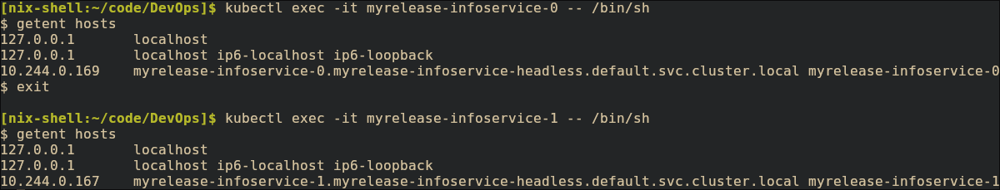

# StatefulSet Overview
**Key Differences:**

| Feature | Deployment | StatefulSet |
|---------|------------|-------------|
| Pod Names | Random suffix | Ordered index (pod-0, pod-1) |
| Storage | Shared PVC | Per-pod PVC via templates |
| Scaling | Any order | Ordered (0→1→2) |
| Network ID | Random | Stable DNS name |

# Resource Verification


# Network Identity


# Per-Pod Storage Evidence
```bash
[nix-shell:~/code/DevOps]$ curl localhost:8080/visits
{"count":0}
[nix-shell:~/code/DevOps]$ curl localhost:8080/visits
{"count":1}
[nix-shell:~/code/DevOps]$ curl localhost:8080/visits
{"count":2}
[nix-shell:~/code/DevOps]$ curl localhost:8081/visits
{"count":0}
[nix-shell:~/code/DevOps]$ curl localhost:8081/visits
{"count":1}
[nix-shell:~/code/DevOps]$ curl localhost:8080/visits
{"count":3}
[nix-shell:~/code/DevOps]$ curl localhost:8080/visits
{"count":4}
[nix-shell:~/code/DevOps]$ curl localhost:8080/visits
{"count":5}
[nix-shell:~/code/DevOps]$ curl localhost:8080/visits
{"count":6}
[nix-shell:~/code/DevOps]$ curl localhost:8080/visits
{"count":7}
[nix-shell:~/code/DevOps]$ curl localhost:8081/visits
{"count":2}
```

# Persistence Test
```bash
[nix-shell:~/code/DevOps]$ kubectl exec myrelease-infoservice-0 -- cat /data/visits.temp
7
[nix-shell:~/code/DevOps]$ kubectl delete pod myrelease-infoservice-0
pod "myrelease-infoservice-0" deleted from default namespace
[nix-shell:~/code/DevOps]$ kubectl exec myrelease-infoservice-0 -- cat /data/visits.temp
7
```
