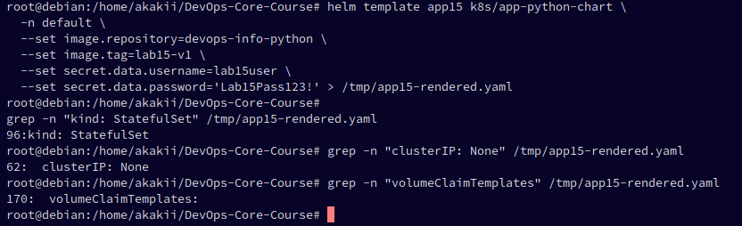
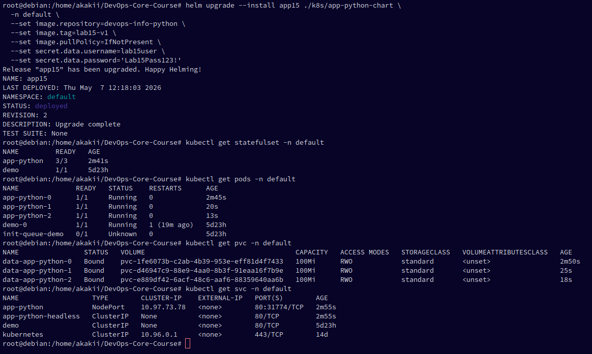
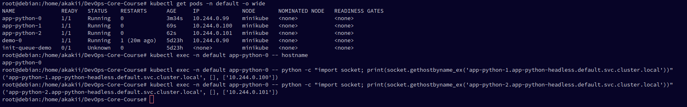
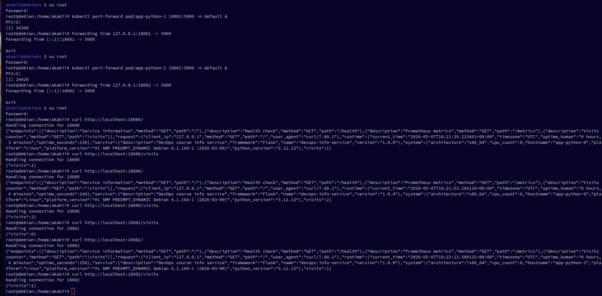
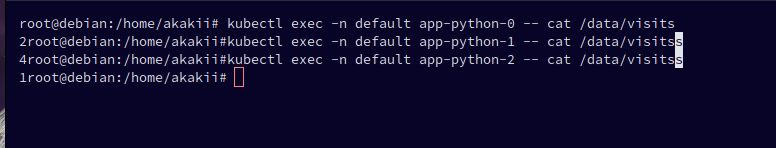
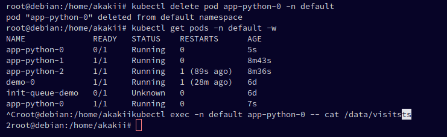

# Lab 15 — StatefulSets & Persistent Storage

**Student:** Alexander Rozanov  
**Email:** al.rozanov@innopolis.university  
**Group:** CBS-02  

---

## Summary

In this lab, the application Helm chart was adapted for a stateful deployment model. The rendered manifests confirm three key StatefulSet properties required by the assignment: the workload is generated as a `StatefulSet`, the chart includes a headless service with `clusterIP: None`, and the storage is created through `volumeClaimTemplates` so that each pod receives its own persistent volume claim.

After deployment, the application was successfully started in the `default` namespace as a three-replica StatefulSet. The resulting resources included `app-python-0`, `app-python-1`, and `app-python-2`, a regular external service `app-python`, a headless service `app-python-headless`, and three bound PVCs (`data-app-python-0`, `data-app-python-1`, and `data-app-python-2`). This demonstrates ordered creation and per-pod storage allocation.

The DNS and identity guarantees of StatefulSets were then validated from inside the cluster. From `app-python-0`, the other pods were resolved using stable DNS names following the pattern `<pod-name>.<headless-service>.<namespace>.svc.cluster.local`, specifically `app-python-1.app-python-headless.default.svc.cluster.local` and `app-python-2.app-python-headless.default.svc.cluster.local`.

Finally, per-pod storage isolation and persistence were verified. Separate requests were sent to individual pods using `kubectl port-forward`, and each pod maintained its own independent visit count. After deleting `app-python-0`, Kubernetes recreated the pod with the same stable identity, and the stored value in `/data/visits` remained preserved, which confirms that the StatefulSet uses persistent per-pod storage correctly.

---

## Task 1 — StatefulSet Concepts

StatefulSets are intended for workloads that require stable identities and persistent storage per replica. Unlike Deployments, which are optimized for interchangeable stateless replicas, StatefulSets guarantee:

- stable pod names with ordinal suffixes (`app-python-0`, `app-python-1`, `app-python-2`);
- stable DNS names through a headless service;
- dedicated persistent storage for each pod;
- ordered rollout and scaling behavior.

Typical use cases include databases, queues, and clustered systems where each instance keeps local state.

---

## Task 2 — Conversion to StatefulSet

The chart rendering output was checked with `helm template`. The screenshot evidence shows:

- `kind: StatefulSet`
- `clusterIP: None`
- `volumeClaimTemplates`

This confirms that the chart was rendered in a stateful form rather than as a regular Deployment.

### Screenshot — rendered Helm manifests



The installation was then performed with:

```bash
helm upgrade --install app15 ./k8s/app-python-chart \
  -n default \
  --set image.repository=devops-info-python \
  --set image.tag=lab15-v1 \
  --set image.pullPolicy=IfNotPresent \
  --set secret.data.username=lab15user \
  --set secret.data.password='Lab15Pass123!'
```

Resource verification after deployment showed:

- `StatefulSet/app-python` with readiness `3/3`
- pods `app-python-0`, `app-python-1`, `app-python-2`
- PVCs `data-app-python-0`, `data-app-python-1`, `data-app-python-2`
- service `app-python`
- headless service `app-python-headless`

This satisfies the main deployment requirements of the lab.

### Screenshot — Helm install/upgrade result



---

## Task 3 — Headless Service & Pod Identity

### DNS Resolution

The pod names and IP addresses were listed with `kubectl get pods -n default -o wide`. After that, DNS resolution was tested from inside `app-python-0`. The following names were successfully resolved:

- `app-python-1.app-python-headless.default.svc.cluster.local`
- `app-python-2.app-python-headless.default.svc.cluster.local`

This confirms the expected DNS naming model for StatefulSets backed by a headless service.

### Screenshot — DNS resolution from inside the pod



### Per-Pod Storage Isolation

Separate port-forwards were used to reach each pod directly:

- `app-python-0` via `localhost:18080`
- `app-python-1` via `localhost:18081`
- `app-python-2` via `localhost:18082`

The captured requests demonstrate different visit counts per pod:

- `app-python-0` reached `2`
- `app-python-1` remained at `0`
- `app-python-2` reached `1`

The same values were then read directly from the mounted files:

```bash
kubectl exec -n default app-python-0 -- cat /data/visits
kubectl exec -n default app-python-1 -- cat /data/visits
kubectl exec -n default app-python-2 -- cat /data/visits
```

This shows that each pod stores its own counter independently rather than sharing a common file.

### Screenshot — individual port-forwards to each pod



### Screenshot — different visit counters per pod



### Persistence After Pod Deletion

The persistence test was performed on `app-python-0`:

1. The pod was deleted with `kubectl delete pod app-python-0 -n default`
2. Kubernetes recreated `app-python-0`
3. The file `/data/visits` was checked again

The value remained `2` after recreation, confirming that the pod retained its own PVC-backed state.

### Screenshot — saved value after pod recreation



---

## Evidence Used

The report above is based on the following screenshots provided in the repository:

- `k8s/docs/screenshots/task_2_helm_template.png`
- `k8s/docs/screenshots/task_2_helm_upgrade.png`
- `k8s/docs/screenshots/task_3_dns_resolve.png`
- `k8s/docs/screenshots/task_3_port_forward.png`
- `k8s/docs/screenshots/task_3_forward_check.png`
- `k8s/docs/screenshots/task_3_saving_after_kill.png`