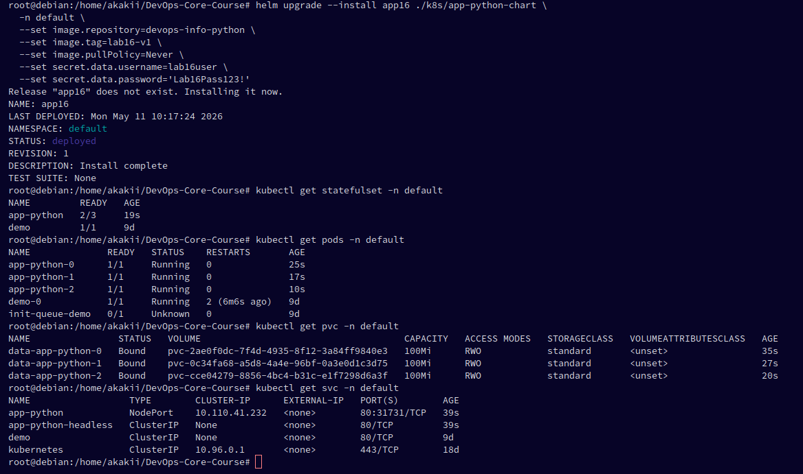
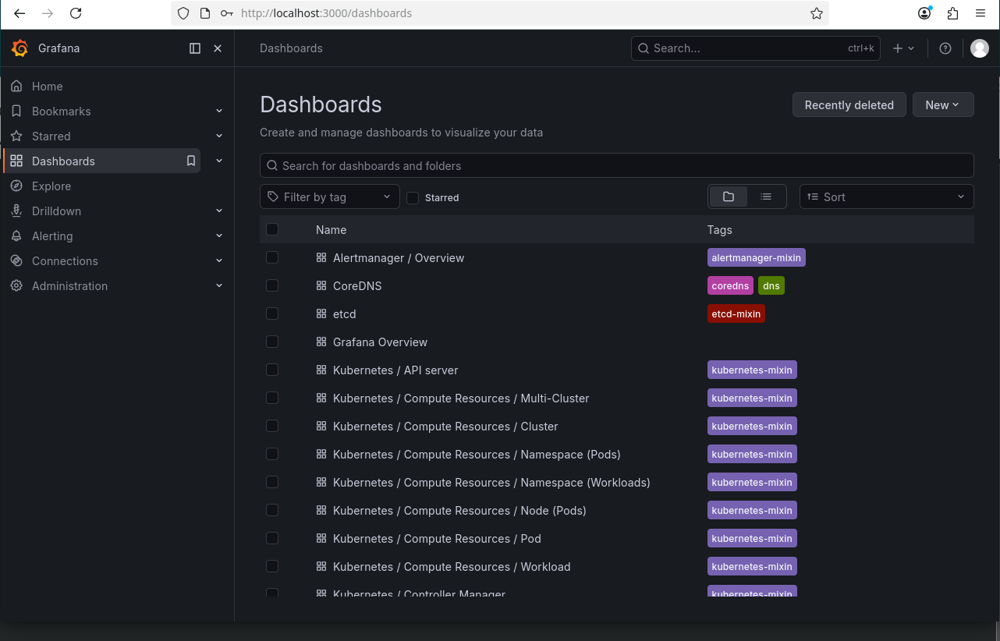
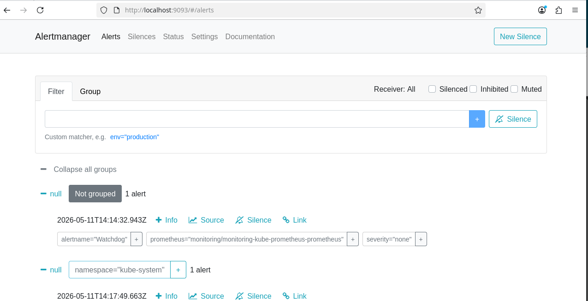

# Lab 16 — Kubernetes Monitoring & Init Containers

**Student:** Alexander Rozanov  
**Email:** al.rozanov@innopolis.university  
**Group:** CBS-02  

---

## Summary

In this lab, the Kubernetes monitoring stack was deployed using the `kube-prometheus-stack` Helm chart in the `monitoring` namespace. The deployed components included Prometheus, Alertmanager, Grafana, Prometheus Operator, `kube-state-metrics`, and `node-exporter`. After initialization, all monitoring pods reached the `Running` state, which confirmed that the observability stack was installed correctly.

The Python application from `labs/lab3/app_python` was then deployed to the `default` namespace through the existing Helm chart as a StatefulSet-based workload. The screenshots confirm that the application was running with three stable pods (`app-python-0`, `app-python-1`, `app-python-2`), three bound PVCs, and both a regular service and a headless service. This provided a monitored stateful workload for the dashboard analysis.

Grafana dashboards were used to answer all required questions about pod CPU and memory usage, namespace-level resource usage, node metrics, kubelet statistics, pod network traffic, and active alerts. Alertmanager UI was additionally used to validate the active alert count.

Finally, two init container patterns were implemented and verified. The first pod downloaded a file using `wget` into a shared volume, and the main container successfully read the downloaded content. The second pod used the wait-for-service pattern and only started its main container after the dependent service became resolvable in cluster DNS.

---

## Task 1 — Kube-Prometheus Stack

The monitoring stack was installed with Helm into the `monitoring` namespace. The release output shows that the `monitoring` release was successfully upgraded and deployed.

### Screenshot — Helm installation of kube-prometheus-stack


The `kubectl get pods -n monitoring` and subsequent watch output show that the main monitoring components became ready:

- `alertmanager-monitoring-kube-prometheus-alertmanager-0`
- `monitoring-grafana-...`
- `monitoring-kube-prometheus-operator-...`
- `monitoring-kube-state-metrics-...`
- `monitoring-prometheus-node-exporter-...`
- `prometheus-monitoring-kube-prometheus-prometheus-0`

A later snapshot with `kubectl get po,sts,svc,pvc,cm -n monitoring` confirms the complete monitoring stack resources.

### Screenshot — monitoring pods and services


### Stack Components Explained

- **Prometheus Operator** manages Prometheus-related Kubernetes resources and automates the deployment and reconciliation of Prometheus and Alertmanager instances.
- **Prometheus** scrapes metrics from the cluster and stores them as time-series data.
- **Alertmanager** receives alerts from Prometheus, groups them, and exposes the alert status UI.
- **Grafana** visualizes collected metrics through dashboards.
- **kube-state-metrics** exports metrics about Kubernetes objects such as Deployments, Pods, Services, StatefulSets, and PVCs.
- **node-exporter** exports node-level operating system metrics such as CPU, memory, disk, and network usage.

---

## Task 2 — Grafana Dashboard Exploration

Before collecting dashboard evidence, the application was installed in the `default` namespace using the Helm chart. The resulting resources show a StatefulSet deployment with three pods and three PVCs.

### Screenshot — application deployment for dashboard analysis



### Access to Grafana and Alertmanager

The Grafana dashboards page was successfully opened and the available Kubernetes dashboards were visible. Alertmanager UI was also accessible and showed active alerts.

### Screenshot — Grafana dashboards



### Screenshot — Alertmanager UI



### Question 1 — CPU and memory usage of the StatefulSet

The pod dashboard for `app-python-0` shows that the container was using very little CPU compared to its requests and limits. The dashboard panel `CPU Quota` reports approximately:

- CPU usage: `0.000600`
- CPU requests: `0.100`
- CPU limits: `0.200`
- CPU requests usage: `0.600%`
- CPU limits usage: `0.300%`

The memory panel shows:

- current memory usage (WSS): about `27.8 MiB`
- memory request: `128 MiB`
- memory limit: `256 MiB`

This indicates that the StatefulSet pods were lightly loaded and had significant resource headroom.

### Screenshot — Pod dashboard for `app-python-0`


The additional pod networking panel for the same pod confirms it was active and handling traffic while remaining within its resource envelope.

### Screenshot — Pod network activity for `app-python-0`


### Question 2 — Which pods use most/least CPU in `default` namespace?

The namespace-level pod dashboard shows CPU usage values for the pods in the `default` namespace:

- `app-python-2`: `0.000662` — highest CPU usage among the application pods
- `app-python-0`: `0.000614`
- `app-python-1`: `0.000613` — lowest CPU usage among the application pods
- `demo-0`: `0` — lowest CPU usage overall in the namespace

The same dashboard also shows memory usage values of approximately:

- `app-python-0`: `27.4 MiB`
- `app-python-1`: `27.4 MiB`
- `app-python-2`: `25.8 MiB`
- `demo-0`: `9.08 MiB`

### Screenshot — namespace CPU comparison


### Screenshot — namespace memory and network comparison


### Question 3 — Node memory usage (% and MB), CPU cores

The `Node Exporter / Nodes` dashboard shows the monitored node with:

- memory usage: `48.8%`
- logical CPU cores: `8`

Based on the memory graph, the node was using roughly half of its RAM, which corresponds to approximately `4.9–5.0 GiB` in use.

### Screenshot — node metrics


### Question 4 — How many pods and containers are managed by Kubelet?

The `Kubernetes / Kubelet` dashboard shows:

- Running Kubelets: `1`
- Running Pods: `29`
- Running Containers: `64`
- Actual Volume Count: `120`
- Desired Volume Count: `120`

### Screenshot — kubelet metrics


### Question 5 — Network traffic for pods in `default` namespace

The networking dashboard for `app-python-0` reports:

- current receive bandwidth: `1.45 kb/s`
- current transmit bandwidth: `1.44 kb/s`
- receive packet rate: about `2.15 p/s`
- transmit packet rate: about `1.52 p/s`
- packet drops: `0`

This confirms successful pod-to-service traffic without packet loss.

### Screenshot — pod networking metrics


### Question 6 — How many active alerts are present?

The Alertmanager UI shows:

- `1` not-grouped `Watchdog` alert
- `4` alerts under `namespace="kube-system"`

Therefore, the total number of active alerts at the time of inspection was **5**.

The visible kube-system alerts included `TargetDown` for `kube-controller-manager`, `TargetDown` for `etcd`, `etcdInsufficientMembers`, and `TargetDown` for `kube-scheduler`.

### Screenshot — active alerts in Alertmanager


---

## Task 3 — Init Containers

### Part 1 — Download file with `wget`

The first init-container example used `busybox:1.36` and downloaded `http://example.com` into `/work-dir/index.html`, which was backed by an `emptyDir` volume shared with the main container.

The pod was created successfully, and the description confirms that the init container `init-download` completed with exit code `0` before the main container continued execution.

### Screenshot — init-download pod creation and description


The logs of the init container show that the HTML file was downloaded successfully. The content was then read from the main container using `kubectl exec`, which proves that the shared volume worked as expected.

### Screenshot — init-download logs and file verification


### Part 2 — Wait-for-service pattern

A dependency pod and service named `wait-backend` were created first. The service became visible in the `default` namespace together with the running workload pods.

### Screenshot — backend pod and service creation


The second init-container example (`init-wait-demo`) used the command:

```sh
until nslookup wait-backend.default.svc.cluster.local; do sleep 2; done
```

The pod remained in init phase until the service became resolvable. After DNS resolution succeeded, the main container started and the pod reached `Running` state.

The log output shows that `wait-backend.default.svc.cluster.local` was resolved successfully and the pod description confirms that the init container completed.

### Screenshot — wait-for-service init container


---

## Bonus Task — Custom Metrics & ServiceMonitor

The Python application used in this lab already exposes a `/metrics` endpoint from previous work, which is appropriate for Prometheus integration. However, the provided evidence set does not contain a `ServiceMonitor` manifest or Prometheus target verification screenshot. For that reason, the bonus part is not claimed as completed in this report.

---

## Conclusion

The lab objectives were achieved. The `kube-prometheus-stack` monitoring solution was installed successfully, the main monitoring components were verified in the `monitoring` namespace, and Grafana dashboards were used to answer all required questions about workload, namespace, node, kubelet, network, and alerting metrics.

The init container patterns were also implemented successfully. The first example demonstrated pre-start file download into a shared volume, and the second example demonstrated dependency waiting via DNS-based service readiness checks.

Overall, the lab provided practical experience with both cluster observability and pod initialization patterns in Kubernetes.

---

## Evidence Used

The report is based on the following screenshots from `k8s/docs/screenshots/`:

- `task_1_helm_upgrade_install.png`
- `task_1_kubectl_get_pods.png`
- `task_2_grafana.png`
- `task_2_alert_manager.png`
- `task_2_helm_upgrade_install.png`
- `task_2_q1_1.png`
- `task_2_q1_2.png`
- `task_2_q2_1.png`
- `task_2_q2_2.png`
- `task_2_q3.png`
- `task_2_q4.png`
- `task_2_q5.png`
- `task_2_q6_1.png`
- `task_3_kubectl_apply.png`
- `task_3_kubectl_apply_get_pod.png`
- `task_3_kubectl_apply_init_wait_demo.png`
- `task_3_kubectl_logs.png`