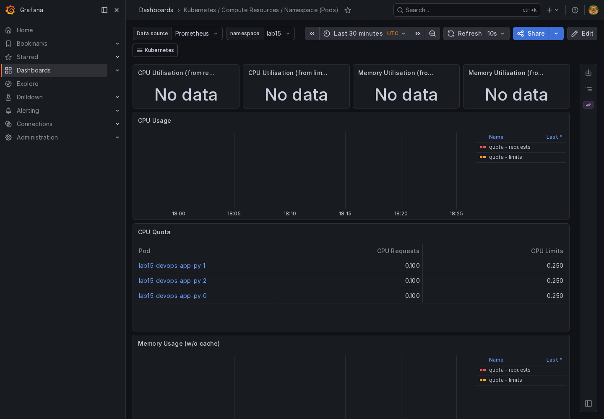
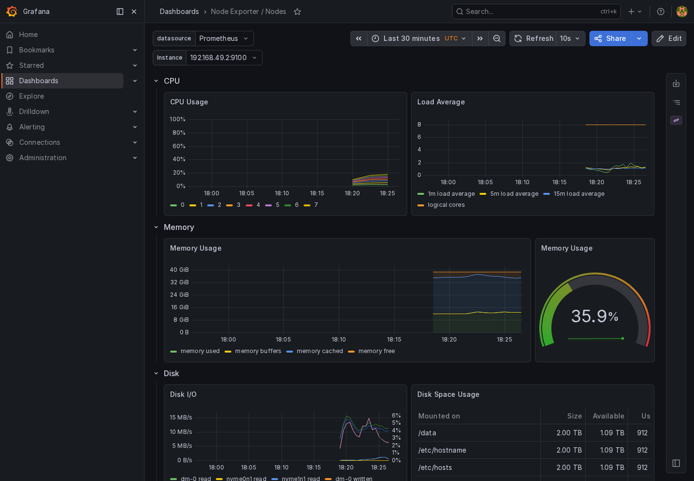
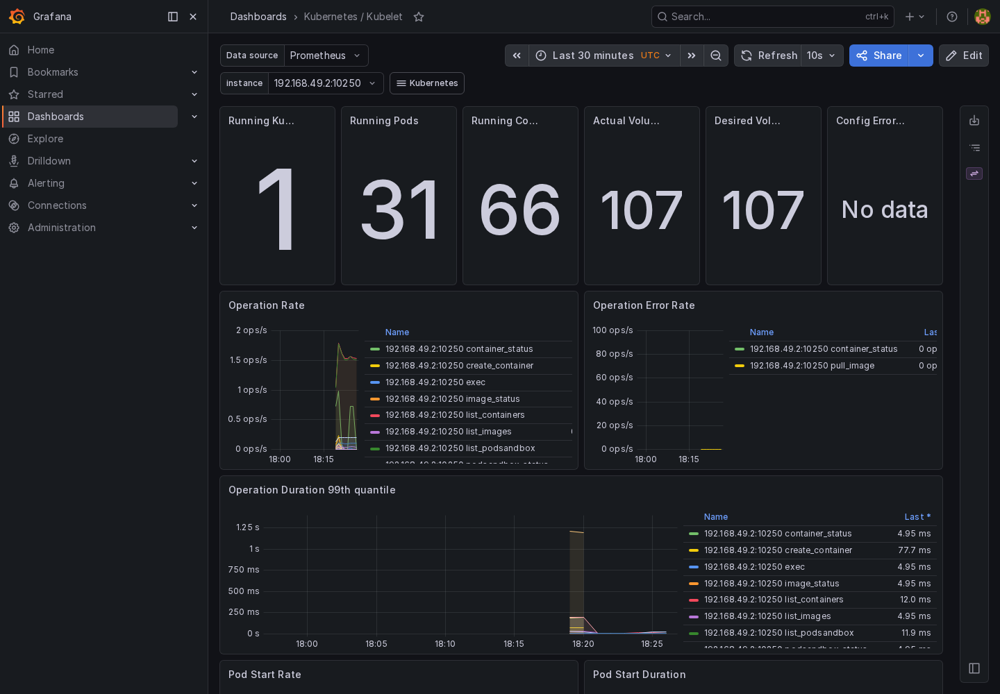
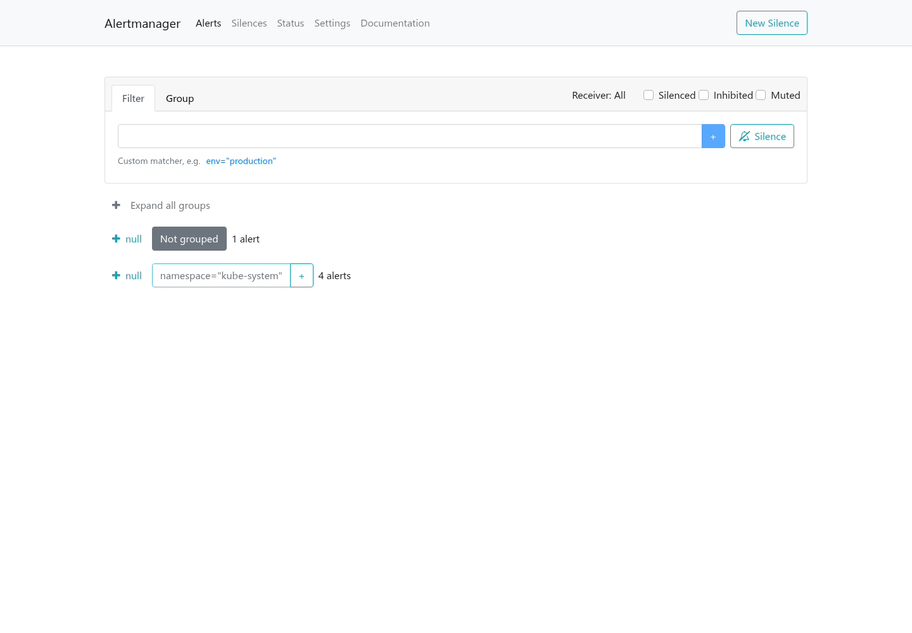
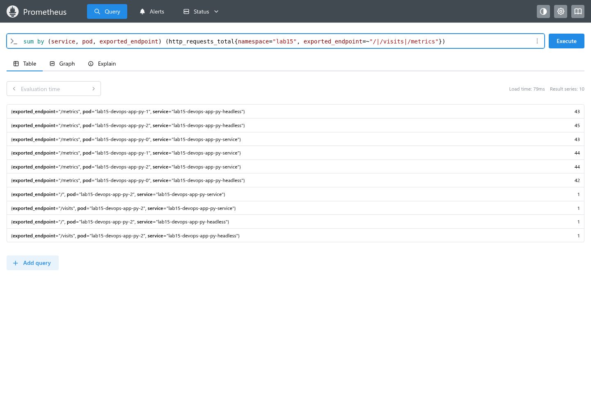

# Kubernetes Lab 16 - Monitoring and Init Containers

Lab 16 adds a kube-prometheus-stack monitoring installation to the existing Lab 15 StatefulSet release and implements init container support in the Helm chart. I kept the application release in the `lab15` namespace so the StatefulSet, PVCs, and stable pod identities from Lab 15 remain the monitored workload.

The monitoring stack is installed as Helm release `monitoring` in namespace `monitoring`, pinned to kube-prometheus-stack chart `84.5.0`. The chart version for `devops-app-py` is now `0.8.0`.

## Stack Components

| Component           | Role in this lab                                                                             |
| ------------------- | -------------------------------------------------------------------------------------------- |
| Prometheus Operator | Reconciles Prometheus, Alertmanager, ServiceMonitor, and rule CRDs into running workloads.   |
| Prometheus          | Scrapes Kubernetes, node, and application metrics, then answers PromQL queries.              |
| Alertmanager        | Receives firing alerts from Prometheus and groups them in the Alertmanager UI.               |
| Grafana             | Provides dashboards for pod, namespace, node, kubelet, and persistent volume metrics.        |
| kube-state-metrics  | Exposes Kubernetes object state such as pod resources, StatefulSet status, and PVC metadata. |
| node-exporter       | Exposes host CPU, memory, disk, and filesystem metrics from the minikube node.               |

## Chart Implementation

The Helm chart now supports:

- `initContainers`: raw Kubernetes init container specs rendered into the shared pod template.
- `extraVolumes` and `extraVolumeMounts`: reusable shared volumes for init and main containers.
- `serviceMonitor.enabled`: optional `monitoring.coreos.com/v1 ServiceMonitor` rendering.
- `statefulset.volumeClaimTemplateLabels`: an upgrade escape hatch for existing StatefulSets, because Kubernetes forbids changes to `volumeClaimTemplates`.

The Lab 16 values file adds two init containers:

- `wait-for-headless-service` waits until `lab15-devops-app-py-headless.lab15.svc.cluster.local` resolves.
- `init-download` uses BusyBox `wget` to save the app service's `/ready` response into `/init-data/lab16-init.txt`, an `emptyDir` volume mounted read-only by the main app container.

I used the in-cluster `/ready` endpoint instead of an external URL so the init container proves the download pattern without depending on outside network access.

## Static Checks

<details>
<summary>Helm render checks</summary>

```text
$ helm lint k8s/devops-app-py
==> Linting k8s/devops-app-py
[INFO] Chart.yaml: icon is recommended

1 chart(s) linted, 0 chart(s) failed

$ helm template lab15 k8s/devops-app-py --namespace lab15 -f k8s/devops-app-py/values-statefulset.yaml -f k8s/devops-app-py/values-lab16.yaml | rg "helm.sh/chart|volumeClaimTemplates:|initContainers:|ServiceMonitor|release: monitoring"
    helm.sh/chart: devops-app-py-0.8.0
    helm.sh/chart: devops-app-py-0.8.0
    helm.sh/chart: devops-app-py-0.8.0
    helm.sh/chart: devops-app-py-0.8.0
    helm.sh/chart: devops-app-py-0.8.0
    helm.sh/chart: devops-app-py-0.8.0
    helm.sh/chart: devops-app-py-0.8.0
      initContainers:
  volumeClaimTemplates:
          helm.sh/chart: devops-app-py-0.7.0
kind: ServiceMonitor
    helm.sh/chart: devops-app-py-0.8.0
    release: monitoring
    helm.sh/chart: devops-app-py-0.8.0
    helm.sh/chart: devops-app-py-0.8.0
```

</details>

The `volumeClaimTemplates` chart label remains `devops-app-py-0.7.0` only in `values-lab16.yaml` for the already-created Lab 15 StatefulSet. Without that compatibility label, Kubernetes rejects the upgrade because the rendered claim template metadata changes.

## Monitoring Install

The first install succeeded, but several images initially pulled from `quay.io` slowly or failed transiently. To make the local minikube install repeatable, I upgraded the same chart version with equivalent Docker Hub and GHCR image names and preloaded those images into minikube.

<details>
<summary>Monitoring release and final readiness</summary>

```text
$ helm upgrade monitoring prometheus-community/kube-prometheus-stack --version 84.5.0 -n monitoring -f /tmp/lab16/monitoring.values.yaml
Release "monitoring" has been upgraded. Happy Helming!
NAME: monitoring
LAST DEPLOYED: Thu May  7 21:17:29 2026
NAMESPACE: monitoring
STATUS: deployed
REVISION: 2
DESCRIPTION: Upgrade complete
TEST SUITE: None

$ kubectl get pods,statefulsets,deployments,daemonsets -n monitoring -o wide
NAME                                                         READY   STATUS    RESTARTS   AGE     IP             NODE       NOMINATED NODE   READINESS GATES
pod/alertmanager-monitoring-kube-prometheus-alertmanager-0   2/2     Running   0          14s     10.244.0.91    minikube   <none>           <none>
pod/monitoring-grafana-785747497f-lkmxf                      3/3     Running   0          26s     10.244.0.87    minikube   <none>           <none>
pod/monitoring-kube-prometheus-operator-cf8cf4744-ml69q      1/1     Running   0          26s     10.244.0.86    minikube   <none>           <none>
pod/monitoring-kube-state-metrics-5957bd45bc-n84lk           1/1     Running   0          5m55s   10.244.0.79    minikube   <none>           <none>
pod/monitoring-prometheus-node-exporter-qq9q6                1/1     Running   0          25s     192.168.49.2   minikube   <none>           <none>
pod/prometheus-monitoring-kube-prometheus-prometheus-0       2/2     Running   0          24s     10.244.0.89    minikube   <none>           <none>

NAME                                                                    READY   AGE     CONTAINERS                     IMAGES
statefulset.apps/alertmanager-monitoring-kube-prometheus-alertmanager   1/1     2m30s   alertmanager,config-reloader   docker.io/prom/alertmanager:v0.32.1,ghcr.io/prometheus-operator/prometheus-config-reloader:v0.90.1
statefulset.apps/prometheus-monitoring-kube-prometheus-prometheus       1/1     2m30s   prometheus,config-reloader     docker.io/prom/prometheus:v3.11.3,ghcr.io/prometheus-operator/prometheus-config-reloader:v0.90.1

NAME                                                  READY   UP-TO-DATE   AVAILABLE   AGE     CONTAINERS                                            IMAGES                                                                                                       SELECTOR
deployment.apps/monitoring-grafana                    1/1     1            1           5m55s   grafana-sc-dashboard,grafana-sc-datasources,grafana   docker.io/kiwigrid/k8s-sidecar:2.7.1,docker.io/kiwigrid/k8s-sidecar:2.7.1,docker.io/grafana/grafana:13.0.1   app.kubernetes.io/instance=monitoring,app.kubernetes.io/name=grafana
deployment.apps/monitoring-kube-prometheus-operator   1/1     1            1           5m55s   kube-prometheus-stack                                 ghcr.io/prometheus-operator/prometheus-operator:v0.90.1                                                      app=kube-prometheus-stack-operator,release=monitoring
deployment.apps/monitoring-kube-state-metrics         1/1     1            1           5m55s   kube-state-metrics                                    registry.k8s.io/kube-state-metrics/kube-state-metrics:v2.18.0                                                app.kubernetes.io/instance=monitoring,app.kubernetes.io/name=kube-state-metrics

NAME                                                 DESIRED   CURRENT   READY   UP-TO-DATE   AVAILABLE   NODE SELECTOR            AGE     CONTAINERS      IMAGES                                 SELECTOR
daemonset.apps/monitoring-prometheus-node-exporter   1         1         1       1            1           kubernetes.io/os=linux   5m55s   node-exporter   docker.io/prom/node-exporter:v1.11.1   app.kubernetes.io/instance=monitoring,app.kubernetes.io/name=prometheus-node-exporter

$ kubectl get prometheus,alertmanager -n monitoring
NAME                                                                     VERSION   DESIRED   READY   RECONCILED   AVAILABLE   AGE
prometheus.monitoring.coreos.com/monitoring-kube-prometheus-prometheus   v3.11.3   1         1       True         True        5m55s

NAME                                                                         VERSION   REPLICAS   READY   RECONCILED   AVAILABLE   AGE
alertmanager.monitoring.coreos.com/monitoring-kube-prometheus-alertmanager   v0.32.1   1          1       True         True        5m55s
```

</details>

## Init Container Proof

<details>
<summary>StatefulSet upgrade and init output</summary>

```text
$ helm status lab15 -n lab15
NAME: lab15
LAST DEPLOYED: Thu May  7 21:18:53 2026
NAMESPACE: lab15
STATUS: deployed
REVISION: 10
DESCRIPTION: Upgrade complete

$ kubectl get pods,statefulsets,svc,pvc,servicemonitor -n lab15 -o wide
NAME                        READY   STATUS    RESTARTS   AGE   IP            NODE       NOMINATED NODE   READINESS GATES
pod/lab15-devops-app-py-0   1/1     Running   0          15s   10.244.0.94   minikube   <none>           <none>
pod/lab15-devops-app-py-1   1/1     Running   0          25s   10.244.0.93   minikube   <none>           <none>
pod/lab15-devops-app-py-2   1/1     Running   0          35s   10.244.0.92   minikube   <none>           <none>

NAME                                   READY   AGE   CONTAINERS      IMAGES
statefulset.apps/lab15-devops-app-py   3/3     60m   devops-app-py   localt0aster/devops-app-py:1.12

NAME                                   TYPE        CLUSTER-IP     EXTERNAL-IP   PORT(S)   AGE   SELECTOR
service/lab15-devops-app-py-headless   ClusterIP   None           <none>        80/TCP    60m   app.kubernetes.io/instance=lab15,app.kubernetes.io/name=devops-app-py
service/lab15-devops-app-py-service    ClusterIP   10.96.64.122   <none>        80/TCP    60m   app.kubernetes.io/instance=lab15,app.kubernetes.io/name=devops-app-py

NAME                                                      STATUS   VOLUME                                     CAPACITY   ACCESS MODES   STORAGECLASS   VOLUMEATTRIBUTESCLASS   AGE   VOLUMEMODE
persistentvolumeclaim/data-volume-lab15-devops-app-py-0   Bound    pvc-fb42ff13-ec37-4604-9833-84381c98e194   100Mi      RWO            standard       <unset>                 60m   Filesystem
persistentvolumeclaim/data-volume-lab15-devops-app-py-1   Bound    pvc-e2f72f28-1577-4b27-82b4-e5b0eb001d88   100Mi      RWO            standard       <unset>                 59m   Filesystem
persistentvolumeclaim/data-volume-lab15-devops-app-py-2   Bound    pvc-32239c77-37ff-4eb5-89a4-86f1be4a84e7   100Mi      RWO            standard       <unset>                 59m   Filesystem

NAME                                                       AGE
servicemonitor.monitoring.coreos.com/lab15-devops-app-py   77s

$ kubectl get pod lab15-devops-app-py-0 -n lab15 -o json | jq '{name: .metadata.name, initContainers: [.status.initContainerStatuses[] | {name, ready, restartCount, state}], containerImages: [.spec.containers[] | {name, image}], annotations: .metadata.annotations}'
{
  "name": "lab15-devops-app-py-0",
  "initContainers": [
    {
      "name": "wait-for-headless-service",
      "ready": true,
      "restartCount": 0,
      "state": {
        "terminated": {
          "exitCode": 0,
          "reason": "Completed"
        }
      }
    },
    {
      "name": "init-download",
      "ready": true,
      "restartCount": 0,
      "state": {
        "terminated": {
          "exitCode": 0,
          "reason": "Completed"
        }
      }
    }
  ],
  "containerImages": [
    {
      "name": "devops-app-py",
      "image": "localt0aster/devops-app-py:1.12"
    }
  ],
  "annotations": {
    "lab15-version": "stateful-v1",
    "lab16-init-demo": "enabled"
  }
}

$ kubectl logs -n lab15 lab15-devops-app-py-0 -c wait-for-headless-service
Name:	lab15-devops-app-py-headless.lab15.svc.cluster.local
Address: 10.244.0.92
Name:	lab15-devops-app-py-headless.lab15.svc.cluster.local
Address: 10.244.0.93

headless service resolved

$ kubectl logs -n lab15 lab15-devops-app-py-0 -c init-download
Connecting to lab15-devops-app-py-service.lab15.svc.cluster.local (10.96.64.122:80)
saving to '/init-data/lab16-init.txt'
lab16-init.txt       100% |********************************|    86  0:00:00 ETA
'/init-data/lab16-init.txt' saved

$ kubectl exec -n lab15 lab15-devops-app-py-0 -- sed -n '1,8p' /init-data/lab16-init.txt
{"status":"ready","timestamp":"2026-05-07T18:19:16.092960+00:00","uptime_seconds":13}

downloaded-by=init-download
```

</details>

## Dashboard Answers

I used Grafana for the dashboard views and Prometheus queries for exact values where the Grafana panel aggregated or omitted raw numbers. The default namespace had no pods at capture time, so the "default namespace" CPU and network questions have an empty result.

| Question                               | Answer                                                                                                                                                                                                                  |
| -------------------------------------- | ----------------------------------------------------------------------------------------------------------------------------------------------------------------------------------------------------------------------- |
| Pod resources for the StatefulSet      | `lab15-devops-app-py-0`, `-1`, and `-2` were about `0.63` to `0.72` millicores and `42.48` to `43.18` MiB working set. The Grafana quota panel also showed each pod requesting `0.100` CPU and limiting at `0.250` CPU. |
| Pods using most/least CPU in `default` | There were no pods in `default`, so there was no most/least CPU consumer.                                                                                                                                               |
| Node metrics                           | Minikube node memory was about `35.99%` used, or `14323.58` MiB, with `8` logical CPU cores.                                                                                                                            |
| Kubelet                                | Kubelet reported `31` running pods and `66` running containers.                                                                                                                                                         |
| Network traffic in `default`           | No `default` namespace pods existed, so the network query returned no series.                                                                                                                                           |
| Alerts                                 | Alertmanager had `5` active alerts: `Watchdog` plus kube-system alerts including `TargetDown` and `etcdInsufficientMembers`.                                                                                            |

<details>
<summary>Dashboard answer queries</summary>

```text
$ kubectl get pods -n default
No resources found in default namespace.

$ curl -fsS -G 127.0.0.1:9090/api/v1/query --data-urlencode 'query=sum by (pod) (rate(container_cpu_usage_seconds_total{namespace="lab15", pod=~"lab15-devops-app-py-.*"}[5m])) * 1000' | jq '[.data.result[] | {pod: .metric.pod, cpu_millicores: .value[1]}]'
[
  {
    "pod": "lab15-devops-app-py-2",
    "cpu_millicores": "0.7247538053105157"
  },
  {
    "pod": "lab15-devops-app-py-1",
    "cpu_millicores": "0.6301911409320081"
  },
  {
    "pod": "lab15-devops-app-py-0",
    "cpu_millicores": "0.700071927370977"
  }
]

$ curl -fsS -G 127.0.0.1:9090/api/v1/query --data-urlencode 'query=sum by (pod) (container_memory_working_set_bytes{namespace="lab15", pod=~"lab15-devops-app-py-.*"}) / 1024 / 1024' | jq '[.data.result[] | {pod: .metric.pod, memory_mib: .value[1]}]'
[
  {
    "pod": "lab15-devops-app-py-2",
    "memory_mib": "42.4765625"
  },
  {
    "pod": "lab15-devops-app-py-1",
    "memory_mib": "43.18359375"
  },
  {
    "pod": "lab15-devops-app-py-0",
    "memory_mib": "42.96875"
  }
]

$ curl -fsS -G 127.0.0.1:9090/api/v1/query --data-urlencode 'query=sum by (pod) (rate(container_cpu_usage_seconds_total{namespace="default"}[5m])) * 1000' | jq '.data.result'
[]

$ curl -fsS -G 127.0.0.1:9090/api/v1/query --data-urlencode 'query=(1 - (node_memory_MemAvailable_bytes / node_memory_MemTotal_bytes)) * 100' | jq '[.data.result[] | {instance: .metric.instance, memory_percent: .value[1]}]'
[
  {
    "instance": "192.168.49.2:9100",
    "memory_percent": "35.99074072983496"
  }
]

$ curl -fsS -G 127.0.0.1:9090/api/v1/query --data-urlencode 'query=(node_memory_MemTotal_bytes - node_memory_MemAvailable_bytes) / 1024 / 1024' | jq '[.data.result[] | {instance: .metric.instance, memory_mib: .value[1]}]'
[
  {
    "instance": "192.168.49.2:9100",
    "memory_mib": "14323.578125"
  }
]

$ curl -fsS -G 127.0.0.1:9090/api/v1/query --data-urlencode 'query=count(count by (cpu) (node_cpu_seconds_total{mode="idle"}))' | jq '[.data.result[] | {logical_cores: .value[1]}]'
[
  {
    "logical_cores": "8"
  }
]

$ curl -fsS -G 127.0.0.1:9090/api/v1/query --data-urlencode 'query=sum(kubelet_running_pods)' | jq '[.data.result[] | {running_pods: .value[1]}]'
[
  {
    "running_pods": "31"
  }
]

$ curl -fsS -G 127.0.0.1:9090/api/v1/query --data-urlencode 'query=sum(kubelet_running_containers)' | jq '[.data.result[] | {running_containers: .value[1]}]'
[
  {
    "running_containers": "66"
  }
]

$ curl -fsS -G 127.0.0.1:9090/api/v1/query --data-urlencode 'query=sum by (namespace, pod) (rate(container_network_receive_bytes_total{namespace="default"}[5m]) + rate(container_network_transmit_bytes_total{namespace="default"}[5m]))' | jq '.data.result'
[]

$ curl -fsS 127.0.0.1:9093/api/v2/alerts | jq 'group_by(.status.state) | map({state: .[0].status.state, count: length})'
[
  {
    "state": "active",
    "count": 5
  }
]
```

</details>

## Bonus: ServiceMonitor

The application already exposed `/metrics`, so Lab 16 adds Helm-managed `ServiceMonitor` support instead of modifying the Python code. The ServiceMonitor has label `release: monitoring`, which matches the kube-prometheus-stack release selector.

Because the chart has both a normal Service and a headless Service with the same selector labels, Prometheus discovered both Services and scraped all three pods through each, for six healthy targets. That is acceptable for this lab and makes the duplicate service behavior visible.

<details>
<summary>ServiceMonitor and Prometheus proof</summary>

```text
$ kubectl get servicemonitor lab15-devops-app-py -n lab15 -o yaml | sed -n '1,80p'
apiVersion: monitoring.coreos.com/v1
kind: ServiceMonitor
metadata:
  labels:
    app.kubernetes.io/instance: lab15
    app.kubernetes.io/managed-by: Helm
    app.kubernetes.io/name: devops-app-py
    app.kubernetes.io/part-of: devops-core-s26
    app.kubernetes.io/version: "1.12"
    helm.sh/chart: devops-app-py-0.8.0
    release: monitoring
  name: lab15-devops-app-py
  namespace: lab15
spec:
  endpoints:
  - interval: 15s
    path: /metrics
    port: http
    scrapeTimeout: 10s
  selector:
    matchLabels:
      app.kubernetes.io/instance: lab15
      app.kubernetes.io/name: devops-app-py

$ curl -fsS 127.0.0.1:9090/api/v1/targets?state=active | jq '[.data.activeTargets[] | select((.labels.namespace // .discoveredLabels.__meta_kubernetes_namespace) == "lab15") | {job: .labels.job, service: (.discoveredLabels.__meta_kubernetes_service_name // ""), health: .health, scrapeUrl: .scrapeUrl}]'
[
  {
    "job": "lab15-devops-app-py-headless",
    "service": "lab15-devops-app-py-headless",
    "health": "up",
    "scrapeUrl": "http://10.244.0.94:5000/metrics"
  },
  {
    "job": "lab15-devops-app-py-service",
    "service": "lab15-devops-app-py-service",
    "health": "up",
    "scrapeUrl": "http://10.244.0.92:5000/metrics"
  },
  {
    "job": "lab15-devops-app-py-service",
    "service": "lab15-devops-app-py-service",
    "health": "up",
    "scrapeUrl": "http://10.244.0.93:5000/metrics"
  },
  {
    "job": "lab15-devops-app-py-service",
    "service": "lab15-devops-app-py-service",
    "health": "up",
    "scrapeUrl": "http://10.244.0.94:5000/metrics"
  },
  {
    "job": "lab15-devops-app-py-headless",
    "service": "lab15-devops-app-py-headless",
    "health": "up",
    "scrapeUrl": "http://10.244.0.92:5000/metrics"
  },
  {
    "job": "lab15-devops-app-py-headless",
    "service": "lab15-devops-app-py-headless",
    "health": "up",
    "scrapeUrl": "http://10.244.0.93:5000/metrics"
  }
]

$ curl -fsS -G 127.0.0.1:9090/api/v1/query --data-urlencode 'query=sum by (service, pod, exported_endpoint) (http_requests_total{namespace="lab15", exported_endpoint=~"/|/visits|/metrics"})' | jq '[.data.result[] | {service: .metric.service, pod: .metric.pod, endpoint: .metric.exported_endpoint, value: .value[1]}]'
[
  {
    "service": "lab15-devops-app-py-service",
    "pod": "lab15-devops-app-py-2",
    "endpoint": "/",
    "value": "1"
  },
  {
    "service": "lab15-devops-app-py-service",
    "pod": "lab15-devops-app-py-2",
    "endpoint": "/visits",
    "value": "1"
  },
  {
    "service": "lab15-devops-app-py-headless",
    "pod": "lab15-devops-app-py-2",
    "endpoint": "/",
    "value": "1"
  },
  {
    "service": "lab15-devops-app-py-headless",
    "pod": "lab15-devops-app-py-2",
    "endpoint": "/visits",
    "value": "1"
  }
]
```

</details>

## Screenshots











## Final State

The final cluster state is healthy:

- `monitoring` namespace: Prometheus, Alertmanager, Grafana, kube-state-metrics, node-exporter, and the Prometheus Operator are ready.
- `lab15` namespace: StatefulSet `lab15-devops-app-py` is `3/3`, all PVCs remain bound, and init containers completed on the rolled pods.
- Bonus ServiceMonitor is active and Prometheus scrapes six healthy app targets from the normal and headless Services.
