# Lab 5 — Ansible Fundamentals

## 1. Architecture Overview

- **Ansible Version:** 2.16.0
- **Target VM OS:** Ubuntu 22.04 LTS
- **Control Node:** Ubuntu
- **Role structure explanation:** Each role contains `tasks/main.yml` (what to do), `handlers/main.yml` (conditional service restarts), and `defaults/main.yml` (default variables). `common` installs base packages, `docker` installs Docker CE, `app_deploy` pulls and runs the container.
- **Why roles instead of monolithic playbooks?** Roles provide reusability (can be used across different projects), they maintain separation of concerns (each role is responsible for one single action). Also they can be composed flexibly in different playbooks.
 - **Control Node:** Ubuntu
 - **Role structure:**
 ```text
 ansible/
 ├── inventory/
 │   └── hosts.ini
 ├── roles/
 │   ├── common/
 │   │   ├── tasks/main.yml
 │   │   └── defaults/main.yml
 │   ├── docker/
 │   │   ├── tasks/main.yml
 │   │   ├── handlers/main.yml
 │   │   └── defaults/main.yml
 │   └── app_deploy/
 │       ├── tasks/main.yml
 │       ├── handlers/main.yml
 │       └── defaults/main.yml
 ├── playbooks/
 │   ├── provision.yml
 │   └── deploy.yml
 ├── ansible.cfg
 └── group_vars/all.yml (vaulted)
 ```

 - **Why roles instead of monolithic playbooks?**
 Roles promote reuse, clear separation of concerns, and easier testing; they make large projects maintainable by organizing tasks, handlers, and defaults per functional unit.

## 2. Roles Documentation

### `roles/common`
- Purpose: Provide base system provisioning: update APT cache, install essential packages, ensure Python 3 is present for Ansible remote operations, and set basic system configuration (timezone, users, cleanup).
- Variables:
	- `common_packages` (list): packages installed by default (example: `['python3-pip','curl','git','vim','htop']`).
	- `timezone` (string): system timezone to set (e.g. `UTC`).
- Handlers:
	- `restart cron` (optional) — triggered if cron config changed.
	- `reload rsyslog` (optional) — when logging config changed.
- Dependencies: None.

### `roles/docker`
- Purpose: Install and configure Docker Engine from the official repository, ensure the Docker service is enabled and running, and add the deployment user to the `docker` group.
- Variables:
	- `docker_packages` (list): `['docker-ce','docker-ce-cli','containerd.io']` (may vary by distro).
	- `docker_user` (string): user to add to `docker` group (e.g. `ubuntu`).
	- `docker_version` (optional): pin Docker version if required.
- Handlers:
	- `restart docker` — restarts the Docker service when configuration or package changes require it.
- Dependencies: `roles/common` should run first to ensure required packages and Python are present.

### `roles/app_deploy`
- Purpose: Authenticate to Docker Hub using vaulted credentials, pull the application image, stop and remove the previous container if present, and start the new container with correct port mappings and restart policy.
- Variables:
	- `dockerhub_username` (string) — provided via `group_vars/all.yml` (vaulted).
	- `dockerhub_password` (string) — vaulted.
	- `app_name` (string) — container name (default: `devops-app`).
	- `docker_image` (string) — image name (e.g. `{{ dockerhub_username }}/devops-app`).
	- `docker_image_tag` (string) — image tag (default: `latest`).
	- `app_port` (int) — container port (default: `5000`).
- Handlers:
	- `restart app container` — restarts the application container when configuration changes.
- Dependencies: `roles/docker` must be applied before this role so Docker is available on the host.

## 3. Idempotency Demonstration

### First run (provision)
Initial run of the provisioning playbook (shows changed tasks):

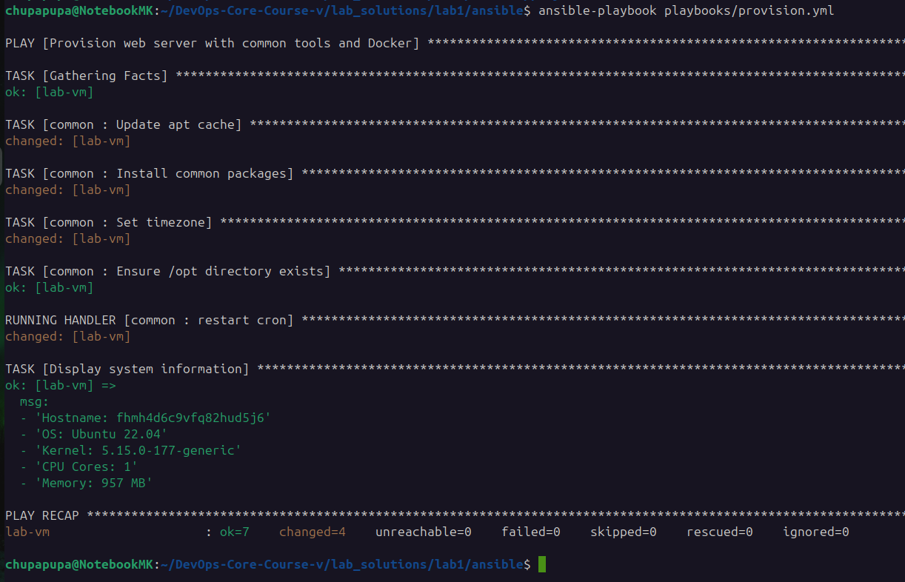

### Second run (idempotency)
Second run should show `ok` for previously changed tasks:

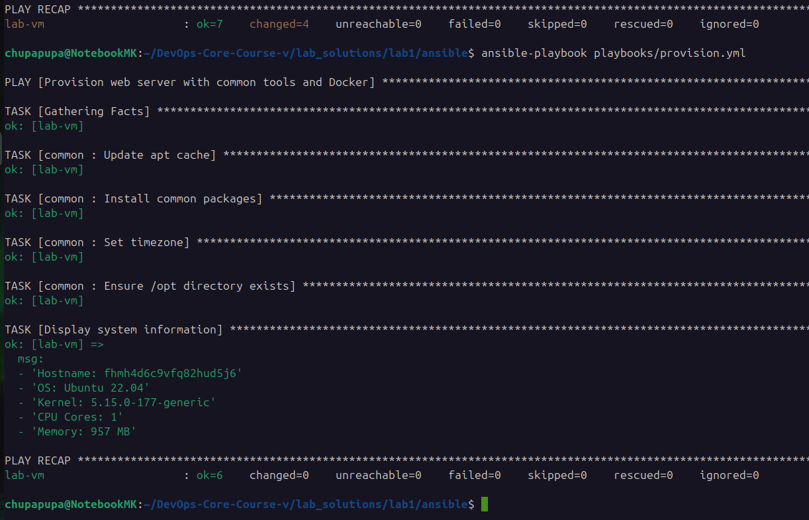

### Provision fixes proof
First provisioning run missed Docker tasks/handlers; after fixes the provision playbook ran successfully:

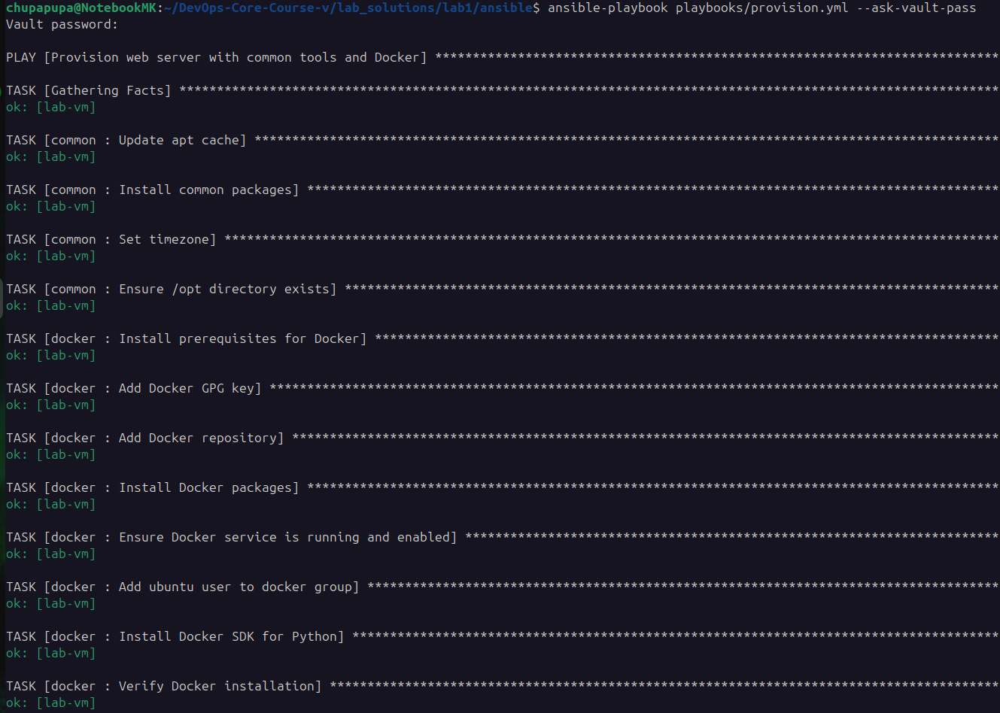
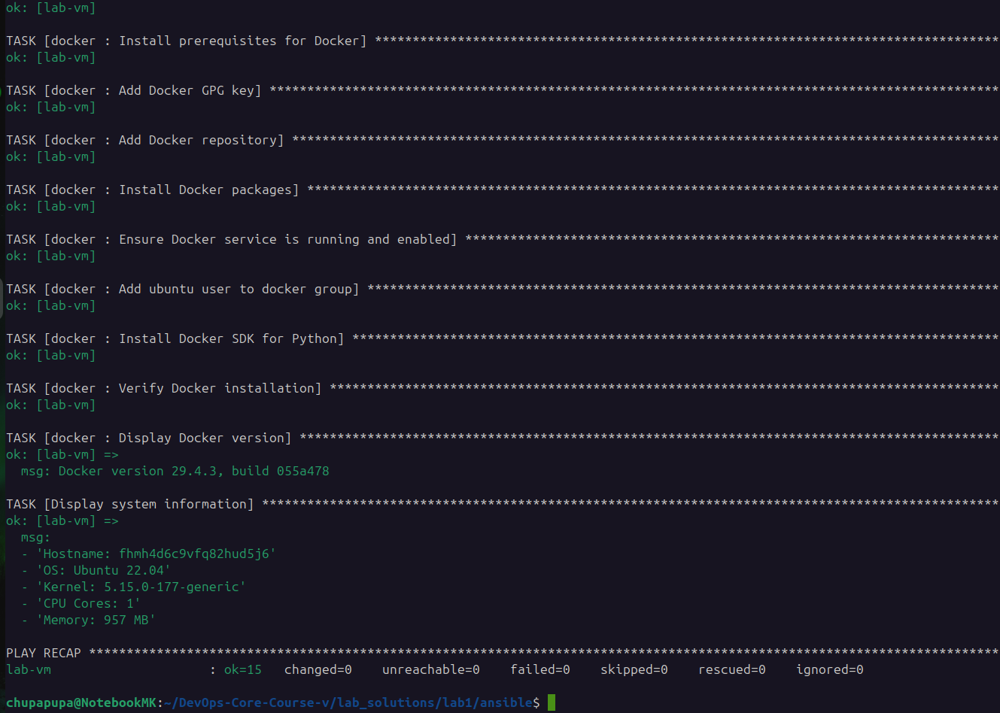

## 3.5 Idempotency analysis (summary)
- First run observations (changed):
	- `apt` update and package installs ran and reported `changed` because packages were absent.
	- Docker repository and GPG key were added (changed).
	- Docker packages installed and service started (changed).
	- Docker group membership and user creation (changed).
	- Image pull and container creation (changed).
- Second run observations (idempotent):
	- `apt` tasks returned `ok` (cache valid), package tasks returned `ok` (packages already present).
	- Repository, keys, service state, group membership, image presence and container state all returned `ok` (no changes needed).
- Why this demonstrates idempotency: tasks use stateful modules (`apt`, `service`, `docker_image`, `docker_container`) which check existing state and only apply changes when needed. Handlers are triggered only on actual changes.

## 4. Ansible Vault Usage
- **How you store credentials securely:** I use `ansible-vault` to encrypt `group_vars/all.yml` which contains Docker Hub credentials and any secret configuration. The vault file is edited with `ansible-vault edit group_vars/all.yml` and the vault password is kept out of the repo (either prompted at runtime with `--ask-vault-pass` or provided by a CI secret/password file listed in `.gitignore`).

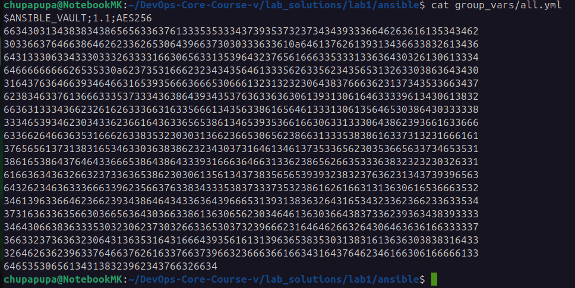

Why Ansible Vault is important: It allows safe version control of secrets by encrypting them at rest. Combined with `no_log: true` on tasks that use secrets, it prevents accidental leaks in logs and ensures credentials are not stored plaintext in the repository or CI logs.
## 5. Deployment Verification

### Deploy playbook run
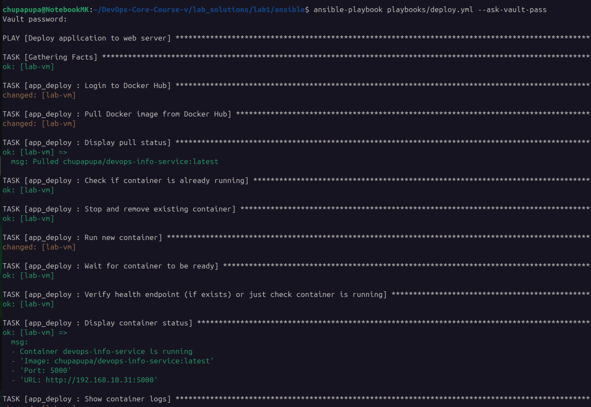
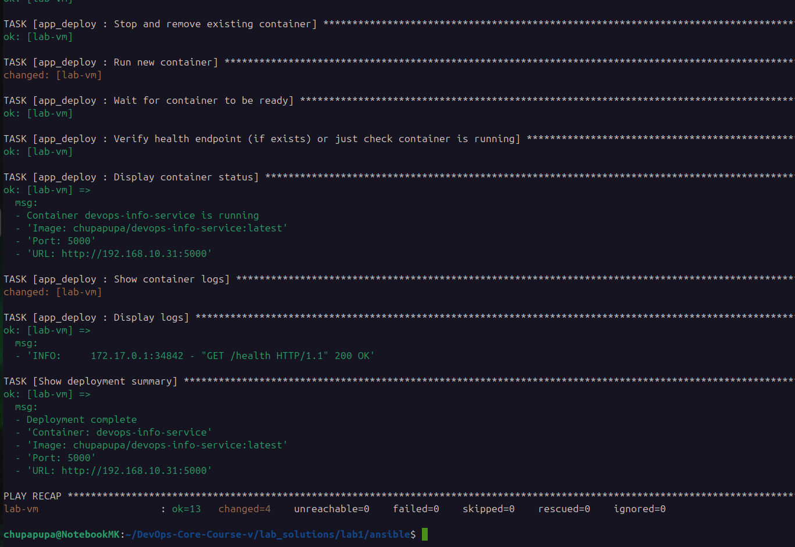

### Health check and main endpoint
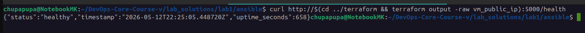
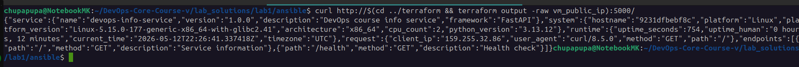

### Container status on target
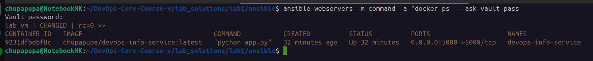

## 6. Key Decisions

- Why use roles instead of plain playbooks?
	Roles provide structure, enable reuse across projects, and separate concerns so teams can work on independent pieces (e.g., provisioning vs deployment) without conflicts.

- How do roles improve reusability?
	By encapsulating tasks, defaults, handlers, and templates into a named role, the same role can be included in multiple playbooks or projects with minimal changes.

- What makes a task idempotent?
	Using modules that declare desired state (e.g., `apt: state=present`, `service: state=started`, `docker_container: state=started`) makes Ansible check current state and only apply changes when necessary.

- How do handlers improve efficiency?
	Handlers run only when notified by a changed task, preventing repeated or unnecessary service restarts; they coalesce multiple changes into a single action.

- Why is Ansible Vault necessary?
	Vault protects secrets while keeping them version-controlled and auditable; it prevents accidental leakage of credentials into the repository or logs.
## 7. Challenges

I encountered an issue with the `requests` package raising "Not supported URL scheme http+docker". It was resolved by downgrading `requests` from `2.34` to `2.31` on both the control node and the VM.

Problem evidence:
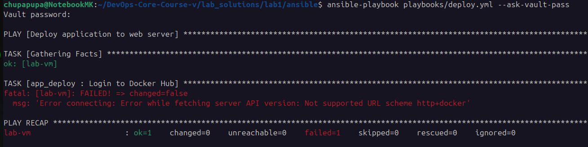

Solution evidence (first and last of the solve series):
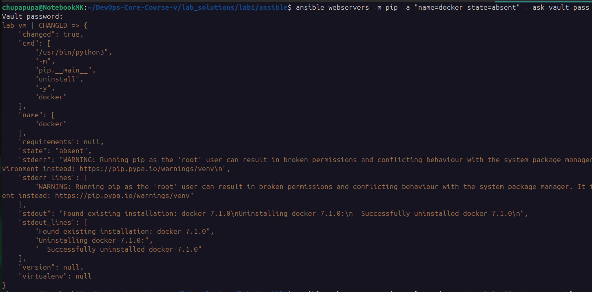
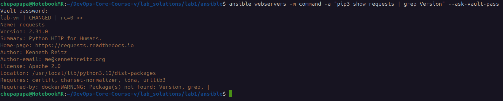
