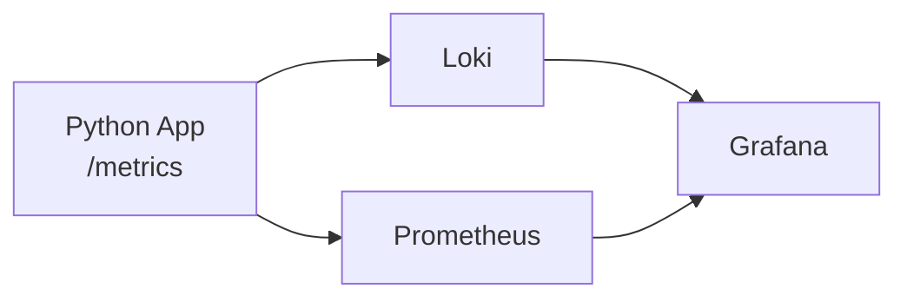

# Lab 8 — Metrics and Monitoring with Prometheus

## 1. Architecture

The monitoring stack uses a pull-based model:

- the Python app exposes `/metrics`
- Prometheus scrapes the app and built-in service targets
- Grafana visualizes the collected time-series data



### Stack Components

- Python app: application metrics and health endpoint
- Prometheus: scraping, storage, and PromQL queries
- Grafana: dashboards and visualization
- Loki + Promtail: log pipeline from Lab 7, kept alongside metrics

---

## 2. Application Instrumentation

The app was extended with Prometheus metrics in [app.py](../../app_python/app.py).

### Added metrics

- Counter: `http_requests_total`
  - labels: `method`, `endpoint`, `status`
  - used to count total requests and error responses
- Gauge: `http_requests_in_progress`
  - used to show active concurrent requests
- Histogram: `http_request_duration_seconds`
  - used to track latency distribution and p95

### Exposed endpoint

- `/metrics` returns Prometheus-formatted metrics

### Why these metrics

- **Rate**: request throughput per endpoint
- **Errors**: 5xx request rate
- **Duration**: p95 latency and latency distribution
- **Current state**: active requests in progress

### Example output

See the captured output in:

- [metrics-endpoint-output.png](./lab8-evidence/metrics-endpoint-output.png)

---

## 3. Prometheus Configuration

Prometheus configuration is in [prometheus.yml](../prometheus/prometheus.yml).

### Key settings

- scrape interval: 15s
- evaluation interval: 15s
- retention time: 15d
- retention size: 10GB

### Scrape targets

- `prometheus:9090` self-scrape
- `loki:3100`
- `grafana:3000`
- `app-python:5000/metrics`

### Why the port is 5000

The application listens on port 5000 inside the container, while Docker maps it to host port 8000. Prometheus must scrape the container port, not the host port.

### Evidence

- [prometheus-targets.png](./lab8-evidence/prometheus-targets.png)

---

## 4. Grafana Dashboard

The dashboard is provisioned from [devops-metrics-dashboard.json](../grafana/dashboards/devops-metrics-dashboard.json).

### Panels

1. Request Rate by Endpoint
2. Error Rate (5xx)
3. p95 Request Duration
4. Latency Heatmap
5. Active Requests
6. Status Code Distribution
7. App Uptime

### Dashboard purpose

This dashboard shows the RED method:

- **Rate**: request throughput
- **Errors**: 5xx errors
- **Duration**: request latency

### Evidence

- [grafana-panels.png](./lab8-evidence/grafana-panels.png)
- [dashboard-before-restart.png](./lab8-evidence/dashboard-before-restart.png)
- [dashboard-after-restart.png](./lab8-evidence/dashboard-after-restart.png)

---

## 5. PromQL Examples

### Request rate

```promql
sum by (endpoint) (rate(http_requests_total[5m]))
```

### Error rate

```promql
sum(rate(http_requests_total{status=~"5.."}[5m]))
```

### p95 latency

```promql
histogram_quantile(0.95, sum by (le) (rate(http_request_duration_seconds_bucket[5m])))
```

### Active requests

```promql
http_requests_in_progress
```

### Status code distribution

```promql
sum by (status) (rate(http_requests_total[5m]))
```

### Service uptime

```promql
up{job="app"}
```

---

## 6. Production Setup

### Health checks

The stack includes health checks for:

- Loki
- Grafana
- Prometheus
- app-python
- promtail

### Resource limits

Configured in [docker-compose.yml](../docker-compose.yml):

- Prometheus: 1 CPU, 1024 MB
- Loki: 1 CPU, 1024 MB
- Grafana: 0.5 CPU, 512 MB
- app-python: 0.5 CPU, 256 MB

### Persistence

Named volumes are used for:

- `loki-data`
- `grafana-data`
- `promtail-data`
- `prometheus-data`

### Restart behavior

Data survives `docker compose down` / `docker compose up -d` because storage is mounted into volumes, not temporary container filesystems.

### Evidence

- [all-services-healthy.png](./lab8-evidence/all-services-healthy.png)
- [all-services-healthy-after-restart.png](./lab8-evidence/all-services-healthy-after-restart.png)

---

## 7. Testing Results

### Verified checks

- `/metrics` endpoint returns Prometheus metrics
- Prometheus targets are up
- Grafana dashboard loads live data
- Services return healthy after restart
- Dashboard remains available after restart

### Evidence

- [metrics-endpoint-output.png](./lab8-evidence/metrics-endpoint-output.png)
- [prometheus-targets.png](./lab8-evidence/prometheus-targets.png)
- [dashboard-before-restart.png](./lab8-evidence/dashboard-before-restart.png)
- [dashboard-after-restart.png](./lab8-evidence/dashboard-after-restart.png)
- [all-services-healthy.png](./lab8-evidence/all-services-healthy.png)
- [all-services-healthy-after-restart.png](./lab8-evidence/all-services-healthy-after-restart.png)

---

## 8. Challenges and Solutions

### Problem: `/metrics` missing in the running container

Solution: rebuilt the app image and restarted the container so the new metrics endpoint was included.

### Problem: Grafana query parse error

Cause: the query was being entered into the wrong datasource type.

Solution: use the Prometheus datasource for PromQL queries.

### Problem: Promtail config failed to start

Cause: a merge conflict marker was left in `promtail/config.yml`.

Solution: removed the conflict marker and restarted Promtail.

### Problem: Persistence proof needed

Solution: used named volumes and verified that dashboards, targets, and logs still existed after restart.

---

## 9. Conclusion

Lab 8 completed metrics observability for the DevOps info service. Logs from Lab 7 and metrics from Lab 8 now work together as a full monitoring setup.
