# cloudflare workers edge api

lab 17 deliverable: a typescript worker deployed to the cloudflare global network, exposing http endpoints with kv persistence, plaintext vars, secrets, structured logging and a deployment history with rollback support

## deployment summary

| attribute | value |
|-----------|-------|
| worker name | `edge-api` |
| public url | `https://edge-api.<your-subdomain>.workers.dev` |
| runtime | cloudflare workers (v8 isolates) |
| language | typescript |
| compatibility date | `2026-01-01` |
| state binding | workers kv namespace `SETTINGS` |
| observability | `observability.enabled = true` in `wrangler.jsonc` |

source layout:

```
edge-api/
├── src/index.ts        # routes
├── wrangler.jsonc      # vars, kv binding, compatibility
├── package.json        # wrangler scripts
├── tsconfig.json       # workers-types globals
└── .gitignore          # excludes .dev.vars and .wrangler/
```

deployment is one command:

```bash
npx wrangler deploy
```

cloudflare immediately distributes the script to every edge location in its network - there is no per-region rollout step

## routes

all responses are json with `content-type: application/json`. one structured log line is emitted per request (path, method, colo, country)

| path | method | description | sample response |
|------|--------|-------------|-----------------|
| `/` | GET | service metadata and endpoint catalogue | `{"app":"edge-api","course":"devops-core","version":"1.0.0","framework":"cloudflare-workers","environment":"production","timestamp":"...","endpoints":["/","/health","/edge","/counter","/config"]}` |
| `/health` | GET | liveness probe | `{"status":"ok","timestamp":"..."}` |
| `/edge` | GET | edge metadata read from `request.cf` | `{"colo":"FRA","country":"DE","city":"Frankfurt","asn":13335,"httpProtocol":"HTTP/2","tlsVersion":"TLSv1.3","timestamp":"..."}` |
| `/counter` | GET | kv-backed visit counter, increments and persists `visits` | `{"key":"visits","visits":7,"stored_at":"..."}` |
| `/config` | GET | reflects vars and confirms secret + kv bindings (never returns secret values) | `{"app_name":"edge-api","course_name":"devops-core","environment":"production","api_token_set":true,"admin_email_set":true,"kv_bound":true}` |
| `*` | any | structured 404 fallback | `{"error":"not found","path":"/anything"}` (status 404) |

`request.cf` is populated only by the cloudflare edge - hitting `wrangler dev` locally returns partial or null fields, which is why end-to-end verification must use the public `workers.dev` url

## configuration

three binding types are used, each with a different trust and durability profile

| kind | declared in | example | committable | mutable at runtime |
|------|-------------|---------|-------------|--------------------|
| plaintext var | `wrangler.jsonc` `vars` | `APP_NAME`, `COURSE_NAME`, `ENVIRONMENT` | yes (visible to anyone with repo read access) | no, requires redeploy |
| secret | `wrangler secret put NAME` | `API_TOKEN`, `ADMIN_EMAIL` | no, never written to disk in the repo | independently of code, no redeploy needed |
| kv namespace | `wrangler.jsonc` `kv_namespaces` | `SETTINGS` (`env.SETTINGS.get/put`) | binding metadata yes, stored values no | yes, eventually consistent global writes |

why plaintext vars are not for secrets: values inside `wrangler.jsonc` are part of the worker bundle and the file is committed to git. anyone with repo access (or a copy of the deployed bundle metadata) can read them. secrets uploaded via `wrangler secret put` are stored encrypted on cloudflare's side and exposed to the worker only through the `env` object at runtime - they never appear in the source tree

local development uses a gitignored `.dev.vars` file for secret values so `wrangler dev` does not need real production secrets

### kv persistence proof

`/counter` reads `visits` from kv, increments it, writes it back, and returns the new value. across redeploys the counter keeps increasing because kv state is decoupled from the worker bundle - exactly the behaviour expected from a managed external store

```bash
curl $WORKER_URL/counter   # {"visits":1,...}
curl $WORKER_URL/counter   # {"visits":2,...}
npx wrangler deploy         # new code version
curl $WORKER_URL/counter   # {"visits":3,...}  - state survived the deploy
```

## evidence

all evidence below was captured against the live worker. raw screenshots live next to this file in `screenshots/`

### authentication

`wrangler whoami` confirms the cli is authenticated against the correct cloudflare account:

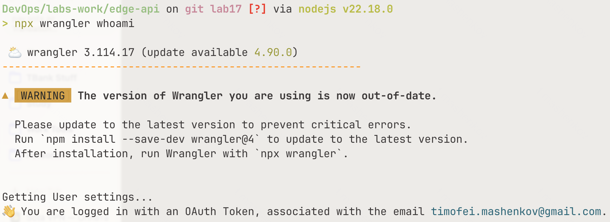

### deploy

`wrangler deploy` uploads the bundle, registers the kv binding, and prints the public `workers.dev` url:

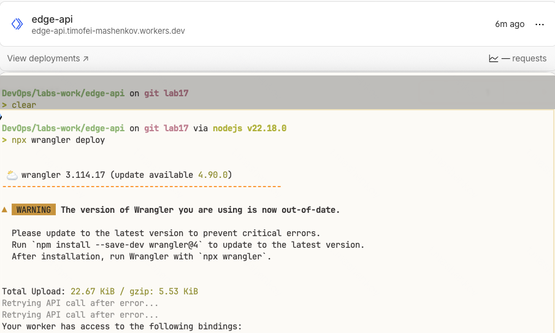

### endpoints

`/health` from the public url - smoke test that traffic reached the edge and the worker responded:

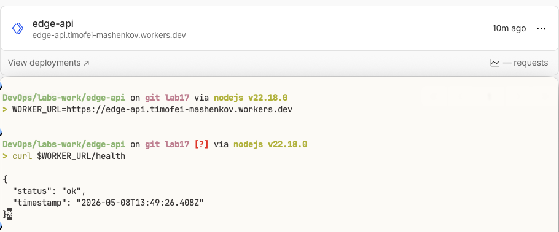

`/edge` returns real metadata from `request.cf` populated by the cloudflare pop that handled the request:

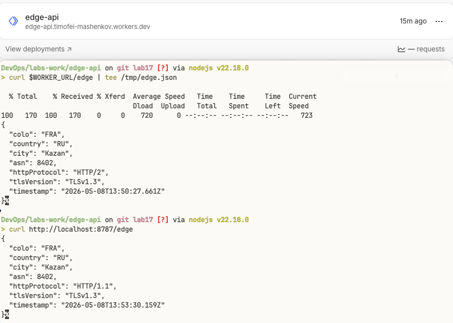

example payload shape:

```json
{
  "colo": "FRA",
  "country": "DE",
  "city": "Frankfurt",
  "asn": 13335,
  "httpProtocol": "HTTP/2",
  "tlsVersion": "TLSv1.3",
  "timestamp": "2026-05-08T12:34:56.789Z"
}
```

`/config` proves both secrets and the kv namespace are bound without ever leaking the secret values:

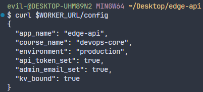

### kv persistence

`/counter` increments are persisted in workers kv. the value keeps growing across an explicit `wrangler deploy` between calls, demonstrating that state is decoupled from the worker bundle:

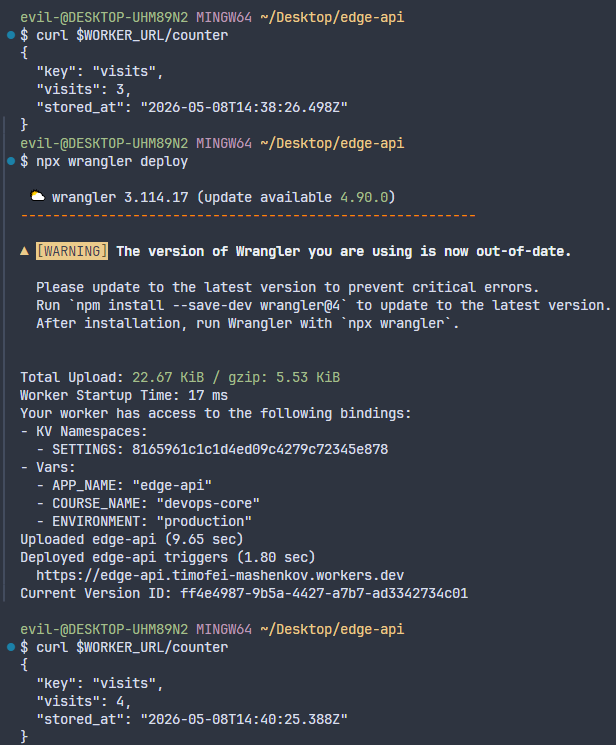

### observability

`wrangler tail` streams one structured json line per request - path, method, colo, country - which is the same shape the dashboard logs tab indexes:

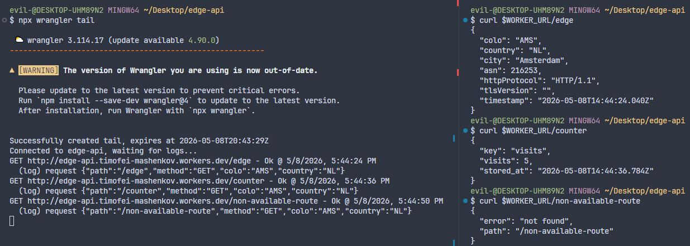

example log line:

```text
{"path":"/edge","method":"GET","colo":"FRA","country":"DE"}
```

the project-level metrics tab in the cloudflare dashboard aggregates request count, success rate, error rate, and median/p99 cpu time over the test window. it is the operator-facing equivalent of grafana for the worker:

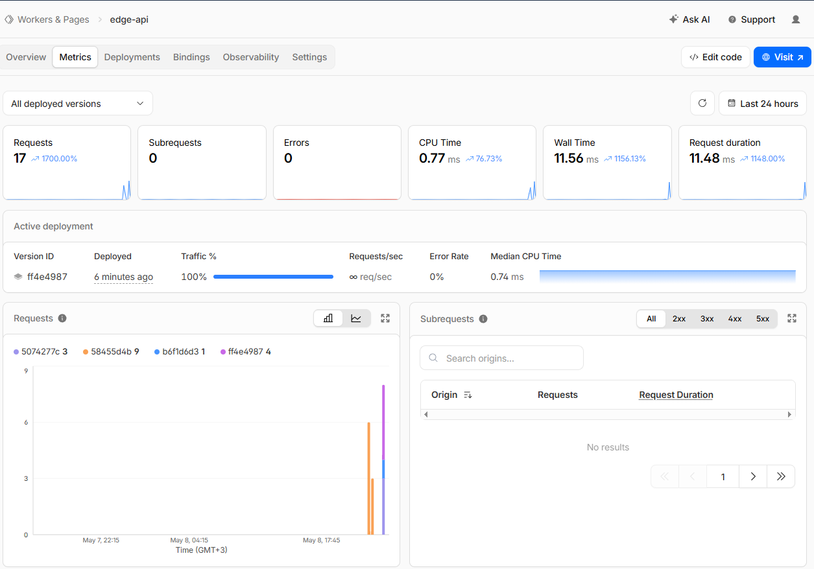

drilling into the cpu time chart specifically - the workers free plan caps each request at 10 ms cpu, and the histogram confirms every request stayed comfortably under that budget:

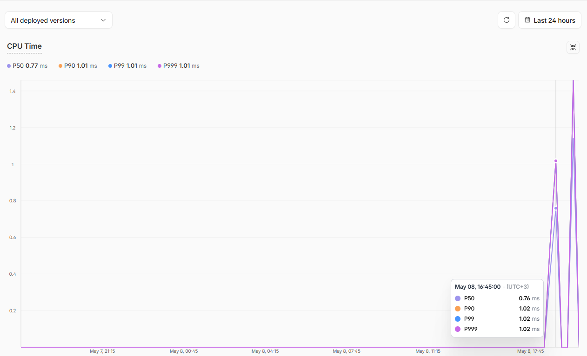

### deployments and rollback

cloudflare keeps every immutable version of the script. `wrangler deployments list` shows the history after a second deploy:

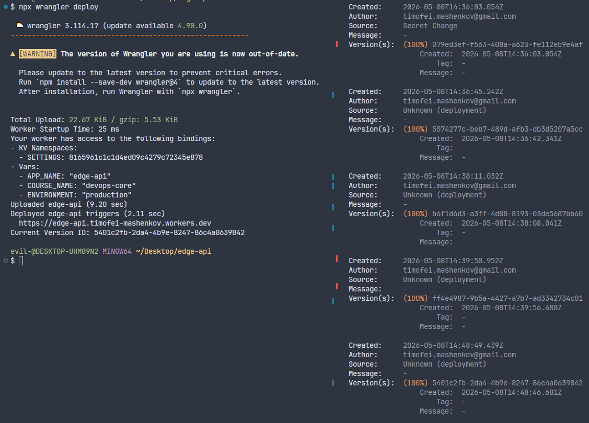

`wrangler rollback` flips active traffic to a prior version in a single command, no rebuild or re-upload needed:

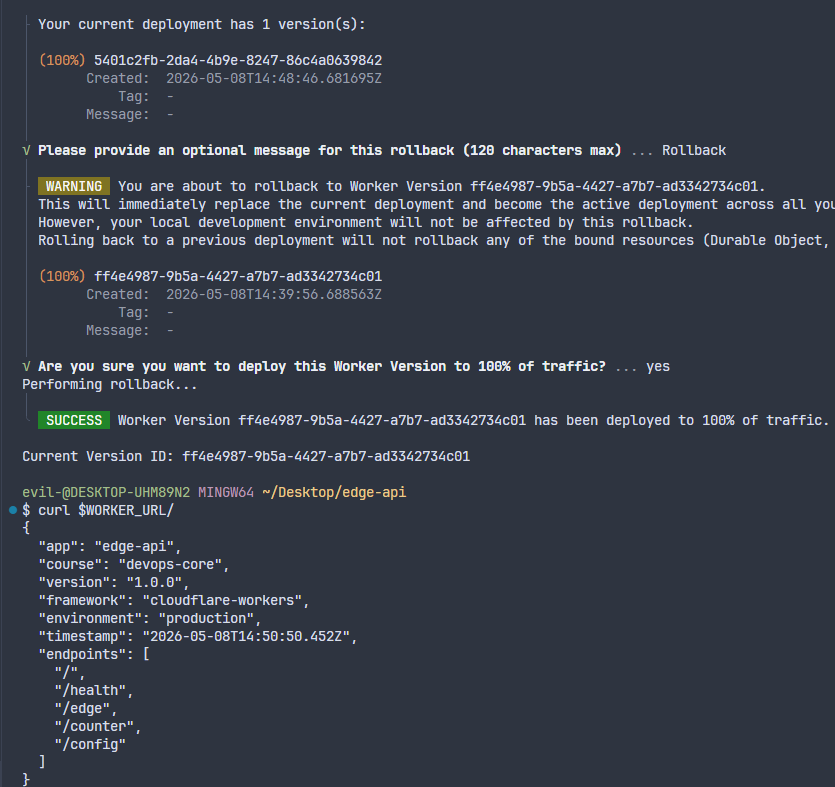

## regional connectivity

cloudflare's control plane (`api.cloudflare.com`) is partially restricted on some russian networks, which produces noisy but recoverable wrangler failures during deploy and management commands. the data plane (`*.workers.dev`) responds normally - end users in restricted networks can still curl the deployed worker, only the operator cli is affected

a real failure observed during this lab:

```text
PUT /accounts/<id>/workers/scripts/edge-api      -> ETIMEDOUT, retried, OK 200
Uploaded edge-api (26.52 sec)
Worker Startup Time: 18 ms
GET /accounts/<id>/workers/scripts/edge-api/subdomain -> ETIMEDOUT, no retry
✘ [ERROR] fetch failed
```

the script upload succeeded (the worker was live and `curl $WORKER_URL/health` returned `{"status":"ok"}`); only the follow-up call to print the public url timed out. the exit code was non-zero but the deploy was complete

### diagnosing

| symptom | meaning |
|---------|---------|
| ~20 s pause then `ETIMEDOUT` on individual requests | network path to `api.cloudflare.com` is being silently dropped, not refused |
| `PUT .../workers/scripts/<name>` returns 200 but next call times out | upload finished, only the metadata read failed - worker is deployed |
| `wrangler dev` works but `wrangler deploy` hangs | dev runs locally and only contacts cloudflare for first registration; deploy talks to the api on every call |

### mitigations applied

- **full-tunnel vpn** for all wrangler operations. split-tunnel routes node.js outside the tunnel and reproduces the failure exactly
- **idempotent retry** - `wrangler deploy` can be re-run safely; the api compares the new bundle against the deployed one and skips the upload if unchanged
- **dashboard fallback** for slow operations: kv namespace creation, secret upload, version rollback, and reading the public worker url all have ui equivalents at `dash.cloudflare.com -> workers & pages -> edge-api`
- **derive the url instead of fetching it** - the worker url is deterministic: `https://<worker-name>.<your-subdomain>.workers.dev`. when the post-deploy `GET /subdomain` call times out, the dashboard or any prior successful deploy already shows the value
- **wrangler v3 vs v4** - the failure is not version-specific; both versions hit the same api endpoints. upgrading does not fix the network path

### lessons for any restricted-network deploy

the operator-cli vs end-user split is real for any saas control plane (cloudflare, vercel, fly, render). the deploy pipeline must tolerate transient api failures even when the actual deployment succeeded - exit codes alone are not enough to tell whether the change reached production. for ci/cd on a restricted network the safe pattern is: deploy, sleep a few seconds, then probe the public url to confirm rollout, rather than trusting the cli exit code

## kubernetes vs cloudflare workers

| aspect | kubernetes | cloudflare workers |
|--------|------------|--------------------|
| setup complexity | high - cluster, networking, ingress, certs, helm, observability stack to install separately (labs 09-15) | low - account + `wrangler login`, no infra to provision |
| deployment speed | minutes - image build, push, helm/argo sync, rolling restart | seconds - `wrangler deploy` ships a new version globally |
| global distribution | manual - separate clusters per region or a multi-region service mesh | automatic - every request hits the nearest of cloudflare's ~330 pops |
| cost (small apps) | non-trivial - control plane fee + at least one node 24/7 even with no traffic | free tier covers 100k requests/day, scale-to-zero by design |
| state / persistence model | full freedom - persistent volumes, statefulsets, postgres, redis, anything | constrained - kv (eventually consistent), durable objects, d1, r2; no local disk |
| control / flexibility | unrestricted - any container image, any port, any binary, custom kernels | restricted - js/ts/wasm/python only, no fs, no listening sockets, ~30 mb bundle, cpu time caps |
| operations model | you operate it - you write probes, alerts, autoscalers, rotation policies | platform-operated - automatic scaling, dos protection, edge tls |
| best use case | long-running stateful services, internal platforms, anything needing posix or a specific runtime | latency-sensitive http apis, request-scoped logic, edge transforms, lightweight backends |

## when to use each

scenarios favouring kubernetes:

- workload needs a specific binary or runtime (databases, ml models, native daemons)
- long-lived connections, websockets at large scale, background workers, cron jobs heavier than a few seconds of cpu
- regulated environments where the cluster lives inside a vpc you fully control
- existing investment in helm charts, gitops, service mesh - the operational stack already exists
- need persistent volumes, complex networking, sidecars, or pod-level resource isolation

scenarios favouring cloudflare workers:

- a public http api that must be fast everywhere without manual region selection
- spiky or unpredictable traffic - scale-to-zero saves money, scale-to-millions needs no planning
- request-path logic that augments existing origins (auth, geo redirects, a/b tests, image transforms)
- small teams that do not want to operate clusters, certificates, autoscalers, or observability stacks
- ddos surface area - cloudflare absorbs attacks before they reach origin

recommendation: for the `devops-info-service` style apps from labs 01-16 - small, stateless, mostly read - workers wins on cost, latency, and operational overhead. the moment the service grows real persistence (postgres), background workers, or a runtime workers cannot host (a python ml model, a long-running grpc server), kubernetes becomes the right answer. in practice many teams run both: workers at the edge as a thin api, kubernetes in one or two regions for the stateful core

## reflection

what felt easier than kubernetes:

- one command (`wrangler deploy`) replaced the `helm upgrade` / `argocd sync` / wait-for-rollout loop
- global distribution arrived for free - no cluster per region, no traffic management
- secrets management is built in (`wrangler secret put`), no need for sealed-secrets or external-secrets
- observability is on by default once `observability.enabled` is set, no prometheus/grafana to install

what felt more constrained:

- only typescript, javascript, wasm or python - cannot just run an existing go binary like the `app_go` image
- no filesystem, no listening sockets, no docker - the entire mental model from labs 02-09 (containers, ports, volumes) does not apply
- state is shaped by the platform: kv is eventually consistent, has a key-size limit and write rate limits; durable objects, d1 or r2 each have their own tradeoffs
- request-scoped cpu and memory caps make heavy work (large json transforms, crypto loops) tricky on the free plan

what changed because workers is not a docker host:

- there is no `dockerfile`, no `docker build`, no image registry. the docker hub pipeline from lab 03 has nothing to push here
- helm chart from labs 10-13 is irrelevant - configuration is `vars`, `secrets`, kv bindings inside `wrangler.jsonc`, not yaml manifests
- health checks become trivial because the platform already does liveness; `/health` exists for the rubric and for downstream tooling, not because cloudflare needs it to keep the service up
- rollbacks are a platform primitive (`wrangler rollback`) instead of a `helm rollback` against a deployment - cloudflare keeps every immutable version of the script
