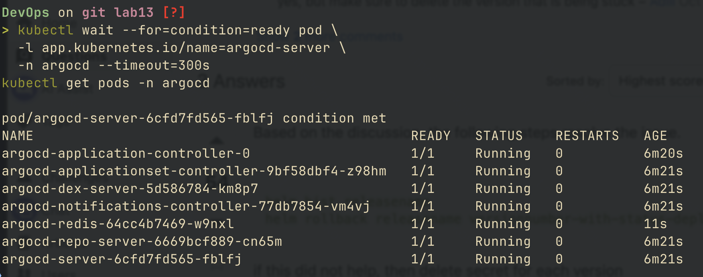
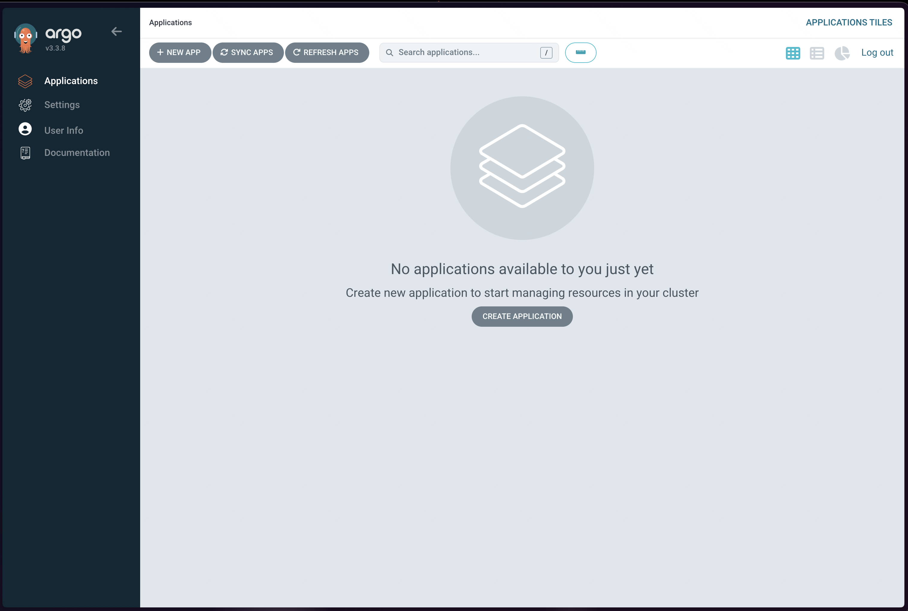
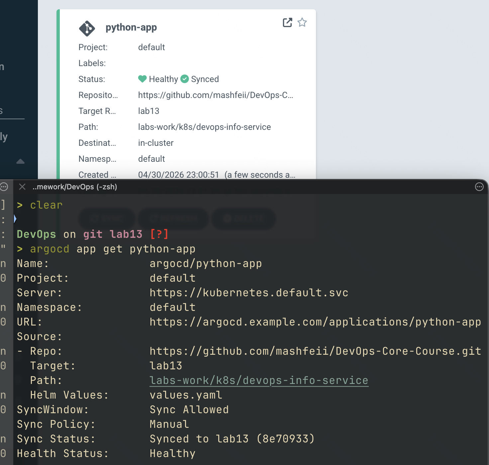
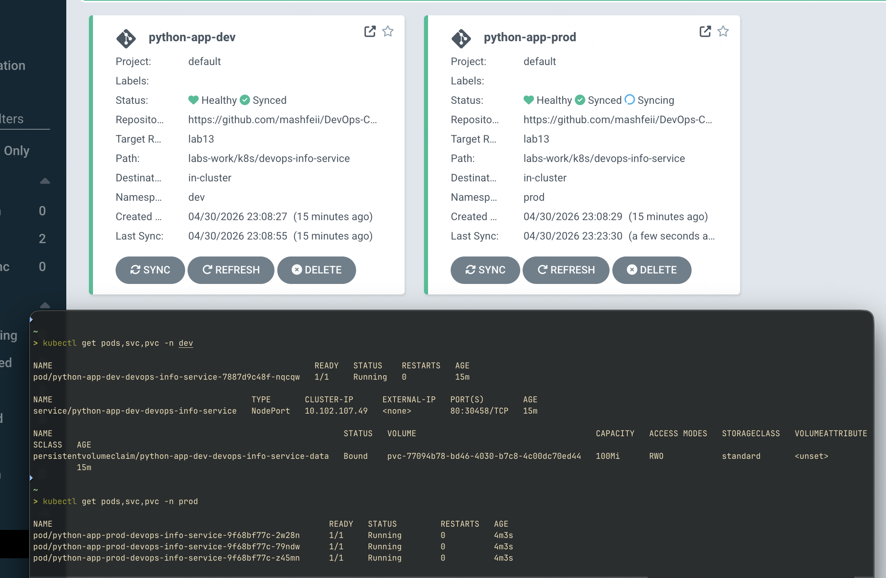
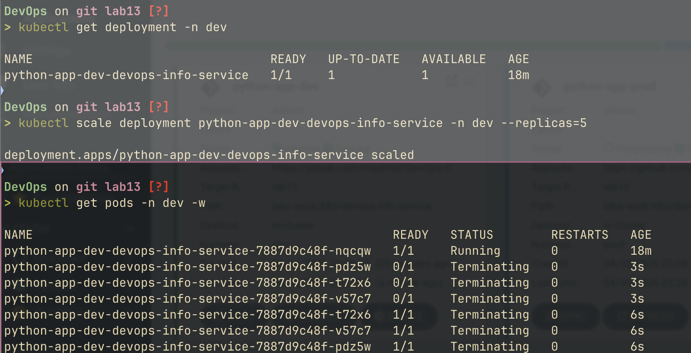
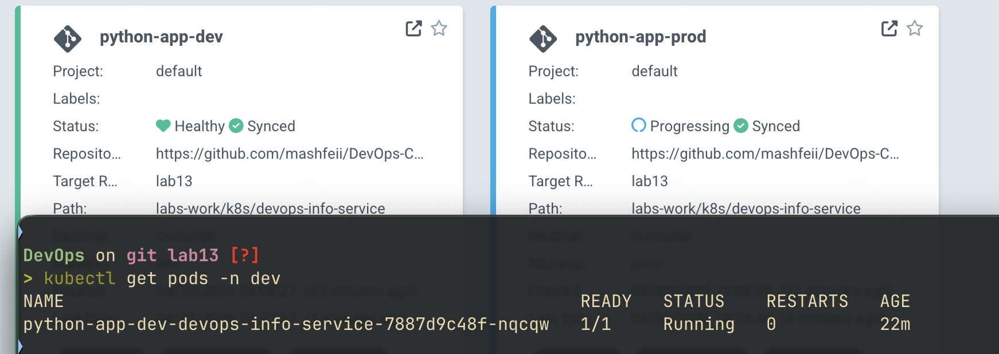
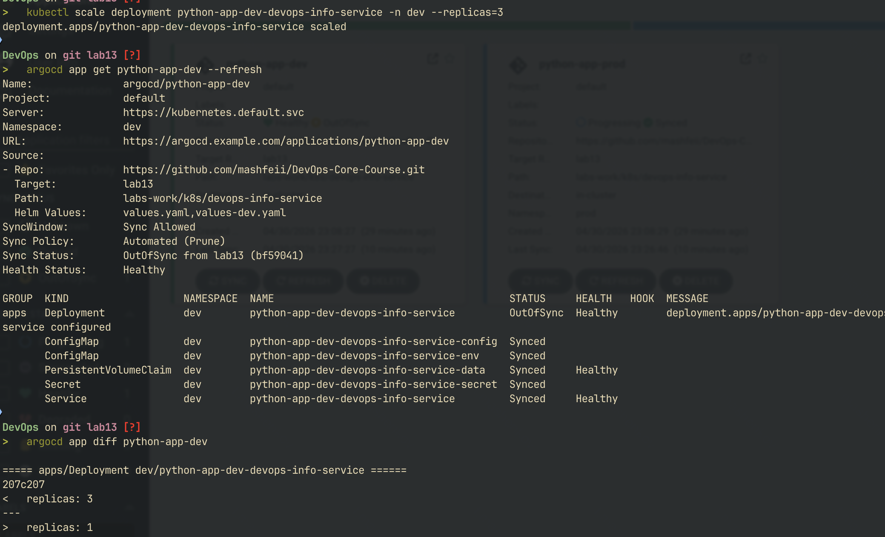
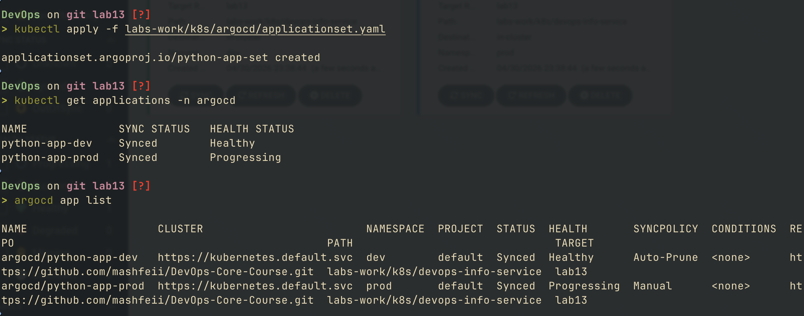

# gitops with argocd

## argocd setup

### installation via helm

```bash
helm repo add argo https://argoproj.github.io/argo-helm
helm repo update
kubectl create namespace argocd
helm install argocd argo/argo-cd --namespace argocd
kubectl wait --for=condition=ready pod \
  -l app.kubernetes.io/name=argocd-server \
  -n argocd --timeout=300s
```

verify all pods running:

```bash
kubectl get pods -n argocd
```



### ui access

```bash
kubectl port-forward svc/argocd-server -n argocd 8080:443
```

retrieve initial admin password:

```bash
kubectl -n argocd get secret argocd-initial-admin-secret \
  -o jsonpath="{.data.password}" | base64 -d
```

login at `https://localhost:8080` with username `admin`



### cli access

```bash
brew install argocd        # macos
argocd login localhost:8080 --insecure
argocd app list
```

## application configuration

### manifest structure

```yaml
apiVersion: argoproj.io/v1alpha1
kind: Application
metadata:
  name: python-app
  namespace: argocd          # always argocd, regardless of target
spec:
  project: default
  source:
    repoURL: https://github.com/mashfeii/DevOps-Core-Course.git
    targetRevision: lab13
    path: labs-work/k8s/devops-info-service
    helm:
      valueFiles:
        - values.yaml
  destination:
    server: https://kubernetes.default.svc
    namespace: default
  syncPolicy:
    syncOptions:
      - CreateNamespace=true
```

### key fields

| field | purpose |
|-------|---------|
| `source.repoURL` | git repository url where chart lives |
| `source.targetRevision` | branch, tag, or commit sha to track |
| `source.path` | path within repo to helm chart |
| `source.helm.valueFiles` | list of values files to merge (in order) |
| `destination.server` | target k8s cluster api server |
| `destination.namespace` | target namespace for resources |
| `syncPolicy.automated` | enables auto-sync if present |
| `syncOptions.CreateNamespace` | auto-creates target namespace if missing |

### sync status indicators

| status | meaning |
|--------|---------|
| synced | cluster matches git |
| outofsync | git has changes not yet applied |
| unknown | argocd cannot determine state |
| healthy | resources running as expected |
| degraded | resources exist but unhealthy |
| progressing | sync in progress |



## multi-environment deployment

### dev vs prod comparison

| aspect | dev | prod |
|--------|-----|------|
| namespace | `dev` | `prod` |
| values file | `values-dev.yaml` | `values-prod.yaml` |
| replicas | 1 | 3 |
| image tag | `latest` | `1.0.0` |
| pull policy | `Never` | `IfNotPresent` |
| service type | `NodePort` | `LoadBalancer` |
| memory request | 64Mi | 128Mi |
| memory limit | 128Mi | 256Mi |
| storage size | 100Mi | 1Gi |
| log level | `DEBUG` | `INFO` |
| sync policy | automated | manual |
| prune | enabled | disabled |
| self-heal | enabled | disabled |

### sync policy rationale

**why auto-sync for dev:**
- fast feedback loop for developers
- self-heal catches accidental cluster edits
- prune removes deleted resources automatically
- low risk environment - changes are expected to be frequent

**why manual sync for prod:**
- change review before deployment
- controlled release timing (maintenance windows)
- compliance and audit requirements
- prevents accidental drift propagation
- allows pre-deployment validation steps

> note: prod uses `service.type: LoadBalancer`. argocd considers a loadbalancer Service `Progressing` until an external ip is assigned. on minikube this requires `minikube tunnel` running, otherwise the application stays Progressing despite all pods being Healthy

### namespace separation

both apps share the same chart but deploy into isolated namespaces:

```bash
kubectl get pods -n dev
kubectl get pods -n prod
```



## self-healing & sync behavior

### kubernetes vs argocd self-healing

| behavior | kubernetes | argocd |
|----------|------------|--------|
| trigger | pod failure, node failure | drift between git and cluster |
| scope | replica count, pod liveness | full resource spec |
| mechanism | replicaset controller | argocd application controller |
| example | killed pod respawns | manual `kubectl scale` reverted |
| config source | deployment spec in cluster | git repository |

### self-heal test (dev environment)

manually scale to break desired state:

```bash
kubectl scale deployment python-app-dev-devops-info-service -n dev --replicas=5
kubectl get pods -n dev -w
```

argocd detects drift via the kubernetes watch api and reverts within seconds — the 3-minute interval is the fallback poll for missed events, not the typical reaction time





### pod deletion test

```bash
kubectl delete pod -n dev -l app.kubernetes.io/name=devops-info-service
kubectl get pods -n dev -w
```

pod is recreated almost instantly - this is **kubernetes** behavior (replicaset), not argocd. argocd is unaware because the deployment spec did not change

### configuration drift test

mutate a managed field (replicas) to force a visible diff. selfHeal is paused first so the diff persists long enough to capture:

```bash
argocd app set python-app-dev --self-heal=false
kubectl scale deployment python-app-dev-devops-info-service -n dev --replicas=3
argocd app get python-app-dev --refresh
argocd app diff python-app-dev
```

re-enable self-heal and verify reversion:

```bash
argocd app set python-app-dev --self-heal=true
kubectl get deployment -n dev
```

> note: ad-hoc labels added via `kubectl label` may be filtered out of `argocd app diff` because they are not present in the rendered chart. mutating a chart-managed field (replicas, image, env) produces a reliable diff



### sync interval

| trigger | timing |
|---------|--------|
| manual sync | immediate (cli/ui) |
| scheduled refresh | every 3 minutes (default) |
| webhook | immediate (if configured) |
| application controller restart | full resync |

## bonus: applicationset

### list generator with conditional sync

`applicationset.yaml` consolidates dev and prod into a single declarative manifest. uses `goTemplate: true` and `templatePatch` to apply env-specific overrides after template rendering:

```yaml
apiVersion: argoproj.io/v1alpha1
kind: ApplicationSet
spec:
  goTemplate: true
  generators:
    - list:
        elements:
          - env: dev
            autoSync: true
          - env: prod
            autoSync: false
  template:
    spec:
      syncPolicy:
        syncOptions:
          - CreateNamespace=true
  templatePatch: |
    {{- if .autoSync }}
    spec:
      syncPolicy:
        automated:
          prune: true
          selfHeal: true
    {{- end }}
```

`templatePatch` is processed as a go template string after the main template renders. it cannot be expressed inside structured yaml because go template `if` blocks may produce missing/extra keys, which is invalid yaml at the structural level

### generator types

| generator | use case |
|-----------|----------|
| list | explicit elements with parameters |
| cluster | replicate across registered clusters |
| git (files) | one app per file matching glob |
| git (directories) | one app per directory matching glob |
| matrix | combine two generators (cartesian product) |
| merge | merge generators by key |
| pull request | one app per github/gitlab pr |

### advantages over individual applications

| aspect | individual apps | applicationset |
|--------|----------------|----------------|
| files | one per environment | single manifest |
| consistency | manual sync required | template enforces structure |
| scaling | n files for n envs | n list elements |
| changes | edit each file | edit template once |
| dynamic discovery | impossible | git directory generator |

### when to use which

- **individual applications**: 2-3 apps with very different specs
- **applicationset**: 4+ apps with similar specs, multi-cluster, or auto-discovery


