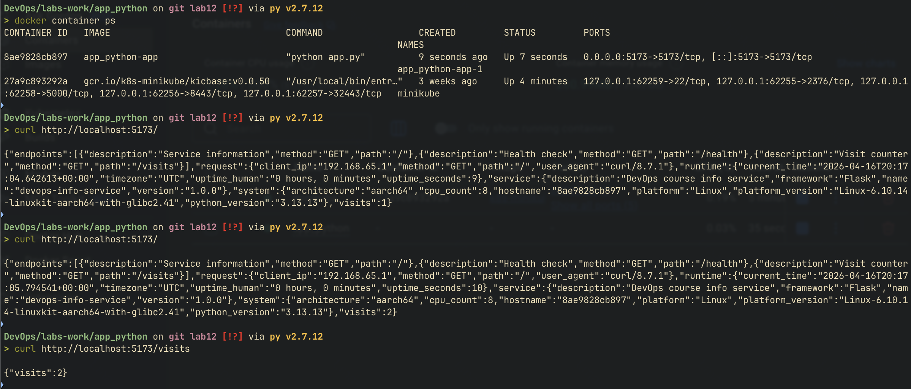
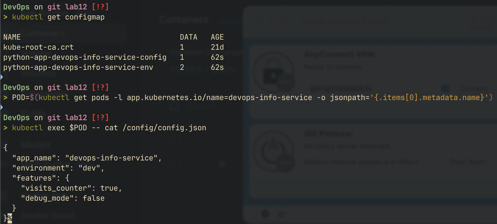
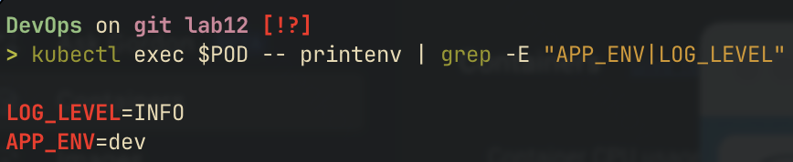
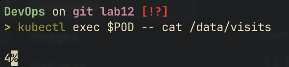
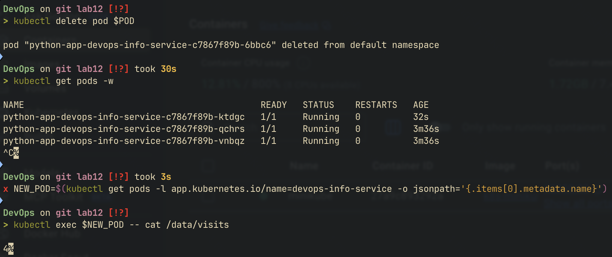
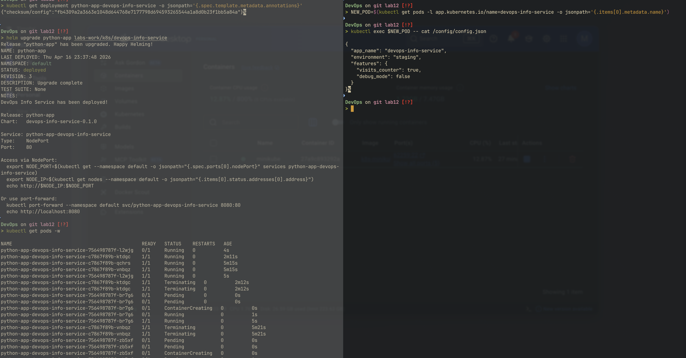

# configmaps & persistent volumes

## application changes

### visits counter

the python app now tracks page visits via a file-based counter:

- `DATA_DIR` env var controls storage location (default: `/data`)
- counter increments on each `GET /` request
- counter value persists in `{DATA_DIR}/visits` as plain text integer
- thread-safe via `threading.Lock`

### new endpoint

**GET /visits**

```json
{"visits": 42}
```

the root endpoint also includes the visits count in its response:

```json
{
  "service": { ... },
  "visits": 42
}
```

### local testing with docker compose

```yaml
services:
  app:
    build: .
    ports:
      - "5173:5173"
    environment:
      - DATA_DIR=/data
    volumes:
      - app-data:/data

volumes:
  app-data:
```



## configmap implementation

### chart structure

```
devops-info-service/
├── files/
│   └── config.json           # application config file
├── templates/
│   ├── configmap.yaml        # configmap from file
│   ├── configmap-env.yaml    # configmap for env vars
│   ├── pvc.yaml              # persistent volume claim
│   └── ...
└── values.yaml
```

### config.json

```json
{
  "app_name": "devops-info-service",
  "environment": "dev",
  "features": {
    "visits_counter": true,
    "debug_mode": false
  }
}
```

### configmap from file

`templates/configmap.yaml` loads the file using `.Files.Get`:

```yaml
apiVersion: v1
kind: ConfigMap
metadata:
  name: {{ include "devops-info-service.fullname" . }}-config
data:
  config.json: |-
{{ .Files.Get "files/config.json" | indent 4 }}
```

mounted as a volume in the deployment:

```yaml
volumeMounts:
  - name: config-volume
    mountPath: /config
volumes:
  - name: config-volume
    configMap:
      name: {{ include "devops-info-service.fullname" . }}-config
```

verification:

```bash
kubectl exec <pod> -- cat /config/config.json
```



### configmap for environment variables

`templates/configmap-env.yaml` provides key-value pairs:

```yaml
apiVersion: v1
kind: ConfigMap
metadata:
  name: {{ include "devops-info-service.fullname" . }}-env
data:
  APP_ENV: {{ .Values.environment | quote }}
  LOG_LEVEL: {{ .Values.logLevel | quote }}
```

injected via `envFrom` in the deployment:

```yaml
envFrom:
  - configMapRef:
      name: {{ include "devops-info-service.fullname" . }}-env
```

verification:

```bash
kubectl exec <pod> -- printenv | grep -E "APP_ENV|LOG_LEVEL"
```



## persistent volume

### pvc configuration

```yaml
{{- if .Values.persistence.enabled }}
apiVersion: v1
kind: PersistentVolumeClaim
metadata:
  name: {{ include "devops-info-service.fullname" . }}-data
spec:
  accessModes:
    - ReadWriteOnce
  resources:
    requests:
      storage: {{ .Values.persistence.size }}
  {{- if .Values.persistence.storageClass }}
  storageClassName: {{ .Values.persistence.storageClass }}
  {{- end }}
{{- end }}
```

values:

```yaml
persistence:
  enabled: true
  size: 100Mi
  storageClass: ""    # uses cluster default
```

### access modes

| mode | description | use case |
|------|-------------|----------|
| ReadWriteOnce (RWO) | single node read/write | single-replica apps, databases |
| ReadOnlyMany (ROX) | multi-node read-only | shared config, static assets |
| ReadWriteMany (RWX) | multi-node read/write | shared storage (requires NFS/CephFS) |

RWO is used here because the visits counter is a single-writer workload. on minikube (single node), RWO works with any replica count since all pods run on the same node

### storage class

- empty string uses the cluster default (minikube provides `standard` backed by hostPath)
- configurable via `persistence.storageClass` in values
- production clusters typically offer options like `gp3` (AWS), `pd-ssd` (GCP), `managed-premium` (Azure)

### volume mount

```yaml
volumeMounts:
  - name: data-volume
    mountPath: /data
volumes:
  - name: data-volume
    persistentVolumeClaim:
      claimName: {{ include "devops-info-service.fullname" . }}-data
```

### persistence test

1. deploy and access root endpoint multiple times
2. check counter: `kubectl exec <pod> -- cat /data/visits`
3. delete the pod: `kubectl delete pod <pod-name>`
4. wait for replacement: `kubectl get pods -w`
5. verify counter is preserved: `kubectl exec <new-pod> -- cat /data/visits`





## configmap vs secret

| aspect | configmap | secret |
|--------|-----------|--------|
| purpose | non-sensitive configuration | sensitive data (passwords, tokens) |
| encoding | plain text | base64 encoded |
| size limit | 1 MiB | 1 MiB |
| encryption at rest | no | optional (etcd encryption) |
| mount as file | yes | yes |
| mount as env var | yes | yes |
| rbac | standard | can be restricted separately |
| examples | app config, feature flags, log level | db passwords, api keys, tls certs |

### when to use configmap

- application configuration files (json, yaml, properties)
- environment-specific settings (dev/staging/prod)
- feature flags and toggles
- log levels and non-sensitive runtime parameters

### when to use secret

- database credentials
- api keys and tokens
- tls certificates
- any value that should not appear in logs or git

## bonus: configmap hot reload

### checksum annotation pattern

the deployment includes a checksum annotation that triggers pod restart on configmap changes:

```yaml
annotations:
  checksum/config: {{ include (print $.Template.BasePath "/configmap.yaml") . | sha256sum }}
```

when `helm upgrade` detects a new configmap checksum, the deployment spec changes, causing kubernetes to perform a rolling restart

### default update behavior

- mounted configmaps (directory mount) are updated automatically by kubelet
- default sync period: ~60 seconds + cache TTL
- total delay: up to 1-2 minutes before changes appear in the pod
- this is eventual consistency, not immediate

### subpath limitation

| mount type | auto-updates | use case |
|------------|-------------|----------|
| directory mount | yes | mount entire configmap as directory |
| subPath mount | **no** | mount single file into existing directory |

subPath creates a copy of the file at mount time rather than a symlink. the kubelet sync mechanism only updates symlinked mounts. avoid subPath when automatic config updates are needed

### reload approaches

| approach | how it works | complexity |
|----------|-------------|------------|
| checksum annotation | pod restart on helm upgrade | low (implemented) |
| stakater/reloader | controller watches configmaps, restarts pods | medium |
| file watching | app watches config file for changes | high |
| sighup handler | app reloads config on signal | medium |

the checksum annotation approach is implemented in this chart as it requires no additional dependencies and works with standard helm upgrade workflow


