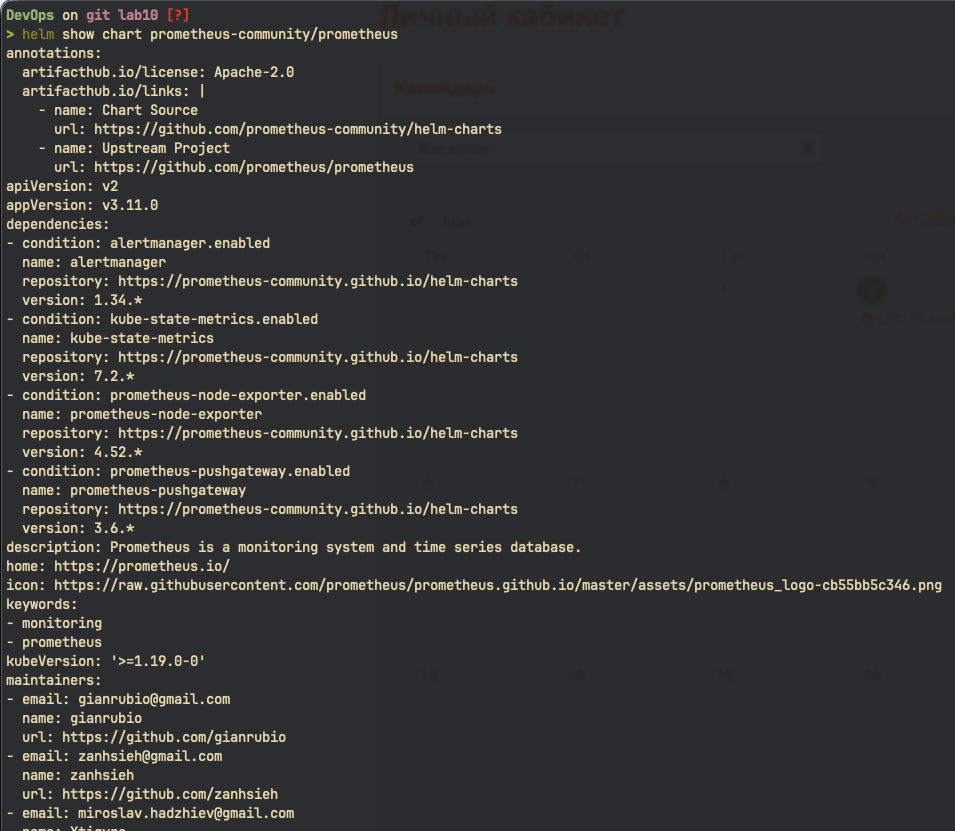
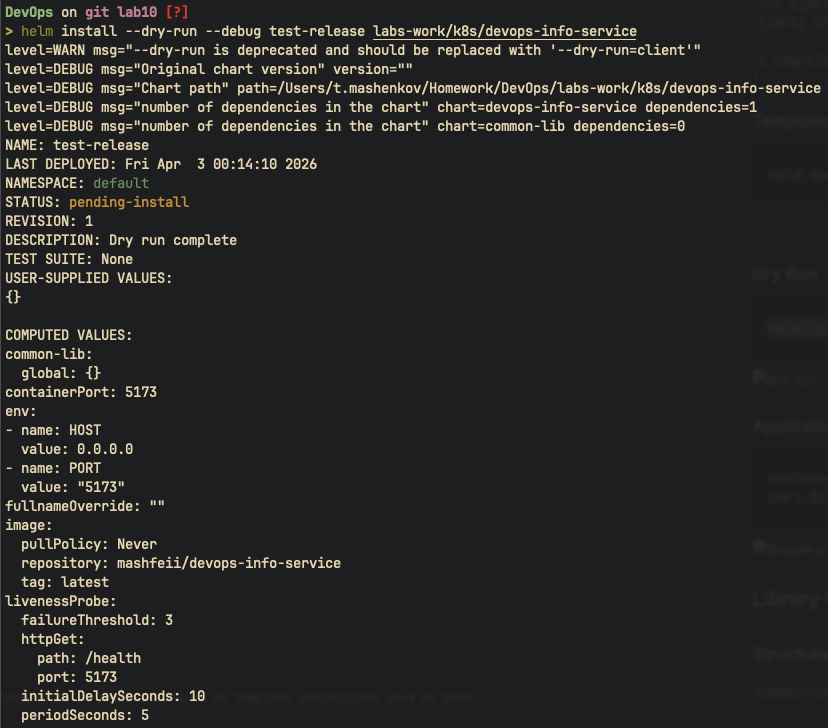
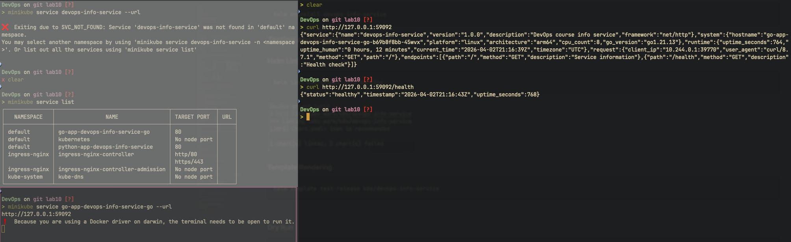
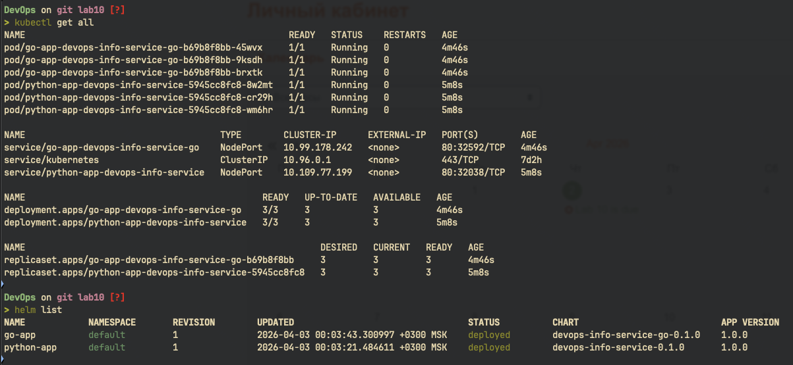

# Helm Chart Documentation

## Helm Setup

### Installation

```bash
brew install helm
helm version
```


### Exploring Public Charts

```bash
helm repo add prometheus-community https://prometheus-community.github.io/helm-charts
helm repo update
helm search repo prometheus
helm show chart prometheus-community/prometheus
```



### Why Helm

- **Templating** - reuse manifests across environments with different values instead of duplicating YAML
- **Versioning** - track releases with rollback support via `helm rollback`
- **Dependencies** - manage multi-service applications as linked charts
- **Hooks** - run tasks (DB migrations, smoke tests) at specific lifecycle points
- **Standardization** - industry-standard packaging used by ArgoCD, Flux, and public chart repositories

## Chart Overview

### Directory Structure

```
k8s/
├── devops-info-service/            # Python app Helm chart
│   ├── Chart.yaml                  # Chart metadata (v0.1.0, depends on common-lib)
│   ├── values.yaml                 # Default values (3 replicas, NodePort, port 5173)
│   ├── values-dev.yaml             # Dev overrides (1 replica, relaxed resources)
│   ├── values-prod.yaml            # Prod overrides (3 replicas, LoadBalancer)
│   ├── .helmignore
│   └── templates/
│       ├── _helpers.tpl            # Wrappers around common-lib templates
│       ├── deployment.yaml         # Templatized Deployment
│       ├── service.yaml            # Templatized Service
│       ├── NOTES.txt               # Post-install instructions
│       └── hooks/
│           ├── pre-install-job.yaml
│           └── post-install-job.yaml
├── devops-info-service-go/         # Go app Helm chart (bonus)
│   └── (same structure as Python chart)
└── common-lib/                     # Shared library chart (bonus)
    ├── Chart.yaml                  # type: library
    └── templates/
        ├── _names.tpl              # common.name, common.fullname, common.chart
        └── _labels.tpl             # common.labels, common.selectorLabels
```

### Values Organization

Values are structured by concern: `image.*` for container image config, `service.*` for Service spec, `resources` for Pod resource limits, and top-level `livenessProbe`/`readinessProbe` blocks for health checks. Environment-specific files (`values-dev.yaml`, `values-prod.yaml`) only override what differs from defaults.

## Configuration Guide

### Key Values

| Value                                | Default                        | Description                            |
| ------------------------------------ | ------------------------------ | -------------------------------------- |
| `replicaCount`                       | 3                              | Number of Pod replicas                 |
| `image.repository`                   | `mashfeii/devops-info-service` | Container image repository             |
| `image.tag`                          | `latest`                       | Image tag (falls back to `appVersion`) |
| `image.pullPolicy`                   | `Never`                        | Image pull policy (Never for minikube) |
| `containerPort`                      | 5173                           | Container listening port               |
| `service.type`                       | `NodePort`                     | Kubernetes Service type                |
| `service.port`                       | 80                             | Service external port                  |
| `service.targetPort`                 | 5173                           | Service target container port          |
| `resources.requests.memory`          | 64Mi                           | Memory request                         |
| `resources.limits.memory`            | 128Mi                          | Memory limit                           |
| `livenessProbe.initialDelaySeconds`  | 10                             | Liveness probe initial delay           |
| `readinessProbe.initialDelaySeconds` | 5                              | Readiness probe initial delay          |

### Environment Customization

| Parameter                           | Dev      | Prod         |
| ----------------------------------- | -------- | ------------ |
| `replicaCount`                      | 1        | 3            |
| `image.tag`                         | latest   | 1.0.0        |
| `image.pullPolicy`                  | Never    | IfNotPresent |
| `resources.limits.memory`           | 128Mi    | 256Mi        |
| `resources.limits.cpu`              | 100m     | 200m         |
| `service.type`                      | NodePort | LoadBalancer |
| `livenessProbe.initialDelaySeconds` | 5        | 15           |

### Example Installations

```bash
# Development
helm install myapp-dev k8s/devops-info-service -f k8s/devops-info-service/values-dev.yaml

# Production
helm install myapp-prod k8s/devops-info-service -f k8s/devops-info-service/values-prod.yaml

# Override specific value
helm install myapp k8s/devops-info-service --set replicaCount=5
```

## Hook Implementation

### Pre-install Hook

- **Purpose:** Validation job that runs before application resources are created
- **Annotation:** `helm.sh/hook: pre-install`
- **Weight:** `-5` (runs first among hooks)
- **Deletion policy:** `hook-succeeded` - Job is automatically cleaned up after successful completion
- **Container:** busybox, simulates prerequisite validation

### Post-install Hook

- **Purpose:** Smoke test job that runs after all resources are installed
- **Annotation:** `helm.sh/hook: post-install`
- **Weight:** `5` (runs after pre-install)
- **Deletion policy:** `hook-succeeded` - cleaned up automatically on success
- **Container:** busybox, simulates deployment verification

### Execution Order

1. Pre-install job (weight -5) runs and completes
2. Main resources (Deployment, Service) are created
3. Post-install job (weight 5) runs and completes
4. Both hook Jobs are deleted per `hook-succeeded` policy

## Installation Evidence

### Helm List and Deployed Resources


### Hook Execution


### Dev vs Prod Deployments


## Operations

### Install

```bash
helm dependency update k8s/devops-info-service
helm install devops-info-service k8s/devops-info-service -f k8s/devops-info-service/values-dev.yaml
```

### Upgrade

```bash
helm upgrade devops-info-service k8s/devops-info-service -f k8s/devops-info-service/values-prod.yaml
```

### Rollback

```bash
helm history devops-info-service
helm rollback devops-info-service 1
```

### Uninstall

```bash
helm uninstall devops-info-service
```

## Testing and Validation

### Helm Lint

```bash
helm lint k8s/devops-info-service
```


### Template Rendering

```bash
helm template test-release k8s/devops-info-service
```


### Dry Run

```bash
helm install --dry-run --debug test-release k8s/devops-info-service
```



### Application Access

```bash
minikube service devops-info-service --url
curl $(minikube service devops-info-service --url)/health
```



## Library Chart (Bonus)

### Structure

`common-lib` is a library chart (`type: library` in Chart.yaml) that cannot be installed standalone. It provides shared Go template definitions used by both application charts.

### Shared Templates

| Template                | Purpose                                                                 |
| ----------------------- | ----------------------------------------------------------------------- |
| `common.name`           | Chart name, truncated to 63 chars                                       |
| `common.fullname`       | `<release>-<chart>`, truncated to 63 chars                              |
| `common.chart`          | `<name>-<version>` for the chart label                                  |
| `common.labels`         | Standard Kubernetes labels (chart, name, instance, version, managed-by) |
| `common.selectorLabels` | Subset for `matchLabels` (name, instance)                               |

### How Both Apps Use the Library

Each app chart declares common-lib as a dependency in `Chart.yaml`:

```yaml
dependencies:
  - name: common-lib
    version: 0.1.0
    repository: 'file://../common-lib'
```

Each app's `_helpers.tpl` wraps library templates with chart-specific names:

```yaml
{{- define "devops-info-service.fullname" -}}
{{- include "common.fullname" . -}}
{{- end }}
```

This way deployment/service templates reference chart-specific names (`devops-info-service.fullname`) while the actual logic lives in the shared library.

### Benefits

- **DRY** - label/name logic defined once, used everywhere
- **Consistency** - all charts produce identical label structures
- **Maintainability** - fix or extend naming logic in one place

### Deployment Evidence



