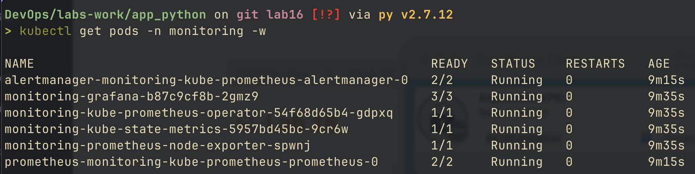
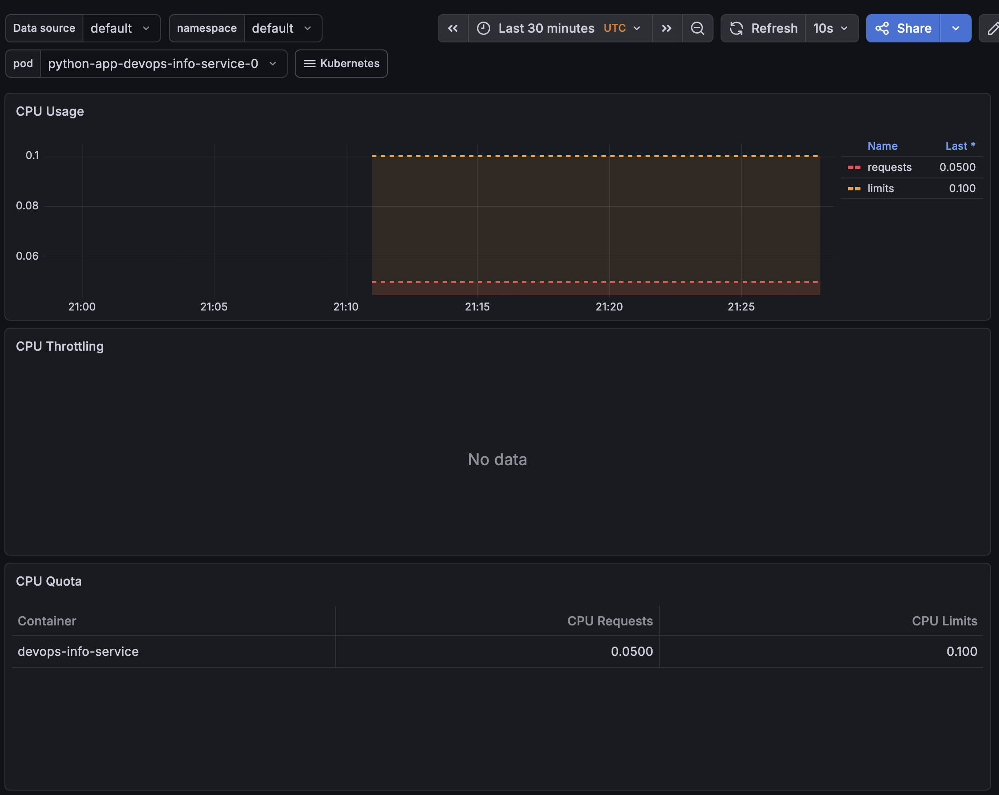
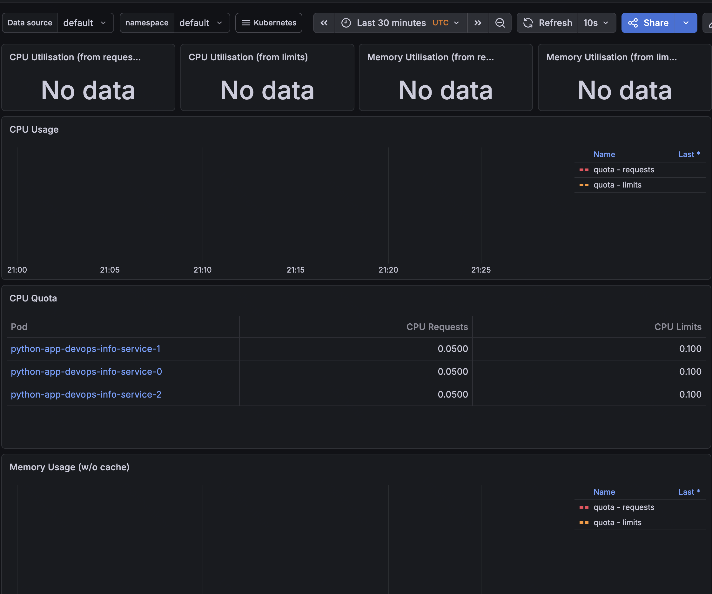
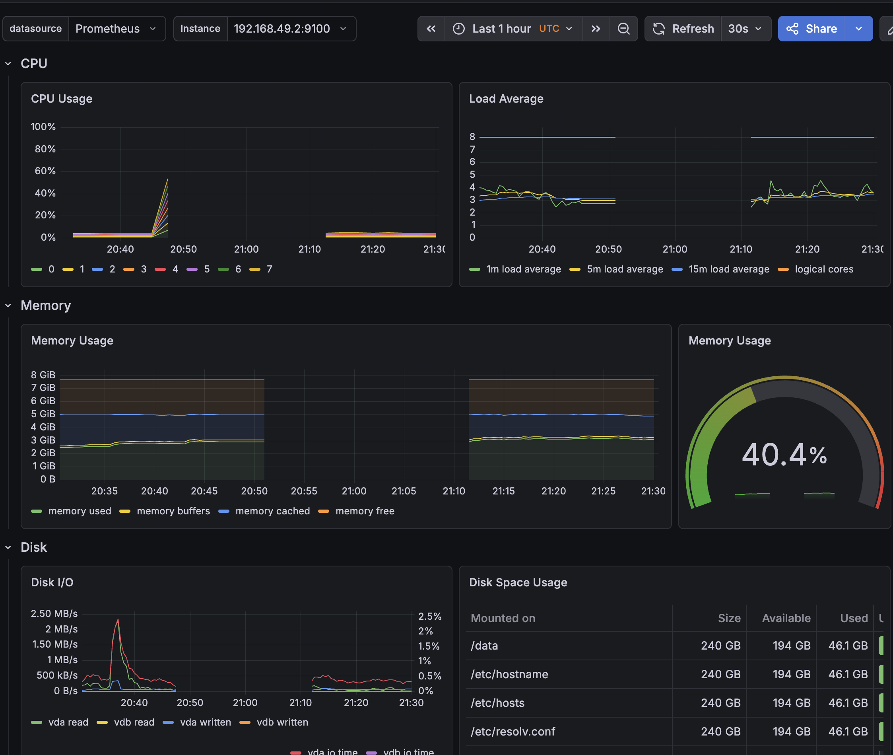
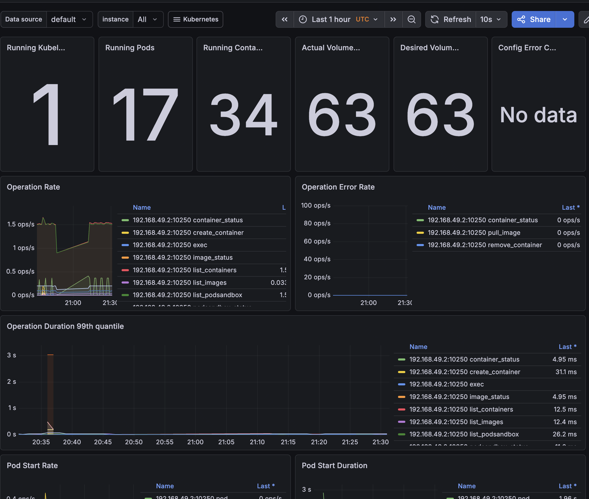
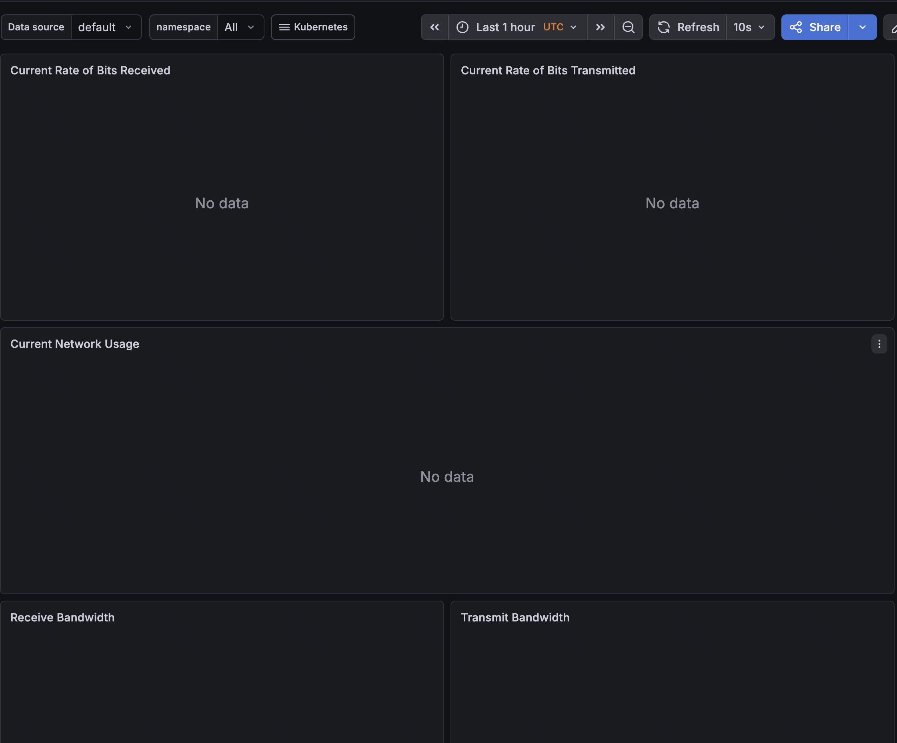
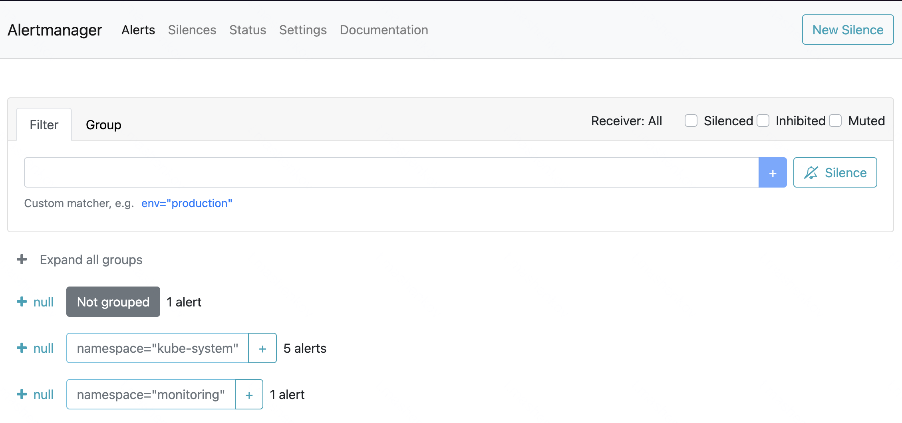
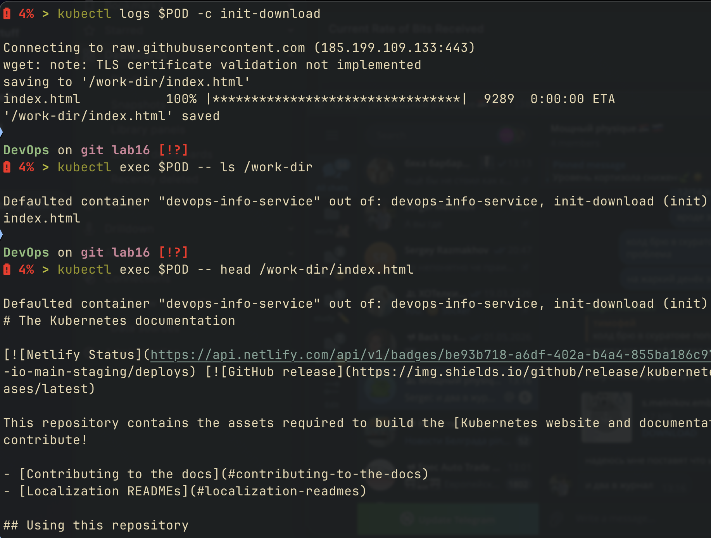
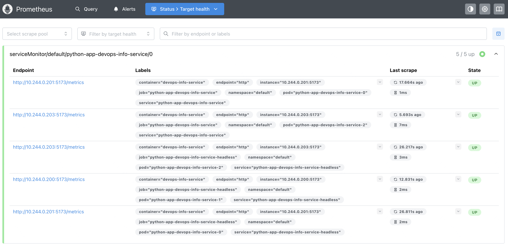
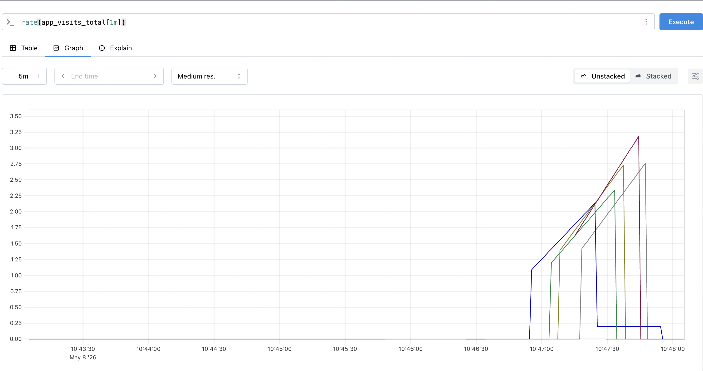

# kubernetes monitoring & init containers

## stack components

the kube-prometheus-stack bundles a complete observability stack as a single helm chart:

| component | role |
|-----------|------|
| prometheus-operator | manages Prometheus, Alertmanager, ServiceMonitor and PodMonitor CRDs declaratively |
| prometheus | time-series database that scrapes targets and stores metrics |
| alertmanager | receives alerts from Prometheus, deduplicates, groups, and routes to receivers (slack, email, webhook) |
| grafana | visualization layer with pre-built dashboards for kubernetes |
| kube-state-metrics | exposes cluster state (deployments, pods, nodes) as Prometheus metrics |
| node-exporter | runs on each node, exposes host-level metrics (cpu, memory, disk, network) |

prometheus-operator is the brain - the other components are kubernetes resources it manages

## installation

```bash
helm repo add prometheus-community https://prometheus-community.github.io/helm-charts
helm repo update
helm install monitoring prometheus-community/kube-prometheus-stack \
  --namespace monitoring \
  --create-namespace
```

verify all pods are running:

```bash
kubectl get pods -n monitoring
```

expected: ~10 pods including `monitoring-grafana`, `prometheus-monitoring-kube-prometheus-prometheus-0`, `alertmanager-monitoring-kube-prometheus-alertmanager-0`, `monitoring-kube-state-metrics`, multiple `monitoring-prometheus-node-exporter` daemonsets



## accessing the ui

| ui | port-forward command | default credentials |
|----|----------------------|---------------------|
| grafana | `kubectl port-forward svc/monitoring-grafana -n monitoring 3000:80` | admin / prom-operator |
| prometheus | `kubectl port-forward svc/monitoring-kube-prometheus-prometheus -n monitoring 9090:9090` | none |
| alertmanager | `kubectl port-forward svc/monitoring-kube-prometheus-alertmanager -n monitoring 9093:9093` | none |

## dashboard answers

> note: some panels show `no data` on minikube. this is a known limitation of the docker driver — cAdvisor does not consistently surface `container_cpu_usage_seconds_total` and `container_network_*` metrics for low-utilization pods. quota panels (which read from kube-state-metrics) and node exporter panels (which read from the host) are reliable and used for the answers below

### question 1: pod resources (cpu/memory of statefulset)

dashboard: `Kubernetes / Compute Resources / Pod`

filtered to namespace `default`, pod `python-app-devops-info-service-0`:

| metric | value |
|--------|-------|
| cpu requests | 0.05 cores (50m) |
| cpu limits | 0.10 cores (100m) |
| memory requests | 64 MiB |
| memory limits | 128 MiB |
| cpu throttling | none observed |
| actual cpu/memory usage | minimal — flask app is idle, real-time usage charts blank on minikube |

the requests/limits dashed lines on the cpu graph confirm the chart's resource configuration is in effect



### question 2: namespace analysis (top/bottom cpu in default)

dashboard: `Kubernetes / Compute Resources / Namespace (Pods)`, namespace = `default`

all three statefulset pods come from the same template, so they share identical resource settings:

| pod | cpu requests | cpu limits | memory requests | memory limits |
|-----|--------------|------------|-----------------|---------------|
| python-app-devops-info-service-0 | 0.05 | 0.10 | 64 MiB | 128 MiB |
| python-app-devops-info-service-1 | 0.05 | 0.10 | 64 MiB | 128 MiB |
| python-app-devops-info-service-2 | 0.05 | 0.10 | 64 MiB | 128 MiB |

result: highest and lowest cpu requesters are tied. usage charts return no data on minikube for low-utilization pods, so peak/min usage cannot be ranked from the dashboard



### question 3: node metrics (memory %, mb, cpu cores)

dashboard: `Node Exporter / Nodes`, instance = the single minikube node

| metric | value |
|--------|-------|
| memory usage | **41.0%** (~3 GiB used of ~8 GiB total) |
| memory breakdown | ~3 GiB used, ~5 GiB cached, buffers/free minimal |
| cpu usage | ~0% across all 8 logical cores |
| logical cores | 8 |
| load average (1m / 5m / 15m) | ~3-4 / ~3 / ~3 (well below the 8-core ceiling) |



### question 4: kubelet (pods/containers managed)

dashboard: `Kubernetes / Kubelet`

key panels:
- **running pods**: total of all pods on the minikube node (kube-system + monitoring + default)
- **running container count**: includes init containers and sidecars from kube-prometheus-stack
- pod startup duration and runtime operations panels track kubelet performance



### question 5: network traffic for default namespace

dashboard: `Kubernetes / Networking / Namespace (Pods)`, namespace = `default`

all panels return `no data` on minikube. this is a known limitation: minikube's docker driver does not expose `container_network_receive_bytes_total` and `container_network_transmit_bytes_total` metrics consistently for cluster-internal pods. on a real cluster (gke, eks, aks, kubeadm) these panels populate normally



### question 6: active alerts

navigate to alertmanager ui:

```bash
kubectl port-forward svc/monitoring-kube-prometheus-alertmanager -n monitoring 9093:9093
```

| group | count |
|-------|-------|
| kube-system | 5 |
| monitoring | 1 |
| ungrouped | 1 |
| **total active** | **7** |

the kube-system alerts are typically `KubeControllerManagerDown`, `KubeSchedulerDown`, `KubeProxyDown`, `KubeletPodStartUpLatencyHigh` — minikube runs these control-plane components as static pods on a non-default port that prometheus's default scrape config cannot reach. on a managed cluster these alerts would not fire



## init containers

init containers run to completion before the main container starts. used for setup tasks: downloading files, waiting for dependencies, running migrations, generating config

### chart configuration

values:

```yaml
initContainers:
  download:
    enabled: false
    url: "https://example.com/file"
    targetFile: "/work-dir/index.html"
  waitFor:
    enabled: false
    service: ""
```

both flags can be enabled independently. the named template `devops-info-service.initContainers` is included from `_helpers.tpl` into all three workload kinds (Deployment, Rollout, StatefulSet) - DRY across the chart

### download pattern

```yaml
initContainers:
  - name: init-download
    image: busybox:1.36
    command:
      - sh
      - -c
      - 'wget -O /work-dir/index.html https://...'
    volumeMounts:
      - name: workdir
        mountPath: /work-dir
```

a shared `emptyDir` volume named `workdir` is mounted in both the init container and the main container, so files written by init are available to the app

### wait-for-service pattern

```yaml
initContainers:
  - name: wait-for-service
    image: busybox:1.36
    command:
      - sh
      - -c
      - 'until nslookup my-service; do sleep 2; done'
```

blocks pod startup until the dns lookup succeeds. useful for "this app depends on that service being up" workflows

### verification

```bash
kubectl get pods -w
# Init:0/1 -> Init:1/1 -> PodInitializing -> Running

kubectl logs <pod> -c init-download
kubectl logs <pod> -c wait-for-service

kubectl exec <pod> -- cat /work-dir/index.html
```



### use cases

| use case | example |
|----------|---------|
| download assets | grab static config or schema before app starts |
| wait for dependencies | block until db, queue, or other service is reachable |
| schema migrations | run alembic/flyway before app boots |
| permission fixes | chown a mounted volume that needs specific owner |
| secret pre-fetch | pull secret from external store and write to shared volume |

## bonus: custom metrics & servicemonitor

### /metrics endpoint

`prometheus_client` is integrated into the flask app. `app.py` defines counters and exposes the `/metrics` endpoint:

```python
from prometheus_client import Counter, generate_latest, CONTENT_TYPE_LATEST

VISITS_COUNTER = Counter('app_visits_total', 'Total visits to root endpoint')
HEALTH_COUNTER = Counter('app_health_checks_total', 'Total health check requests')

@app.route('/metrics')
def metrics():
    return Response(generate_latest(), mimetype=CONTENT_TYPE_LATEST)
```

response is the prometheus text exposition format - bare text/plain with metric name, labels, value triples

### servicemonitor crd

`templates/servicemonitor.yaml` tells prometheus what to scrape:

```yaml
apiVersion: monitoring.coreos.com/v1
kind: ServiceMonitor
metadata:
  name: <fullname>
  labels:
    release: monitoring     # required for default Prometheus to discover
spec:
  selector:
    matchLabels:
      app.kubernetes.io/name: devops-info-service
      app.kubernetes.io/instance: <release>
  endpoints:
    - port: http             # references named port on the Service
      path: /metrics
      interval: 30s
```

key requirement: the `release: monitoring` label must match the `serviceMonitorSelector` of the prometheus instance. by default, kube-prometheus-stack's prometheus selects servicemonitors with `release: <helm-release-name>`

### enabling and verifying

```bash
helm upgrade python-app labs-work/k8s/devops-info-service \
  --set serviceMonitor.enabled=true
```

port-forward prometheus and check targets:

```bash
kubectl port-forward svc/monitoring-kube-prometheus-prometheus -n monitoring 9090:9090
```

navigate to `http://localhost:9090/targets` - find a target named `serviceMonitor/default/python-app-devops-info-service/0` with status `UP`



run a query:

```promql
app_visits_total
rate(app_visits_total[1m])
```


