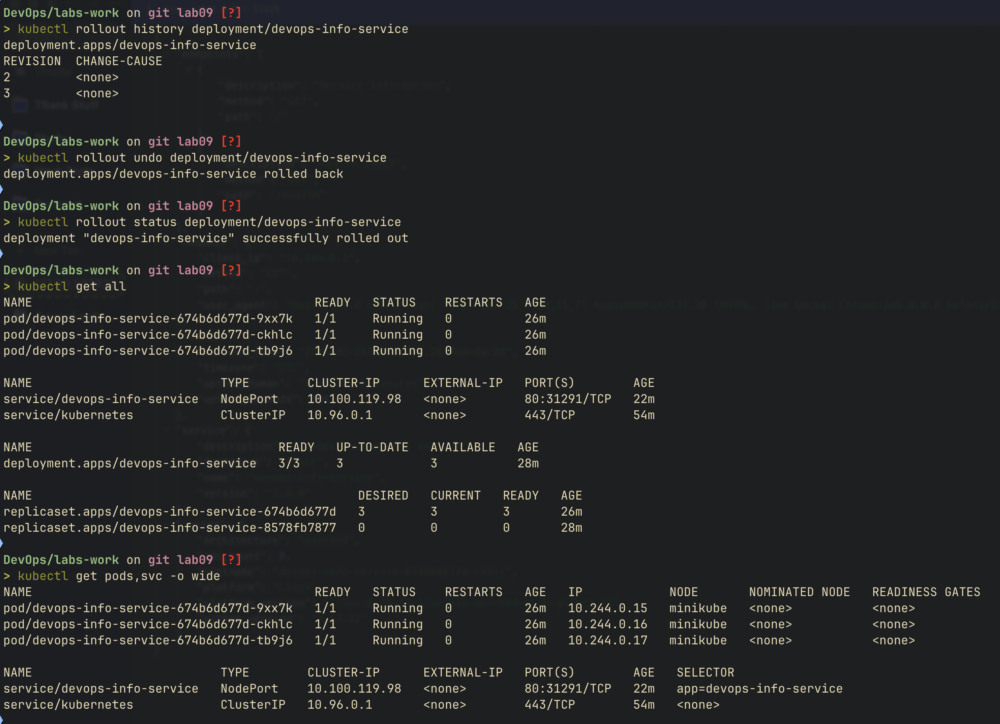
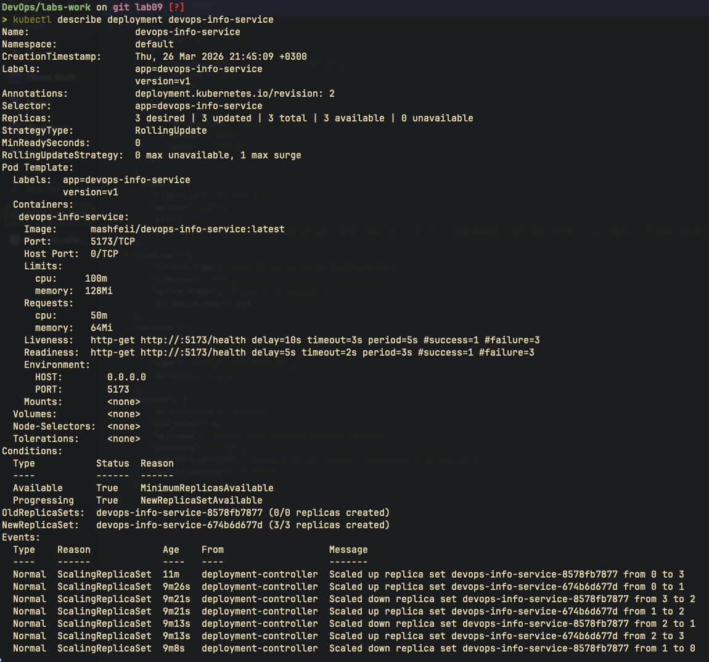
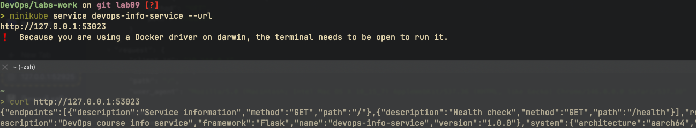
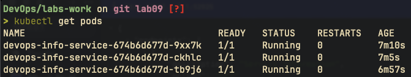
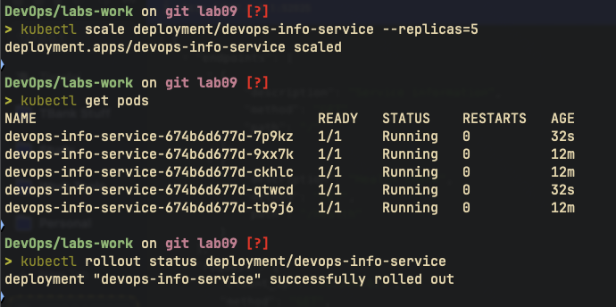
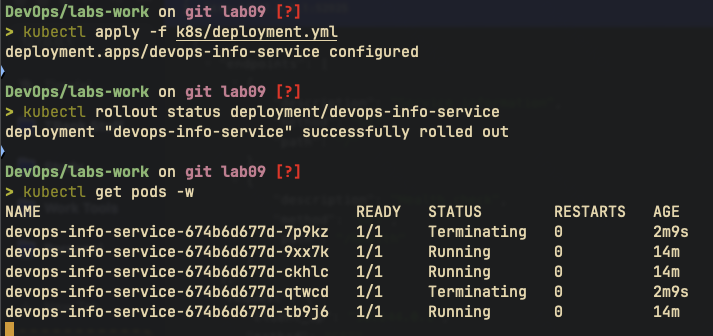

# Kubernetes Deployment Documentation

## Architecture Overview

```
                    ┌─────────────────────────────────────┐
                    │         Minikube Cluster             │
                    │                                     │
  User Request ──►  │  Service (NodePort :80)              │
                    │       │                             │
                    │       ├──► Pod 1 (Flask :5173)      │
                    │       ├──► Pod 2 (Flask :5173)      │
                    │       └──► Pod 3 (Flask :5173)      │
                    │                                     │
                    │  Deployment: 3 replicas              │
                    │  Strategy: RollingUpdate             │
                    │  Resources: 64-128Mi / 50-100m CPU  │
                    └─────────────────────────────────────┘
```

- 3 Pod replicas of `mashfeii/devops-info-service` behind a NodePort Service
- Each Pod gets 64Mi memory request / 128Mi limit, 50m CPU request / 100m limit
- Traffic enters via NodePort, load-balanced across all ready Pods

## Manifest Files

| File                | Description                                                                        |
| ------------------- | ---------------------------------------------------------------------------------- |
| `deployment.yml`    | Python app Deployment - 3 replicas, health probes, resource limits, rolling update |
| `service.yml`       | NodePort Service exposing port 80 → container port 5173                            |
| `deployment-go.yml` | Go app Deployment (bonus) - same patterns, port 8080                               |
| `service-go.yml`    | NodePort Service for Go app (bonus)                                                |
| `ingress.yml`       | Ingress with path-based routing and TLS (bonus)                                    |

### Key Configuration Choices

- **3 replicas** - balances availability with local resource usage
- **RollingUpdate** with `maxSurge: 1, maxUnavailable: 0` - ensures zero downtime during updates
- **Resource limits** - prevents any single Pod from consuming excessive cluster resources
- **Separate liveness/readiness probes** - liveness restarts unhealthy containers, readiness gates traffic

## Deployment Evidence







## Operations Performed

### Deploy

```bash
kubectl apply -f k8s/deployment.yml
kubectl apply -f k8s/service.yml
kubectl get pods
```



### Scaling to 5 Replicas

```bash
kubectl scale deployment/devops-info-service --replicas=5
kubectl get pods
kubectl rollout status deployment/devops-info-service
```



### Rolling Update

```bash
kubectl apply -f k8s/deployment.yml
kubectl rollout status deployment/devops-info-service
```



### Rollback

```bash
kubectl rollout history deployment/devops-info-service
kubectl rollout undo deployment/devops-info-service
kubectl rollout status deployment/devops-info-service
```


## Production Considerations

### Health Checks

- **Liveness probe** (`/health`, period 5s) - restarts containers stuck in a broken state
- **Readiness probe** (`/health`, period 3s) - removes unready Pods from Service endpoints, preventing failed requests

### Resource Limits Rationale

- Requests (64Mi/50m) guarantee scheduling baseline
- Limits (128Mi/100m) cap burst usage to protect other workloads
- Python Flask is lightweight; these values are sufficient for the info service

### Production Improvements

- Use `Ingress` or `LoadBalancer` instead of NodePort
- Add `PodDisruptionBudget` for maintenance safety
- Implement `HorizontalPodAutoscaler` for dynamic scaling
- Use namespaces to isolate environments (dev/staging/prod)
- Add network policies to restrict Pod-to-Pod traffic
- Set up Prometheus + Grafana for monitoring (see Lab 07)

## Challenges & Solutions

- **Problem:** Image pull errors when cluster can't reach Docker Hub
- **Solution:** Verify internet connectivity; for local images use `minikube image load`

- **Problem:** Pods in CrashLoopBackOff
- **Solution:** Check logs with `kubectl logs <pod>` and describe with `kubectl describe pod <pod>` to identify probe failures or configuration issues

- **Problem:** Service not routing traffic
- **Solution:** Verify label selectors match between Service and Deployment using `kubectl get endpoints`

### Debugging Commands

```bash
kubectl logs <pod-name>
kubectl describe pod <pod-name>
kubectl get events --sort-by='.lastTimestamp'
kubectl get endpoints
```
