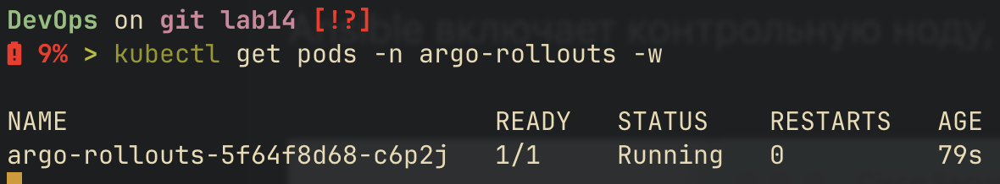
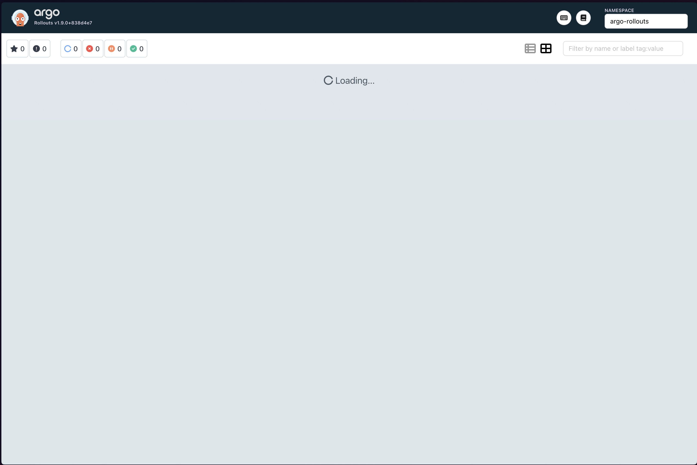
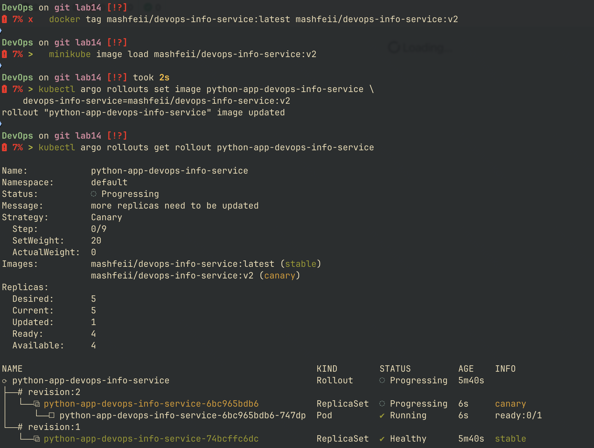
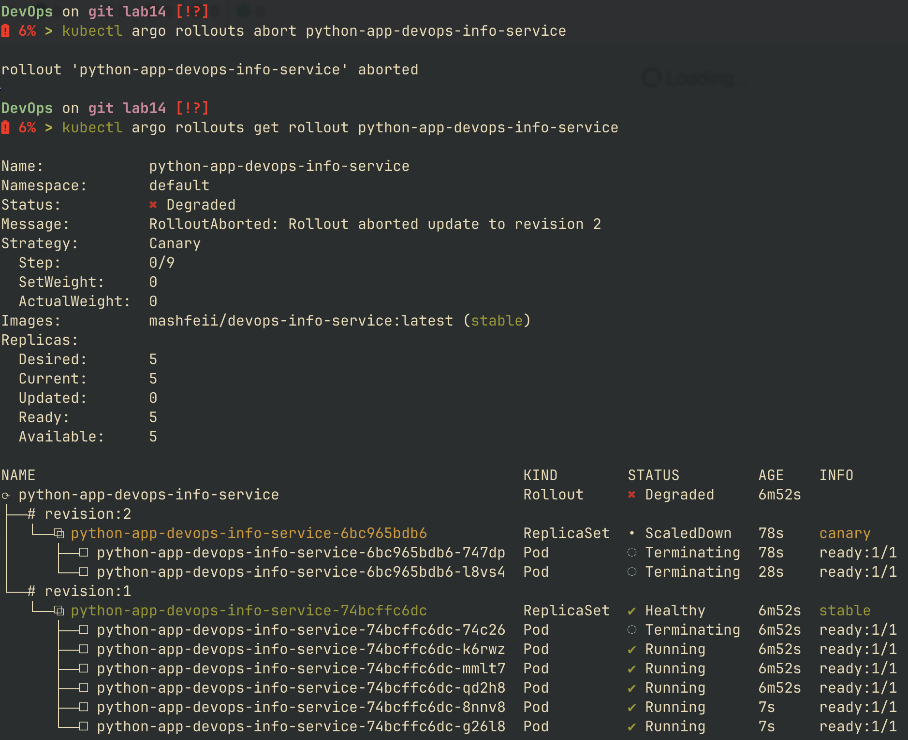
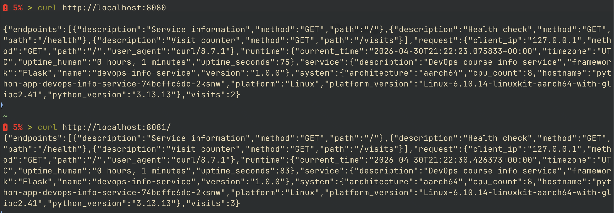
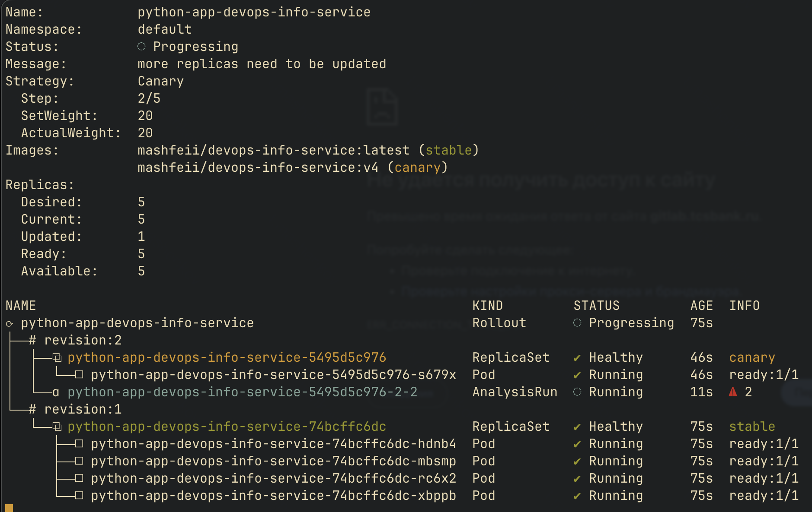
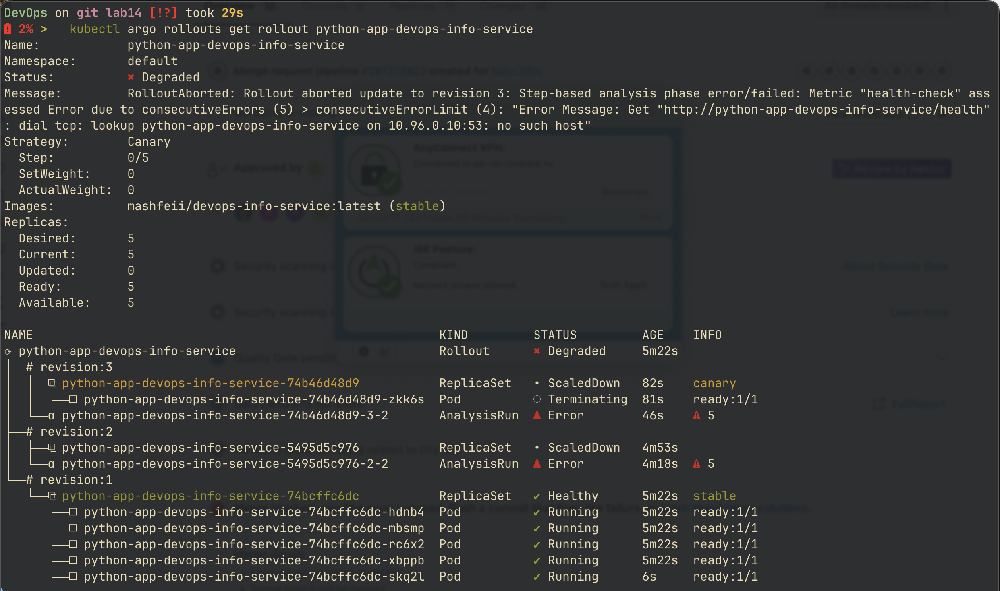

# progressive delivery with argo rollouts

## argo rollouts setup

### controller installation

```bash
kubectl create namespace argo-rollouts
kubectl apply -n argo-rollouts \
  -f https://github.com/argoproj/argo-rollouts/releases/latest/download/install.yaml
```

verify:

```bash
kubectl get pods -n argo-rollouts
```



### kubectl plugin

```bash
brew install argoproj/tap/kubectl-argo-rollouts   # macos
kubectl argo rollouts version
```

### dashboard

```bash
kubectl apply -n argo-rollouts \
  -f https://github.com/argoproj/argo-rollouts/releases/latest/download/dashboard-install.yaml
kubectl port-forward svc/argo-rollouts-dashboard -n argo-rollouts 3100:3100
```

open `http://localhost:3100`



## rollout vs deployment

| field | deployment | rollout |
|-------|------------|---------|
| api version | apps/v1 | argoproj.io/v1alpha1 |
| strategy | RollingUpdate / Recreate | canary / blueGreen |
| traffic shift | none (replica swap) | weighted via service or smi/istio |
| pause / promote | no | yes (manual or duration-based) |
| analysis | no | yes (metrics-based gate) |
| preview env | no | yes (blue-green) |
| pod template | identical | identical |
| service compatibility | direct | activeService field |

the chart renders one or the other based on `rollout.enabled` to keep them mutually exclusive

## canary deployment

### strategy configuration

defined in `values.yaml`:

```yaml
rollout:
  enabled: true
  strategy: canary
  canary:
    steps:
      - setWeight: 20
      - pause: {}                    # manual promotion
      - setWeight: 40
      - pause: { duration: 30s }
      - setWeight: 60
      - pause: { duration: 30s }
      - setWeight: 80
      - pause: { duration: 30s }
      - setWeight: 100
```

### step progression

| step | action | description |
|------|--------|-------------|
| 1 | setWeight: 20 | shift 20% of replicas to new version |
| 2 | pause: {} | wait for manual promotion |
| 3 | setWeight: 40 | shift to 40% |
| 4-8 | pause 30s + setWeight | automatic progression |
| 9 | setWeight: 100 | full cutover |

without an external traffic provider (istio/smi), traffic split is replica-based. with `replicaCount: 5`, a 20% weight = 1 new pod, 4 stable



### manual promotion

```bash
kubectl argo rollouts get rollout <name> -w
kubectl argo rollouts promote <name>
```

### abort and rollback

```bash
kubectl argo rollouts abort <name>
kubectl argo rollouts retry rollout <name>
```

abort instantly shifts all traffic back to the stable version - no rolling restart needed



## blue-green deployment

### strategy configuration

```yaml
rollout:
  enabled: true
  strategy: blueGreen
  blueGreen:
    autoPromotionEnabled: false
```

### service architecture

| service | purpose | selector |
|---------|---------|----------|
| `<fullname>` | active (production) traffic | rollouts adds pod-template-hash for current stable version |
| `<fullname>-preview` | preview (test) traffic | rollouts adds pod-template-hash for new version |

both services share the same standard selector labels - argo rollouts automatically injects the `rollouts-pod-template-hash` label to route traffic correctly

### promotion flow

1. deploy initial version → both services point to v1
2. update image/config → new replicaset created (preview points to v2)
3. test new version via preview service
4. `kubectl argo rollouts promote <name>` → instant switch (active points to v2)
5. old replicaset scaled down after `scaleDownDelaySeconds` (default 30s)

```bash
# port-forward both services
kubectl port-forward svc/<fullname> 8080:80 &
kubectl port-forward svc/<fullname>-preview 8081:80 &

curl http://localhost:8080/   # active (v1)
curl http://localhost:8081/   # preview (v2)
```



### instant rollback

after promotion, the old replicaset is still alive (unless scaled down). undo:

```bash
kubectl argo rollouts undo <name>
```

traffic switches back instantly - no pod startup time

## strategy comparison

| aspect | canary | blue-green |
|--------|--------|------------|
| traffic shift | gradual (weighted) | atomic (cutover) |
| resource usage | shared (no extra pods) | 2x during transition |
| user impact | small subset sees new version | all-or-nothing |
| rollback speed | fast (abort) | instant (undo) |
| testability before promote | limited (production traffic) | full (preview service) |
| best for | risk-tolerant changes, slow detection of issues | high-stakes changes, schema migrations |

### when to use each

- **canary**: api changes, performance tweaks, feature flag rollouts
- **blue-green**: major version upgrades, breaking changes, regulated environments

## cli reference

| command | purpose |
|---------|---------|
| `kubectl argo rollouts get rollout <name>` | inspect status |
| `kubectl argo rollouts get rollout <name> -w` | watch live progression |
| `kubectl argo rollouts promote <name>` | move to next step |
| `kubectl argo rollouts promote <name> --full` | skip remaining steps |
| `kubectl argo rollouts abort <name>` | stop and revert to stable |
| `kubectl argo rollouts retry rollout <name>` | resume aborted rollout |
| `kubectl argo rollouts undo <name>` | revert to previous version |
| `kubectl argo rollouts set image <name> <container>=<image>` | trigger rollout via image change |
| `kubectl argo rollouts list rollouts` | list all rollouts |

## bonus: automated analysis

### web-based analysis template

`templates/analysistemplate.yaml` provides metric-driven promotion gating without prometheus:

```yaml
apiVersion: argoproj.io/v1alpha1
kind: AnalysisTemplate
metadata:
  name: <fullname>-health
spec:
  args:
    - name: service-name
  metrics:
    - name: health-check
      interval: 10s
      count: 3
      failureLimit: 1
      successCondition: "result == 'healthy'"
      provider:
        web:
          url: "http://{{args.service-name}}/health"
          jsonPath: "{$.status}"
```

### success condition logic

| field | meaning |
|-------|---------|
| `interval` | time between samples (10s) |
| `count` | total samples per measurement |
| `failureLimit` | max failed samples before AnalysisRun fails |
| `successCondition` | expression evaluated against `result` |
| `result` | value extracted via `jsonPath` from response body |

condition `result == 'healthy'` matches the `/health` endpoint json `{"status": "healthy", ...}`

### integration with canary

add an `analysis` step after the first traffic shift in values:

```yaml
canary:
  steps:
    - setWeight: 20
    - pause: { duration: 60s }
    - analysis:
        templates:
          - templateName: python-app-devops-info-service-health
        args:
          - name: service-name
            value: python-app-devops-info-service
    - setWeight: 60
    - setWeight: 100
```

if the AnalysisRun fails, the rollout aborts automatically and traffic returns to the stable version



### demo with intentional failure

trigger by pointing service-name at a non-existent endpoint, or push an image with a broken `/health` handler:

1. `helm upgrade --set image.tag=broken-tag`
2. rollout begins, hits analysis step
3. AnalysisRun samples /health, all fail
4. rollout aborts, kubectl shows `Status: Degraded`
5. all traffic returns to stable


