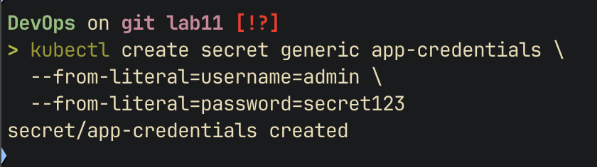
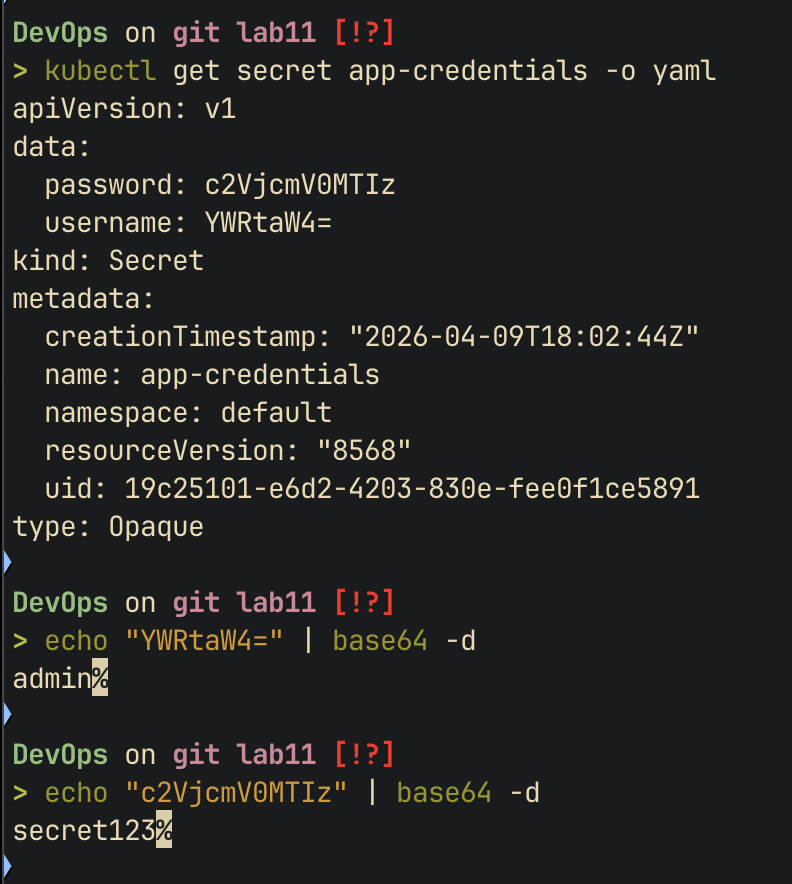
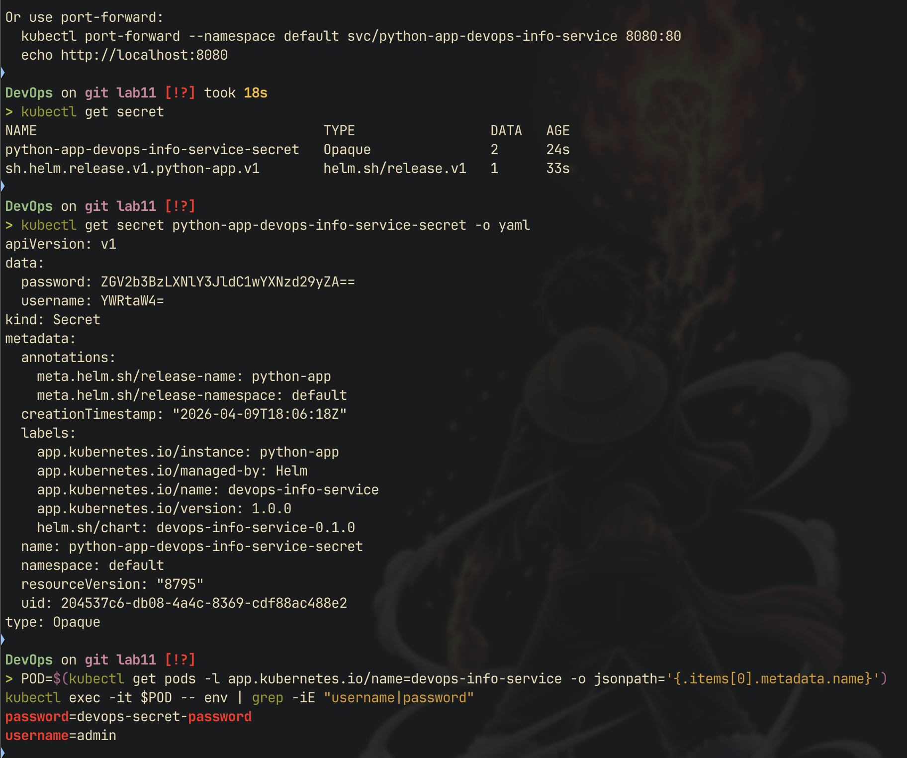
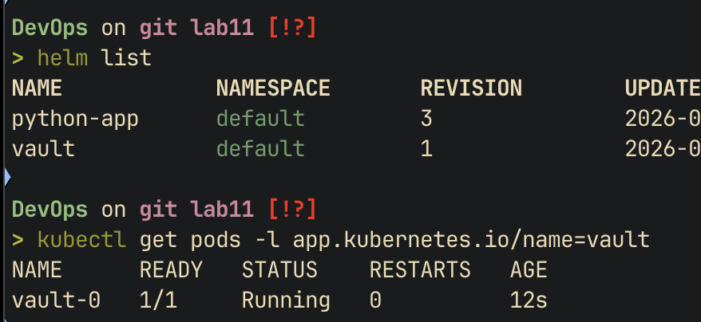
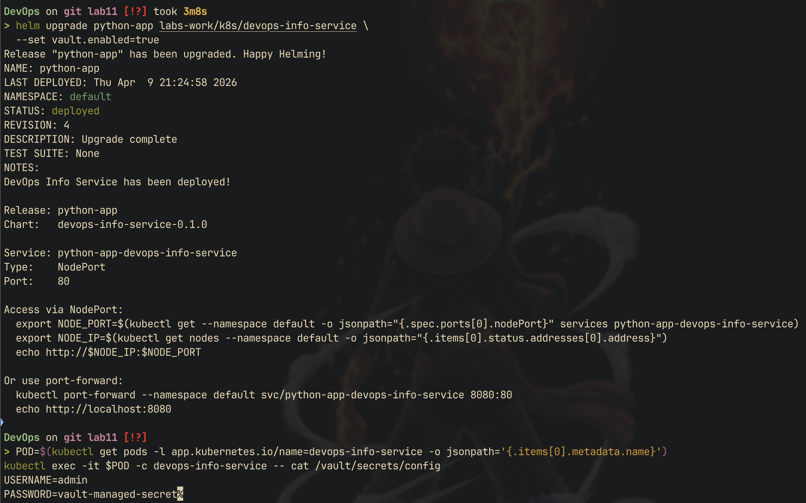
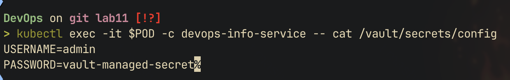

# kubernetes secrets & hashicorp vault

## kubernetes secrets fundamentals

### creating a secret

```bash
kubectl create secret generic app-credentials \
  --from-literal=username=admin \
  --from-literal=password=secret123
```



### examining the secret

```bash
kubectl get secret app-credentials -o yaml
```

output contains base64-encoded values under `data`:

```yaml
data:
  username: YWRtaW4=
  password: c2VjcmV0MTIz
```

decoding:

```bash
echo "YWRtaW4=" | base64 -d        # admin
echo "c2VjcmV0MTIz" | base64 -d    # secret123
```



### base64 encoding vs encryption

| aspect | base64 encoding | encryption |
|--------|----------------|------------|
| purpose | data representation | data protection |
| reversibility | anyone can decode | requires a key |
| security | none | strong |
| k8s secrets default | yes | no |

- kubernetes secrets are base64-encoded, **not encrypted** at rest by default
- anyone with api access can decode them trivially
- etcd encryption can be enabled to encrypt secrets at rest, but requires explicit configuration
- for production: enable etcd encryption, enforce rbac, use external secret managers

## helm-managed secrets

### chart structure

```
devops-info-service/
├── Chart.yaml
├── values.yaml              # secrets placeholder values
├── templates/
│   ├── _helpers.tpl         # named template for env vars
│   ├── deployment.yaml      # consumes secrets via envFrom
│   ├── secrets.yaml         # secret resource template
│   ├── service.yaml
│   ├── NOTES.txt
│   └── hooks/
│       ├── pre-install-job.yaml
│       └── post-install-job.yaml
└── charts/
```

### secret template

`templates/secrets.yaml` uses `stringData` (auto-encodes to base64):

```yaml
apiVersion: v1
kind: Secret
metadata:
  name: {{ include "devops-info-service.fullname" . }}-secret
  labels:
    {{- include "devops-info-service.labels" . | nindent 4 }}
type: Opaque
stringData:
 username: {{ .Values.secrets.username | quote }}
 password: {{ .Values.secrets.password | quote }}
```

placeholder values in `values.yaml`:

```yaml
secrets:
 username: "admin"
 password: "devops-secret-password"
```

real values should be injected at deploy time via `--set`:

```bash
helm install myapp ./devops-info-service \
 --set secrets.username=real-user \
 --set secrets.password=real-password
```

### deployment integration

secrets are injected as environment variables using `envFrom`:

```yaml
envFrom:
 - secretRef:
     name: {{ include "devops-info-service.fullname" . }}-secret
```

this maps all keys from the secret to environment variables (`USERNAME`, `PASSWORD`)

### verification

```bash
kubectl exec -it <pod-name> -- env | grep -E "username|password"
```

`kubectl describe pod` shows the secretRef but **not** the actual values



## resource management

### configuration

defined in `values.yaml`:

```yaml
resources:
 requests:
   memory: "64Mi"
   cpu: "50m"
 limits:
   memory: "128Mi"
   cpu: "100m"
```

### requests vs limits

| parameter | requests | limits |
|-----------|----------|--------|
| purpose | scheduling guarantee | hard cap |
| scheduler | uses for pod placement | ignores |
| enforcement | soft - guaranteed minimum | hard - pod killed/throttled if exceeded |
| oom kill | no | yes, if memory exceeded |
| cpu throttle | no | yes, if cpu exceeded |

### choosing values

- flask app is lightweight, 64Mi memory request covers baseline usage
- 128Mi limit provides headroom for request spikes without allowing runaway
- 50m cpu request is sufficient for low-traffic service
- 100m cpu limit prevents cpu starvation of other pods
- monitor actual usage with `kubectl top pods` and adjust accordingly

## vault integration

### installation

```bash
helm repo add hashicorp https://helm.releases.hashicorp.com
helm repo update
helm install vault hashicorp/vault \
 --set "server.dev.enabled=true" \
 --set "injector.enabled=true"
```



### vault configuration

```bash
kubectl exec -it vault-0 -- /bin/sh

# enable kv-v2 secrets engine
vault secrets enable -path=secret kv-v2

# store secrets
vault kv put secret/devops-info-service/config \
 username="admin" \
 password="vault-managed-secret"
```

### kubernetes authentication

```bash
# enable k8s auth method
vault auth enable kubernetes

# configure k8s auth
vault write auth/kubernetes/config \
 kubernetes_host="https://$KUBERNETES_PORT_443_TCP_ADDR:443"

# create policy
vault policy write devops-info-service - <<EOF
path "secret/data/devops-info-service/config" {
 capabilities = ["read"]
}
EOF

# create role bound to service account
vault write auth/kubernetes/role/devops-info-service \
 bound_service_account_names=default \
 bound_service_account_namespaces=default \
 policies=devops-info-service \
 ttl=24h
```

### vault agent injection

deployment annotations (enabled via `vault.enabled: true` in values.yaml):

```yaml
annotations:
 vault.hashicorp.com/agent-inject: "true"
 vault.hashicorp.com/role: "devops-info-service"
 vault.hashicorp.com/agent-inject-secret-config: "secret/data/devops-info-service/config"
```

verification:

```bash
kubectl exec -it <pod-name> -c devops-info-service -- cat /vault/secrets/config
```



### sidecar injection pattern

the vault agent injector works as follows:

1. **mutating webhook** watches for pods with `vault.hashicorp.com/agent-inject: "true"` annotation
2. **init container** is injected to pre-populate secrets before the app starts
3. **sidecar container** runs alongside the app, watching for secret updates
4. secrets are written as files to `/vault/secrets/` inside the pod
5. the app reads secrets from files rather than environment variables

advantages: secrets never pass through kubernetes api, automatic rotation, audit logging

## security analysis

### kubernetes secrets vs vault

| aspect | k8s secrets | hashicorp vault |
|--------|------------|-----------------|
| encryption at rest | optional (etcd config) | always encrypted |
| access control | rbac | fine-grained policies |
| audit logging | k8s audit logs | built-in audit device |
| secret rotation | manual | automatic with leases |
| dynamic secrets | no | yes (db creds, cloud iam) |
| secret versioning | no | yes (kv-v2) |
| complexity | low | high |
| external dependency | none | vault cluster required |

### when to use each

- **k8s secrets**: development environments, non-sensitive config, simple deployments
- **vault**: production, compliance requirements, dynamic secrets, multi-cluster setups

### production recommendations

- never commit real secrets to git - use `--set` or external secret management
- enable etcd encryption at rest as baseline
- use vault for anything beyond basic secrets
- implement rbac to restrict secret access by namespace and service account
- rotate secrets regularly
- use sealed-secrets or external-secrets-operator as intermediate options

## bonus: vault agent templates

### template annotation

renders secrets as `.env` format file using consul template syntax:

```yaml
vault.hashicorp.com/agent-inject-template-config: |
 {{- with secret "secret/data/devops-info-service/config" -}}
 USERNAME={{ .Data.data.username }}
 PASSWORD={{ .Data.data.password }}
 {{- end -}}
```

### rendered file content

the resulting `/vault/secrets/config` file:

```
USERNAME=admin
PASSWORD=vault-managed-secret
```



### named template implementation

`_helpers.tpl` defines a reusable template for environment variables:

```yaml
{{- define "devops-info-service.envVars" -}}
{{- range .Values.env }}
- name: {{ .name }}
 value: {{ .value | quote }}
{{- end }}
{{- end }}
```

used in deployment via `include`:

```yaml
env:
 {{- include "devops-info-service.envVars" . | nindent 12 }}
```

benefits:
- single source of truth for env var definitions
- can be extended with conditional logic without modifying deployment template
- reusable across multiple templates if needed
- demonstrates DRY principle in helm charts

### dynamic secret rotation

- vault agent sidecar periodically checks vault for secret updates
- default refresh interval is controlled by vault's ttl settings
- when secrets change, the sidecar rewrites the file on disk
- `vault.hashicorp.com/agent-inject-command` annotation can specify a command to run after secret update (e.g., signal the app to reload
)
- applications should watch the secrets file or handle SIGHUP for zero-downtime rotation
