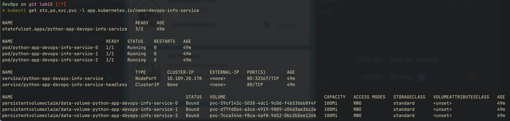
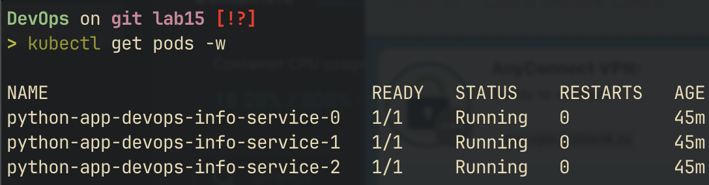
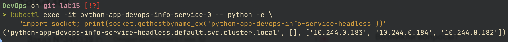
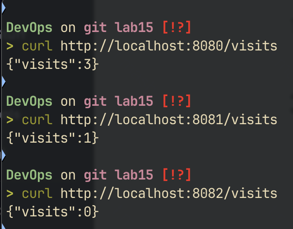
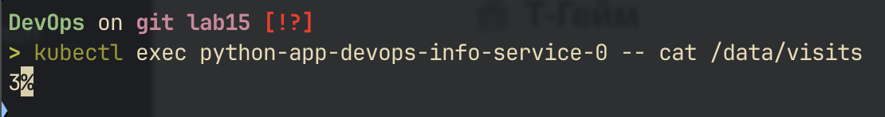
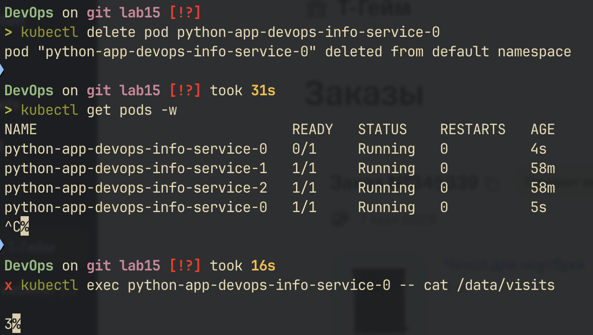
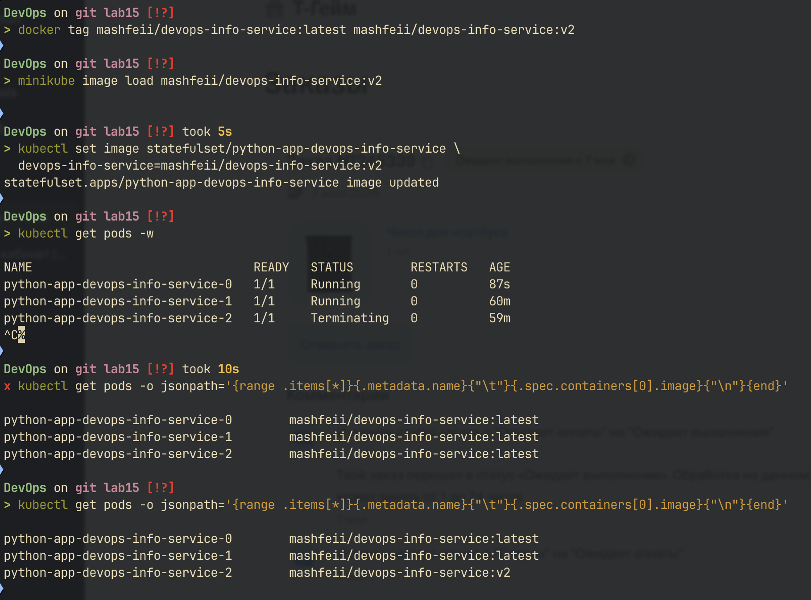

# statefulsets & persistent storage

## statefulset overview

statefulsets manage workloads that need stable identity and per-instance storage. unlike deployments which treat pods as interchangeable, statefulsets give each pod:

- a stable, predictable name (`<sts>-0`, `<sts>-1`, ...)
- a stable dns hostname via a headless service
- its own persistent volume that survives pod deletion
- ordered creation, scaling, and termination

### typical use cases

- databases (postgres, mysql, mongodb)
- message queues (kafka, rabbitmq)
- distributed systems (elasticsearch, cassandra, zookeeper)
- any workload where pods are not interchangeable

## statefulset vs deployment

| feature | deployment | statefulset |
|---------|------------|-------------|
| pod naming | random suffix (`pod-abc12`) | ordered index (`pod-0`, `pod-1`) |
| pod identity | interchangeable | unique and stable |
| network identity | random pod ip | stable dns name |
| storage | shared pvc or none | per-pod pvc via volumeClaimTemplates |
| scale order | parallel | sequential (0 → 1 → 2) |
| delete order | parallel | reverse sequential (2 → 1 → 0) |
| update strategy | RollingUpdate / Recreate | RollingUpdate (with partition) / OnDelete |
| service required | regular service (optional) | headless service (required) |

## headless service

a service with `clusterIP: None` does not get a virtual ip. instead, the dns query for the service returns one a-record per pod, and each pod also gets a stable dns >.<headlname:

```
<pod-nameess-service-name>.<namespace>.svc.cluster.local
```

example for our chart:

```
python-app-devops-info-service-0.python-app-devops-info-service-headless.default.svc.cluster.local
```

`publishNotReadyAddresses: true` ensures dns resolves even before pods become ready, which helps peer-discovery during startup

## chart implementation

### workload mode matrix

the chart now supports three mutually-exclusive workload modes via values flags:

| flag | workload | pvc | services |
|------|----------|-----|----------|
| default | Deployment | shared standalone PVC | regular |
| `rollout.enabled=true` | Rollout (canary/blueGreen) | shared standalone PVC | regular (+ preview if blueGreen) |
| `statefulset.enabled=true` | StatefulSet | per-pod via volumeClaimTemplates | regular + headless |

`statefulset.enabled` takes precedence over `rollout.enabled`

### statefulset.yaml structure

key elements:

```yaml
apiVersion: apps/v1
kind: StatefulSet
spec:
  serviceName: <fullname>-headless     # headless service for stable dns
  replicas: {{ .Values.replicaCount }}
  updateStrategy:
    type: RollingUpdate
    rollingUpdate:
      partition: 0                     # only update pods with ordinal >= partition
  template:
    # identical pod spec to deployment.yaml
  volumeClaimTemplates:
    - metadata:
        name: data-volume
      spec:
        accessModes: [ReadWriteOnce]
        resources:
          requests:
            storage: 100Mi
```

### volumeClaimTemplates vs pvc

| aspect | standalone pvc | volumeClaimTemplates |
|--------|----------------|----------------------|
| owner | the chart release | the statefulset |
| count | one shared pvc | one pvc per pod |
| naming | `<fullname>-data` | `<volumeName>-<podName>` |
| lifecycle | survives chart uninstall (manual delete) | survives statefulset uninstall (manual delete) |
| pod isolation | shared data (race conditions on RWO) | each pod has own data |

example pvcs created by our statefulset (3 replicas):

```
data-volume-python-app-devops-info-service-0
data-volume-python-app-devops-info-service-1
data-volume-python-app-devops-info-service-2
```

## resource verification

```bash
kubectl get sts,po,svc,pvc -l app.kubernetes.io/name=devops-info-service
```

expected output shape:

```
NAME                                             READY   AGE
statefulset.apps/python-app-devops-info-service  3/3     2m

NAME                                          READY   STATUS    AGE
pod/python-app-devops-info-service-0          1/1     Running   2m
pod/python-app-devops-info-service-1          1/1     Running   90s
pod/python-app-devops-info-service-2          1/1     Running   60s

NAME                                                TYPE        CLUSTER-IP   PORT(S)
service/python-app-devops-info-service              NodePort    10.x.x.x     80:NNNNN/TCP
service/python-app-devops-info-service-headless     ClusterIP   None         80/TCP

NAME                                                          STATUS   CAPACITY
persistentvolumeclaim/data-volume-python-app-...-service-0    Bound    100Mi
persistentvolumeclaim/data-volume-python-app-...-service-1    Bound    100Mi
persistentvolumeclaim/data-volume-python-app-...-service-2    Bound    100Mi
```



ordered pod creation:



## network identity evidence

### dns resolution from inside a pod

```bash
kubectl exec -it python-app-devops-info-service-0 -- nslookup \
  python-app-devops-info-service-1.python-app-devops-info-service-headless
```

expected: returns the ip of `python-app-devops-info-service-1`. crucially, this ip would have been impossible to address by name with a regular Deployment since pod names are random



### dns naming pattern

| target | dns name |
|--------|----------|
| specific pod | >.<head`<pod-nameless-svc>.<namespace>.svc.cluster.local` |
| all pods | a-records returned by `<headless-svc>.<namespace>.svc.cluster.local` |
| load-balanced via regular service | `<regular-svc>.<namespace>.svc.cluster.local` (round-robin) |

## per-pod storage evidence

each pod has its own `/data/visits` file because each gets its own pvc:

```bash
kubectl port-forward pod/python-app-devops-info-service-0 8080:5173
kubectl port-forward pod/python-app-devops-info-service-1 8081:5173
kubectl port-forward pod/python-app-devops-info-service-2 8082:5173

curl localhost:8080/        # bumps pod-0 counter
curl localhost:8080/
curl localhost:8081/        # bumps pod-1 counter

curl localhost:8080/visits  # 2
curl localhost:8081/visits  # 1
curl localhost:8082/visits  # 0
```



with a Deployment + shared pvc, all replicas would have shown the same counter (with race conditions) - per-pod isolation is what makes statefulsets distinct

## persistence evidence

### test data survival

```bash
# capture the count for pod-0
kubectl exec python-app-devops-info-service-0 -- cat /data/visits
# 5

# delete the pod
kubectl delete pod python-app-devops-info-service-0

# wait for it to come back (ordered re-creation)
kubectl get pods -w

# verify count is preserved
kubectl exec python-app-devops-info-service-0 -- cat /data/visits
# 5
```

the new pod attaches to the same pvc (`data-volume-python-app-devops-info-service-0`) and reads the existing visits file





## bonus: update strategies

### rolling update with partition

```yaml
statefulset:
  updateStrategy:
    type: RollingUpdate
    rollingUpdate:
      partition: 2
```

with `partition: 2` and 3 replicas, only pods with ordinal `>= 2` (i.e., pod-2) are updated when the pod template changes. pod-0 and pod-1 stay on the old version

useful for staged rollouts: bump partition down step by step (2 → 1 → 0) to gradually update each pod

### ondelete strategy

```yaml
statefulset:
  updateStrategy:
    type: OnDelete
```

pods are not updated automatically. the user must delete each pod manually for it to be recreated with the new spec

### use cases

| strategy | when to use |
|----------|-------------|
| RollingUpdate (partition: 0) | normal production updates, all pods update sequentially |
| RollingUpdate (partition: N) | staged rollout, canary-style for stateful apps |
| OnDelete | manual control, schema migrations, ordering-critical systems where the operator wants explicit pod recreation |


