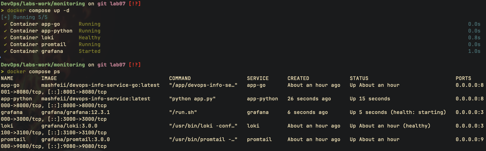
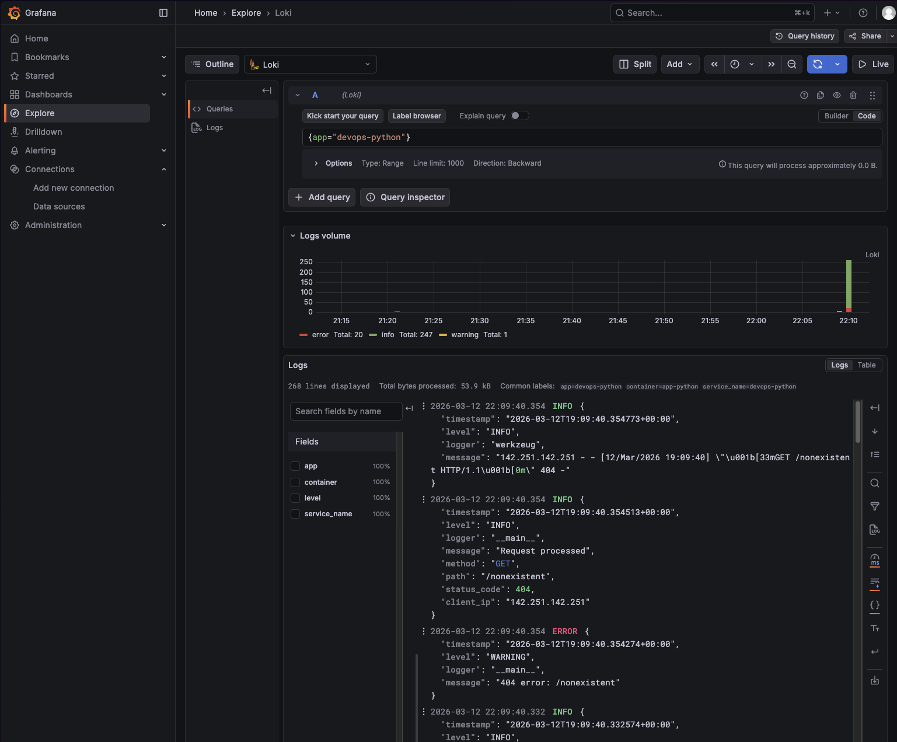
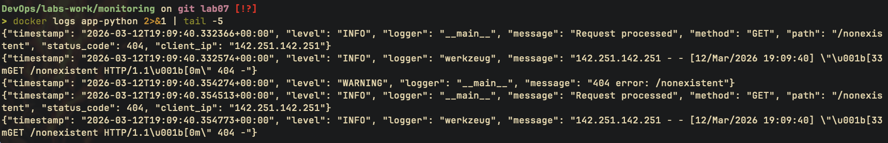
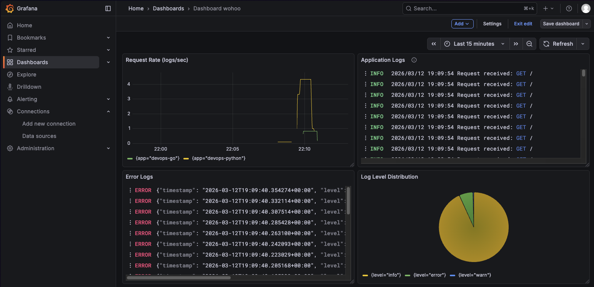
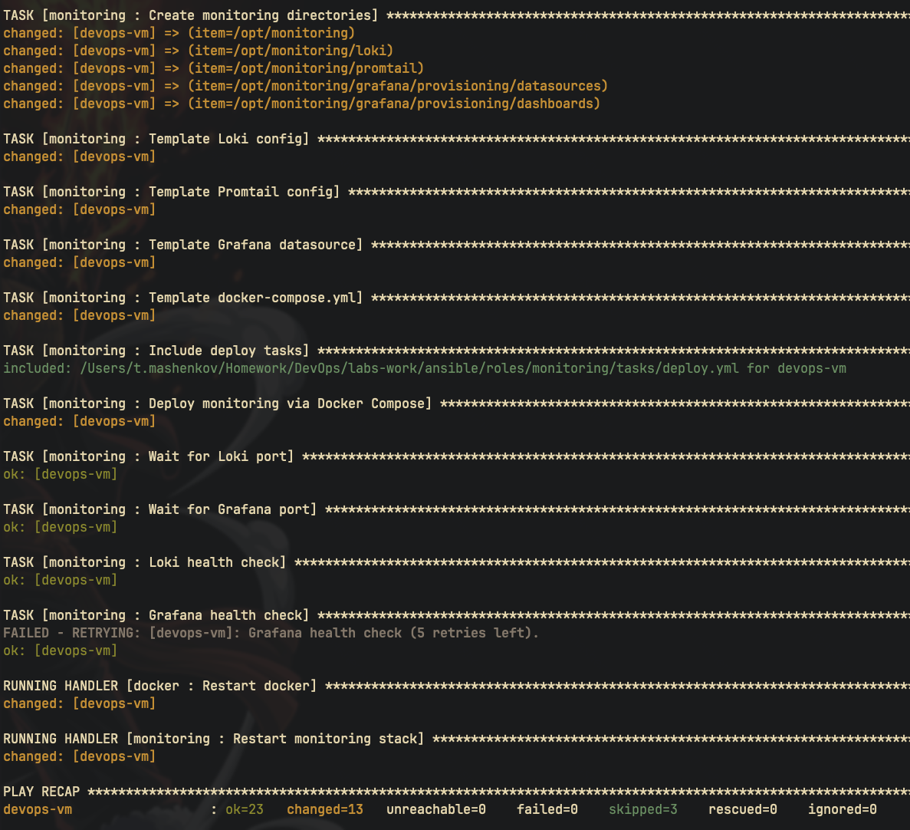
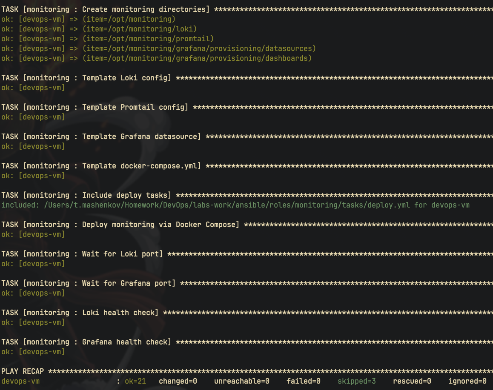
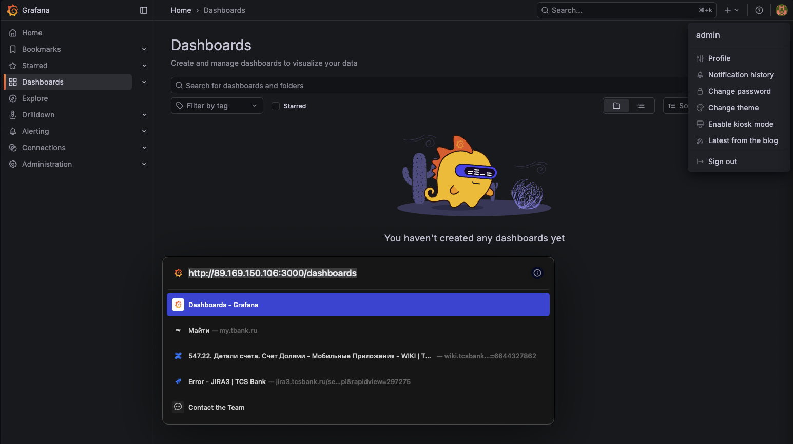

# Lab 07 - Observability & Logging with Loki Stack

## Overview

- Deployed centralized logging stack: Loki + Promtail + Grafana via Docker Compose
- Added structured JSON logging to the Python app (no new dependencies)
- Auto-provisioned Loki datasource in Grafana
- Hardened for production: resource limits, health checks, retention, auth
- Bonus: Ansible role for automated deployment on remote VM

## Architecture

```
┌─────────────┐     ┌──────────┐     ┌───────────┐
│  app-python │────>│          │     │           │
│  (JSON logs)│     │ Promtail │────>│   Loki    │
│  app-go     │────>│          │     │           │
└─────────────┘     └──────────┘     └─────┬─────┘
                                           │
                                     ┌─────▼─────┐
                                     │  Grafana  │
                                     │  :3000    │
                                     └───────────┘
```

Promtail discovers containers via Docker socket, filters by `logging=promtail` label, and ships logs to Loki. Grafana queries Loki for visualization.

### Service Versions

| Service  | Image                          | Port |
| -------- | ------------------------------ | ---- |
| Loki     | grafana/loki:3.0.0             | 3100 |
| Promtail | grafana/promtail:3.0.0         | 9080 |
| Grafana  | grafana/grafana:12.3.1         | 3000 |
| Python   | mashfeii/devops-info-service   | 8000 |
| Go       | mashfeii/devops-info-service-go| 8001 |

## Setup

```bash
cd labs-work/monitoring

# Create .env with Grafana admin password
echo 'GF_SECURITY_ADMIN_PASSWORD=your-secure-password' > .env
echo 'GF_AUTH_ANONYMOUS_ENABLED=false' >> .env

# Start the stack
docker compose up -d

# Verify all services
docker compose ps
curl http://localhost:3100/ready    # Loki
curl http://localhost:9080/targets  # Promtail
curl http://localhost:8000/         # Python app
curl http://localhost:8001/         # Go app
```

Open Grafana at `http://localhost:3000` (admin / your password from `.env`).

## JSON Structured Logging

Custom `JSONFormatter` class added to `app.py` without new dependencies. Uses `@app.after_request` to log every request uniformly.

### Log Format

```json
{
  "timestamp": "2026-03-11T12:00:00+00:00",
  "level": "INFO",
  "logger": "app",
  "message": "Request processed",
  "method": "GET",
  "path": "/",
  "status_code": 200,
  "client_ip": "172.18.0.1"
}
```

Benefits over plain text:
- Loki can parse JSON fields with `| json` pipeline
- Filter by `status_code`, `method`, `path` in LogQL
- No regex needed for log parsing

## Loki Configuration

Key settings in `loki/config.yml`:

| Setting            | Value        | Rationale                                        |
| ------------------ | ------------ | ------------------------------------------------ |
| `store`            | `tsdb`       | Modern index format, better performance than BoltDB |
| `schema`           | `v13`        | Latest schema, required for TSDB                 |
| `object_store`     | `filesystem` | Simplest backend for single-node deployment      |
| `retention_period` | `168h`       | 7 days - enough for dev, prevents disk bloat     |
| `auth_enabled`     | `false`      | Single-tenant dev setup                          |
| `compactor`        | enabled      | Enforces retention, cleans old chunks            |

## Promtail Configuration

Docker service discovery (`docker_sd_configs`) with filtering:

- Connects to Docker socket to discover running containers
- Filters containers by `logging=promtail` label - only monitored apps are scraped
- Relabels `__meta_docker_container_name` to `container` label
- Relabels `__meta_docker_container_label_app` to `app` label for LogQL queries

## Grafana Provisioning

Loki datasource is auto-provisioned via `grafana/provisioning/datasources/loki.yml` - no manual setup needed after first boot. Dashboard provider configured at `/var/lib/grafana/dashboards`.

## Dashboard Panels and LogQL Queries

### Recommended Panels

**Live Log Stream** - shows real-time logs from both apps:
```logql
{app=~"devops-python|devops-go"}
```

**Error Logs** - filters for warnings and errors:
```logql
{app=~"devops-python|devops-go"} | json | level=~"WARNING|ERROR"
```

**Request Rate** (metric from logs):
```logql
count_over_time({app="devops-python"} | json | message="Request processed" [1m])
```

**Status Code Distribution**:
```logql
sum by (status_code) (count_over_time({app="devops-python"} | json | message="Request processed" [5m]))
```

**404 Errors**:
```logql
{app="devops-python"} | json | status_code=404
```

## Production Hardening

| Feature          | Implementation                                      |
| ---------------- | --------------------------------------------------- |
| Resource limits  | Memory and CPU caps on all services via `deploy`     |
| Health checks    | Loki (`/ready`) and Grafana (`/api/health`)          |
| Auth             | Grafana anonymous access disabled, password in `.env`|
| Secrets          | `.env` excluded from git via `.gitignore`            |
| Retention        | 7-day auto-deletion via Loki compactor               |
| Restart policy   | `unless-stopped` on all services                     |
| Read-only mounts | Config files mounted as `:ro`                        |
| Dependency order | Promtail and Grafana wait for Loki health            |

## Testing

```bash
# Generate traffic for log testing
for i in $(seq 1 10); do curl -s http://localhost:8000/ > /dev/null; done
for i in $(seq 1 5); do curl -s http://localhost:8000/nonexistent > /dev/null; done

# Verify JSON logs
docker logs app-python 2>&1 | head -5

# Query Loki directly
curl -G http://localhost:3100/loki/api/v1/query \
  --data-urlencode 'query={app="devops-python"}' | jq .

# Check Promtail targets
curl http://localhost:9080/targets
```









## Bonus: Ansible Automation

### Role Structure

```
roles/monitoring/
├── defaults/main.yml            # All variables (versions, ports, limits)
├── tasks/
│   ├── main.yml                 # Orchestration entry point
│   ├── setup.yml                # Create dirs, template configs
│   ├── deploy.yml               # Docker Compose deployment
│   └── wipe.yml                 # Teardown (when monitoring_wipe=true)
├── templates/
│   ├── docker-compose.yml.j2
│   ├── loki-config.yml.j2
│   ├── promtail-config.yml.j2
│   └── grafana-datasource.yml.j2
├── handlers/main.yml
└── meta/main.yml                # Depends on: docker role
```

### Key Variables

| Variable                         | Default     | Purpose                        |
| -------------------------------- | ----------- | ------------------------------ |
| `monitoring_loki_version`        | `3.0.0`     | Loki image tag                 |
| `monitoring_grafana_version`     | `12.3.1`    | Grafana image tag              |
| `monitoring_loki_retention`      | `168h`      | Log retention period (7 days)  |
| `monitoring_compose_dir`         | `/opt/monitoring` | Remote deployment path    |
| `monitoring_grafana_admin_password` | from vault | Grafana admin password      |
| `monitoring_wipe`                | `false`     | Set `true` to teardown stack   |

All service versions, ports, and resource limits are parameterized via Jinja2 templates.

### Running the Playbook

```bash
cd labs-work/ansible

# Deploy monitoring stack to VM
ansible-playbook playbooks/deploy-monitoring.yml --ask-vault-pass

# Verify idempotency (second run should show 0 changed)
ansible-playbook playbooks/deploy-monitoring.yml --ask-vault-pass
```

### Evidence

First run - deploys all services:



Second run - idempotent, zero changes:



Grafana accessible on the remote VM:



## Challenges and Solutions

**Problem:** Loki 3.0 requires TSDB store and schema v13 - older BoltDB configs fail silently

**Solution:** Used `store: tsdb` with `schema: v13` and matching `tsdb_shipper` storage config

---

**Problem:** Promtail scrapes all containers by default, flooding Loki with infrastructure logs

**Solution:** Docker SD filter `logging=promtail` label - only explicitly labeled containers are scraped

---

**Problem:** Grafana needs manual datasource setup on first boot

**Solution:** Provisioning YAML in `grafana/provisioning/datasources/` auto-configures Loki on startup
