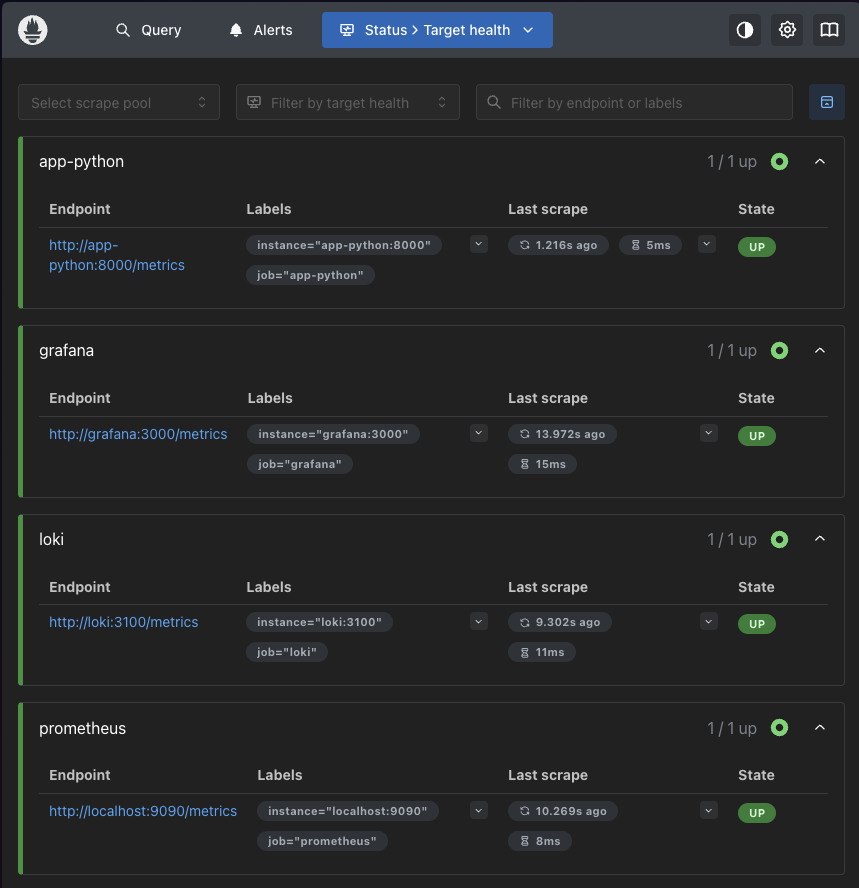
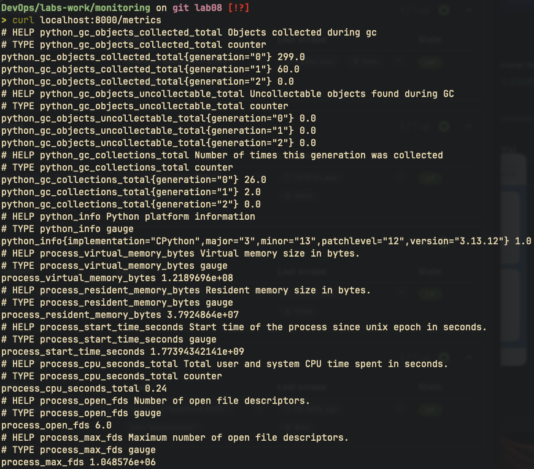
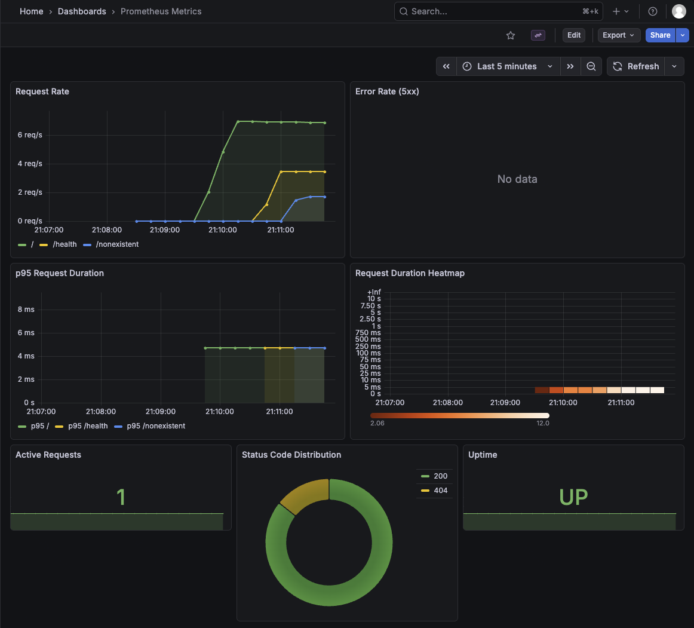
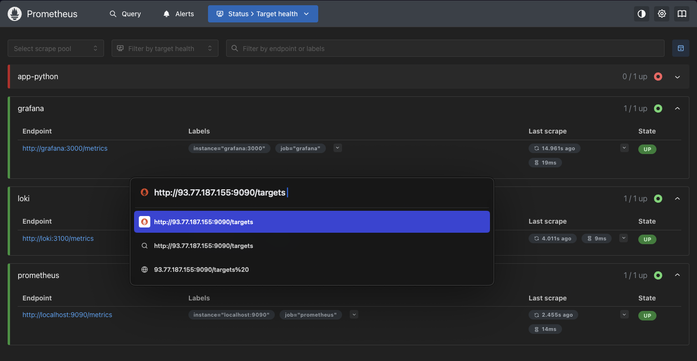

# Lab 08 - Metrics & Monitoring with Prometheus

## Overview

- Instrumented Python app with `prometheus_client` for application-level metrics
- Deployed Prometheus to scrape metrics from all services
- Built a 7-panel Grafana dashboard with PromQL queries
- Hardened for production: health checks, resource limits, retention policies
- Bonus: Extended Ansible role to automate Prometheus deployment

## Architecture

```
┌─────────────┐
│  app-python │──── /metrics ────┐
│  :8000      │                  │
└─────────────┘                  │
                           ┌─────▼──────┐     ┌───────────┐
                           │ Prometheu  │────>│  Grafana  │
                           │ :9090      │     │  :3000    │
                           └────┬───────┘     └───────────┘
┌─────────────┐                 │
│    Loki     │── /metrics ─────┘
│   :3100     │
└─────────────┘

┌─────────────┐     ┌──────────┐
│  app-python │────>│          │
│  app-go     │────>│ Promtail │────> Loki ────> Grafana
└─────────────┘     └──────────┘
```

Prometheus scrapes `/metrics` endpoints from app-python, Loki, Grafana, and itself. Grafana queries both Prometheus (metrics) and Loki (logs) as datasources.

### Service Versions

| Service    | Image                           | Port |
| ---------- | ------------------------------- | ---- |
| Prometheus | prom/prometheus:v3.9.0          | 9090 |
| Loki       | grafana/loki:3.0.0              | 3100 |
| Promtail   | grafana/promtail:3.0.0          | 9080 |
| Grafana    | grafana/grafana:12.3.1          | 3000 |
| Python     | mashfeii/devops-info-service    | 8000 |
| Go         | mashfeii/devops-info-service-go | 8001 |

## Application Instrumentation

Added `prometheus_client` to the Flask app with 5 custom metrics:

| Metric                          | Type      | Labels                   | Purpose                                   |
| ------------------------------- | --------- | ------------------------ | ----------------------------------------- |
| `http_requests_total`           | Counter   | method, endpoint, status | Total request count by method/path/status |
| `http_request_duration_seconds` | Histogram | method, endpoint         | Request latency distribution              |
| `http_requests_in_progress`     | Gauge     | -                        | Currently active requests                 |
| `endpoint_calls_total`          | Counter   | endpoint                 | Per-endpoint call frequency               |
| `system_info_duration_seconds`  | Histogram | -                        | System info collection latency            |

### Why These Metrics

- **Counter** (`http_requests_total`) - monotonically increasing, ideal for rate calculations. Labels allow slicing by status code, endpoint, and method
- **Histogram** (`http_request_duration_seconds`) - captures latency distribution with buckets, enabling percentile calculations (p50, p95, p99)
- **Gauge** (`http_requests_in_progress`) - tracks concurrent load, useful for saturation monitoring
- **App-specific counters/histograms** - `endpoint_calls_total` shows traffic patterns, `system_info_duration_seconds` tracks the most expensive operation

### Implementation

Metrics are recorded via Flask hooks:

```python
@app.before_request
def before_request_metrics():
    request._start_time = time.monotonic()
    HTTP_REQUESTS_IN_PROGRESS.inc()

@app.after_request
def log_request(response):
    HTTP_REQUESTS_IN_PROGRESS.dec()
    if request.path != '/metrics':
        duration = time.monotonic() - request._start_time
        HTTP_REQUESTS_TOTAL.labels(...).inc()
        HTTP_REQUEST_DURATION.labels(...).observe(duration)
    return response
```

The `/metrics` path is excluded from tracking to avoid self-referential metric inflation.

## Prometheus Configuration

```yaml
global:
  scrape_interval: 15s

scrape_configs:
  - job_name: prometheus # Self-monitoring
  - job_name: app-python # Application metrics
  - job_name: loki # Loki internal metrics
  - job_name: grafana # Grafana internal metrics
```

| Setting           | Value | Rationale                                           |
| ----------------- | ----- | --------------------------------------------------- |
| `scrape_interval` | 15s   | Default balance between resolution and resource use |
| `retention.time`  | 15d   | Two weeks of history for trend analysis             |
| `retention.size`  | 10GB  | Prevents disk exhaustion on small VMs               |
| Storage           | TSDB  | Default local storage, efficient for single-node    |

## Dashboard Walkthrough

The "Prometheus Metrics" dashboard contains 7 panels:

### 1. Request Rate (Timeseries)

```promql
sum(rate(http_requests_total[5m])) by (endpoint)
```

Shows requests per second per endpoint. The `rate()` function handles counter resets and gives a per-second rate over the 5-minute window.

### 2. Error Rate (Timeseries)

```promql
sum(rate(http_requests_total{status=~"5.."}[5m]))
```

Filters for 5xx status codes only. A spike here indicates server-side errors that need investigation.

### 3. p95 Request Duration (Timeseries)

```promql
histogram_quantile(0.95, sum(rate(http_request_duration_seconds_bucket[5m])) by (le, endpoint))
```

95th percentile latency per endpoint. Uses histogram buckets to estimate the duration below which 95% of requests complete.

### 4. Request Duration Heatmap

```promql
sum(rate(http_request_duration_seconds_bucket[5m])) by (le)
```

Visualizes the full latency distribution as a heatmap. Useful for spotting bimodal latency patterns that percentiles would hide.

### 5. Active Requests (Stat)

```promql
http_requests_in_progress
```

Current number of requests being processed. Thresholds at 5 (yellow) and 10 (red) indicate load levels.

### 6. Status Code Distribution (Pie Chart)

```promql
sum by (status) (http_requests_total)
```

Proportional breakdown of response codes. Quickly shows the ratio of successful vs error responses.

### 7. Uptime (Stat)

```promql
up{job="app-python"}
```

Binary UP/DOWN indicator. Prometheus sets `up=1` when a target is reachable and scrape succeeds.

## PromQL Examples

### Request Rate Per Endpoint

```promql
sum(rate(http_requests_total[5m])) by (endpoint)
```

Per-second request rate grouped by endpoint over 5-minute windows.

### Error Percentage

```promql
100 * sum(rate(http_requests_total{status=~"[45].."}[5m])) / sum(rate(http_requests_total[5m]))
```

Percentage of requests resulting in 4xx or 5xx responses.

### Average Request Duration

```promql
rate(http_request_duration_seconds_sum[5m]) / rate(http_request_duration_seconds_count[5m])
```

Mean latency computed from histogram sum and count.

### Top Endpoints by Traffic

```promql
topk(5, sum by (endpoint) (rate(http_requests_total[5m])))
```

The 5 most frequently called endpoints.

### System Info Collection Duration (p99)

```promql
histogram_quantile(0.99, rate(system_info_duration_seconds_bucket[5m]))
```

99th percentile of the most expensive app operation.

### Scrape Target Health

```promql
up
```

Shows which targets Prometheus can successfully scrape. Value 1 = healthy, 0 = down.

## Production Setup

| Feature          | Implementation                                                   |
| ---------------- | ---------------------------------------------------------------- |
| Health checks    | Prometheus (`/-/healthy`), app-python (`/health`), Loki, Grafana |
| Resource limits  | All services have memory and CPU caps                            |
| Retention        | 15-day time retention, 10GB size cap                             |
| Persistent data  | Named volumes: `prometheus-data`, `loki-data`, `grafana-data`    |
| Restart policy   | `unless-stopped` on all services                                 |
| Read-only mounts | Config files mounted as `:ro`                                    |
| Dependency order | Grafana waits for Loki and Prometheus health                     |

### Updated Resource Limits

| Service    | Memory | CPUs |
| ---------- | ------ | ---- |
| Loki       | 1G     | 1    |
| Promtail   | 128M   | 0.25 |
| Prometheus | 512M   | 0.5  |
| Grafana    | 512M   | 0.5  |
| app-python | 256M   | 0.5  |
| app-go     | 256M   | 0.5  |

## Testing

```bash
cd labs-work/monitoring

# Start the stack
docker compose up -d

# Verify metrics endpoint
curl http://localhost:8000/metrics

# Generate traffic
for i in $(seq 1 20); do curl -s http://localhost:8000/ > /dev/null; done
for i in $(seq 1 10); do curl -s http://localhost:8000/health > /dev/null; done
for i in $(seq 1 5); do curl -s http://localhost:8000/nonexistent > /dev/null; done

# Check Prometheus targets
curl -s http://localhost:9090/api/v1/targets | jq '.data.activeTargets[] | {job: .labels.job, health: .health}'

# Verify dashboard
# Open http://localhost:3000 → Dashboards → Prometheus Metrics
```








## Bonus: Ansible Automation

### Updated Role Structure

```
roles/monitoring/
├── defaults/main.yml                    # Added prometheus variables
├── tasks/
│   ├── main.yml
│   ├── setup.yml                        # Added prometheus dir, templates
│   ├── deploy.yml                       # Added prometheus health check
│   └── wipe.yml
├── templates/
│   ├── docker-compose.yml.j2            # Added prometheus service
│   ├── prometheus.yml.j2                # NEW: Prometheus scrape config
│   ├── grafana-datasource-prometheus.yml.j2  # NEW: Prometheus datasource
│   ├── grafana-datasource.yml.j2
│   ├── loki-config.yml.j2
│   └── promtail-config.yml.j2
├── files/
│   └── prometheus-metrics.json          # NEW: Dashboard JSON
├── handlers/main.yml
└── meta/main.yml
```

### New Variables

| Variable                                | Default  | Purpose                |
| --------------------------------------- | -------- | ---------------------- |
| `monitoring_prometheus_version`         | `v3.9.0` | Prometheus image tag   |
| `monitoring_prometheus_port`            | `9090`   | Prometheus port        |
| `monitoring_prometheus_memory`          | `512M`   | Memory limit           |
| `monitoring_prometheus_cpus`            | `0.5`    | CPU limit              |
| `monitoring_prometheus_retention_time`  | `15d`    | TSDB time retention    |
| `monitoring_prometheus_retention_size`  | `10GB`   | TSDB size retention    |
| `monitoring_prometheus_scrape_interval` | `15s`    | Global scrape interval |

### Running the Playbook

```bash
cd labs-work/ansible

# Deploy monitoring stack (includes Prometheus)
ansible-playbook playbooks/deploy-monitoring.yml --ask-vault-pass

# Verify idempotency
ansible-playbook playbooks/deploy-monitoring.yml --ask-vault-pass
```



## Challenges and Solutions

**Problem:** The `/metrics` endpoint requests inflated metric counters, making rate calculations misleading

**Solution:** Excluded `/metrics` path from metric recording in the `after_request` hook - only actual application traffic is tracked

---

**Problem:** Grafana dashboard provider path didn't match where provisioned JSON files are mounted

**Solution:** Changed provider path from `/var/lib/grafana/dashboards` to `/etc/grafana/provisioning/dashboards` to match the volume mount

---

**Problem:** `app-go` uses scratch-based Docker image with no shell, making health checks impossible via `CMD-SHELL`

**Solution:** Skipped health check for `app-go` - it has no shell or wget available. Prometheus `up` metric serves as an external health indicator instead
