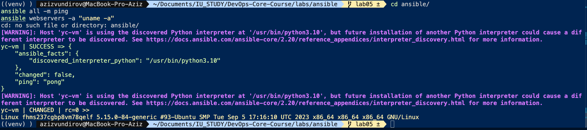
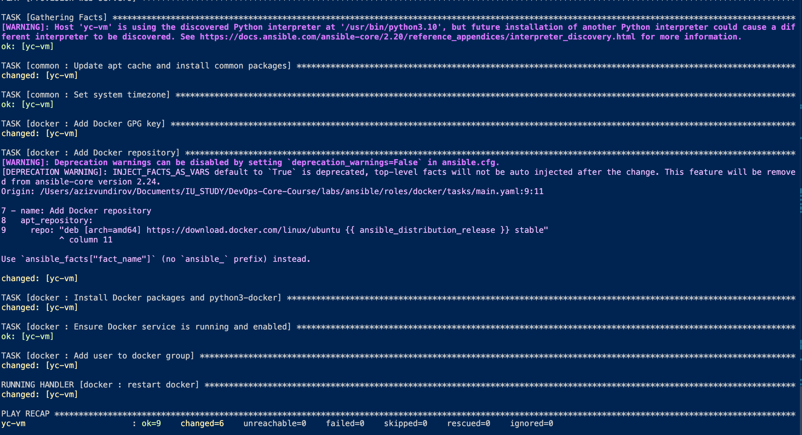
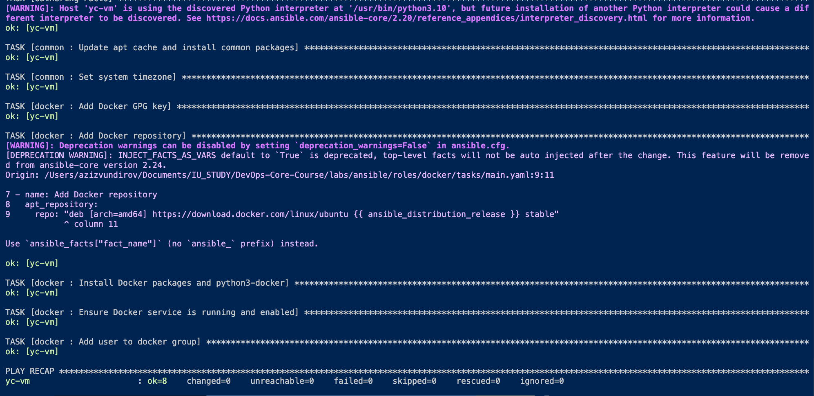
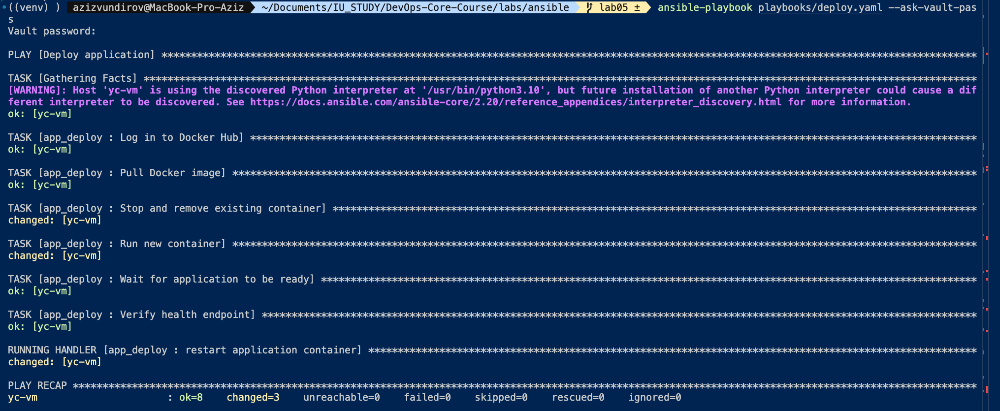
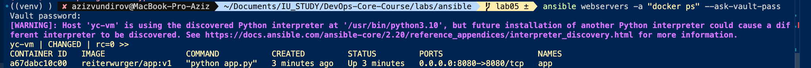
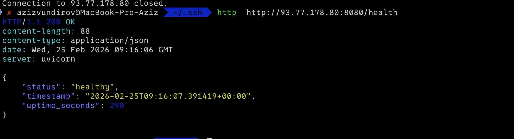

# LAB05 — Ansible Fundamentals (Documentation)

## 1. Architecture Overview
- **Ansible version:** 
```
 ✘ azizvundirov@MacBook-Pro-Aziz  ~/.ssh  ansible --version
ansible [core 2.20.2]
  config file = None
  configured module search path = ['/Users/azizvundirov/.ansible/plugins/modules', '/usr/share/ansible/plugins/modules']
  ansible python module location = /opt/homebrew/Cellar/ansible/13.3.0/libexec/lib/python3.14/site-packages/ansible
  ansible collection location = /Users/azizvundirov/.ansible/collections:/usr/share/ansible/collections
  executable location = /opt/homebrew/bin/ansible
  python version = 3.14.3 (main, Feb  3 2026, 15:32:20) [Clang 17.0.0 (clang-1700.6.3.2)] (/opt/homebrew/Cellar/ansible/13.3.0/libexec/bin/python)
  jinja version = 3.1.6
  pyyaml version = 6.0.3 (with libyaml v0.2.5)
```
- **Target VM OS:** ubuntu
- **Role structure:** common → docker → web_app
- **Why roles:** smaller, reusable, easier to test and maintain than monolithic playbooks.

### Role directory structure
```
ansible/
├── ansible.cfg
├── requirements.yml
├── group_vars/
│   └── all.yml            # Ansible Vault encrypted
├── inventory/
│   └── hosts.ini
├── playbooks/
│   ├── provision.yaml
│   └── deploy.yaml
└── roles/
    ├── common/
    │   ├── defaults/main.yaml
    │   └── tasks/main.yaml
    ├── docker/
    │   ├── defaults/main.yaml
    │   ├── handlers/main.yaml
    │   └── tasks/main.yaml
    └── web_app/
        ├── defaults/main.yaml
        ├── handlers/main.yaml
        ├── meta/main.yaml
        ├── tasks/
        │   ├── main.yaml
        │   └── wipe.yaml
        └── templates/
            └── docker-compose.yml.j2
```

## 2. Roles Documentation

### Role: common
- **Purpose:** base system setup (apt cache, common packages, timezone).
- **Variables (defaults):** `common_packages`, `system_timezone`.
- **Handlers:** none.
- **Dependencies:** none.

### Role: docker
- **Purpose:** install and configure Docker engine and Python SDK.
- **Variables (defaults):** `docker_user`.
- **Handlers:** `restart docker`.
- **Dependencies:** none.

### Role: web_app
- **Purpose:** deploy containerized app via Docker Compose, verify health endpoint, and support wipe logic.
- **Variables (defaults / vault):** `app_name`, `docker_image`, `docker_tag`, `app_port`, `app_internal_port`, `compose_project_dir`, `docker_compose_version`, `web_app_wipe`, `dockerhub_username`, `dockerhub_password`.
- **Handlers:** `restart web_app` (runs `docker_compose_v2` with `state: restarted`).
- **Dependencies:** `docker` role (declared in `meta/main.yaml`).

## 2.5 Connectivity Test

```bash
ansible all -m ping
ansible webservers -a "uname -a"
```

<!-- TODO: screenshot of ansible all -m ping output -->
> **TODO:** add screenshot `screenshots/check-ansible-conection.png`



---

## 3. Idempotency Demonstration

### First run (provision.yml)


### Second run (provision.yml)



**Analysis:**
- **First run**: install all packages
- **Second run:** no changes thanks to idempotency

## 4. Ansible Vault Usage
- **Storage:** secrets in `ansible/group_vars/all.yml` (encrypted).
- **Password management:** --ask-vault-pass
- **Encrypted file example:**
```
$ANSIBLE_VAULT;1.1;AES256
38346235333863303237616366626234316238383334343237623134356633353632636431356337
3764343432626263633234393163353937303732316632650a336133313136633864313431313664
31306636393530666465316563333533316665646663626537623563656433343066366436626434
6163...
```
- **Why Vault:** keeps credentials out of git history and logs.

## 5. Deployment Verification

### deploy.yml run


### Docker container status


### Health check


## 6. Key Decisions
- **Why use roles instead of plain playbooks?** 
Roles break down complex configurations into smaller, manageable units. This prevents "spaghetti code" in playbooks and makes it easier for teams to collaborate on specific parts of the infrastructure.
- **How do roles improve reusability?** Since roles are self-contained, a docker role written for this project can be dropped into any other project without modification. This "LEGO-block" approach saves significant time during infrastructure scaling.
- **What makes a task idempotent?** A task is idempotent if it uses state-defined modules (like state: present or state: started). Instead of executing a command blindly, Ansible checks if the current system state matches the target state and only acts if there is a discrepancy.
- **How do handlers improve efficiency?** Handlers prevent unnecessary service restarts. They only run if a task they are listening to actually reports a change, and even then, they run only once at the end of the play to avoid flapping
- **Why is Ansible Vault necessary?** It allows for the secure inclusion of secrets within a version-controlled repository. Without Vault, credentials would be stored in plaintext, violating basic security principles and risking exposure on platforms like GitHub.

## 7. Challenges (Optional)
- **GPG key timeouts:** Docker's APT GPG key occasionally times out on first request; solved by adding a `rescue` block that waits 10 s and retries.
- **python3-docker vs community.docker:** The `docker_container` module requires `python3-docker` on the managed host; added it to the `docker` role's install list.
- **`app_deploy` → `web_app` rename:** After renaming the role directory, the `deploy.yaml` playbook still referenced the old name; fixed the reference and removed the stale `app_deploy` subdirectory that had ended up inside `web_app`.
- **Vault password workflow:** Used `--ask-vault-pass` during development; the vault password is never stored in the repo.
