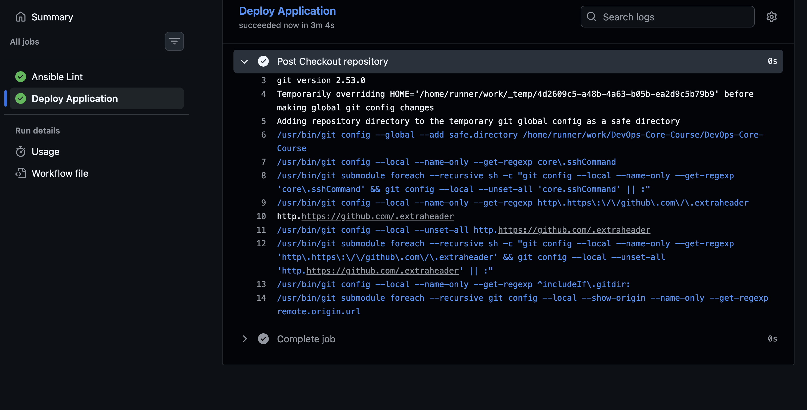
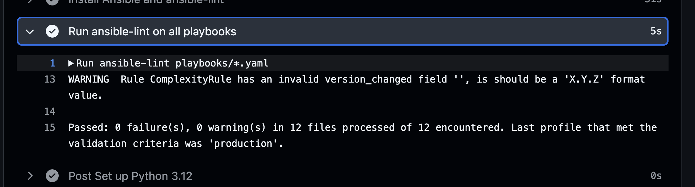
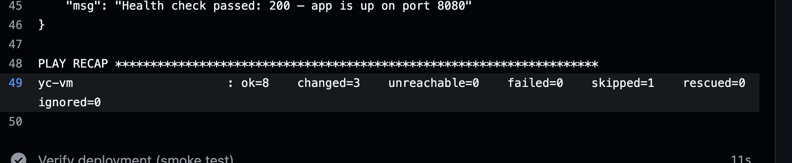
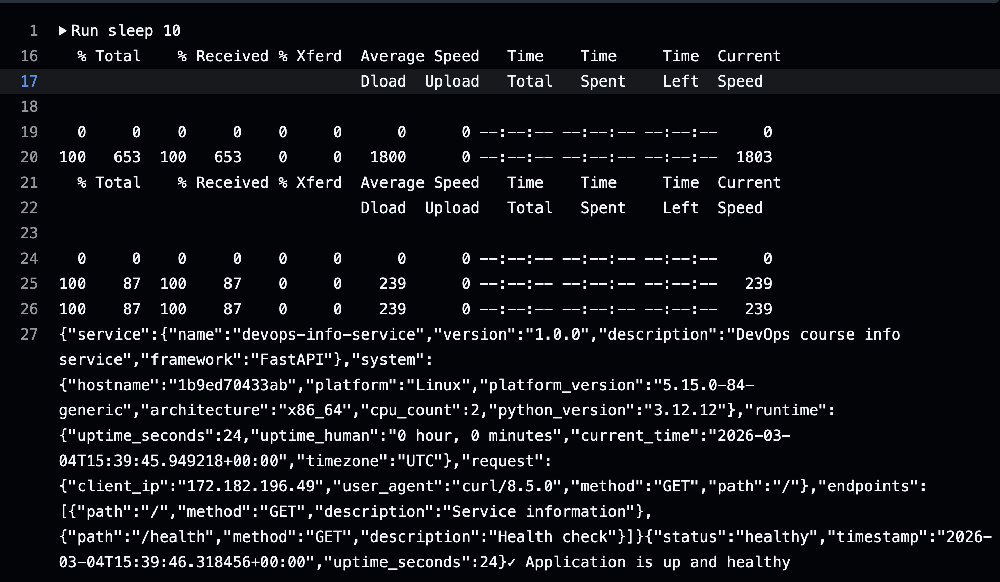

# Lab 6: Advanced Ansible & CI/CD - Submission

**Name:** Aziz Vundirov  
**Date:** 2026-03-04  
**Lab Points:** 10 (+ bonus not implemented)

---

## Overview

In this lab I upgraded Ansible automation from basic role execution to production-style deployment flow:
- Refactored roles using **blocks/rescue/always** and selective **tags**
- Migrated app deployment to **Docker Compose template** (`docker-compose.yml.j2`)
- Added safe **wipe logic** with double gate: variable + tag
- Implemented **GitHub Actions CI/CD** with lint → deploy → verify pipeline

Tech used: Ansible Core 2.16+, community.docker collection, Docker Compose v2, GitHub Actions.

---

## Task 1: Blocks & Tags (2 pts)

### 1.1 `common` role refactor
File: `roles/common/tasks/main.yaml`
- Added `System and Packages Configuration` block
- Added `rescue` with `apt-get update --fix-missing`
- Added `always` log task (`/tmp/common_packages.log`)
- Added `User Management` block with `users` tag
- Removed hardcoded user and switched to `deploy_user` variable

File: `roles/common/defaults/main.yaml`
- Added:
```yaml
deploy_user: "{{ ansible_user }}"
```

### 1.2 `docker` role refactor
File: `roles/docker/tasks/main.yaml`
- Split into two tagged blocks:
  - `docker_install`
  - `docker_config`
- Added `rescue` retry flow for Docker apt/GPG setup
- Added `always` task ensuring docker service started+enabled
- Added `become: true` at block level
- Normalized module calls to FQCN (`ansible.builtin.*`)
- Replaced deprecated fact usage with `ansible_facts['distribution_release']`

### 1.3 Role-level tagging
File: `playbooks/provision.yaml`
- Added explicit role tags:
```yaml
roles:
  - role: common
    tags: [common]
  - role: docker
    tags: [docker]
```

### 1.4 Selective execution evidence
Commands used:
```bash
ansible-playbook playbooks/provision.yaml --tags "docker"
ansible-playbook playbooks/provision.yaml --skip-tags "common"
ansible-playbook playbooks/provision.yaml --tags "packages"
ansible-playbook playbooks/provision.yaml --tags "docker" --check
ansible-playbook playbooks/provision.yaml --tags "docker_install"
```
Result summary from captured output:
- `--tags docker`: only docker tasks executed
- second run showed mostly `ok` (idempotency)
- `--tags packages`: only package-related tasks in `common` block executed

### 1.5 Research answers (Task 1)
1. **What if rescue block fails too?**  
   The task/play fails; `always` still runs.
2. **Can blocks be nested?**  
   Yes, nested blocks are supported.
3. **How do tags inherit in blocks?**  
   Tags on block are inherited by tasks in that block.
   
   ## Outputs
```
((venv) )  ✘ azizvundirov@MacBook-Pro-Aziz  ~/Documents/IU_STUDY/DevOps-Core-Course/labs/ansible   lab06 ±  # Test provision with only docker
ansible-playbook playbooks/provision.yaml --tags "docker"

# Skip common role
ansible-playbook playbooks/provision.yaml --skip-tags "common"

# Install packages only across all roles
ansible-playbook playbooks/provision.yaml --tags "packages"

# Check mode to see what would run
ansible-playbook playbooks/provision.yaml --tags "docker" --check

# Run only docker installation tasks
ansible-playbook playbooks/provision.yaml --tags "docker_install"OC

PLAY [Provision web servers] *****************************************************

TASK [Gathering Facts] ***********************************************************
[WARNING]: Host 'yc-vm' is using the discovered Python interpreter at '/usr/bin/python3.10', but future installation of another Python interpreter could cause a different interpreter to be discovered. See https://docs.ansible.com/ansible-core/2.20/reference_appendices/interpreter_discovery.html for more information.
ok: [yc-vm]

TASK [docker : Add Docker GPG key] ***********************************************
changed: [yc-vm]

TASK [docker : Add Docker repository] ********************************************
[WARNING]: Deprecation warnings can be disabled by setting `deprecation_warnings=False` in ansible.cfg.
[DEPRECATION WARNING]: INJECT_FACTS_AS_VARS default to `True` is deprecated, top-level facts will not be auto injected after the change. This feature will be removed from ansible-core version 2.24.
Origin: /Users/azizvundirov/Documents/IU_STUDY/DevOps-Core-Course/labs/ansible/roles/docker/tasks/main.yaml:12:15

10     - name: Add Docker repository
11       apt_repository:
12         repo: "deb [arch=amd64] https://download.docker.com/linux/ubuntu {{ ansible_distribution_release }} stable"
                 ^ column 15

Use `ansible_facts["fact_name"]` (no `ansible_` prefix) instead.

changed: [yc-vm]

TASK [docker : Install Docker packages and python3-docker] ***********************
changed: [yc-vm]

TASK [docker : Ensure Docker service is running and enabled] *********************
ok: [yc-vm]

TASK [docker : Add user to docker group] *****************************************
changed: [yc-vm]

RUNNING HANDLER [docker : restart docker] ****************************************
changed: [yc-vm]

PLAY RECAP ***********************************************************************
yc-vm                      : ok=7    changed=5    unreachable=0    failed=0    skipped=0    rescued=0    ignored=0   


PLAY [Provision web servers] *****************************************************

TASK [Gathering Facts] ***********************************************************
[WARNING]: Host 'yc-vm' is using the discovered Python interpreter at '/usr/bin/python3.10', but future installation of another Python interpreter could cause a different interpreter to be discovered. See https://docs.ansible.com/ansible-core/2.20/reference_appendices/interpreter_discovery.html for more information.
ok: [yc-vm]

TASK [docker : Add Docker GPG key] ***********************************************
ok: [yc-vm]

TASK [docker : Add Docker repository] ********************************************
[WARNING]: Deprecation warnings can be disabled by setting `deprecation_warnings=False` in ansible.cfg.
[DEPRECATION WARNING]: INJECT_FACTS_AS_VARS default to `True` is deprecated, top-level facts will not be auto injected after the change. This feature will be removed from ansible-core version 2.24.
Origin: /Users/azizvundirov/Documents/IU_STUDY/DevOps-Core-Course/labs/ansible/roles/docker/tasks/main.yaml:12:15

10     - name: Add Docker repository
11       apt_repository:
12         repo: "deb [arch=amd64] https://download.docker.com/linux/ubuntu {{ ansible_distribution_release }} stable"
                 ^ column 15

Use `ansible_facts["fact_name"]` (no `ansible_` prefix) instead.

ok: [yc-vm]

TASK [docker : Install Docker packages and python3-docker] ***********************
ok: [yc-vm]

TASK [docker : Ensure Docker service is running and enabled] *********************
ok: [yc-vm]

TASK [docker : Add user to docker group] *****************************************
ok: [yc-vm]

PLAY RECAP ***********************************************************************
yc-vm                      : ok=6    changed=0    unreachable=0    failed=0    skipped=0    rescued=0    ignored=0   


PLAY [Provision web servers] *****************************************************

TASK [Gathering Facts] ***********************************************************
[WARNING]: Host 'yc-vm' is using the discovered Python interpreter at '/usr/bin/python3.10', but future installation of another Python interpreter could cause a different interpreter to be discovered. See https://docs.ansible.com/ansible-core/2.20/reference_appendices/interpreter_discovery.html for more information.
ok: [yc-vm]

TASK [common : Update apt cache and install common packages] *********************
changed: [yc-vm]

TASK [common : Set system timezone] **********************************************
ok: [yc-vm]

TASK [common : Log package installation completion] ******************************
changed: [yc-vm]

PLAY RECAP ***********************************************************************
yc-vm                      : ok=4    changed=2    unreachable=0    failed=0    skipped=0    rescued=0    ignored=0   


PLAY [Provision web servers] *****************************************************

TASK [Gathering Facts] ***********************************************************
[WARNING]: Host 'yc-vm' is using the discovered Python interpreter at '/usr/bin/python3.10', but future installation of another Python interpreter could cause a different interpreter to be discovered. See https://docs.ansible.com/ansible-core/2.20/reference_appendices/interpreter_discovery.html for more information.
ok: [yc-vm]

TASK [docker : Add Docker GPG key] ***********************************************
ok: [yc-vm]

TASK [docker : Add Docker repository] ********************************************
[WARNING]: Deprecation warnings can be disabled by setting `deprecation_warnings=False` in ansible.cfg.
[DEPRECATION WARNING]: INJECT_FACTS_AS_VARS default to `True` is deprecated, top-level facts will not be auto injected after the change. This feature will be removed from ansible-core version 2.24.
Origin: /Users/azizvundirov/Documents/IU_STUDY/DevOps-Core-Course/labs/ansible/roles/docker/tasks/main.yaml:12:15

10     - name: Add Docker repository
11       apt_repository:
12         repo: "deb [arch=amd64] https://download.docker.com/linux/ubuntu {{ ansible_distribution_release }} stable"
                 ^ column 15

Use `ansible_facts["fact_name"]` (no `ansible_` prefix) instead.

ok: [yc-vm]

TASK [docker : Install Docker packages and python3-docker] ***********************
ok: [yc-vm]

TASK [docker : Ensure Docker service is running and enabled] *********************
ok: [yc-vm]

TASK [docker : Add user to docker group] *****************************************
ok: [yc-vm]

PLAY RECAP ***********************************************************************
yc-vm                      : ok=6    changed=0    unreachable=0    failed=0    skipped=0    rescued=0    ignored=0   


PLAY [Provision web servers] *****************************************************

TASK [Gathering Facts] ***********************************************************
[WARNING]: Host 'yc-vm' is using the discovered Python interpreter at '/usr/bin/python3.10', but future installation of another Python interpreter could cause a different interpreter to be discovered. See https://docs.ansible.com/ansible-core/2.20/reference_appendices/interpreter_discovery.html for more information.
ok: [yc-vm]

PLAY RECAP ***********************************************************************
yc-vm                      : ok=1    changed=0    unreachable=0    failed=0    skipped=0    rescued=0    ignored=0   
```


---

## Task 2: Docker Compose Migration (3 pts)

### 2.1 Role rename and structure
Role is now `web_app` (instead of `app_deploy`), and deploy playbook references `web_app`.

### 2.2 Compose template
File: `roles/web_app/templates/docker-compose.yml.j2`
- Dynamic service, image/tag, ports, env vars
- `restart: unless-stopped`
- `healthcheck` for `/health`
- Named default network: `{{ app_name }}_net`

### 2.3 Role dependency
File: `roles/web_app/meta/main.yaml`
```yaml
dependencies:
  - role: docker
```
This guarantees Docker setup happens before `web_app` deployment.

### 2.4 Deployment implementation
File: `roles/web_app/tasks/main.yaml`
- Create project directory (`/opt/{{ app_name }}`)
- Render compose template
- Deploy with `community.docker.docker_compose_v2`
- Wait for port and verify health endpoint
- On failure, gather compose logs in `rescue`

Tags used:
- `app_deploy`
- `compose`
Output of the
```
 ansible-playbook playbooks/deploy.yml
 ```
```
((venv) )  ✘ azizvundirov@MacBook-Pro-Aziz  ~/Documents/IU_STUDY/DevOps-Core-Course/labs/ansible   lab06 ±  ansible-playbook playbooks/deploy.yaml
# Should automatically run docker role first

PLAY [Deploy application] ************************************************************************************************************

TASK [Gathering Facts] ***************************************************************************************************************
[WARNING]: Host 'yc-vm' is using the discovered Python interpreter at '/usr/bin/python3.10', but future installation of another Python interpreter could cause a different interpreter to be discovered. See https://docs.ansible.com/ansible-core/2.20/reference_appendices/interpreter_discovery.html for more information.
ok: [yc-vm]

TASK [docker : Add Docker GPG key] ***************************************************************************************************
ok: [yc-vm]

TASK [docker : Add Docker repository] ************************************************************************************************
ok: [yc-vm]

TASK [docker : Install Docker packages and python3-docker] ***************************************************************************
ok: [yc-vm]

TASK [docker : Ensure Docker service is running and enabled] *************************************************************************
ok: [yc-vm]

TASK [docker : Add user to docker group] *********************************************************************************************
ok: [yc-vm]

TASK [web_app : Include wipe tasks (runs only when web_app_wipe=true + tag active)] **************************************************
included: /Users/azizvundirov/Documents/IU_STUDY/DevOps-Core-Course/labs/ansible/roles/web_app/tasks/wipe.yaml for yc-vm

TASK [web_app : Take down Docker Compose project (stop + remove containers, networks)] ***********************************************
skipping: [yc-vm]

TASK [web_app : Remove docker-compose.yml file] **************************************************************************************
skipping: [yc-vm]

TASK [web_app : Remove application directory] ****************************************************************************************
skipping: [yc-vm]

TASK [web_app : Log successful wipe] *************************************************************************************************
skipping: [yc-vm]

TASK [web_app : Ensure application directory exists] *********************************************************************************
changed: [yc-vm]

TASK [web_app : Template docker-compose.yml to the VM] *******************************************************************************
changed: [yc-vm]

TASK [web_app : Login to Docker Hub when credentials are provided] *******************************************************************
skipping: [yc-vm]

TASK [web_app : Deploy or update with Docker Compose] ********************************************************************************
changed: [yc-vm]

TASK [web_app : Wait for application port to be open] ********************************************************************************
ok: [yc-vm]

TASK [web_app : Verify application health endpoint] **********************************************************************************
ok: [yc-vm]

TASK [web_app : Show health check response] ******************************************************************************************
ok: [yc-vm] => {
    "msg": "Health check passed: 200 — app is up on port 8080"
}

PLAY RECAP ***************************************************************************************************************************
yc-vm                      : ok=13   changed=3    unreachable=0    failed=0    skipped=5    rescued=0    ignored=0 
```


### 2.5 Variables
Defaults are defined in `roles/web_app/defaults/main.yaml`:
- `app_name`, `docker_image`, `docker_tag`
- `app_port`, `app_internal_port`
- `compose_project_dir`, `docker_compose_version`
- `web_app_wipe`

Secrets are stored in vault-encrypted `group_vars/all.yml`.

## Full deployment
```
((venv) )  ✘ azizvundirov@MacBook-Pro-Aziz  ~/Documents/IU_STUDY/DevOps-Core-Course/labs/ansible   lab06 ±  # Full deployment
ansible-playbook playbooks/deploy.yaml

# Check idempotency (run twice, second should show no changes)
ansible-playbook playbooks/deploy.yaml
ansible-playbook playbooks/deploy.yaml

# Verify on target VM
ssh -i ~/.ssh/yandex_cloud ubuntu@46.21.244.107
docker ps
docker compose -f /opt/app/docker-compose.yml ps
curl http://localhost:8080

PLAY [Deploy application] ************************************************************************************************************

TASK [Gathering Facts] ***************************************************************************************************************
[WARNING]: Host 'yc-vm' is using the discovered Python interpreter at '/usr/bin/python3.10', but future installation of another Python interpreter could cause a different interpreter to be discovered. See https://docs.ansible.com/ansible-core/2.20/reference_appendices/interpreter_discovery.html for more information.
ok: [yc-vm]

TASK [docker : Add Docker GPG key] ***************************************************************************************************
ok: [yc-vm]

TASK [docker : Add Docker repository] ************************************************************************************************
ok: [yc-vm]

TASK [docker : Install Docker packages and python3-docker] ***************************************************************************
ok: [yc-vm]

TASK [docker : Ensure Docker service is running and enabled] *************************************************************************
ok: [yc-vm]

TASK [docker : Add user to docker group] *********************************************************************************************
ok: [yc-vm]

TASK [web_app : Include wipe tasks (runs only when web_app_wipe=true + tag active)] **************************************************
included: /Users/azizvundirov/Documents/IU_STUDY/DevOps-Core-Course/labs/ansible/roles/web_app/tasks/wipe.yaml for yc-vm

TASK [web_app : Take down Docker Compose project (stop + remove containers, networks)] ***********************************************
skipping: [yc-vm]

TASK [web_app : Remove docker-compose.yml file] **************************************************************************************
skipping: [yc-vm]

TASK [web_app : Remove application directory] ****************************************************************************************
skipping: [yc-vm]

TASK [web_app : Log successful wipe] *************************************************************************************************
skipping: [yc-vm]

TASK [web_app : Ensure application directory exists] *********************************************************************************
ok: [yc-vm]

TASK [web_app : Template docker-compose.yml to the VM] *******************************************************************************
ok: [yc-vm]

TASK [web_app : Login to Docker Hub when credentials are provided] *******************************************************************
skipping: [yc-vm]

TASK [web_app : Deploy or update with Docker Compose] ********************************************************************************
ok: [yc-vm]

TASK [web_app : Wait for application port to be open] ********************************************************************************
ok: [yc-vm]

TASK [web_app : Verify application health endpoint] **********************************************************************************
ok: [yc-vm]

TASK [web_app : Show health check response] ******************************************************************************************
ok: [yc-vm] => {
    "msg": "Health check passed: 200 — app is up on port 8080"
}

PLAY RECAP ***************************************************************************************************************************
yc-vm                      : ok=13   changed=0    unreachable=0    failed=0    skipped=5    rescued=0    ignored=0   


PLAY [Deploy application] ************************************************************************************************************

TASK [Gathering Facts] ***************************************************************************************************************
[WARNING]: Host 'yc-vm' is using the discovered Python interpreter at '/usr/bin/python3.10', but future installation of another Python interpreter could cause a different interpreter to be discovered. See https://docs.ansible.com/ansible-core/2.20/reference_appendices/interpreter_discovery.html for more information.
ok: [yc-vm]

TASK [docker : Add Docker GPG key] ***************************************************************************************************
ok: [yc-vm]

TASK [docker : Add Docker repository] ************************************************************************************************
ok: [yc-vm]

TASK [docker : Install Docker packages and python3-docker] ***************************************************************************
ok: [yc-vm]

TASK [docker : Ensure Docker service is running and enabled] *************************************************************************
ok: [yc-vm]

TASK [docker : Add user to docker group] *********************************************************************************************
ok: [yc-vm]

TASK [web_app : Include wipe tasks (runs only when web_app_wipe=true + tag active)] **************************************************
included: /Users/azizvundirov/Documents/IU_STUDY/DevOps-Core-Course/labs/ansible/roles/web_app/tasks/wipe.yaml for yc-vm

TASK [web_app : Take down Docker Compose project (stop + remove containers, networks)] ***********************************************
skipping: [yc-vm]

TASK [web_app : Remove docker-compose.yml file] **************************************************************************************
skipping: [yc-vm]

TASK [web_app : Remove application directory] ****************************************************************************************
skipping: [yc-vm]

TASK [web_app : Log successful wipe] *************************************************************************************************
skipping: [yc-vm]

TASK [web_app : Ensure application directory exists] *********************************************************************************
ok: [yc-vm]

TASK [web_app : Template docker-compose.yml to the VM] *******************************************************************************
ok: [yc-vm]

TASK [web_app : Login to Docker Hub when credentials are provided] *******************************************************************
skipping: [yc-vm]

TASK [web_app : Deploy or update with Docker Compose] ********************************************************************************
ok: [yc-vm]

TASK [web_app : Wait for application port to be open] ********************************************************************************
ok: [yc-vm]

TASK [web_app : Verify application health endpoint] **********************************************************************************
ok: [yc-vm]

TASK [web_app : Show health check response] ******************************************************************************************
ok: [yc-vm] => {
    "msg": "Health check passed: 200 — app is up on port 8080"
}

PLAY RECAP ***************************************************************************************************************************
yc-vm                      : ok=13   changed=0    unreachable=0    failed=0    skipped=5    rescued=0    ignored=0   


PLAY [Deploy application] ************************************************************************************************************

TASK [Gathering Facts] ***************************************************************************************************************
[WARNING]: Host 'yc-vm' is using the discovered Python interpreter at '/usr/bin/python3.10', but future installation of another Python interpreter could cause a different interpreter to be discovered. See https://docs.ansible.com/ansible-core/2.20/reference_appendices/interpreter_discovery.html for more information.
ok: [yc-vm]

TASK [docker : Add Docker GPG key] ***************************************************************************************************
ok: [yc-vm]

TASK [docker : Add Docker repository] ************************************************************************************************
ok: [yc-vm]

TASK [docker : Install Docker packages and python3-docker] ***************************************************************************
ok: [yc-vm]

TASK [docker : Ensure Docker service is running and enabled] *************************************************************************
ok: [yc-vm]

TASK [docker : Add user to docker group] *********************************************************************************************
ok: [yc-vm]

TASK [web_app : Include wipe tasks (runs only when web_app_wipe=true + tag active)] **************************************************
included: /Users/azizvundirov/Documents/IU_STUDY/DevOps-Core-Course/labs/ansible/roles/web_app/tasks/wipe.yaml for yc-vm

TASK [web_app : Take down Docker Compose project (stop + remove containers, networks)] ***********************************************
skipping: [yc-vm]

TASK [web_app : Remove docker-compose.yml file] **************************************************************************************
skipping: [yc-vm]

TASK [web_app : Remove application directory] ****************************************************************************************
skipping: [yc-vm]

TASK [web_app : Log successful wipe] *************************************************************************************************
skipping: [yc-vm]

TASK [web_app : Ensure application directory exists] *********************************************************************************
ok: [yc-vm]

TASK [web_app : Template docker-compose.yml to the VM] *******************************************************************************
ok: [yc-vm]

TASK [web_app : Login to Docker Hub when credentials are provided] *******************************************************************
skipping: [yc-vm]

TASK [web_app : Deploy or update with Docker Compose] ********************************************************************************
ok: [yc-vm]

TASK [web_app : Wait for application port to be open] ********************************************************************************
ok: [yc-vm]

TASK [web_app : Verify application health endpoint] **********************************************************************************
ok: [yc-vm]

TASK [web_app : Show health check response] ******************************************************************************************
ok: [yc-vm] => {
    "msg": "Health check passed: 200 — app is up on port 8080"
}

PLAY RECAP ***************************************************************************************************************************
yc-vm                      : ok=13   changed=0    unreachable=0    failed=0    skipped=5    rescued=0    ignored=0   

Welcome to Ubuntu 22.04.3 LTS (GNU/Linux 5.15.0-84-generic x86_64)

 * Documentation:  https://help.ubuntu.com
 * Management:     https://landscape.canonical.com
 * Support:        https://ubuntu.com/advantage

  System information as of Wed Mar  4 02:37:52 PM UTC 2026

  System load:                      0.2353515625
  Usage of /:                       51.2% of 9.76GB
  Memory usage:                     19%
  Swap usage:                       0%
  Processes:                        142
  Users logged in:                  1
  IPv4 address for br-8e7a7251c950: 172.18.0.1
  IPv4 address for docker0:         172.17.0.1
  IPv4 address for eth0:            192.168.10.10

 * Strictly confined Kubernetes makes edge and IoT secure. Learn how MicroK8s
   just raised the bar for easy, resilient and secure K8s cluster deployment.

   https://ubuntu.com/engage/secure-kubernetes-at-the-edge

Expanded Security Maintenance for Applications is not enabled.

250 updates can be applied immediately.
175 of these updates are standard security updates.
To see these additional updates run: apt list --upgradable

Enable ESM Apps to receive additional future security updates.
See https://ubuntu.com/esm or run: sudo pro status

New release '24.04.4 LTS' available.
Run 'do-release-upgrade' to upgrade to it.


*** System restart required ***
Last login: Wed Mar  4 14:37:50 2026 from 185.155.99.161
ubuntu@fhmbqkh9s5jhf0son9ea:~$ docker ps
docker compose -f /opt/app/docker-compose.yml ps
curl http://localhost:8080
CONTAINER ID   IMAGE                 COMMAND           CREATED          STATUS                      PORTS                                         NAMES
8351071a42c8   reiterwurger/app:v1   "python app.py"   10 minutes ago   Up 10 minutes (unhealthy)   0.0.0.0:8080->8080/tcp, [::]:8080->8080/tcp   app
Command 'docker-compose' not found, but can be installed with:
sudo snap install docker          # version 20.10.24, or
sudo apt  install docker-compose  # version 1.29.2-1
See 'snap info docker' for additional versions.
{"service":{"name":"devops-info-service","version":"1.0.0","description":"DevOps course info service","framework":"FastAPI"},"system":{"hostname":"8351071a42c8","platform":"Linux","platform_version":"5.15.0-84-generic","architecture":"x86_64","cpu_count":2,"python_version":"3.12.12"},"runtime":{"uptime_seconds":617,"uptime_human":"0 hour, 10 minutes","current_time":"2026-03-04T14:38:20.154430+00:00","timezone":"UTC"},"request":{"client_ip":"172.18.0.1","user_agent":"curl/7.81.0","method":"GET","path":"/"},"endpoints":[{"path":"/","method":"GET","description":"Service information"},{"path":"/health","method":"GET","description":"Health check"}]}ubuntu@fhmbqkh9s5jhf0son9ea:~$ 

```
### 2.6 Research answers (Task 2)
1. **`always` vs `unless-stopped` restart policy:**  
   `always` restarts even after manual stop; `unless-stopped` respects manual stop.
2. **Compose network vs default bridge:**  
   Compose creates project-scoped isolated networks with automatic service DNS.
3. **Can Vault variables be used in templates?**  
   Yes; once decrypted by Ansible they are regular variables in Jinja2 templates.

---

## Task 3: Wipe Logic (1 pt)

### 3.1 Implementation
File: `roles/web_app/tasks/wipe.yaml`
- Compose down (`state: absent`)
- Remove compose file
- Remove project directory
- Log wipe completion

File: `roles/web_app/tasks/main.yaml`
- `include_tasks: wipe.yaml` placed at top (before deploy block)

File: `roles/web_app/defaults/main.yaml`
```yaml
web_app_wipe: false
```

### 3.2 Safety model (double gate)
Wipe runs only when:
- `web_app_wipe | bool == true`
- `web_app_wipe` tag is active

This prevents accidental destructive execution during normal deployment.

### 3.3 Test scenarios
1. Normal deploy: wipe skipped
```
((venv) )  azizvundirov@MacBook-Pro-Aziz  ~/Documents/IU_STUDY/DevOps-Core-Course/labs/ansible   lab06 ±  ansible-playbook playbooks/deploy.yaml

# Verify: app deploys normally, wipe tasks skipped (tag not specified)
ssh ubuntu@46.21.244.107  "docker ps"

PLAY [Deploy application] ********************************************************************************************************************************************************************************

TASK [Gathering Facts] ***********************************************************************************************************************************************************************************
[WARNING]: Host 'yc-vm' is using the discovered Python interpreter at '/usr/bin/python3.10', but future installation of another Python interpreter could cause a different interpreter to be discovered. See https://docs.ansible.com/ansible-core/2.20/reference_appendices/interpreter_discovery.html for more information.
ok: [yc-vm]

TASK [docker : Add Docker GPG key] ***********************************************************************************************************************************************************************
ok: [yc-vm]

TASK [docker : Add Docker repository] ********************************************************************************************************************************************************************
ok: [yc-vm]

TASK [docker : Install Docker packages and python3-docker] ***********************************************************************************************************************************************
ok: [yc-vm]

TASK [docker : Ensure Docker service is running and enabled] *********************************************************************************************************************************************
ok: [yc-vm]

TASK [docker : Add user to docker group] *****************************************************************************************************************************************************************
ok: [yc-vm]

TASK [web_app : Include wipe tasks (runs only when web_app_wipe=true + tag active)] **********************************************************************************************************************
included: /Users/azizvundirov/Documents/IU_STUDY/DevOps-Core-Course/labs/ansible/roles/web_app/tasks/wipe.yaml for yc-vm

TASK [web_app : Take down Docker Compose project (stop + remove containers, networks)] *******************************************************************************************************************
skipping: [yc-vm]

TASK [web_app : Remove docker-compose.yml file] **********************************************************************************************************************************************************
skipping: [yc-vm]

TASK [web_app : Remove application directory] ************************************************************************************************************************************************************
skipping: [yc-vm]

TASK [web_app : Log successful wipe] *********************************************************************************************************************************************************************
skipping: [yc-vm]

TASK [web_app : Ensure application directory exists] *****************************************************************************************************************************************************
ok: [yc-vm]

TASK [web_app : Template docker-compose.yml to the VM] ***************************************************************************************************************************************************
ok: [yc-vm]

TASK [web_app : Login to Docker Hub when credentials are provided] ***************************************************************************************************************************************
skipping: [yc-vm]

TASK [web_app : Deploy or update with Docker Compose] ****************************************************************************************************************************************************
ok: [yc-vm]

TASK [web_app : Wait for application port to be open] ****************************************************************************************************************************************************
ok: [yc-vm]

TASK [web_app : Verify application health endpoint] ******************************************************************************************************************************************************
ok: [yc-vm]

TASK [web_app : Show health check response] **************************************************************************************************************************************************************
ok: [yc-vm] => {
    "msg": "Health check passed: 200 — app is up on port 8080"
}

PLAY RECAP ***********************************************************************************************************************************************************************************************
yc-vm                      : ok=13   changed=0    unreachable=0    failed=0    skipped=5    rescued=0    ignored=0   

CONTAINER ID   IMAGE                 COMMAND           CREATED          STATUS                      PORTS                                         NAMES
8351071a42c8   reiterwurger/app:v1   "python app.py"   18 minutes ago   Up 18 minutes (unhealthy)   0.0.0.0:8080->8080/tcp, [::]:8080->8080/tcp   app
```


2. Wipe only: `-e "web_app_wipe=true" --tags web_app_wipe`
```
(venv) )  ✘ azizvundirov@MacBook-Pro-Aziz  ~/Documents/IU_STUDY/DevOps-Core-Course/labs/ansible   lab06 ±  ansible-playbook playbooks/deploy.yaml \
  -e "web_app_wipe=true" \
  --tags web_app_wipe

# Verify: app should be removed, deployment skipped
ssh ubuntu@46.21.244.107  "docker ps"  # Should not show app
ssh ubuntu@46.21.244.107  "ls /opt"    # Should not have app directory

PLAY [Deploy application] ************************************************************************************************************

TASK [Gathering Facts] ***************************************************************************************************************
[WARNING]: Host 'yc-vm' is using the discovered Python interpreter at '/usr/bin/python3.10', but future installation of another Python interpreter could cause a different interpreter to be discovered. See https://docs.ansible.com/ansible-core/2.20/reference_appendices/interpreter_discovery.html for more information.
ok: [yc-vm]

TASK [web_app : Include wipe tasks (runs only when web_app_wipe=true + tag active)] **************************************************
included: /Users/azizvundirov/Documents/IU_STUDY/DevOps-Core-Course/labs/ansible/roles/web_app/tasks/wipe.yaml for yc-vm

TASK [web_app : Check compose project directory state] *******************************************************************************
ok: [yc-vm]

TASK [web_app : Take down Docker Compose project (stop + remove containers, networks)] ***********************************************
skipping: [yc-vm]

TASK [web_app : Skip compose down when project directory is absent] ******************************************************************
ok: [yc-vm] => {
    "msg": "Skip compose down: /opt/app does not exist"
}

TASK [web_app : Skip compose down when project path is not directory] ****************************************************************
skipping: [yc-vm]

TASK [web_app : Remove docker-compose.yml file] **************************************************************************************
skipping: [yc-vm]

TASK [web_app : Remove application directory] ****************************************************************************************
ok: [yc-vm]

TASK [web_app : Log successful wipe] *************************************************************************************************
ok: [yc-vm] => {
    "msg": "✓ Application \"app\" wiped from /opt/app. Re-run without --tags web_app_wipe to deploy fresh.\n"
}

PLAY RECAP ***************************************************************************************************************************
yc-vm                      : ok=6    changed=0    unreachable=0    failed=0    skipped=3    rescued=0    ignored=0   

CONTAINER ID   IMAGE     COMMAND   CREATED   STATUS    PORTS     NAMES
containerd
devops-app
```
3. Clean reinstall: `-e "web_app_wipe=true"` (wipe first, then deploy)

```
((venv) )  ✘ azizvundirov@MacBook-Pro-Aziz  ~/Documents/IU_STUDY/DevOps-Core-Course/labs/ansible   lab06 ±  # This is the KEY use case: fresh start
ansible-playbook playbooks/deploy.yaml \
  -e "web_app_wipe=true"

# What happens:
# 1. Wipe tasks run first (remove old installation)
# 2. Deployment tasks run second (install fresh)
# Result: clean reinstallation

# Verify: old app removed, new app running
ssh ubuntu@46.21.244.107  "docker ps"

PLAY [Deploy application] ************************************************************************************************************

TASK [Gathering Facts] ***************************************************************************************************************
[WARNING]: Host 'yc-vm' is using the discovered Python interpreter at '/usr/bin/python3.10', but future installation of another Python interpreter could cause a different interpreter to be discovered. See https://docs.ansible.com/ansible-core/2.20/reference_appendices/interpreter_discovery.html for more information.
ok: [yc-vm]

TASK [docker : Add Docker GPG key] ***************************************************************************************************
ok: [yc-vm]

TASK [docker : Add Docker repository] ************************************************************************************************
ok: [yc-vm]

TASK [docker : Install Docker packages and python3-docker] ***************************************************************************
ok: [yc-vm]

TASK [docker : Ensure Docker service is running and enabled] *************************************************************************
ok: [yc-vm]

TASK [docker : Add user to docker group] *********************************************************************************************
ok: [yc-vm]

TASK [web_app : Include wipe tasks (runs only when web_app_wipe=true + tag active)] **************************************************
included: /Users/azizvundirov/Documents/IU_STUDY/DevOps-Core-Course/labs/ansible/roles/web_app/tasks/wipe.yaml for yc-vm

TASK [web_app : Check compose project directory state] *******************************************************************************
ok: [yc-vm]

TASK [web_app : Take down Docker Compose project (stop + remove containers, networks)] ***********************************************
skipping: [yc-vm]

TASK [web_app : Skip compose down when project directory is absent] ******************************************************************
ok: [yc-vm] => {
    "msg": "Skip compose down: /opt/app does not exist"
}

TASK [web_app : Skip compose down when project path is not directory] ****************************************************************
skipping: [yc-vm]

TASK [web_app : Remove docker-compose.yml file] **************************************************************************************
skipping: [yc-vm]

TASK [web_app : Remove application directory] ****************************************************************************************
ok: [yc-vm]

TASK [web_app : Log successful wipe] *************************************************************************************************
ok: [yc-vm] => {
    "msg": "✓ Application \"app\" wiped from /opt/app. Re-run without --tags web_app_wipe to deploy fresh.\n"
}

TASK [web_app : Ensure application directory exists] *********************************************************************************
changed: [yc-vm]

TASK [web_app : Template docker-compose.yml to the VM] *******************************************************************************
changed: [yc-vm]

TASK [web_app : Login to Docker Hub when credentials are provided] *******************************************************************
skipping: [yc-vm]

TASK [web_app : Deploy or update with Docker Compose] ********************************************************************************
changed: [yc-vm]

TASK [web_app : Wait for application port to be open] ********************************************************************************
ok: [yc-vm]

TASK [web_app : Verify application health endpoint] **********************************************************************************
ok: [yc-vm]

TASK [web_app : Show health check response] ******************************************************************************************
ok: [yc-vm] => {
    "msg": "Health check passed: 200 — app is up on port 8080"
}

PLAY RECAP ***************************************************************************************************************************
yc-vm                      : ok=17   changed=3    unreachable=0    failed=0    skipped=4    rescued=0    ignored=0   

CONTAINER ID   IMAGE                 COMMAND           CREATED          STATUS                             PORTS                                         NAMES
3da12c5fe284   reiterwurger/app:v1   "python app.py"   11 seconds ago   Up 10 seconds (health: starting)   0.0.0.0:8080->8080/tcp, [::]:8080->8080/tcp   app
```
4. Safety check: `--tags web_app_wipe` with default `web_app_wipe=false` => skipped
```
((venv) )  ✘ azizvundirov@MacBook-Pro-Aziz  ~/Documents/IU_STUDY/DevOps-Core-Course/labs/ansible   lab06 ±  # 4a: Tag specified but variable false (when condition blocks it)
ansible-playbook playbooks/deploy.yaml --tags web_app_wipe
# Result: wipe tasks skipped, deployment runs normally

# 4b: Variable true, deployment skipped (only wipe runs)
ansible-playbook playbooks/deploy.yaml \
  -e "web_app_wipe=true" \
  --tags web_app_wipe
# Result: only wipe, no deployment

PLAY [Deploy application] ************************************************************************************************************

TASK [Gathering Facts] ***************************************************************************************************************
[WARNING]: Host 'yc-vm' is using the discovered Python interpreter at '/usr/bin/python3.10', but future installation of another Python interpreter could cause a different interpreter to be discovered. See https://docs.ansible.com/ansible-core/2.20/reference_appendices/interpreter_discovery.html for more information.
ok: [yc-vm]

TASK [web_app : Include wipe tasks (runs only when web_app_wipe=true + tag active)] **************************************************
included: /Users/azizvundirov/Documents/IU_STUDY/DevOps-Core-Course/labs/ansible/roles/web_app/tasks/wipe.yaml for yc-vm

TASK [web_app : Check compose project directory state] *******************************************************************************
skipping: [yc-vm]

TASK [web_app : Take down Docker Compose project (stop + remove containers, networks)] ***********************************************
skipping: [yc-vm]

TASK [web_app : Skip compose down when project directory is absent] ******************************************************************
skipping: [yc-vm]

TASK [web_app : Skip compose down when project path is not directory] ****************************************************************
skipping: [yc-vm]

TASK [web_app : Remove docker-compose.yml file] **************************************************************************************
skipping: [yc-vm]

TASK [web_app : Remove application directory] ****************************************************************************************
skipping: [yc-vm]

TASK [web_app : Log successful wipe] *************************************************************************************************
skipping: [yc-vm]

PLAY RECAP ***************************************************************************************************************************
yc-vm                      : ok=2    changed=0    unreachable=0    failed=0    skipped=7    rescued=0    ignored=0   


PLAY [Deploy application] ************************************************************************************************************

TASK [Gathering Facts] ***************************************************************************************************************
[WARNING]: Host 'yc-vm' is using the discovered Python interpreter at '/usr/bin/python3.10', but future installation of another Python interpreter could cause a different interpreter to be discovered. See https://docs.ansible.com/ansible-core/2.20/reference_appendices/interpreter_discovery.html for more information.
ok: [yc-vm]

TASK [web_app : Include wipe tasks (runs only when web_app_wipe=true + tag active)] **************************************************
included: /Users/azizvundirov/Documents/IU_STUDY/DevOps-Core-Course/labs/ansible/roles/web_app/tasks/wipe.yaml for yc-vm

TASK [web_app : Check compose project directory state] *******************************************************************************
ok: [yc-vm]

TASK [web_app : Take down Docker Compose project (stop + remove containers, networks)] ***********************************************
changed: [yc-vm]

TASK [web_app : Skip compose down when project directory is absent] ******************************************************************
skipping: [yc-vm]

TASK [web_app : Skip compose down when project path is not directory] ****************************************************************
skipping: [yc-vm]

TASK [web_app : Remove docker-compose.yml file] **************************************************************************************
changed: [yc-vm]

TASK [web_app : Remove application directory] ****************************************************************************************
changed: [yc-vm]

TASK [web_app : Log successful wipe] *************************************************************************************************
ok: [yc-vm] => {
    "msg": "✓ Application \"app\" wiped from /opt/app. Re-run without --tags web_app_wipe to deploy fresh.\n"
}

PLAY RECAP ***************************************************************************************************************************
yc-vm                      : ok=7    changed=3    unreachable=0    failed=0    skipped=2    rescued=0    ignored=0   

```
### 3.4 Research answers (Task 3)
1. **Why variable + tag?**  
   Double confirmation for destructive operations (defense in depth).
2. **Difference from `never` tag?**  
   `never` is tag-only gating; here we additionally require runtime variable approval.
3. **Why wipe before deployment?**  
   To enable deterministic clean reinstall flow.
4. **Clean reinstall vs rolling update?**  
   Clean reinstall for drift/corruption reset; rolling update for zero/minimal downtime.
5. **How to extend wipe to images/volumes?**  
   Add `remove_volumes: true` in compose down and optional image prune/remove tasks.

---

## Task 4: CI/CD with GitHub Actions (3 pts)

### 4.1 Workflow
File: `.github/workflows/ansible-deploy.yml`
Pipeline:
1. Trigger on Ansible path changes
2. Lint job (`ansible-lint`)
3. Deploy job (provision + deploy playbooks)
4. Post-deploy HTTP verification (`/` and `/health`)

### 4.2 Security and secrets
Used secrets:
- `ANSIBLE_VAULT_PASSWORD`
- `SSH_PRIVATE_KEY`
- `VM_HOST`

Workflow writes vault password to temp file and deletes it in cleanup step.

### 4.3 Path filters
Workflow excludes docs-only changes in `labs/ansible/docs/**`, reducing unnecessary runs.

### 4.4 Verification






### 4.5 Research answers (Task 4)
1. **Risks of SSH keys in GitHub Secrets:**  
   Secret leakage via workflow misuse, over-privileged keys, and compromised runners; mitigate with least privilege and key rotation.
2. **How to do staging → production:**  
   Separate jobs/environments, manual approval gate, and promotion after staging health checks.
3. **How to support rollback:**  
   Use immutable image tags + tracked release metadata + rollback job to previous known-good tag.
4. **Why self-hosted runner can improve security:**  
   Full control over runner network, access boundaries, and hardening baseline.

