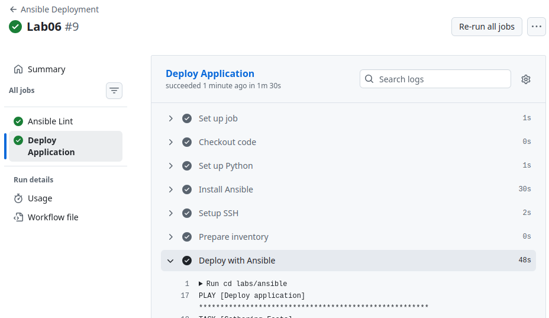

# Lab 06 #

## Task 1: Blocks & Tags ##

### Proofs ###

```bash
ansible-playbook playbooks/provision.yml --tags "docker"
```


```bash
TASK [docker : Remove conflicting packages] ****************************************************************************************************************************************************
ok: [compute-vm-2-2-20-ssd-1771947628469]

TASK [docker : Add Docker GPG key] *************************************************************************************************************************************************************
ok: [compute-vm-2-2-20-ssd-1771947628469]

TASK [docker : Add Docker repository] **********************************************************************************************************************************************************
ok: [compute-vm-2-2-20-ssd-1771947628469]

TASK [docker : Install Docker packages] ********************************************************************************************************************************************************
ok: [compute-vm-2-2-20-ssd-1771947628469]

TASK [docker : Ensure Docker service is enabled] ***********************************************************************************************************************************************
ok: [compute-vm-2-2-20-ssd-1771947628469]

TASK [docker : Add user to docker group] *******************************************************************************************************************************************************
ok: [compute-vm-2-2-20-ssd-1771947628469]

TASK [docker : Install Python Docker module] ***************************************************************************************************************************************************
ok: [compute-vm-2-2-20-ssd-1771947628469]

PLAY RECAP *************************************************************************************************************************************************************************************
compute-vm-2-2-20-ssd-1771947628469 : ok=8    changed=0    unreachable=0    failed=0    skipped=0    rescued=0    ignored=0  
```

### With error: 

```bash
ansible-playbook playbooks/provision.yml --skip-tags "docker"
```

```bash
PLAY [Provision web servers] *******************************************************************************************************************************************************************

TASK [Gathering Facts] *************************************************************************************************************************************************************************
ok: [compute-vm-2-2-20-ssd-1771947628469]

TASK [common : Update apt cache] ***************************************************************************************************************************************************************
changed: [compute-vm-2-2-20-ssd-1771947628469]

TASK [common : Install common packages] ********************************************************************************************************************************************************
ok: [compute-vm-2-2-20-ssd-1771947628469]

TASK [common : Set timezone] ***************PLAY [Provision web servers] *******************************************************************************************************************************************************************

TASK [Gathering Facts] *************************************************************************************************************************************************************************
ok: [compute-vm-2-2-20-ssd-1771947628469]

TASK [docker : Remove conflicting packages] ****************************************************************************************************************************************************
ok: [compute-vm-2-2-20-ssd-1771947628469]

TASK [docker : Add Docker GPG key] *************************************************************************************************************************************************************
fatal: [compute-vm-2-2-20-ssd-1771947628469]: FAILED! => {"changed": false, "msg": "Failed to download key at https://download.docker.com/linux/ubntu/gpg: HTTP Error 404: Not Found"}

TASK [docker : Wait and retry apt update (GPG key may need time)] ******************************************************************************************************************************
fatal: [compute-vm-2-2-20-ssd-1771947628469 -> localhost]: FAILED! => {"changed": false, "module_stderr": "sudo: a password is required\n", "module_stdout": "", "msg": "MODULE FAILURE\nSee stdout/stderr for the exact error", "rc": 1}

TASK [docker : Ensure Docker service is enabled] ***********************************************************************************************************************************************
fatal: [compute-vm-2-2-20-ssd-1771947628469]: FAILED! => {"msg": "The conditional check 'install_result is success' failed. The error was: The 'failed' test expects a dictionary\n\nThe error appears to be in '/home/vexell/DevOps/DevOps-Core-Course/labs/ansible/roles/docker/tasks/main.yml': line 52, column 7, but may\nbe elsewhere in the file depending on the exact syntax problem.\n\nThe offending line appears to be:\n\n  always:\n    - name: Ensure Docker service is enabled\n      ^ here\n"}

PLAY RECAP *************************************************************************************************************************************************************************************
compute-vm-2-2-20-ssd-1771947628469 : ok=2    changed=0    unreachable=0    failed=2    skipped=0    rescued=1    ignored=0      
```

### Tags list

```bash
ansible-playbook playbooks/provision.yml --list-tags
```

```bash
playbook: playbooks/provision.yml

  play #1 (all): Provision web servers  TAGS: []
      TASK TAGS: [common, docker, docker_config, docker_install, packages]
```

### Research Questions: ###

- If the rescue block itself fails, Ansible considers the overall block as failed.

- Yes, blocks can be nested.

- Tags applied to a block are inherited by all tasks inside that block (including nested blocks) by default. However, if a task within the block defines its own tags directive, those tags override the block’s tags for that specific task—they do not merge.


## Task 2: Docker Compose ## 

### First deploy

```bash
ansible-playbook playbooks/deploy.yml --ask-vault-pass
```

```bash
PLAY [Deploy application] **********************************************************************************************************************************************************************

TASK [Gathering Facts] *************************************************************************************************************************************************************************
ok: [compute-vm-2-2-20-ssd-1771947628469]

TASK [docker : Remove conflicting packages] ****************************************************************************************************************************************************
ok: [compute-vm-2-2-20-ssd-1771947628469]

TASK [docker : Add Docker GPG key] *************************************************************************************************************************************************************
ok: [compute-vm-2-2-20-ssd-1771947628469]

TASK [docker : Add Docker repository] **********************************************************************************************************************************************************
ok: [compute-vm-2-2-20-ssd-1771947628469]

TASK [docker : Install Docker packages] ********************************************************************************************************************************************************
ok: [compute-vm-2-2-20-ssd-1771947628469]

TASK [docker : Ensure Docker service is enabled] ***********************************************************************************************************************************************
ok: [compute-vm-2-2-20-ssd-1771947628469]

TASK [docker : Add user to docker group] *******************************************************************************************************************************************************
ok: [compute-vm-2-2-20-ssd-1771947628469]

TASK [docker : Install Python Docker module] ***************************************************************************************************************************************************
ok: [compute-vm-2-2-20-ssd-1771947628469]

TASK [web_app : Remove existing container] *****************************************************************************************************************************************************
changed: [compute-vm-2-2-20-ssd-1771947628469]

TASK [web_app : Create application directory] **************************************************************************************************************************************************
ok: [compute-vm-2-2-20-ssd-1771947628469]

TASK [web_app : Template docker-compose.yml] ***************************************************************************************************************************************************
ok: [compute-vm-2-2-20-ssd-1771947628469]

TASK [web_app : Deploy with Docker Compose] ****************************************************************************************************************************************************
changed: [compute-vm-2-2-20-ssd-1771947628469]

PLAY RECAP *************************************************************************************************************************************************************************************
compute-vm-2-2-20-ssd-1771947628469 : ok=12   changed=2    unreachable=0    failed=0    skipped=0    rescued=0    ignored=0  
```

### Second deploy:

```bash

PLAY [Deploy application] **********************************************************************************************************************************************************************

TASK [Gathering Facts] *************************************************************************************************************************************************************************
ok: [compute-vm-2-2-20-ssd-1771947628469]

TASK [docker : Remove conflicting packages] ****************************************************************************************************************************************************
ok: [compute-vm-2-2-20-ssd-1771947628469]

TASK [docker : Add Docker GPG key] *************************************************************************************************************************************************************
ok: [compute-vm-2-2-20-ssd-1771947628469]

TASK [docker : Add Docker repository] **********************************************************************************************************************************************************
ok: [compute-vm-2-2-20-ssd-1771947628469]

TASK [docker : Install Docker packages] ********************************************************************************************************************************************************
ok: [compute-vm-2-2-20-ssd-1771947628469]

TASK [docker : Ensure Docker service is enabled] ***********************************************************************************************************************************************
ok: [compute-vm-2-2-20-ssd-1771947628469]

TASK [docker : Add user to docker group] *******************************************************************************************************************************************************
ok: [compute-vm-2-2-20-ssd-1771947628469]

TASK [docker : Install Python Docker module] ***************************************************************************************************************************************************
ok: [compute-vm-2-2-20-ssd-1771947628469]

TASK [web_app : Check if container exists and is managed by Compose] ***************************************************************************************************************************
ok: [compute-vm-2-2-20-ssd-1771947628469]

TASK [web_app : Remove old container if it exists and is NOT managed by Compose] ***************************************************************************************************************
skipping: [compute-vm-2-2-20-ssd-1771947628469]

TASK [web_app : Create application directory] **************************************************************************************************************************************************
ok: [compute-vm-2-2-20-ssd-1771947628469]

TASK [web_app : Template docker-compose.yml] ***************************************************************************************************************************************************
ok: [compute-vm-2-2-20-ssd-1771947628469]

TASK [web_app : Deploy with Docker Compose] ****************************************************************************************************************************************************
ok: [compute-vm-2-2-20-ssd-1771947628469]

PLAY RECAP *************************************************************************************************************************************************************************************
compute-vm-2-2-20-ssd-1771947628469 : ok=12   changed=0    unreachable=0    failed=0    skipped=1    rescued=0    ignored=0  
```

### Check container

```bash
docker ps
```

```bash
CONTAINER ID   IMAGE                      COMMAND                  CREATED          STATUS          PORTS                                         NAMES
e43f1e7cb918   thevex/simple-app:latest   "python app.py --hos…"   51 seconds ago   Up 50 seconds   0.0.0.0:8000->8000/tcp, [::]:8000->8000/tcp   simple-app
```

```bash
docker-compose -f /opt/simple-app/docker-compose.yml ps
```

```bash
   Name                 Command               State                    Ports                  
----------------------------------------------------------------------------------------------
simple-app   python app.py --host 0.0.0 ...   Up      0.0.0.0:8000->8000/tcp,:::8000->8000/tcp
```

```bash
curl http://localhost:8000
```

```bash
{"service":{"name":"devops-info-service","version":"1.0.0","description":"DevOps course info service","framework":"FastAPI"},"system":{"hostname":"e43f1e7cb918","platform":"Linux","platform_version":"#101-Ubuntu SMP PREEMPT_DYNAMIC Mon Feb  9 10:15:05 UTC 2026","architecture":["64bit",""],"cpu_count":2,"python_version":"3.12.12"},"runtime":{"uptime_seconds":153,"uptime_human":"0 hours, 2 minutes","current_time":"2026-03-04T18:43:45.151855","timezone":"UTC+3"},"request":{"client_ip":"172.18.0.1","user_agent":"curl/8.5.0","method":"GET","path":"/"},"endpoints":[{"path":"/openapi.json","name":"openapi"},{"path":"/docs","name":"swagger_ui_html"},{"path":"/docs/oauth2-redirect","name":"swagger_ui_redirect"},{"path":"/redoc","name":"redoc_html"},{"path":"/health","name":"get_health"},{"path":"/","name":"get_status"}]}
```

```bash
cat  /opt/simple-app/docker-compose.yml
```

```bash
services:
  simple-app:
    image: thevex/simple-app:latest
    container_name: simple-app
    ports:
      - "8000:8000"
    environment:
            - ENVIRONMENT=production
            - LOG_LEVEL=info
            - SECRET_KEY=secret_value
    restart: unless-stopped
```

### Research Questions:

- ```always``` overrides manual stops; ```unless-stopped``` respects manual stops.

- Compose networks provide automatic DNS‑based service discovery and project isolation, making multi‑container communication simpler and more secure.

- Yes, you can use vault‑encrypted variables directly in templates.


## Task 3: Wipe Logic ##


### Scenario 1: Normal deployment (wipe should NOT run)

```bash
ansible-playbook playbooks/deploy.yml

ssh user@vm_ip "docker ps"
```

```bash
CONTAINER ID   IMAGE                      COMMAND                  CREATED          STATUS          PORTS                                                   NAMES
19819aaf8732   thevex/simple-app:latest   "python app.py --hos…"   54 seconds ago   Up 49 seconds   0.0.0.0:8000->8000/tcp, [::]:8000->8000/tcp, 8000/tcp   simple-app
```

### Scenario 2: Wipe only (remove existing deployment)

```bash
ansible-playbook playbooks/deploy.yml \
  -e "web_app_wipe=true" \
  --tags web_app_wipe

ssh user@vm_ip "docker ps"  # Should not show app
ssh user@vm_ip "ls /opt"
```

```bash
CONTAINER ID   IMAGE     COMMAND   CREATED   STATUS    PORTS     NAMES

---

containerd
```


### Scenario 3: Clean reinstallation (wipe → deploy)

```bash
ansible-playbook playbooks/deploy.yml \
  -e "web_app_wipe=true"

ssh user@vm_ip "docker ps"
```

```bash
CONTAINER ID   IMAGE                      COMMAND                  CREATED         STATUS         PORTS                                                   NAMES
371f572b24e8   thevex/simple-app:latest   "python app.py --hos…"   8 seconds ago   Up 7 seconds   0.0.0.0:8000->8000/tcp, [::]:8000->8000/tcp, 8000/tcp   simple-app
```

### Scenario 4: Safety checks (should NOT wipe)

```bash
ansible-playbook playbooks/deploy.yml --tags web_app_wipe
```

```bash
PLAY [Deploy application] **********************************************************************************************************************************************************************

TASK [Gathering Facts] *************************************************************************************************************************************************************************
ok: [compute-vm-2-2-20-ssd-1771947628469]

TASK [web_app : Include wipe tasks] ************************************************************************************************************************************************************
included: /home/vexell/DevOps/DevOps-Core-Course/labs/ansible/roles/web_app/tasks/wipe.yml for compute-vm-2-2-20-ssd-1771947628469

TASK [web_app : Check if project directory exists] *********************************************************************************************************************************************
skipping: [compute-vm-2-2-20-ssd-1771947628469]

TASK [web_app : Stop and remove containers (docker compose down)] ******************************************************************************************************************************
skipping: [compute-vm-2-2-20-ssd-1771947628469]

TASK [web_app : Remove docker-compose.yml file] ************************************************************************************************************************************************
skipping: [compute-vm-2-2-20-ssd-1771947628469]

TASK [web_app : Remove application directory] **************************************************************************************************************************************************
skipping: [compute-vm-2-2-20-ssd-1771947628469]

TASK [web_app : Optionally remove Docker image (to free disk space)] ***************************************************************************************************************************
skipping: [compute-vm-2-2-20-ssd-1771947628469]

TASK [web_app : Log wipe completion] ***********************************************************************************************************************************************************
skipping: [compute-vm-2-2-20-ssd-1771947628469]

PLAY RECAP *************************************************************************************************************************************************************************************
compute-vm-2-2-20-ssd-1771947628469 : ok=2    changed=0    unreachable=0    failed=0    skipped=6    rescued=0    ignored=0  
```

### Research Questions

- The variable ensures that the tasks won't run unless you explicitly set it. The tag allows you to run only the wipe tasks. Together, they prevent accidental deletion of production applications.

- The never tag makes a task always skipped. However, you can still accidentally trigger wipe by including the tag in a playbook that runs all tags. The double‑safety with a variable is more explicit and harder to trigger accidentally.

- Wipe task goes before deployment because it is needed to remove the old application first, then deploy the new one. Else, wipe will just destroy newly deployed app.

- Clean reinstallation vs rolling update: 
    - Clean reinstallation: When you need to start from a known state, testing in a fresh environment, or if the application state is corrupted.

    - Rolling update: When you want zero downtime; you update the application without stopping it. Compose with recreate: auto can achieve rolling updates for stateless apps

- To extend this to wipe:
    - Volumes: Add remove_volumes: yes to the docker_compose_v2 task.

    - Images: Use a task with docker_image module to remove the image(s).


## Task 4: CI/CD ##

### Workflow working




### Ansible lint

```bash
Run cd labs/ansible
WARNING  Rule ComplexityRule has an invalid version_changed field '', is should be a 'X.Y.Z' format value.

Passed: 0 failure(s), 0 warning(s) in 12 files processed of 12 encountered. Last profile that met the validation criteria was 'production'.
```


### Ansible playbook execution

```bash
Run cd labs/ansible

PLAY [Deploy application] ******************************************************

TASK [Gathering Facts] *********************************************************
Warning: : Host '***' is using the discovered Python interpreter at '/usr/bin/python3.12', but future installation of another Python interpreter could cause a different interpreter to be discovered. See https://docs.ansible.com/ansible-core/2.20/reference_appendices/interpreter_discovery.html for more information.
ok: [***]

TASK [docker : Remove conflicting packages] ************************************
ok: [***]

TASK [docker : Add Docker GPG key] *********************************************
ok: [***]

TASK [docker : Add Docker repository] ******************************************
Warning: : Deprecation warnings can be disabled by setting `deprecation_warnings=False` in ansible.cfg.
[DEPRECATION WARNING]: INJECT_FACTS_AS_VARS default to `True` is deprecated, top-level facts will not be auto injected after the change. This feature will be removed from ansible-core version 2.24.
Origin: /home/runner/work/DevOps-Core-Course/DevOps-Core-Course/labs/ansible/roles/docker/tasks/main.yml:27:15

25     - name: Add Docker repository
26       ansible.builtin.apt_repository:
27         repo: "deb [arch=amd64] https://download.docker.com/linux/ubuntu {{ ansible_distribution_release }} stable"
                 ^ column 15

Use `ansible_facts["fact_name"]` (no `ansible_` prefix) instead.

ok: [***]

TASK [docker : Install Docker packages] ****************************************
ok: [***]

TASK [docker : Ensure Docker service is enabled] *******************************
ok: [***]

TASK [docker : Add user to docker group] ***************************************
ok: [***]

TASK [docker : Install Python Docker module] ***********************************
ok: [***]

TASK [web_app : Include wipe tasks] ********************************************
included: /home/runner/work/DevOps-Core-Course/DevOps-Core-Course/labs/ansible/roles/web_app/tasks/wipe.yml for ***

TASK [web_app : Check if project directory exists] *****************************
skipping: [***]

TASK [web_app : Stop and remove containers (docker compose down)] **************
skipping: [***]

TASK [web_app : Remove docker-compose.yml file] ********************************
skipping: [***]

TASK [web_app : Remove application directory] **********************************
skipping: [***]

TASK [web_app : Optionally remove Docker image (to free disk space)] ***********
skipping: [***]

TASK [web_app : Log wipe completion] *******************************************
skipping: [***]

TASK [web_app : Check if container exists and is managed by Compose] ***********
ok: [***]

TASK [web_app : Remove old container if it exists] *****************************
skipping: [***]

TASK [web_app : Create application directory] **********************************
ok: [***]

TASK [web_app : Template docker-compose.yml] ***********************************
ok: [***]

TASK [web_app : Deploy with Docker Compose] ************************************
ok: [***]

PLAY RECAP *********************************************************************
***              : ok=13   changed=0    unreachable=0    failed=0    skipped=7    rescued=0    ignored=0   
```


### Verification output

```bash
Run sleep 5
  % Total    % Received % Xferd  Average Speed   Time    Time     Time  Current
                                 Dload  Upload   Total   Spent    Left  Speed

  0     0    0     0    0     0      0      0 --:--:-- --:--:-- --:--:--     0
100   824  100   824    0     0   3016      0 --:--:-- --:--:-- --:--:--  3018
{"service":{"name":"devops-info-service","version":"1.0.0","description":"DevOps course info service","framework":"FastAPI"},"system":{"hostname":"9d77a2c937df","platform":"Linux","platform_version":"#101-Ubuntu SMP PREEMPT_DYNAMIC Mon Feb  9 10:15:05 UTC 2026","architecture":["64bit",""],"cpu_count":2,"python_version":"3.12.12"},"runtime":{"uptime_seconds":211,"uptime_human":"0 hours, 3 minutes","current_time":"2026-03-05T09:48:12.076736","timezone":"UTC+3"},"request":{"client_ip":"20.55.15.96","user_agent":"curl/8.5.0","method":"GET","path":"/"},"endpoints":[{"path":"/openapi.json","name":"openapi"},{"path":"/docs","name":"swagger_ui_html"},{"path":"/docs/oauth2-redirect","name":"swagger_ui_redirect"},{"path":"/redoc","name":"redoc_html"},{"path":"/health","name":"get_health"},{"path":"/","name":"get_status"}]}
```

### Research Questions:

- GitHub Secrets good for storing SSH keys because they are encrypted and only exposed to workflows that you control.

- To implement staging->production deployment pipeline, you need to create two separate workflows that deploy to different environments.

- To make rollback possible, you need to tag each deployment with the Git commit SHA. Then, in the workflow, before deploying, it is needed to take a snapshot of the current state. Finally, you need to provide a separate “rollback” workflow that re‑deploys the previous known‑good version using the saved tag.

- Self-hosted runner is more secure than Github-hosteed because as a self‑hosted runner, the runner software runs inside your own infrastructure and no SSH keys need to be stored on GitHub. Moreover, the network traffic never leaves your environment, which reduces the attack surface.