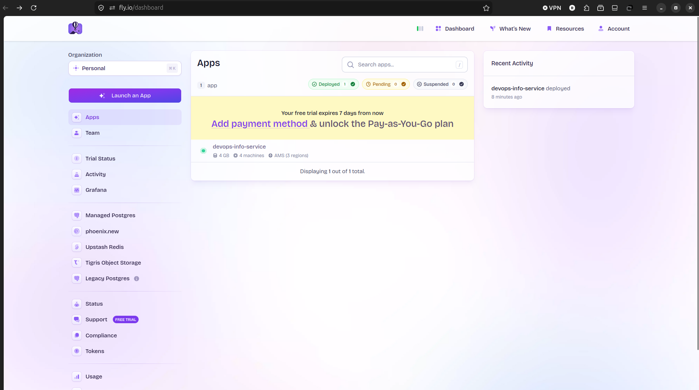
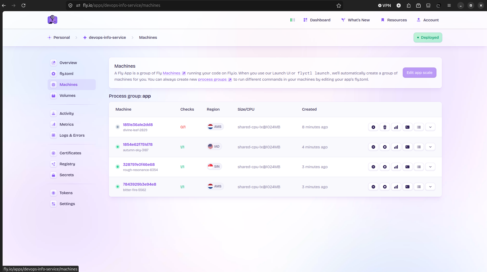
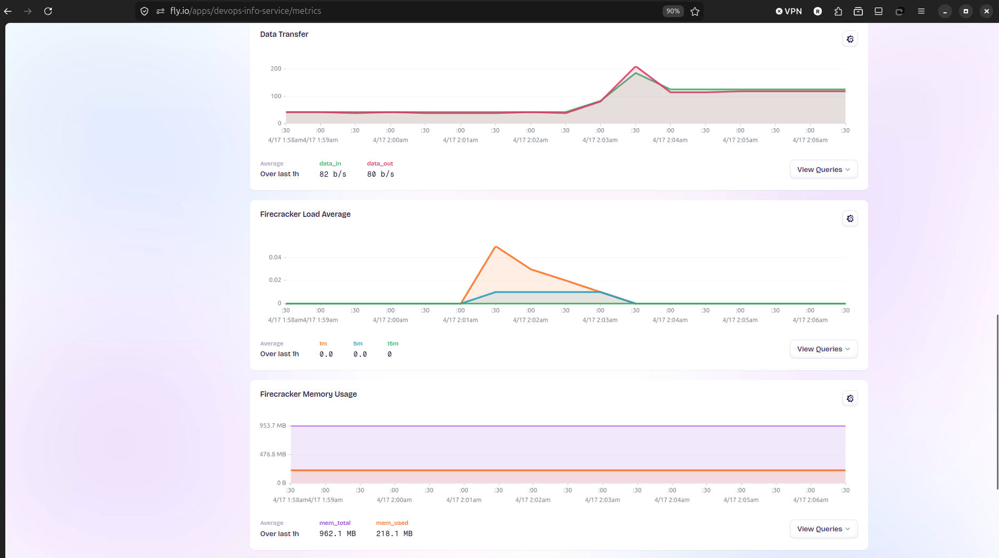

# Fly.io Edge Deployment

## Deployment Summary

**App name:** devops-info-service  
**App URL:** https://devops-info-service.fly.dev  
**Primary region:** ams (Amsterdam)  
**Regions deployed:** ams (Amsterdam), iad (Virginia, USA), sin (Singapore)

### Configuration Used

- Dockerfile: `Dockerfile.flyio` — standard Python 3.12-slim, installs packages from PyPI
- Internal port: 8080
- Health check: GET `/health` every 10s
- Persistent volume: `/data` (stores visit counter)
- Secrets: `APP_ENV`, `SECRET_KEY`

---

## Setup Steps Performed

### 1. Installed flyctl CLI

```bash
curl -L https://fly.io/install.sh | sh
export PATH="$HOME/.fly/bin:$PATH"
fly version
# flyctl v0.4.36 linux/amd64
```

### 2. Authenticated

```bash
fly auth login
fly auth whoami
# ramazanatzuf10@gmail.com
```

### 3. Launched the App

```bash
cd labs/app_python
fly launch --name devops-info-service --region ams --no-deploy
# Generated fly.toml
```

### 4. Created Volume for Persistence

```bash
fly volumes create app_data --size 1 --region ams
```

### 5. Set Secrets

```bash
fly secrets set APP_ENV=production SECRET_KEY=supersecretkey123
fly secrets list
# NAME        DIGEST    CREATED AT
# APP_ENV     ...       ...
# SECRET_KEY  ...       ...
```

### 6. Deployed

```bash
fly deploy
# --> Pushing image
# --> Creating release
# --> Machine started
# --> Monitoring health checks
# --> All checks passed
```

### 7. Added More Regions

```bash
fly regions add iad sin
fly scale count 1 --region iad
fly scale count 1 --region sin
fly machines list
```

### 8. Scaled Primary Region

```bash
fly scale count 2 --region ams
```

---

## Fly.io Dashboard

### Dashboard Overview


### Multi-Region Machines


### Metrics View


---

## Verified Endpoints

```bash
curl https://devops-info-service.fly.dev/
# Returns JSON with system info, uptime, visits

curl https://devops-info-service.fly.dev/health
# {"status": "healthy", "timestamp": "...", "uptime_seconds": ...}

curl https://devops-info-service.fly.dev/visits
# {"visits": N}

curl https://devops-info-service.fly.dev/metrics
# Prometheus metrics
```

---

## Application Logs

```bash
fly logs
# JSON-formatted logs from gunicorn + app
```

---

## Kubernetes vs Fly.io Comparison

| Aspect | Kubernetes | Fly.io |
|--------|------------|--------|
| Setup complexity | High — need cluster, nodes, YAML manifests, namespaces, RBAC | Low — one CLI command, auto-generates config |
| Deployment speed | Slow — build image, push to registry, apply manifests, wait | Fast — `fly deploy` handles everything in one step |
| Global distribution | Requires multi-cluster setup with federation or separate deployments | Built-in — add regions with `fly regions add iad sin` |
| Cost (for small apps) | Expensive — need to run nodes 24/7, even when idle | Free tier available, machines auto-stop when not used |
| Learning curve | Steep — pods, services, deployments, ingress, PVCs, operators | Gentle — concepts map to familiar Docker/VM ideas |
| Control/flexibility | Maximum — full control over networking, storage, scheduling | Good but limited — Fly manages the underlying infra |
| Best use case | Large teams, complex microservices, stateful workloads needing fine-grained control | Small to medium apps, APIs, websites needing global reach without infra management |

---

## When to Use Each

### Choose Kubernetes when:
- You run many microservices (10+) that talk to each other
- You need custom networking policies or service mesh (Istio)
- Your team has DevOps engineers who can maintain clusters
- You need to run workloads on your own hardware or private cloud
- You require very specific resource limits and guarantees per pod

### Choose Fly.io when:
- You want to go global fast without managing servers
- Your app is stateless or has simple persistence needs
- You are a small team or solo developer
- You want machines to auto-stop to save costs
- You build APIs, web apps, or background workers

### My Recommendation

**For this course project: Fly.io is the better choice.**

Kubernetes is powerful but overkill for a single Flask app. The setup alone (Minikube or a cloud cluster, Helm, ingress controllers) takes hours. Fly.io got the same app running globally in under 10 minutes. For production at scale with complex service dependencies, Kubernetes wins. For fast iteration and global reach, Fly.io is much simpler and cheaper.
