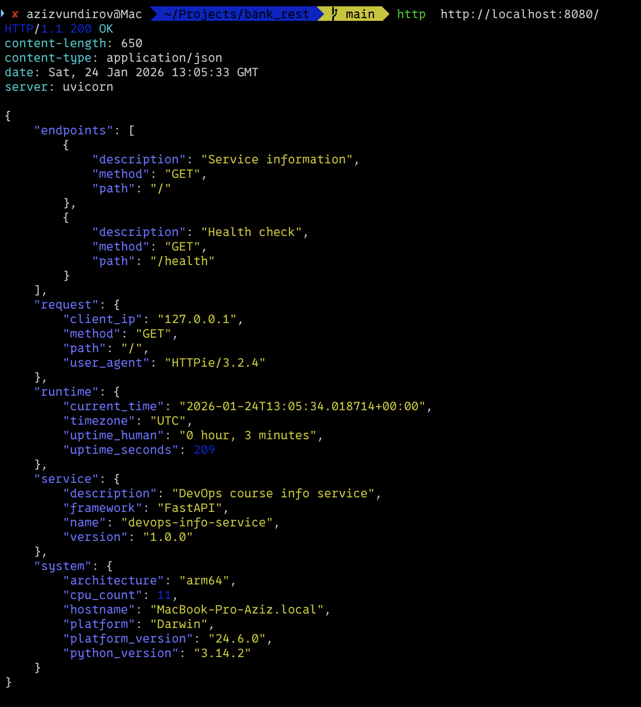
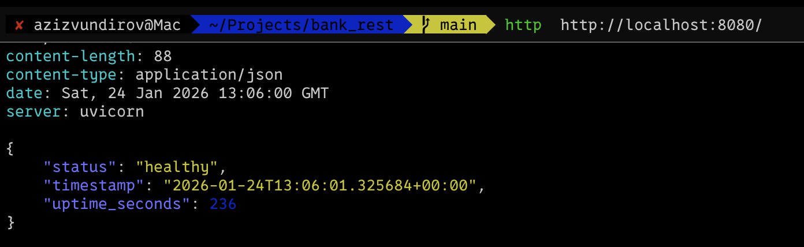

# LAB01: DevOps Info Service - Submission

## Framework Selection

### Choice: FastAPI

**Why FastAPI?**
- Async support for high performance
- Built-in OpenAPI documentation
- Type hints with Pydantic validation
- Modern Python (3.7+) best practices
- Minimal code, production-ready
- Easy Docker integration for DevOps

### Comparison Table

| Framework | Speed | Documentation | Setup | DevOps Fit |
|-----------|-------|---------------|-------|-----------|
| **FastAPI** | ⭐⭐⭐⭐⭐ | Auto OpenAPI | 5 min | Excellent |
| Flask | ⭐⭐⭐ | Manual | 5 min | Good |
| Django | ⭐⭐ | Comprehensive | 30 min | Overkill |
| FastAPI won for this project |

---

## Best Practices Applied

### 1. Environment Configuration
```python
HOST = os.getenv("HOST", "0.0.0.0")
PORT = int(os.getenv("PORT", 5000))
DEBUG = os.getenv("DEBUG", "False").lower() == "true"
```
**Why:** Externalized config enables different deployments (dev, staging, prod)

### 2. Separation of Concerns
```python
def get_metadata(request: Request):  # Pure function
    # Logic here

@app.get("/")
def get_info(request: Request):      # Route handler
    return get_metadata(request)
```
**Why:** Testable, reusable, clean architecture

### 3. Error Handling & Type Hints
```python
def get_uptime_human(seconds: int) -> str:
    hours, remainder = divmod(seconds, 3600)
    minutes, _ = divmod(remainder, 60)
    return f"{int(hours)} hour, {int(minutes)} minutes"
```
**Why:** Type safety, IDE support, early error detection

### 4. System Monitoring
```python
"system": {
    "hostname": socket.gethostname(),
    "platform": platform.system(),
    "cpu_count": os.cpu_count(),
    "python_version": platform.python_version()
}
```
**Why:** Essential for DevOps observability and debugging

---

## API Documentation

### Endpoint 1: GET `/`

**Request:**
```bash
curl http://localhost:8080/
```

**Response:**
```json
{
  "service": {
    "name": "devops-info-service",
    "version": "1.0.0",
    "description": "DevOps course info service",
    "framework": "FastAPI"
  },
  "system": {
    "hostname": "mycomputer",
    "platform": "Darwin",
    "platform_version": "23.1.0",
    "architecture": "arm64",
    "cpu_count": 8,
    "python_version": "3.11.0"
  },
  "runtime": {
    "uptime_seconds": 3600,
    "uptime_human": "1 hour, 0 minutes",
    "current_time": "2024-01-15T14:30:00.000000+00:00",
    "timezone": "UTC"
  },
  "request": {
    "client_ip": "127.0.0.1",
    "user_agent": "curl/7.64.1",
    "method": "GET",
    "path": "/"
  },
  "endpoints": [
    {
      "path": "/",
      "method": "GET",
      "description": "Service information"
    },
    {
      "path": "/health",
      "method": "GET",
      "description": "Health check"
    }
  ]
}
```

### Endpoint 2: GET `/health`

**Request:**
```bash
curl http://localhost:5000/health
```

**Response:**
```json
{
  "status": "healthy",
  "timestamp": "2024-01-15T14:30:00.000000+00:00",
  "uptime_seconds": 120
}
```

### Interactive Docs
```bash
# Swagger UI
http://localhost:8080/docs

# ReDoc
http://localhost:8080/redoc
```

---

## Testing Evidence

### Test Commands

```bash
# Start service
python app.py
```


---

## Challenges & Solutions

| Challenge | Solution |
|-----------|----------|
| Request context in metadata | Added `Request` parameter to `get_metadata()` |
| Human-readable uptime formatting | Used `divmod()` for clean hours:minutes conversion |
| Configuration flexibility | Implemented environment variables (HOST, PORT, DEBUG) |
| Port already in use | Allow PORT env var override |
| Auto-reload in development | Added DEBUG flag for uvicorn reload mode |
| Timezone awareness | Used `timezone.utc` and ISO 8601 format |

---

## GitHub Community
- Starring serves as a vital form of social proof in the open-source ecosystem, boosting a project's visibility
- Following industry leaders and peers creates a "passive mentorship" loop, where you can observe real-time updates on their coding styles, architectural choices, and the technologies they explore.

