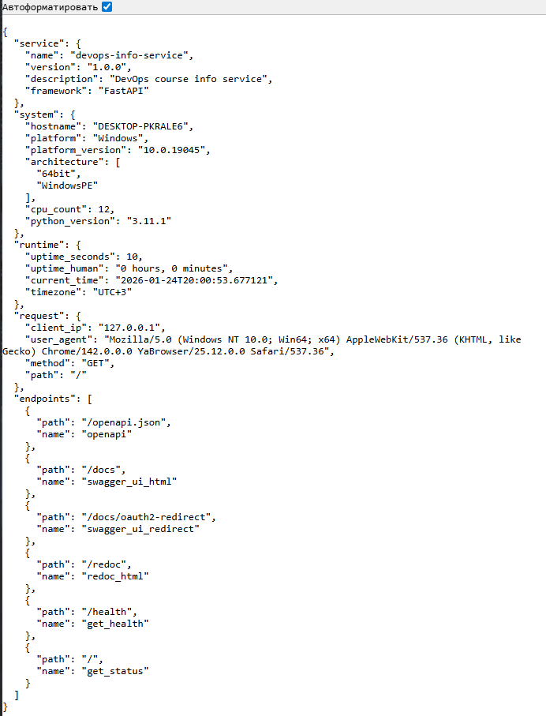
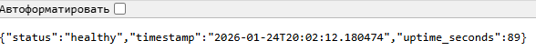
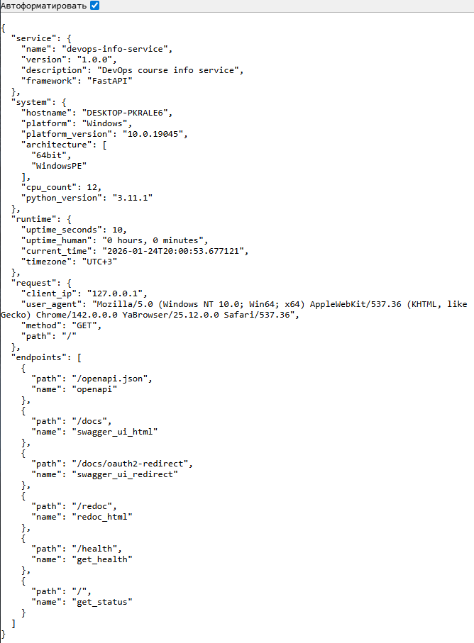

#### Framework Selection ####

I chose FastAPI because I have some experience with this Framework. Other variants were thrown away immediately.

#### Best Practices Applied ####

- Clean Code Organization is important for increasing readability of code: 

``` python
import platform
import socket
import os
import requests
import uvicorn
import logging
import argparse
from datetime import datetime
from fastapi import FastAPI, Request, HTTPException

app = FastAPI()

# Configuration
parser = argparse.ArgumentParser()
parser.add_argument("--host", default=os.getenv('HOST', '0.0.0.0'))
parser.add_argument("--port", type=int, default=int(os.getenv('PORT', 8000)))
parser.add_argument("--debug", action="store_true", default=os.getenv('DEBUG', 'False').lower() == 'true')
args = parser.parse_args()

```

- Error Handling needed for app stability:

```python
def get_all_endpoints():
    """Returns all endpoints of application"""
    logging.info("List of all endpoints")
    routes = [{"path": route.path, "name": route.name} for route in app.routes]
    if not routes:
        raise HTTPException(status_code=404, detail="Endpoints were not found")
    return routes
```

- Logging for improved debugging:
```python
def get_service_info():
    """Returns service info"""
    logging.info("Service info")
    return {
        "name": "devops-info-service",
        "version": "1.0.0",
        "description": "DevOps course info service",
        "framework": "FastAPI"
    }
```

- Dependencies for easier installation:

```bash
fastapi==0.128.0
requests==2.32.5
uvicorn==0.40.0
```

- Git ignore to not overflow git with trash:
```bash
# Python
__pycache__/
*.py[cod]
venv/
*.log

# IDE
.vscode/
.idea/

# OS
.DS_Store
```

#### API ####

- `GET /` returns info about a system
- `GET /health` returns health state

#### Evidence ####

\
\

(I didn't understand what I supposed to show at the third screenshot...)

#### Challenges & Solutions ####

I am at Windows OS so 
`HOST=127.0.0.1 PORT=3000 python app.py` cmd syntax not working for me, so I used agrument parsing instead.

#### GitHub Community ####

Starring repositories and following developers helps them to become more popular respectively.
