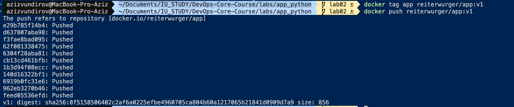
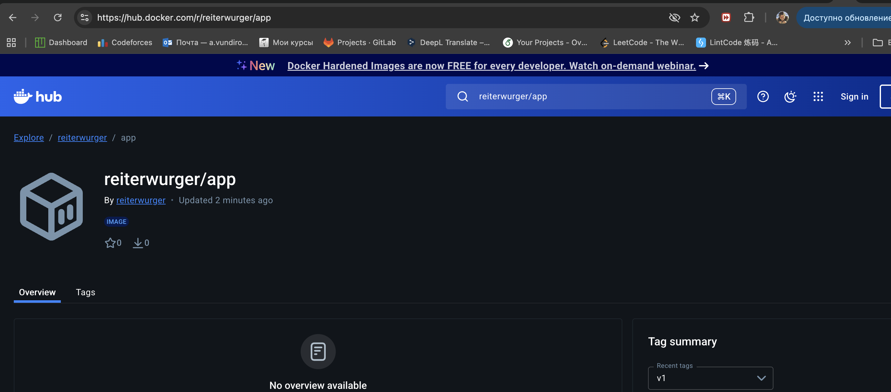

## Pushing image to dockerhub
Repo url: https://hub.docker.com/r/reiterwurger/app
Tagging explation:

{name}/{app_name}:{version}


**Docker Best Practices Applied**
- Non-root runtime user defined in [labs/app_python/Dockerfile](labs/app_python/Dockerfile#L7-L17) to drop privileges and shrink attack surface: `adduser --system appuser` and `USER appuser` ensure the app cannot modify host-mounted files or escalate.
- Layer caching preserved by copying `requirements.txt` before `app.py` in [labs/app_python/Dockerfile](labs/app_python/Dockerfile#L11-L15), letting dependency installs stay cached when only code changes.
- Build-time envs set in [labs/app_python/Dockerfile](labs/app_python/Dockerfile#L3-L5) to avoid bytecode writes and force unbuffered logs for clearer container logging.
- Dedicated workdir [labs/app_python/Dockerfile](labs/app_python/Dockerfile#L9) keeps filesystem tidy and prevents accidental writes to `/`.
- Port exposed via [labs/app_python/Dockerfile](labs/app_python/Dockerfile#L19) using `${PORT}` so the same image can run under different bindings.
- .dockerignore added at [labs/app_python/.dockerignore](labs/app_python/.dockerignore#L1-L18) to keep cache/IDE noise out of the build context, reducing build time and avoiding secret leakage.

> Key snippet (non-root, cache-friendly ordering):
```dockerfile
FROM python:3.12-slim
ENV PYTHONDONTWRITEBYTECODE=1 \
	PYTHONUNBUFFERED=1 \
	PORT=8080
RUN addgroup --system appgroup && adduser --system --ingroup appgroup appuser
WORKDIR /app
COPY requirements.txt .
RUN pip install --no-cache-dir -r requirements.txt
COPY app.py .
RUN chown -R appuser:appgroup /app
USER appuser
EXPOSE ${PORT}
CMD [ "python", "app.py" ]
```

**Image Information & Decisions**
- Base image: `python:3.12-slim` chosen for up-to-date security fixes, small footprint vs full Debian, and matches app runtime (FastAPI on 3.12) so no ABI surprises.
- Final image size: 223MB (`docker images`), acceptable for Python + FastAPI; could be shrunk further with `python:3.12-alpine` plus musl-tuning or multi-stage with `pip --no-cache-dir` wheels.
- Layer structure (from `docker history`): last layers are `CMD`/`EXPOSE`/`USER`, ownership fix, code copy, deps install, requirements copy, workdir, user add, env, then base. Keeps mutable parts (code) at the top so cache hits on deps.
- Optimization choices: no build tools left inside (pip `--no-cache-dir`), minimal packages, simple single-stage since no native builds; .dockerignore trims context to ~186 bytes.

**Build & Run Process**
- Build (from labs/app_python):
```bash
$ docker build -t reiterwurger/app:lab02 .
[+] Building 2.4s (13/13) FINISHED                                                                                  docker:desktop-linux
 => [internal] load build definition from Dockerfile                                                                                0.0s
 => => transferring dockerfile: 409B                                                                                                0.0s
 => [internal] load metadata for docker.io/library/python:3.12-slim                                                                 2.3s
 => [auth] library/python:pull token for registry-1.docker.io                                                                       0.0s
 => [internal] load .dockerignore                                                                                                   0.0s
 => => transferring context: 186B                                                                                                   0.0s
 => [1/7] FROM docker.io/library/python:3.12-slim@sha256:5e2dbd4bbdd9c0e67412aea9463906f74a22c60f89eb7b5bbb7d45b66a2b68a6           0.0s
 => => resolve docker.io/library/python:3.12-slim@sha256:5e2dbd4bbdd9c0e67412aea9463906f74a22c60f89eb7b5bbb7d45b66a2b68a6           0.0s
 => [internal] load build context                                                                                                   0.0s
 => => transferring context: 64B                                                                                                    0.0s
 => CACHED [2/7] RUN addgroup --system appgroup && adduser --system --ingroup appgroup appuser                                      0.0s
 => CACHED [3/7] WORKDIR /app                                                                                                       0.0s
 => CACHED [4/7] COPY requirements.txt .                                                                                            0.0s
 => CACHED [5/7] RUN pip install --no-cache-dir -r requirements.txt                                                                 0.0s
 => CACHED [6/7] COPY app.py .                                                                                                      0.0s
 => CACHED [7/7] RUN chown -R appuser:appgroup /app                                                                                 0.0s
 => exporting to image                                                                                                              0.0s
 => => exporting layers                                                                                                             0.0s
 => => exporting manifest sha256:d8d57c28d795f5c36463d4ca64133979d201d2f867b4503f797fd3df80768c02                                   0.0s
 => => exporting config sha256:7b55314f70b5080f86b2cce881bb5d44f053ac43e7a29bbc9cf0e62a68e78f31                                     0.0s
 => => exporting attestation manifest sha256:3a5b5be6b1e3ee703f30568ae8e49633e7e0e0eb35f47cc9bb691bb435ab67d4                       0.0s
 => => exporting manifest list sha256:1e36d3a0151c2ccdb3f73c6d87c589cc67827b9799e03659965534b40e4928f0                              0.0s
 => => naming to docker.io/reiterwurger/app:lab02                                                                                   0.0s
 => => unpacking to docker.io/reiterwurger/app:lab02                                                                                0.0s
```
- Run (host port 8081 mapped to container 8080 after freeing name):
```bash
$ docker rm -f devops-app
$ docker run -d -p 8081:8080 --name devops-app reiterwurger/app:lab02
2ce5aae5a79486207e54adb14fceb41b9d8e363c2906b8528f0232ab7e0d38c6
```
- Endpoint checks:
```bash
$ curl -s http://localhost:8081/health
{"status":"healthy","timestamp":"2026-01-27T16:10:45.904868+00:00","uptime_seconds":3}

$ curl -s http://localhost:8081/
{"service":{"name":"devops-info-service","version":"1.0.0","description":"DevOps course info service","framework":"FastAPI"},"system":{"hostname":"2ce5aae5a794","platform":"Linux","platform_version":"6.10.14-linuxkit","architecture":"aarch64","cpu_count":11,"python_version":"3.12.12"},"runtime":{"uptime_seconds":7,"uptime_human":"0 hour, 0 minutes","current_time":"2026-01-27T16:10:49.834118+00:00","timezone":"UTC"},"request":{"client_ip":"192.168.65.1","user_agent":"curl/8.7.1","method":"GET","path":"/"},"endpoints":[{"path":"/","method":"GET","description":"Service information"},{"path":"/health","method":"GET","description":"Health check"}]}
```
- Docker Hub: https://hub.docker.com/r/reiterwurger/app

**Technical Analysis**
- Why it works: environment vars configure logging and port; non-root user plus ownership change prevents permission errors; copying requirements before app keeps dependency layer reusable; `pip --no-cache-dir` avoids leftover wheels; explicit `CMD ["python","app.py"]` launches uvicorn entrypoint defined in [labs/app_python/app.py](labs/app_python/app.py#L75-L78).
- Layer order impact: moving `COPY app.py` above deps would bust cache on every code change and force re-install; moving `USER` earlier would break `pip install` (no perms); placing `chown` earlier would be overwritten by later copies.
- Security considerations: non-root runtime, slim base (smaller CVE surface), no build tools left in final layer, predictable port via env, 404/500 handlers in [labs/app_python/app.py](labs/app_python/app.py#L45-L70) to avoid info leaks.
- .dockerignore effect: excluding caches, VCS, IDE files and screenshots ([labs/app_python/.dockerignore](labs/app_python/.dockerignore#L1-L18)) keeps context tiny, speeds upload to daemon, and reduces risk of shipping secrets or large binaries.

**Challenges & Solutions**
- Port 8080 already allocated on host → first `docker run` failed; resolved by freeing name then remapping to host 8081.
- Container name `devops-app` was left over from failed start → `docker rm -f devops-app` before rerun.
- Build steps showed cached layers; validated that cache friendliness came from ordering requirements before code, confirming the intended optimization.