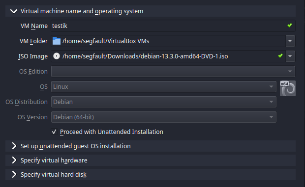
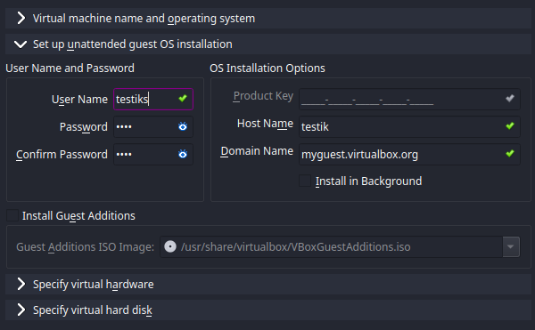
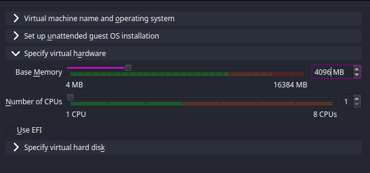
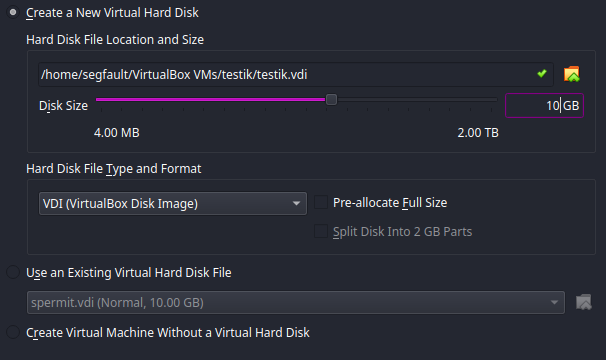
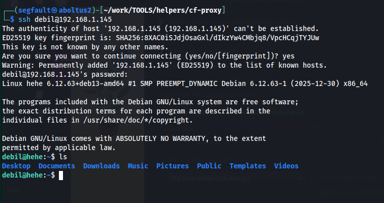

# LAB04

### 1. Provider & Infrastructure
I decided to use local VM for this lab insted of a cloud instance. I don't have access to any cloud provider instance. 
And its more convinient for me to use Local VM

Thankfully, my machine can handle VM with such hardware:
- Debian 13 (6.12.63 amd-64)
- 4 GB RAM
- 10 GB disk space
- Network adapter in Bridged mode
- Static IP (192.168.1.145)
- SSH server is installed and configured
- Public SSH key added to `~/.ssh/authorized_keys`

### 2. Terraform Implementation
Terraform is not used, because local VM was selected. I installed `virtualbox` and set up **Debian 13** using `.iso`

### 3. Pulumi Implementation
VM used, so no polumni implemented

### 4. VM creation
After downloading and installing `virtualbox-7.2` (My host is `6.18.9+kali-amd64`) and Debian 13 `.iso` I set up VM:
 

And intalled neccessary packages (including `openssh-server`):

### 5. Exposed Ports & Firewall
These ports are accessible within bridged network:
- Port 22 (SSH)
- Port 3000 (app) 

### 6. Lab 5 Preparation & Cleanup

**VM for Lab 5:**
- Are you keeping your VM for Lab 5? Yes [x]
- Local VM
