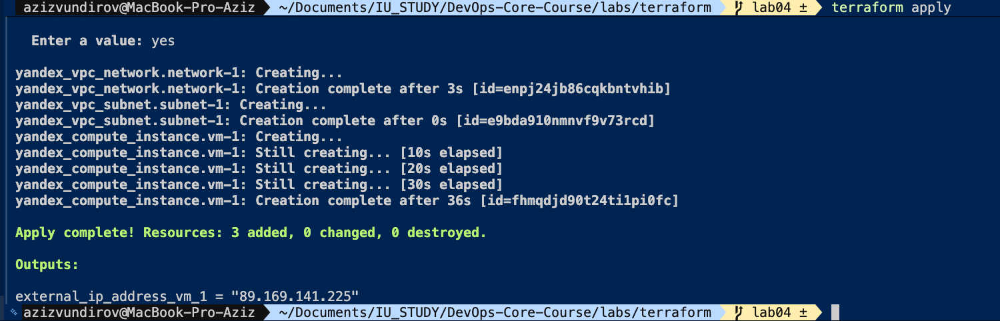
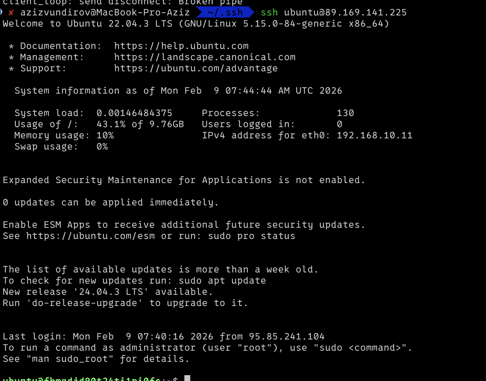
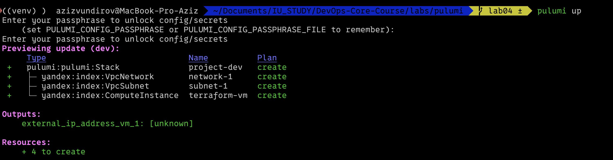
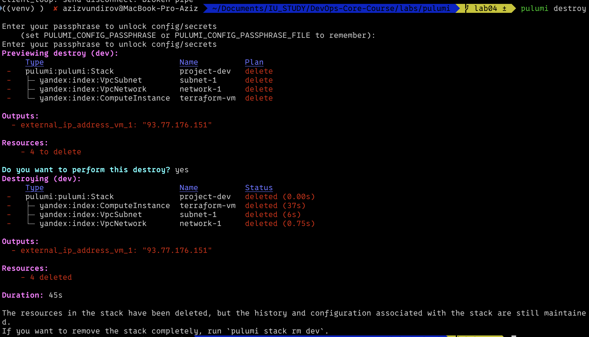
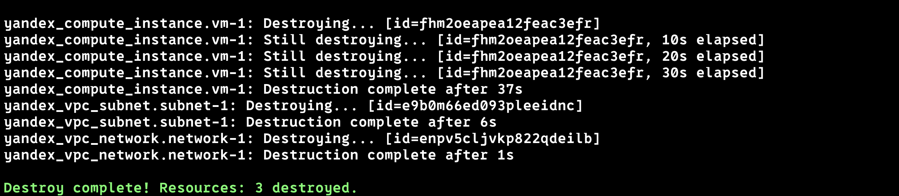

# Task 3 — Documentation (IaC)

---

## 1. Cloud Provider & Infrastructure

**Cloud provider:** Yandex Cloud  
**Rationale:** Free tier availability, reliable documentation, local region (`ru-central1`), and mature provider support for both Terraform and Pulumi.

**Region/zone:** `ru-central1-a`  
**Instance type/size:** `standard-v2`, 2 vCPU (20% core fraction), 2 GB RAM, 10 GB disk (HDD).  
**Estimated cost:** Low/Free tier eligible (using burstable instances).

**Resources created (Identical for Terraform & Pulumi):**
- **VPC Network:** `network-1`
- **Subnet:** `subnet-1` (CIDR: `192.168.10.0/24`)
- **VM Instance:** `terraform-vm` / `pulumi-vm` (Ubuntu 22.04 LTS, Public NAT IP enabled)
- **Security:** SSH key injection via metadata (`ubuntu` user).

---

## 2. Terraform Implementation

**Terraform version:** 1.5.7 (darwin_arm64)  
**Provider:** `yandex-cloud/yandex`

**Project structure:**
```text
terraform/
├── main.tf             # Resource definitions
├── variables.tf        # Input variables (cloud_id, folder_id)
├── terraform.tfvars    # Values for variables (gitignored)
├── authorized_key.json # Service Account Key (gitignored)
└── .terraform.lock.hcl # Provider version lock

```

**Key configuration decisions:**

* **State Management:** Local state (`terraform.tfstate`) used for this lab.
* **SSH Injection:** Used `file("~/.ssh/yandex_cloud.pub")` to dynamically load the public key.
* **Networking:** Explicitly created a dedicated VPC and Subnet instead of using the "default" one to ensure isolation.

**Challenges encountered:**

* **Provider Initialization:** Required setting up a Service Account and generating an `authorized_key.json`.
* **HCL Syntax:** Learning the specific interpolation syntax (`"${...}"`) for file reading was slightly less intuitive than standard programming languages.

### Terminal output

**terraform plan**

```hcl
Terraform used the selected providers to generate the following execution plan. Resource actions are indicated with the following symbols:
  + create

Terraform will perform the following actions:

  # yandex_compute_instance.vm-1 will be created
  + resource "yandex_compute_instance" "vm-1" {
      + name                      = "terraform-vm"
      + platform_id               = "standard-v2"
      + resources {
          + core_fraction = 20
          + cores         = 2
          + memory        = 2
        }
      + boot_disk {
          + initialize_params {
              + image_id    = "fd80bm0rh4rkepi5ksdi"
              + size        = 10
              + type        = "network-hdd"
            }
        }
      + network_interface {
          + nat            = true
          + subnet_id      = (known after apply)
        }
      + metadata = {
          + "ssh-keys" = (sensitive value)
        }
    }

  # yandex_vpc_network.network-1 will be created
  + resource "yandex_vpc_network" "network-1" {
      + name = "network-1"
    }

  # yandex_vpc_subnet.subnet-1 will be created
  + resource "yandex_vpc_subnet" "subnet-1" {
      + name           = "subnet1"
      + v4_cidr_blocks = [
          + "192.168.10.0/24",
        ]
      + zone           = "ru-central1-a"
    }

Plan: 3 to add, 0 to change, 0 to destroy.

```

**terraform apply**



**ssh connection**

---

## 3. Pulumi Implementation

**Pulumi version:** 3.x

**Language chosen:** Python (3.12)

**Reason:** As a Java/Backend developer, using a general-purpose language (Python) provides better control structures (loops, file I/O) and IDE support compared to declarative languages like HCL.

**Pulumi project:** `labs/pulumi`

**Stack:** `dev`

**Config source:** `Pulumi.dev.yaml`

### How code differs from Terraform

* **Imperative vs Declarative:** Used Python's `os` module (`os.path.expanduser`) to handle file paths robustly, rather than Terraform's built-in `file()` function.
* **Refactoring:** The code is structured as a standard Python script (`__main__.py`), allowing for the potential use of classes, functions, and external PyPI packages.
* **Outputs:** Values are exported using `pulumi.export()` instead of `output` blocks.

### Challenges encountered & Solutions

1. **Dependency Conflict (Python 3.12):**
* *Issue:* `ModuleNotFoundError: No module named 'pkg_resources'` during `pulumi preview`.
* *Cause:* The `pulumi_yandex` provider relied on an older `setuptools` feature removed in version 82.0.0.
* *Solution:* Downgraded setuptools: `pip install "setuptools<70.0.0"`.


2. **Authentication Config:**
* *Issue:* `one of 'token' or 'service_account_key_file' should be specified`. Environment variables were not picked up correctly.
* *Solution:* Explicitly configured the key path in the stack config:
`pulumi config set yandex:serviceAccountKeyFile ./authorized_key.json`.


### Terminal output

**pulumi preview**



**pulumi up**


**SSH connection**


---

## 4. Terraform vs Pulumi Comparison

| Feature | Terraform (HCL) | Pulumi (Python) |
| --- | --- | --- |
| **Language** | Domain Specific (HCL) | General Purpose (Python, TS, Go, Java) |
| **State** | `terraform.tfstate` | Managed via Pulumi Service or local login |
| **Logic** | Limited (count, for_each) | Full power of Python (loops, if, classes) |
| **IDE Support** | Good (plugin required) | Native (IntelliJ/VS Code autocompletion) |

**Comparison of Experience:**

1. **Ease of Setup:** Terraform was slightly easier initially as it handles provider plugins automatically. Pulumi required managing a Python virtual environment (`venv`) and resolving dependency versions (`setuptools`).
2. **Code Readability:** Pulumi code feels more natural for a developer. For example, reading the SSH key:
* *Terraform:* `"ubuntu:${file("~/.ssh/yandex_cloud.pub")}"`
* *Pulumi:* `f"ubuntu:{public_key}"` (using standard Python file reading).


3. **Debugging:** Pulumi errors (like the Python traceback) were easier to Google and understand because they are standard programming errors, whereas Terraform errors can sometimes be obscure provider-specific messages.

**Conclusion:**
For simple, static infrastructure, **Terraform** is excellent due to its simplicity and industry adoption. However, for complex environments involving logic, loops, or integration with application code, **Pulumi** is superior. As a developer, I prefer **Pulumi** because it bridges the gap between application development and infrastructure management.

---

## 5. Lab 5 Preparation & Cleanup

### Cleanup Strategy

Since Lab 5 usually requires a fresh start or specific configuration, I performed a cleanup of the Pulumi resources to avoid billing and state conflicts.

**Pulumi destroy output**


**Terraform destroy output**





