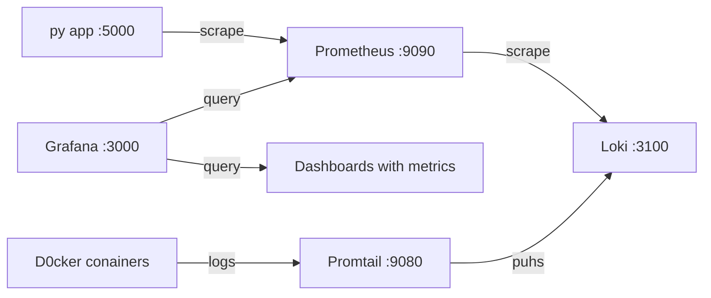
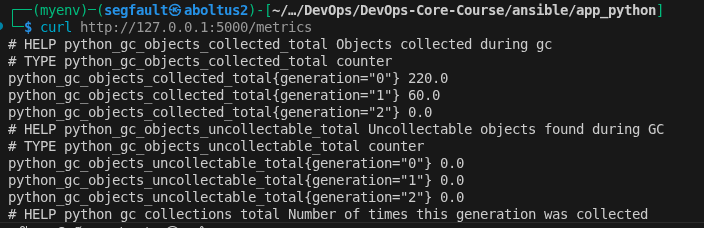
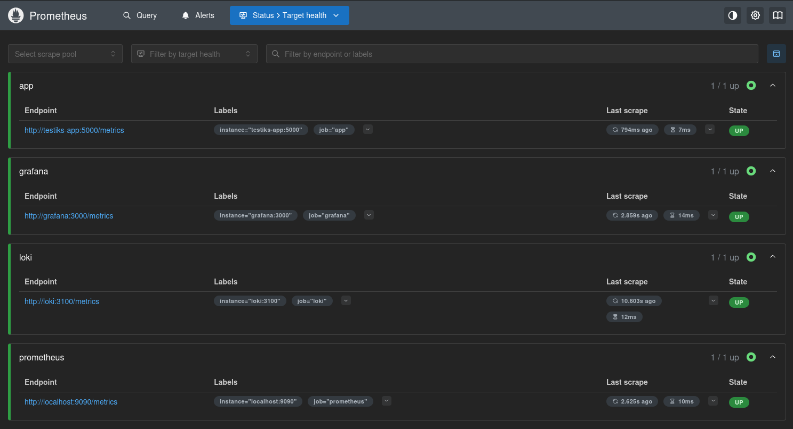
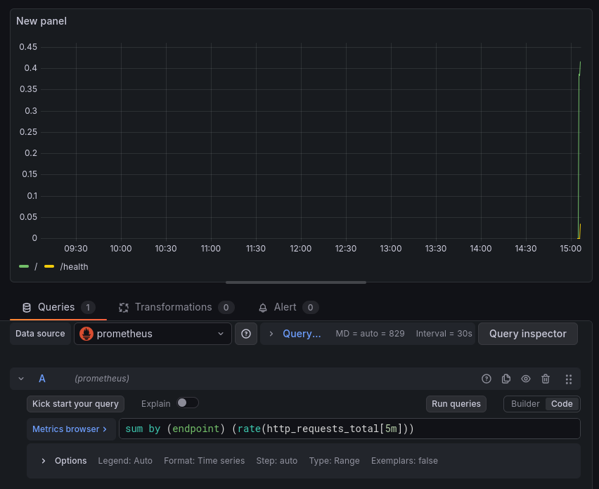
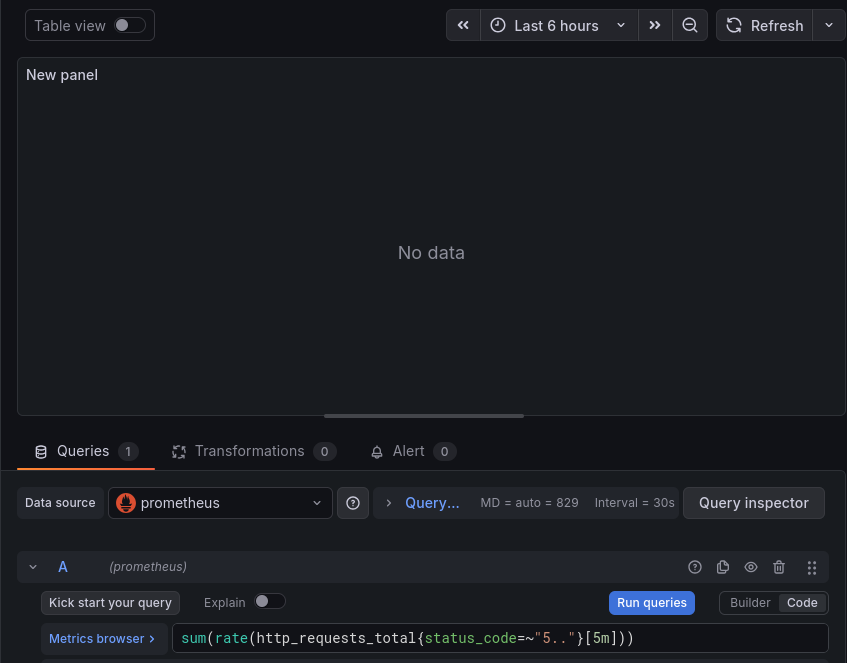
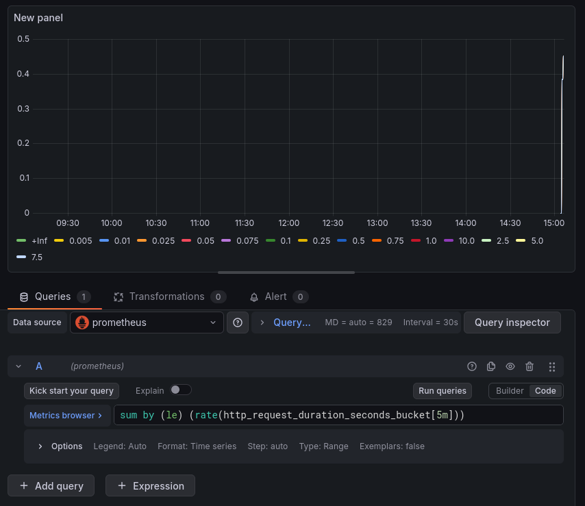
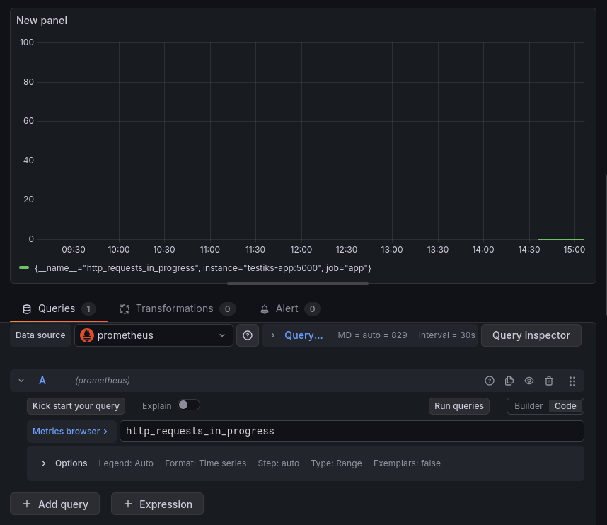
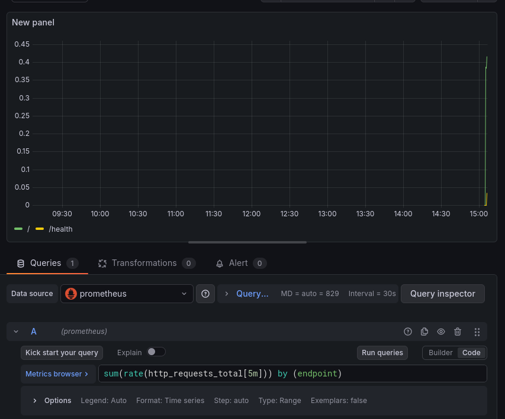
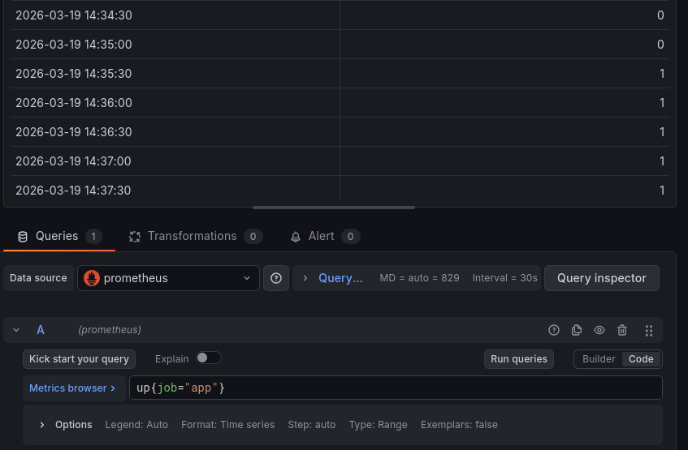

## Lab 8 — Metrics & Monitoring with Prometheus

## Architecture
Key components:
- `testiks-app`: exposes Prometheus metrics at `GET /metrics`
- `Prometheus`: scrapes metrics (pull model) and stores time-series in TSDB
- `Grafana`: visualizes Prometheus metrics with dashboards (PromQL)
- `Loki`: remain for logs, complementing metrics


### Diagram:



Data flow:
- Py app exposes metrics at `/metrics` using prometheus
- Prometheus scrapes all targets  (app, itself, Loki, Grafana)
- Grafana queries Prometheus via PromQL to render dashboard panels
- Loki receives logs from Promtail, while Prometheus scrapes Loki's own metrics
- Grafana combines both data sources for full observability (logs + metrics)

### Why these metrics
- Counter (`http_requests_total`): Useful for calculating request rates and error rates over time windows
- Histogram (`http_request_duration_seconds`): Provides bucketed latency distribution, enabling percentile calculations (p50, p95, p99)
- Gauge (`http_requests_in_progress`): Can go up and down: shows current load on the service
- Business metrics (`devops_info_endpoint_calls`): Track which endpoints are most popular beyond raw HTTP metrics

The `/metrics` endpoint itself is excluded from tracking to avoid feedback loops

## Application Instrumentation
### Metrics
We track the standard RED metrics with low-cardinality labels like `method`, normalized `endpoint`, and `status_code`:

- **Counter** `http_requests_total{method,endpoint,status_code}`  
  Counts all HTTP requests. Useful for monitoring request rates and errors.
- **Histogram** `http_request_duration_seconds_bucket{method,endpoint,...}`  
  Measures latency distribution. We use this to calculate p95 and create heatmaps.
- **Gauge** `http_requests_in_progress`  
  Shows the number of ongoing HTTP requests at any moment.

App-specific Metrics:
- **Counter** `devops_info_endpoint_calls{endpoint}`  
  Tracks usage for specific endpoints like `"/"` and `"/health"`
- **Histogram** `devops_info_system_collection_seconds`  
  Measures the time spent collecting system info within a request

**Label Design Note**: Endpoint labels are normalized using Flask route rules (for example `"/health"`). We deliberately avoid using user IDs or raw paths to prevent high label cardinality.



### Code Location
- Metrics are implemented in: `./ansible/app_python/app.py`:
```python
http_requests_total = Counter(
    'http_requests_total',
    'Total HTTP requests',
    ['method', 'endpoint', 'status']
)

http_request_duration_seconds = Histogram(
    'http_request_duration_seconds',
    'HTTP request duration',
    ['method', 'endpoint']
)

http_requests_in_progress = Gauge(
    'http_requests_in_progress',
    'HTTP requests currently being processed'
)

```

### Local Testing
```bash
cd app_python
pip install -r requirements.txt
python3 app.py
curl -s http://localhost:5000/metrics | head -n 40
```

## Prometheus Configuration
### Docker Compose Setup

The monitoring stack is defined in monitoring/docker-compose.yml

Key settings:
- Prometheus image: prom/prometheus:v3.9.0
- Scrape interval: 15s
- Retention:
    - `--storage.tsdb.retention.time=15d`
    - `--storage.tsdb.retention.size=10GB`

Persistent volume: `prometheus-data:/prometheus`

Connected to the same logging network as Loki and Grafana (from Lab 7)

### Scrape Targets:

Prometheus configuration is in monitoring/prometheus/prometheus.yml. Jobs include:
- prometheus: localhost:9090
- app: app-python:5000 (path: `/metrics`)
- loki: loki:3100 (path: `/metrics`)
- grafana: grafana:3000 (path: `/metrics`)



## Grafana Dashboard Walkthrough

### Request Rate (time series)
Shows throughput per endpoint (RED metric “Rate”):

`sum by (endpoint) (rate(http_requests_total[5m]))`



### Error Rate (5xx) (time series)
Tracks server errors:

`sum(rate(http_requests_total{status_code=~"5.."}[5m]))`



### Latency Heatmap (heatmap)
Visualizes latency distribution:

`sum by (le) (rate(http_request_duration_seconds_bucket[5m]))`



### Active Requests (stat/time series)
Displays ongoing requests:

`http_requests_in_progress`



### Status Code Distribution (pie chart)
Breakdown of 2xx/4xx/5xx responses:

`sum by (status_code) (rate(http_requests_total[5m]))`




### Uptime (app target) (stat)
Shows app availability:

`up{job="app"}`



### CPU usage rate
Shows app CPU consumption:

`rate(process_cpu_seconds_total{job="app"}[5m]) * 100`


## Production Setup

### Health checks

| Service      | Check                                           | Interval | Retries |
|-------------|-------------------------------------------------|----------|---------|
| Prometheus  | `wget http://localhost:9090/-/healthy`         | 10s      | 5       |
| Loki        | `wget http://localhost:3100/ready`             | 10s      | 5       |
| Grafana     | `curl http://localhost:3000/api/health`        | 10s      | 5       |
| app-python  | `urllib.request.urlopen('http://localhost:5000/health')` | 10s      | 5       |

---

### Resource limits

| Service      | CPU Limit | Memory Limit | CPU Reserved | Memory Reserved |
|-------------|-----------|--------------|--------------|----------------|
| Prometheus  | 1.0       | 1 GB         | 0.25         | 256 MB         |
| Loki        | 1.0       | 1 GB         | 0.25         | 256 MB         |
| Grafana     | 0.5       | 512 MB       | 0.25         | 256 MB         |
| app-python  | 0.5       | 256 MB       | 0.1          | 64 MB          |
| Promtail    | 0.5       | 512 MB       | 0.1          | 128 MB         |

---

### Retention policies

- **Prometheus**: 15 days / 10 GB (whichever limit is reached first)  
- **Loki**: 168 hours (7 days), configured via `limits_config.retention_period`

---

### Persistent volumes

| Volume           | Service     | Mount Point          | Purpose                          |
|-----------------|------------|--------------------|----------------------------------|
| `prometheus-data` | Prometheus | `/prometheus`      | TSDB storage                     |
| `loki-data`      | Loki       | `/loki`            | Log chunks and index             |
| `grafana-data`   | Grafana    | `/var/lib/grafana` | Dashboards, users, settings      |

> Data survives `docker compose down` + `docker compose up -d`.

---

## Testing Results

### Verification steps

```bash
cd monitoring
echo 'GRAFANA_ADMIN_PASSWORD=testpass' > .env
docker compose up -d

docker compose ps

curl http://localhost:9090/api/v1/targets | jq '.data.activeTargets[].health'
curl http://localhost:8000/metrics

curl -u admin:admin http://localhost:3000/api/datasources

# Test persistence
docker compose down
docker compose up -d
# Dashboards and data should persist
```

Persistance evidence:


## Metrics vs Logs — When to Use Each

| Aspect         | Metrics (Prometheus)                     | Logs (Loki)                       |
|----------------|----------------------------------------|----------------------------------|
| Purpose        | Numeric measurements over time         | Event records with context       |
| Use when       | "How many?", "How fast?", "How much?" | "What happened?", "Why did it fail?" |
| Alerting       | Ideal — threshold-based alerts on rates | Possible but less efficient      |
| Storage        | Compact (numeric time series)          | Verbose (full text)              |
| Query          | PromQL — aggregations, rates, percentiles | LogQL — filter, parse, aggregate |
| Example        | "Error rate > 5% in last 5 min"       | "Show me the stack trace for request X" |
| Cardinality    | Keep low (avoid high-cardinality labels) | Naturally high (each log is unique) |

**Best practice:** Use metrics for detection (something is wrong), logs for investigation (why it’s wrong)


## Challenges & Solutions

| Challenge                              | Solution                                                                 |
|----------------------------------------|-------------------------------------------------------------------------|
| Metrics endpoint creating feedback loops | Excluded `/metrics` path from request tracking in `before_request` / `after_request` hooks |
| Grafana data source UID mismatch        | Used provisioning YAML to auto-configure Prometheus and Loki data sources |
| Prometheus container health check       | Used `wget` instead of `curl` since `prom/prometheus` image is Alpine-based |
| Dashboard persistence across restarts   | Used Grafana provisioning with JSON files mounted as volumes            |