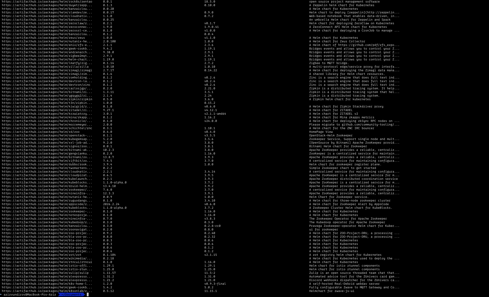
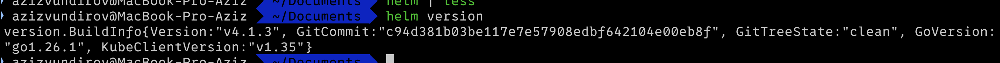
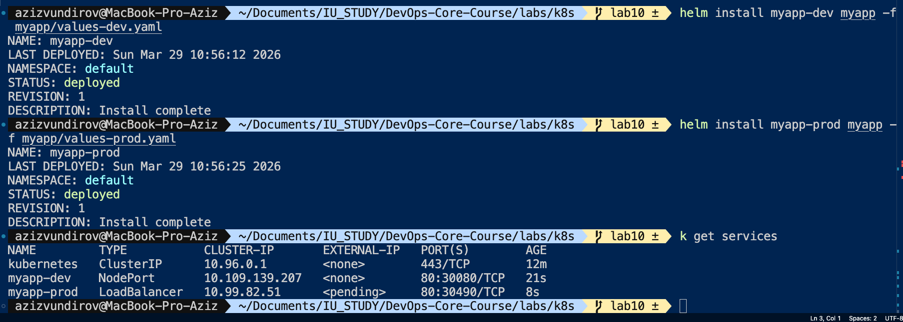
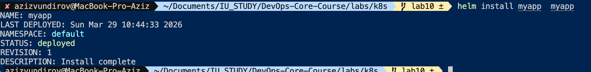
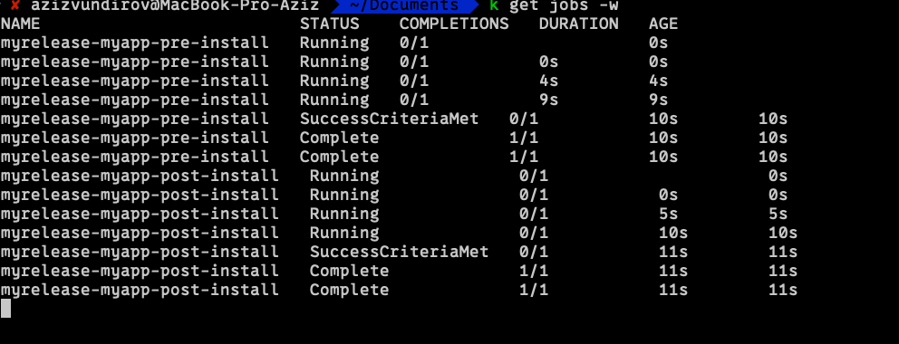

# Lab 10 - Helm Package Manager

## 1. Chart Overview

### Chart location
- Main chart: `labs/k8s/myapp`
- Additional chart (bonus context): `labs/k8s/appy`

### Chart structure (myapp)
```text
myapp/
├── Chart.yaml
├── values.yaml
├── values-dev.yaml
├── values-prod.yaml
└── templates/
    ├── _helpers.tpl
    ├── deployment.yaml
    ├── service.yaml
    ├── pre-install-job.yaml
    ├── post-install-job.yaml
    └── tests/test-connection.yaml
```

### What each template does
- `templates/deployment.yaml`
  - Deploys application pods with configurable replicas, image, resources and security context.
  - Uses helper templates for naming and labels.
  - Keeps livenessProbe enabled and configurable from values.

- `templates/service.yaml`
  - Exposes the app with configurable service type/port/targetPort.
  - Supports optional fixed `nodePort` when service type is `NodePort`.

- `templates/pre-install-job.yaml`
  - Helm hook Job executed before install (pre-install).
  - Intended for pre-deploy tasks (example: migration/validation simulation).

- `templates/post-install-job.yaml`
  - Helm hook Job executed after install (post-install).
  - Intended for post-deploy smoke checks.

- `templates/_helpers.tpl`
  - Centralizes reusable naming and labeling logic.
  - Defines helpers such as fullname, chart label, common labels, selector labels.

- `templates/tests/test-connection.yaml`
  - Helm test pod for basic connectivity check.

### Values organization strategy
- `values.yaml` contains baseline/default configuration.
- `values-dev.yaml` overrides defaults for development.
- `values-prod.yaml` overrides defaults for production.

This follows the standard Helm pattern:
- Stable defaults in one place.
- Environment-specific overrides in separate files.
- Minimal duplication.

---

## 2. Configuration Guide

### Important values in this chart

- `replicaCount`
  - Number of pod replicas.

- `image.repository`, `image.tag`
  - Container image source and version.

- `podSecurityContext`
  - Pod-level security settings.
  - In this chart: non-root execution with UID 1000.

- `service.type`, `service.port`, `service.targetPort`, `service.nodePort`
  - Service exposure mode and port mapping.

- `resources.requests`, `resources.limits`
  - Guaranteed and maximum CPU/memory per pod.

- `livenessProbe.*`
  - Health-check endpoint and timing settings.
  - Probe is enabled and not commented out.

### Environment profiles

#### Development (`values-dev.yaml`)
- `replicaCount: 1`
- `service.type: NodePort`
- Lower CPU/memory requests and limits.
- Faster liveness timing (`initialDelaySeconds: 5`, `periodSeconds: 10`).

#### Production (`values-prod.yaml`)
- `replicaCount: 5`
- `service.type: LoadBalancer`
- Higher CPU/memory requests and limits.
- More conservative liveness timing (`initialDelaySeconds: 30`, `periodSeconds: 5`).
- `readinessProbe` timing override is present in prod values.

### Example installation commands
```bash
# Default values
helm install myrelease labs/k8s/myapp

# Development profile
helm install myapp-dev labs/k8s/myapp -f labs/k8s/myapp/values-dev.yaml

# Production profile
helm install myapp-prod labs/k8s/myapp -f labs/k8s/myapp/values-prod.yaml

# Upgrade release with prod profile
helm upgrade myrelease labs/k8s/myapp -f labs/k8s/myapp/values-prod.yaml
```

---

## 3. Hook Implementation

### Implemented hooks

- Pre-install hook
  - File: `templates/pre-install-job.yaml`
  - Annotation: `helm.sh/hook: pre-install`
  - Weight: `-5`
  - Delete policy: `hook-succeeded`
  - Purpose: run pre-install step before core resources (e.g., migration/validation simulation).

- Post-install hook
  - File: `templates/post-install-job.yaml`
  - Annotation: `helm.sh/hook: post-install`
  - Weight: `5`
  - Delete policy: `hook-succeeded`
  - Purpose: run smoke-check style step after deployment.

### Execution order logic
- Lower hook weight runs first.
- With current setup:
  - pre-install hook (`-5`) runs before install
  - app resources are installed
  - post-install hook (`5`) runs after install

### Why hook-succeeded deletion policy
- Removes completed hook Jobs automatically.
- Keeps namespace clean from one-time operational Jobs.
- Preserves failed hooks for troubleshooting (unless other policies are added).

---

## 4. Installation Evidence




---

## 5. Operations

### Commands used
```bash
# Install
helm install myrelease labs/k8s/myapp

# Upgrade
helm upgrade myrelease labs/k8s/myapp -f labs/k8s/myapp/values-prod.yaml

# Rollback
helm rollback myrelease 1

# Uninstall
helm uninstall myrelease
```

### Operational notes
- Use `helm history myrelease` before rollback to select a safe revision.
- Prefer environment values files instead of many inline `--set` overrides.

---

## 6. Testing and Validation






---


## 8. Summary

- The `myapp` Helm chart is implemented with reusable templates, helper functions and environment-specific values files.
- Health checks are preserved and configurable.
- Pre-install and post-install hooks are implemented with explicit weights and cleanup policy.
- Validation via lint passed successfully.
- Remaining command output blocks are marked as PLACEHOLDER for final report completion.
