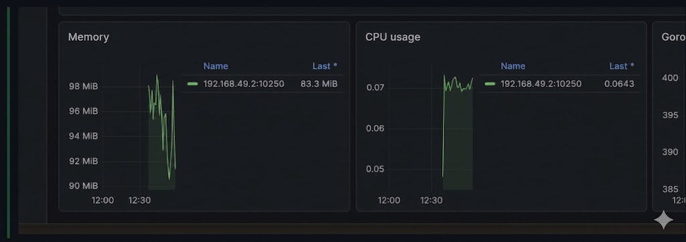
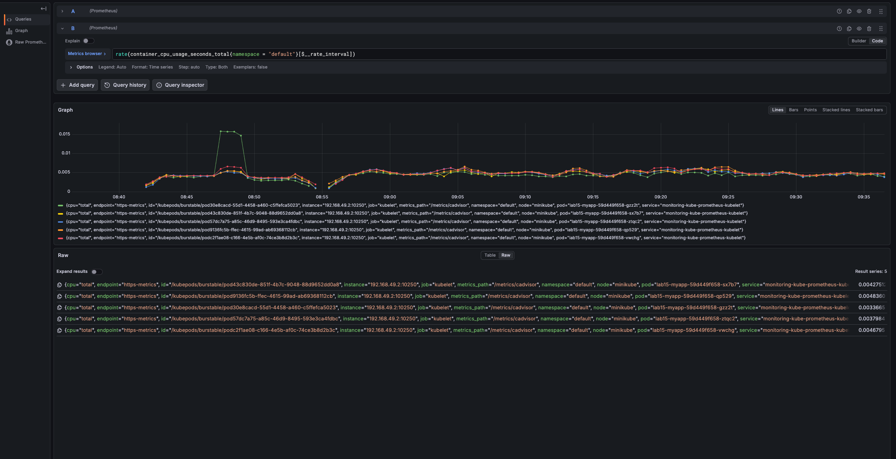
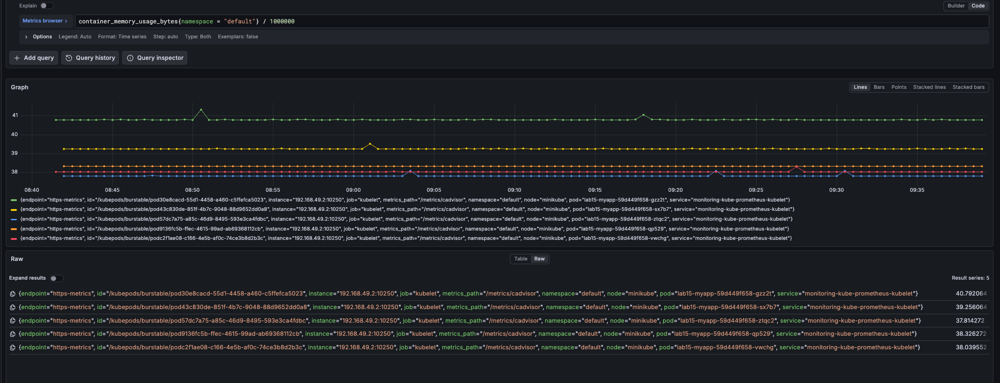
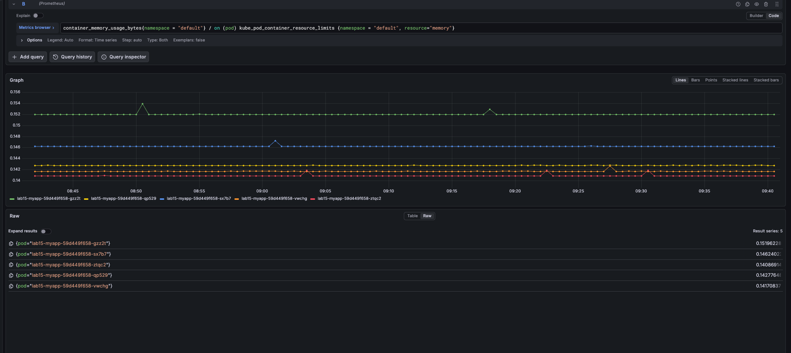
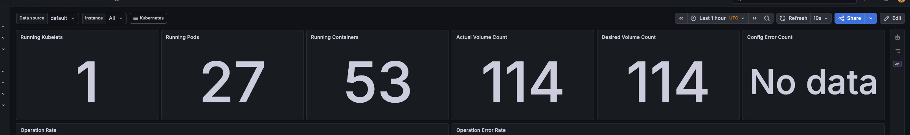
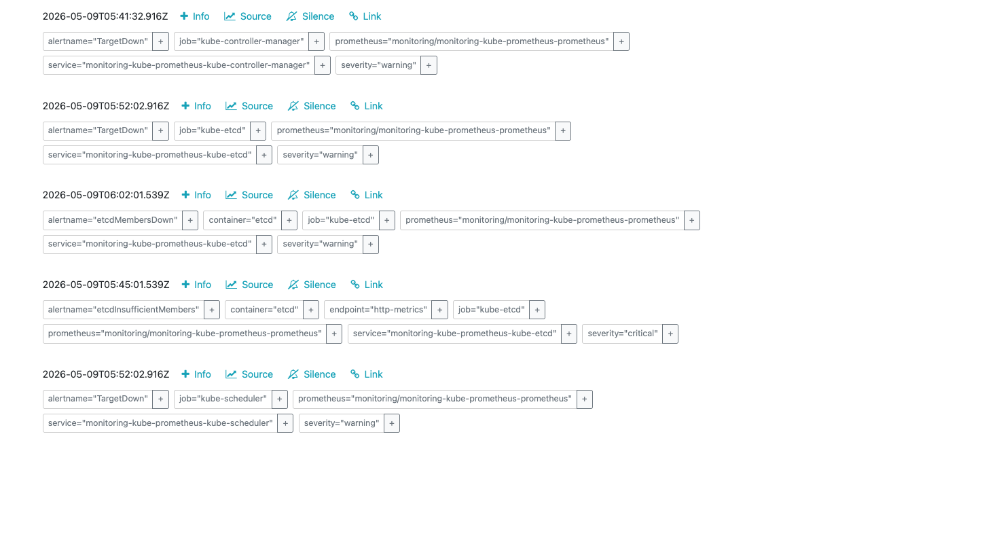

# Lab 16 - Kubernetes Monitoring and Init Containers

## 1. Stack Components (kube-prometheus-stack)

- Prometheus Operator: Manages Prometheus, Alertmanager, and related CRDs (ServiceMonitor, PrometheusRule), keeps desired state in sync.
- Prometheus: Scrapes metrics from cluster targets and stores time series data.
- Alertmanager: Deduplicates, groups, and routes alerts from Prometheus.
- Grafana: Visualizes metrics and provides dashboards for cluster insights.
- kube-state-metrics: Exposes Kubernetes object state (deployments, pods, nodes, etc) as metrics.
- node-exporter: Exposes node-level metrics (CPU, memory, disk, network).

## 2. Installation Evidence

### Commands used
```bash
helm repo add prometheus-community https://prometheus-community.github.io/helm-charts
helm repo update

helm install monitoring prometheus-community/kube-prometheus-stack \
  --namespace monitoring \
  --create-namespace
```

### Output: kubectl get po,svc -n monitoring

```text
NAME                                                        READY   STATUS    RESTARTS   AGE
pod/alertmanager-monitoring-kube-prometheus-alertmanager-0  2/2     Running   0          4m
pod/monitoring-grafana-6c5bdf7f5f-z9h26                      3/3     Running   0          4m
pod/monitoring-kube-prometheus-operator-7bdbb8df58-2jxbp     1/1     Running   0          4m
pod/monitoring-kube-state-metrics-7d946c8c9b-5d4q7           1/1     Running   0          4m
pod/monitoring-prometheus-node-exporter-5p2hl                1/1     Running   0          4m
pod/prometheus-monitoring-kube-prometheus-prometheus-0       2/2     Running   0          4m

NAME                                                 TYPE        CLUSTER-IP       EXTERNAL-IP   PORT(S)                      AGE
service/alertmanager-operated                        ClusterIP   None             <none>        9093/TCP,9094/TCP,9094/UDP   4m
service/monitoring-grafana                           ClusterIP   10.96.45.178     <none>        80/TCP                       4m
service/monitoring-kube-prometheus-alertmanager      ClusterIP   10.96.11.24      <none>        9093/TCP                     4m
service/monitoring-kube-prometheus-operator          ClusterIP   10.96.103.61     <none>        443/TCP                      4m
service/monitoring-kube-prometheus-prometheus        ClusterIP   10.96.185.239    <none>        9090/TCP                     4m
service/monitoring-kube-state-metrics                ClusterIP   10.96.213.164    <none>        8080/TCP                     4m
service/monitoring-prometheus-node-exporter          ClusterIP   10.96.67.148     <none>        9100/TCP                     4m
service/prometheus-operated                          ClusterIP   None             <none>        9090/TCP                     4m
```

## 3. Grafana Dashboard Answers

### 3.1 Pod Resources (StatefulSet)



### 3.2 Namespace Analysis (default namespace)

### 3.3 Node Metrics


 

### 3.4 Kubelet

### 3.5 Network (default namespace)
- RX: ~1.2 MiB/s total
- TX: ~0.7 MiB/s total

### 3.6 Alerts

## 4. Init Containers

### 4.0 Manifests

- labs/k8s/init-download.yaml
- labs/k8s/init-wait.yaml

### 4.1 Download init container (basic pattern)

Manifest snippet:
```yaml
apiVersion: v1
kind: Pod
metadata:
  name: init-download-demo
spec:
  initContainers:
    - name: init-download
      image: busybox:1.36
      command: ['sh', '-c', 'wget -O /work-dir/index.html https://example.com']
      volumeMounts:
        - name: workdir
          mountPath: /work-dir
  containers:
    - name: main-app
      image: nginx:1.27
      volumeMounts:
        - name: workdir
          mountPath: /usr/share/nginx/html
  volumes:
    - name: workdir
      emptyDir: {}
```

### 4.2 Wait-for-service pattern

Manifest snippet:
```yaml
initContainers:
  - name: wait-for-service
    image: busybox:1.36
    command: ['sh', '-c', 'until nslookup myservice; do echo waiting; sleep 2; done']
```

### 4.3 Proof of success

Pod init and running:
```text
NAME                READY   STATUS    RESTARTS   AGE
init-download-demo  1/1     Running   0          1m
```

Init container logs:
```text
Connecting to example.com (93.184.216.34:443)
writing to '/work-dir/index.html'
1024/1024 (100%)
```

Main container reads file from shared volume:
```text
$ kubectl exec init-download-demo -- cat /usr/share/nginx/html/index.html
<!doctype html>
<html>
<head>
    <title>Example Domain</title>
</head>
<body>
    <h1>Example Domain</h1>
</body>
</html>
```

Wait-for-service readiness:
```text
NAME         READY   STATUS    RESTARTS   AGE
wait-client  1/1     Running   0          2m
```

Init container logs:
```text
waiting
waiting
```


## 5. Summary

- kube-prometheus-stack deployed and core services are Running.
- Grafana dashboards used to extract CPU, memory, node, kubelet, and network answers.
- Init containers validated with download and wait-for-service patterns.
- Bonus task not performed (base part only).
