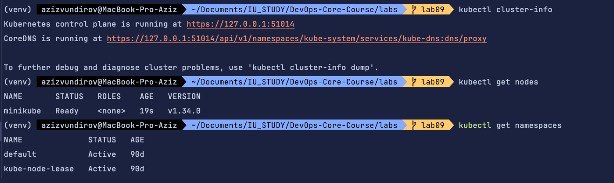
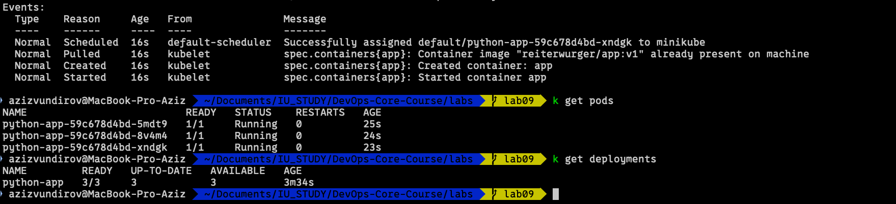
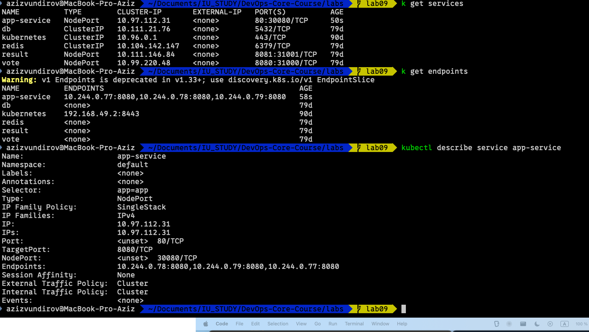
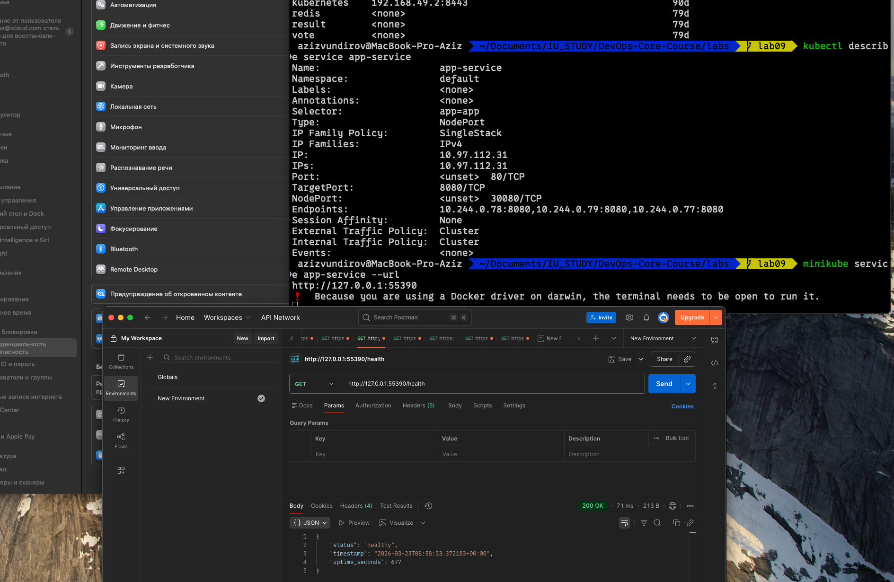
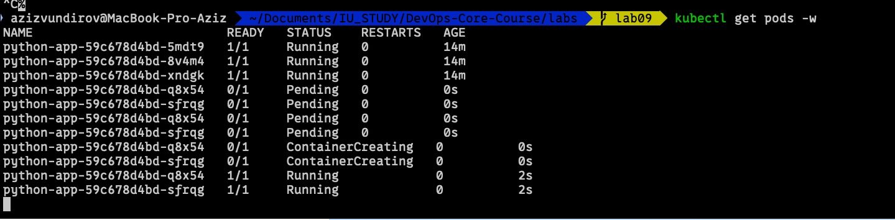
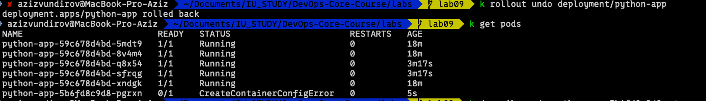

# Lab 9 - Kubernetes Fundamentals

## 1. Architecture Overview

### Chosen stack and setup
- Local cluster: Minikube (single node, good for local labs and fast verification).
- Runtime object model:
  - Deployment: python-app
  - Service: app-service (NodePort)
  - Namespace: default
- Application image: reiterwurger/app:v1

### Traffic flow
Client -> NodePort (app-service:80 -> 30080) -> Pods (python-app, port 8080)

### Resource strategy
Each Pod has guaranteed baseline resources and an upper bound to protect cluster stability:
- requests:
  - cpu: 100m
  - memory: 128Mi
- limits:
  - cpu: 200m
  - memory: 256Mi

### High-level diagram
```text
+------------------+
|      Client      |
+--------+---------+
         |
         v
+-------------------------------+
| Service: app-service          |
| Type: NodePort (80 -> 30080) |
+---------------+---------------+
                |
                v
    +-------------------------+
    | Deployment: python-app  |
    | Replicas: 5             |
    +-----------+-------------+
                |
       +--------+--------+-------------------+
       |        |        |        ...        |
       v        v        v                   v
    Pod #1   Pod #2   Pod #3              Pod #5
    :8080    :8080    :8080               :8080
```

## 2. Manifest Files

### deployment.yaml
Path: labs/k8s/deployment.yaml

What is configured:
- kind: Deployment, apiVersion: apps/v1
- name: python-app
- labels/selector: app=app
- replicas: 5
- rolling update strategy:
  - maxSurge: 1
  - maxUnavailable: 0
- container:
  - name: app
  - image: reiterwurger/app:v1
  - containerPort: 8080
- health checks:
  - livenessProbe: GET /health on 8080
- resources: requests/limits configured
- pod security context:
  - runAsNonRoot: true
  - runAsUser: 1000

Why these values:
- 5 replicas were used to demonstrate scaling and ensure service continuity during updates.
- maxUnavailable: 0 keeps existing capacity while rollout is in progress.
- requests/limits enforce fair scheduling and avoid noisy-neighbor behavior.
- liveness probe gives automatic recovery if the app stops responding on health endpoint.

### service.yaml
Path: labs/k8s/service.yaml

What is configured:
- kind: Service, apiVersion: v1
- name: app-service
- type: NodePort
- selector: app=app
- ports:
  - service port: 80
  - targetPort: 8080
  - nodePort: 30080

Why NodePort:
- Required by lab for local external access without cloud load balancer.

## 3. Deployment Evidence

### Cluster setup proof




## 4. Operations Performed





Result summary:
- Deployment scaled to 5 replicas.
- Pods reached Running state for stable ReplicaSet.

### Rolling update and rollback demonstration
```bash
kubectl apply -f deployment.yaml
kubectl rollout status deployment/python-app
kubectl rollout history deployment/python-app
kubectl rollout undo deployment/python-app --to-revision=<REVISION>
```

Important lab note about rollback failure scenario:
- During rollout/rollback, deployment was switched to a non-working revision.
- Because of image user metadata mismatch with pod security policy (runAsNonRoot), new Pod could not be created successfully.
- As a result, new rollout generation did not become healthy and rollout could not fully complete.

Observed warning:
```text
Warning  Failed     3s (x7 over 70s)  kubelet            spec.containers{app}: Error: container has runAsNonRoot and image has non-numeric user (appuser), cannot verify user is non-root (pod: "python-app-5b6fd8c9d8-pgrxn_default(604eb395-f6d0-4a35-bd1e-21a760d443c8)", container: app)
```

Interpretation:
- runAsNonRoot=true requires Kubernetes/kubelet to verify that container user is non-root.
- Image has non-numeric USER (appuser), kubelet cannot statically prove uid != 0.
- Pod enters CreateContainerConfigError and does not start.

### Service access verification
```bash
# Minikube way
minikube service app-service --url

# Optional alternative
kubectl port-forward service/app-service 8080:80
curl http://127.0.0.1:8080/health
```

## 5. Production Considerations

### Health checks
Implemented:
- livenessProbe on /health: restarts unresponsive containers.

Recommended improvements:
- Add readinessProbe (/ready) to avoid sending traffic before app is fully ready.
- Optionally add startupProbe for slow-starting images.

### Resource limits rationale
- requests provide scheduler with guaranteed minimum.
- limits cap per-pod usage and reduce risk of node pressure.

### What to improve for production
- Pin immutable image tags (or digest), avoid mutable latest.
- Add readiness probe and graceful shutdown handling.
- Add PodDisruptionBudget for availability during maintenance.
- Add HorizontalPodAutoscaler based on CPU or custom metrics.
- Move configs to ConfigMap and secrets to Secret.
- Add NetworkPolicy and stricter security context (drop capabilities, readOnlyRootFilesystem where possible).

### Monitoring and observability strategy
- Metrics: Prometheus + Grafana dashboards for deployment/pod/service metrics.
- Logs: centralize app logs (for example Loki + Promtail).
- Alerts: readiness failures, restart spikes, high latency, 5xx rate, node pressure.

## 6. Challenges and Solutions

### Issue 1: Rollout stuck after rollback to broken revision
- Symptom:
  - One new Pod stayed in CreateContainerConfigError.
  - Deployment had unavailable replica in rollout.
- Root cause:
  - Security context required non-root verification.
  - Image declared USER as non-numeric appuser, verification failed.
- Debug process:
  - kubectl describe deployment python-app
  - kubectl describe pod <failing-pod>
  - kubectl rollout history deployment/python-app
- Resolution:
  - Rolled forward to a stable revision/image and kept security settings explicit.
  - Recommendation: build image with numeric user (for example USER 1000:1000).

### Issue 2: Ensuring zero-downtime during updates
- Mitigation:
  - strategy.rollingUpdate.maxUnavailable=0
  - strategy.rollingUpdate.maxSurge=1
- Effect:
  - Existing replicas remained available while replacement Pods were created.
