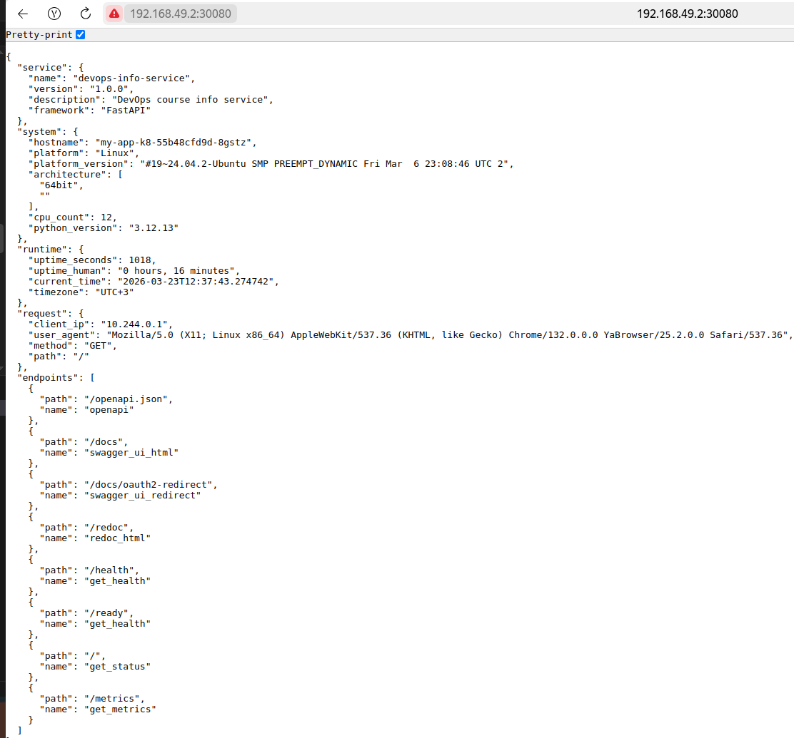

# Lab 9

## Architecture Overview

The application is deployed on a local Kubernetes cluster (minikube) using the following resources:

- **Deployment** – manages 3 replicas of the application Pods. It ensures high availability and supports rolling updates.
- **Service** – exposes the Deployment internally and externally via a NodePort, allowing access from the host machine.
- **Health Probes** – liveness and readiness probes configured to monitor application health and manage traffic.

### Component Details

| Resource | Name | Purpose |
|----------|------|---------|
| Deployment | `my-app-k8` | Defines the desired state: 3 replicas, resource limits, probes, rolling update strategy. |
| Service | `simple-app-service` | NodePort service on port 30080, targeting pods with label `app: simple-app`. |
| Pods | – | Each pod runs a single container based on `thevex/simple-app:2026.03.09`. |

### Resource Allocation

Each container requests **100m CPU** and **128Mi memory**, with limits of **200m CPU** and **256Mi memory**. These values were chosen to ensure fair scheduling and prevent resource starvation while leaving room for other workloads.

### Networking Flow

1. External request arrives at NodePort `30080`.
2. Service routes it to one of the healthy Pods on port `8000` (targetPort).
3. The application processes the request and returns a response.

## Manifest Files

### `deployment.yml`

Contains the Deployment definition with:
- Replicas: 3
- Rolling update strategy (`maxSurge: 1`, `maxUnavailable: 0`) for zero‑downtime updates.
- Resource requests and limits.
- Liveness probe (HTTP GET on `/health`, port 8000) to restart unresponsive containers.
- Readiness probe (HTTP GET on `/ready`, port 8000) to control traffic admission.

### `service.yml`

Defines a Service of type `NodePort`:
- Selector matches `app: simple-app`.
- Maps external port `30080` to container port `8000`.
- Exposes the application outside the cluster.

### Key Configuration Choices

- **Replicas = 3** – provides basic fault tolerance and load distribution.
- **Resource requests = 128Mi/100m** – ensures each pod gets at least this amount; scheduling decisions respect these values.
- **Limits = 256Mi/200m** – prevents a single pod from consuming excessive resources.
- **Probes** – critical for self‑healing and safe traffic routing; without them, a dead container would stay in the load balancer.

## Deployment Evidence & Operations performed

```bash
$ minikube start --driver=docker

😄  minikube v1.38.1 on Ubuntu 24.04
✨  Using the docker driver based on user configuration
❗  Starting v1.39.0, minikube will default to "containerd" container runtime. See #21973 for more info.
📌  Using Docker driver with root privileges
👍  Starting "minikube" primary control-plane node in "minikube" cluster
🚜  Pulling base image v0.0.50 ...
💾  Downloading Kubernetes v1.35.1 preload ...
    > preloaded-images-k8s-v18-v1...:  272.45 MiB / 272.45 MiB  100.00% 32.41 M
    > gcr.io/k8s-minikube/kicbase...:  519.58 MiB / 519.58 MiB  100.00% 28.06 M
 
🔥  Creating docker container (CPUs=2, Memory=3900MB) ...
🐳  Preparing Kubernetes v1.35.1 on Docker 29.2.1 ...
🔗  Configuring bridge CNI (Container Networking Interface) ...
🔎  Verifying Kubernetes components...
    ▪ Using image gcr.io/k8s-minikube/storage-provisioner:v5
🌟  Enabled addons: storage-provisioner, default-storageclass
🏄  Done! kubectl is now configured to use "minikube" cluster and "default" namespace by default

```

```bash
$ kubectl cluster-info

Kubernetes control plane is running at https://192.168.49.2:8443
CoreDNS is running at https://192.168.49.2:8443/api/v1/namespaces/kube-system/services/kube-dns:dns/proxy

To further debug and diagnose cluster problems, use 'kubectl cluster-info dump'.
```

```bash
$ kubectl get nodes

NAME       STATUS   ROLES           AGE    VERSION
minikube   Ready    control-plane   2m7s   v1.35.1
```

```bash
$ kubectl get all
NAME                             READY   STATUS    RESTARTS   AGE
pod/my-app-k8-55b48cfd9d-6x64p   1/1     Running   0          28m
pod/my-app-k8-55b48cfd9d-8gstz   1/1     Running   0          14m
pod/my-app-k8-55b48cfd9d-97vk5   1/1     Running   0          28m
pod/my-app-k8-55b48cfd9d-9w9qf   1/1     Running   0          14m
pod/my-app-k8-55b48cfd9d-m64rv   1/1     Running   0          28m

NAME                         TYPE        CLUSTER-IP     EXTERNAL-IP   PORT(S)        AGE
service/kubernetes           ClusterIP   10.96.0.1      <none>        443/TCP        49m
service/simple-app-service   NodePort    10.105.54.69   <none>        80:30080/TCP   19m

NAME                        READY   UP-TO-DATE   AVAILABLE   AGE
deployment.apps/my-app-k8   5/5     5            5           40m

NAME                                   DESIRED   CURRENT   READY   AGE
replicaset.apps/my-app-k8-55b48cfd9d   5         5         5       28m
replicaset.apps/my-app-k8-6d7bcd646f   0         0         0       40m
replicaset.apps/my-app-k8-6f5bc49b55   0         0         0       15m
replicaset.apps/my-app-k8-84d95d4598   0         0         0       32m
```

```bash
$ kubectl describe deployment my-app-k8
Name:                   my-app-k8
Namespace:              default
CreationTimestamp:      Mon, 23 Mar 2026 14:54:54 +0300
Labels:                 app=simple-app
Annotations:            deployment.kubernetes.io/revision: 5
Selector:               app=simple-app
Replicas:               5 desired | 5 updated | 5 total | 5 available | 0 unavailable
StrategyType:           RollingUpdate
MinReadySeconds:        0
RollingUpdateStrategy:  0 max unavailable, 1 max surge
Pod Template:
  Labels:       app=simple-app
  Annotations:  kubectl.kubernetes.io/restartedAt: 2026-03-23T15:06:28+03:00
  Containers:
   simple-app:
    Image:      thevex/simple-app:latest
    Port:       8000/TCP (http)
    Host Port:  0/TCP (http)
    Limits:
      cpu:     200m
      memory:  256Mi
    Requests:
      cpu:         100m
      memory:      128Mi
    Liveness:      http-get http://:8000/health delay=10s timeout=1s period=5s #success=1 #failure=3
    Readiness:     http-get http://:8000/ready delay=5s timeout=1s period=3s #success=1 #failure=3
    Environment:   <none>
    Mounts:        <none>
  Volumes:         <none>
  Node-Selectors:  <none>
  Tolerations:     <none>
Conditions:
  Type           Status  Reason
  ----           ------  ------
  Available      True    MinimumReplicasAvailable
  Progressing    True    NewReplicaSetAvailable
OldReplicaSets:  my-app-k8-6d7bcd646f (0/0 replicas created), my-app-k8-84d95d4598 (0/0 replicas created), my-app-k8-6f5bc49b55 (0/0 replicas created)
NewReplicaSet:   my-app-k8-55b48cfd9d (5/5 replicas created)
Events:
  Type    Reason             Age                From                   Message
  ----    ------             ----               ----                   -------
  Normal  ScalingReplicaSet  41m                deployment-controller  Scaled up replica set my-app-k8-6d7bcd646f from 0 to 3
  Normal  ScalingReplicaSet  33m                deployment-controller  Scaled up replica set my-app-k8-84d95d4598 from 0 to 1
  Normal  ScalingReplicaSet  30m                deployment-controller  Scaled down replica set my-app-k8-6d7bcd646f from 3 to 2
  Normal  ScalingReplicaSet  30m                deployment-controller  Scaled up replica set my-app-k8-55b48cfd9d from 0 to 1
  Normal  ScalingReplicaSet  29m                deployment-controller  Scaled down replica set my-app-k8-6d7bcd646f from 2 to 1
  Normal  ScalingReplicaSet  29m                deployment-controller  Scaled up replica set my-app-k8-55b48cfd9d from 1 to 2
  Normal  ScalingReplicaSet  29m                deployment-controller  Scaled down replica set my-app-k8-6d7bcd646f from 1 to 0
  Normal  ScalingReplicaSet  29m                deployment-controller  Scaled up replica set my-app-k8-55b48cfd9d from 2 to 3
  Normal  ScalingReplicaSet  29m                deployment-controller  Scaled down replica set my-app-k8-84d95d4598 from 1 to 0
  Normal  ScalingReplicaSet  16m                deployment-controller  Scaled down replica set my-app-k8-55b48cfd9d from 5 to 3
  Normal  ScalingReplicaSet  16m                deployment-controller  Scaled up replica set my-app-k8-6f5bc49b55 from 0 to 1
  Normal  ScalingReplicaSet  15m (x2 over 18m)  deployment-controller  Scaled up replica set my-app-k8-55b48cfd9d from 3 to 5
  Normal  ScalingReplicaSet  12m                deployment-controller  Scaled down replica set my-app-k8-6f5bc49b55 from 1 to 0
  ```

#### Demo:



Rolling to invalid release:


```bash
$ kubectl rollout status deployment my-app-k8

Waiting for deployment "my-app-k8" rollout to finish: 1 out of 5 new replicas have been updated...
```

```bash
$ kubectl rollout undo deployment my-app-k8

deployment.apps/my-app-k8 rolled back
```

## Production Considerations

```yaml
livenessProbe:
  httpGet:
    path: /health
    port: 8000
  initialDelaySeconds: 10
  periodSeconds: 5

readinessProbe:
  httpGet:
    path: /ready
    port: 8000
  initialDelaySeconds: 5
  periodSeconds: 3
```

- **Liveness probe**: Ensures the container is alive. If it fails, Kubernetes restarts the container. This helps recover from deadlocks or internal failures.

- **Readiness probe**: Determines whether the container is ready to serve traffic. If it fails, the Pod is removed from the Service’s endpoint list, preventing requests from being sent to an unready Pod.

### Resource Limits Rationale

```yaml
resources:
  requests:
    memory: "128Mi"
    cpu: "100m"
  limits:
    memory: "256Mi"
    cpu: "200m"
```
- **Requests** guarantee that the Pod gets at least this amount of resources. The scheduler uses requests to place Pods on nodes with sufficient capacity.

- **Limits** cap resource usage, preventing a single Pod from starving other Pods on the same node. They also help in achieving Quality of Service (QoS) classes (in this case, Burstable). This configuration balances predictability and resource efficiency.

### Improvement 

- **Ingress Controller** – replace NodePort with an Ingress to provide HTTP‑level routing, SSL termination, and host‑based rules.

- **ConfigMaps and Secrets** – externalise environment variables and sensitive data.

### Monitoring and Observability Strategy

- **Logging** – send container logs to a centralised system for aggregation, searching, and alerting.

- **Metrics** – expose Prometheus metrics from the application and collect them using a Prometheus operator. Visualise with Grafana dashboards.

- **Alerting** – configure alerts for critical conditions via Alertmanager.
