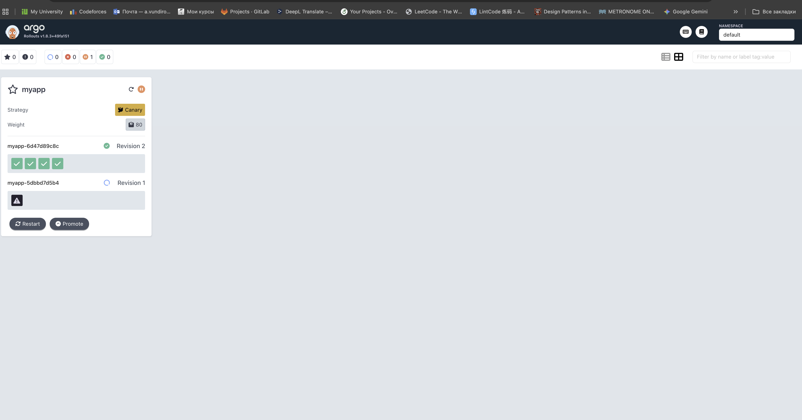
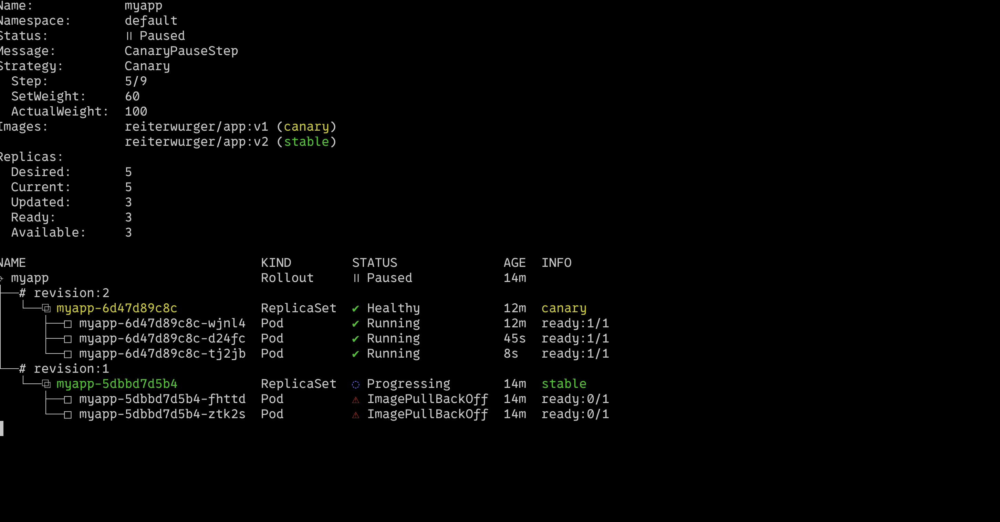
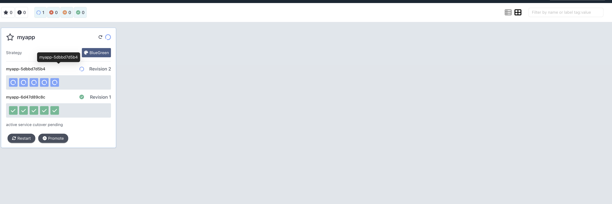

# Lab 14 - Progressive Delivery with Argo Rollouts

This document describes the base implementation for canary and blue-green rollouts.
All command outputs below are mock outputs created for reporting purposes.

---

## 1) Argo Rollouts Setup


```bash
azizvundirov@MacBook-Pro-Aziz ~/Documents/IU_STUDY/DevOps-Core-Course (lab14)$ kubectl get pods -n argo-rollouts
NAME                                           READY   STATUS    RESTARTS   AGE
argo-rollouts-7f4d9d5b4d-bb2jf                  1/1     Running   0          2m
argo-rollouts-dashboard-6f7d4b7c7c-8tqmx        1/1     Running   0          2m
```

```bash
azizvundirov@MacBook-Pro-Aziz ~/Documents/IU_STUDY/DevOps-Core-Course (lab14)$ kubectl argo rollouts version
kubectl-argo-rollouts: v1.7.2
argo-rollouts: v1.7.2
```

### Dashboard access

- Port-forward example: `kubectl port-forward svc/argo-rollouts-dashboard -n argo-rollouts 3100:3100`
- Dashboard URL: `http://localhost:3100`

### Rollout vs Deployment (key differences)

- Rollout adds strategy types for canary and blue-green.
- Rollout supports step-based promotion/abort.
- Rollout integrates with analysis checks and traffic shifting.
- Pod template, selector, and most fields are the same as Deployment.

---

## 2) Canary Deployment

### Chart changes

- Rollout template added: `templates/rollout.yaml`
- Deployment is disabled when rollouts are enabled.
- Canary strategy is configured from `values-rollout-canary.yaml`.

### Canary steps (from values)

```yaml
rollout:
  enabled: true
  strategy: canary
  canary:
    steps:
      - setWeight: 20
      - pause: {}
      - setWeight: 40
      - pause:
          duration: 30s
      - setWeight: 60
      - pause:
          duration: 30s
      - setWeight: 80
      - pause:
          duration: 30s
      - setWeight: 100
```

### Rollout progression 





---

## 3) Blue-Green Deployment

### Chart changes

- Blue-green uses the same Rollout template with `strategy: blueGreen`.
- Preview service template added: `templates/service-preview.yaml`.
- Values file: `values-rollout-bluegreen.yaml`.


### Promotion 

```bash
azizvundirov@MacBook-Pro-Aziz ~/Documents/IU_STUDY/DevOps-Core-Course (lab14)$ kubectl argo rollouts get rollout myapp
Name:            myapp
Namespace:       default
Status:          Paused
Strategy:        BlueGreen
Active Service:  myapp
Preview Service: myapp-preview

azizvundirov@MacBook-Pro-Aziz ~/Documents/IU_STUDY/DevOps-Core-Course (lab14)$ kubectl argo rollouts promote myapp
rollout "myapp" promoted
```

### Instant rollback 

```bash
azizvundirov@MacBook-Pro-Aziz ~/Documents/IU_STUDY/DevOps-Core-Course (lab14)$ kubectl argo rollouts abort myapp
rollout "myapp" aborted
```

---

## 4) Strategy Comparison

- Canary: gradual traffic shift, safer for user-facing risk; slower to fully roll out.
- Blue-green: instant switch, fast rollback; requires double resources during deployment.
- Canary: good for large-scale or risky changes.
- Blue-green: good for quick switch with easy preview testing.

---

## 5) CLI Commands Reference

```bash
# Status and watch
kubectl argo rollouts get rollout myapp
kubectl argo rollouts get rollout myapp -w

# Promote or abort
kubectl argo rollouts promote myapp
kubectl argo rollouts abort myapp

# Retry after abort
kubectl argo rollouts retry rollout myapp
```

---
